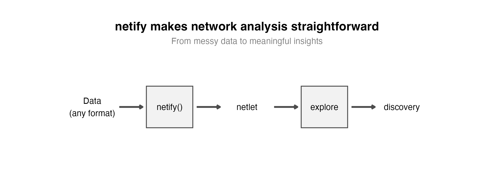
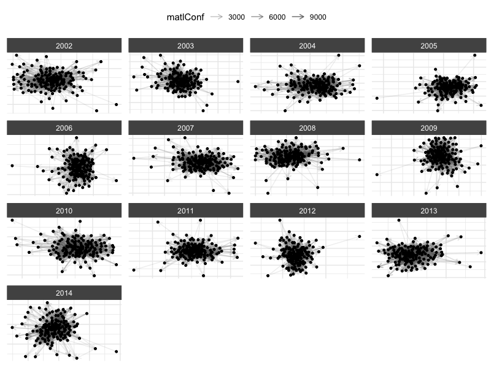
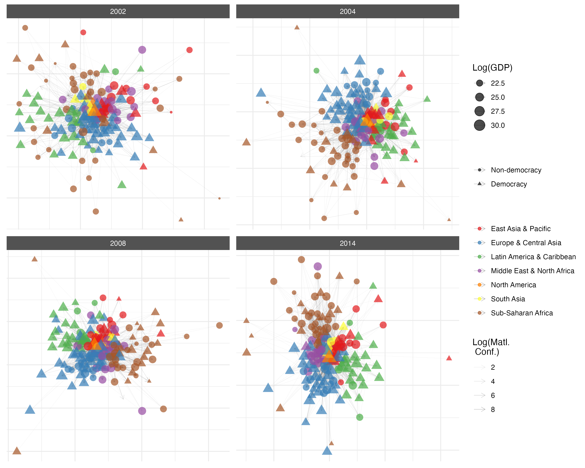

# netify 

## Overview 

netify is an R package for working with relational data. It converts edge lists, matrices, and data frames into network objects that you can analyze and visualize using a consistent set of functions.

We built netify while doing our own network research in social science. It handles common tasks like temporal network analysis, ego network extraction, and multiplex relationships without requiring multiple packages or data format conversions.

<!--  -->

## Installation

You have two options for installing `netify`.

### 🛠 Option 1: Pre-built binaries (no compilation needed)

If you're on **macOS** or **Windows** and want to avoid installing developer tools (like compilers, Xcode, or Rtools), you can use our pre-built binaries from the [Releases page](https://github.com/netify-dev/netify/releases):

#### ✅ Steps:

1. Go to: [https://github.com/netify-dev/netify/releases](https://github.com/netify-dev/netify/releases)
2. Click on the latest release (e.g., **v0.1.3**)
3. Download the file that matches your system:

#### 🖥 macOS users:

There are several macOS builds — choose the one that fits your system:

| File              | For...                                                                      |
| ----------------- | --------------------------------------------------------------------------- |
| `macos-arm64.tgz` | Macs with Apple Silicon (M1, M2, M3 chips) running recent macOS             |
| `macos-intel.tgz` | Macs with Intel chips                                                       |
| `macos-asan.tgz`  | Developer/debug version (for advanced users only; includes sanitizer flags) |

Most users can choose based on chip type:

```r
# Example: Apple Silicon (M1/M2/M3)
install.packages(
  "~/Downloads/netify_0.1.3-macos-arm64.tgz", 
  repos = NULL, type = "mac.binary", dependencies = TRUE)

# Example: Intel Mac
install.packages(
  "~/Downloads/netify_0.1.3-macos-intel.tgz", 
  repos = NULL, type = "mac.binary", dependencies = TRUE)
```

#### 🪟 Windows users:

Download the `.zip` file named `netify_0.1.3-windows.zip` (if available) and install:

```r
install.packages(
  "C:/path/to/netify_0.1.3-windows.zip", 
  repos = NULL, dependencies = TRUE)
```

Be sure to replace the file path with where you saved the download.

#### 🐧 Linux users:

You can use the precompiled `.tgz` file, or install from source (see Option 2). Example:

```r
install.packages(
  "~/Downloads/netify_0.1.3-linux.tgz", 
  repos = NULL, type = "source", dependencies = TRUE)
```

### 🔧 Option 2: Install from GitHub (requires build tools)

> ⚠️ Requires R build tools:
>
> * macOS: Xcode Command Line Tools
> * Windows: Rtools
> * Linux: build-essential and related packages

```r
# Install from GitHub
# install.packages("devtools")
devtools::install_github("netify-dev/netify", dependencies = TRUE)
```

## Quick Start

Transform your relational data into a network object with just one function:

```r
library(netify)
data(icews)

# Create a network from dyadic data
icews_conflict <- netify(
  icews,
  actor1 = 'i', 
  actor2 = 'j',
  time = 'year',
  symmetric = FALSE, 
  weight = 'matlConf',
  nodal_vars = c('i_polity2', 'i_log_gdp', 'i_region')
)

# Print the netify object
print(icews_conflict)
```

```
✔ Hello, you have created network data, yay!
• Unipartite
• Asymmetric
• Weights from `matlConf`
• Longitudinal: 13 Periods
• # Unique Actors: 152
Network Summary Statistics (averaged across time):
          dens miss  mean recip trans
matlConf 0.113    0 1.471 0.594 0.387
• Nodal Features: None
• Dyad Features: None
```

### Quick visualization

```r
# Plot the network
plot(icews_conflict)
```



### More involved visualization

netify's plotting system is highly customizable. Here's how you can create a more sophisticated visualization:

```r
# Create democracy indicator
icews$i_democ <- factor(
  ifelse(icews$i_polity2 >= 6, 1, 0), 
  levels = c(0, 1), 
  labels = c("Non-democracy", "Democracy")
)

# Add it to the network
icews_conflict <- add_node_vars(
  icews_conflict, icews,
  actor = 'i', time = 'year',
  node_vars = 'i_democ'
)

# plot(
  icews_conflict, 
  # Log transform weights
  mutate_weight = log1p, 
  # Map node attributes to aesthetics
  node_color_by = 'i_region', 
  node_size_by = 'i_log_gdp', 
  node_shape_by = 'i_democ',
  # set global node alpha
  node_alpha = .7,
  # set global edge alpha
  edge_linewidth = .1,
  # Filter data
  node_filter = ~ !is.na(i_democ),
  time_filter = c('2002', '2004', '2008', '2014'),
  # clean up plot labels
  edge_alpha_label = 'Log(Matl.\n Conf.)',
  node_color_label = '',
  node_size_label = 'Log(GDP)',
  node_shape_label = ''
  ) +
  theme(legend.position = 'right') + 
  scale_color_brewer(palette = 'Set1')
```



## What can you do with a netify object?

### Get network statistics

```r
summary(icews_conflict)
```

This returns a data frame with network statistics for each time period:

| Year | Actors | Density | Edges | Mean Weight | Reciprocity | Transitivity |
|------|--------|---------|-------|-------------|-------------|--------------|
| 2002 | 152    | 0.090   | 2069  | 1.12        | 0.200       | 0.354        |
| 2003 | 152    | 0.095   | 2193  | 1.54        | 0.294       | 0.358        |
| 2004 | 152    | 0.115   | 2666  | 1.64        | 0.647       | 0.391        |
| ...  | ...    | ...     | ...   | ...         | ...         | ...          |

(Table shows first few rows - actual output includes all time periods)

## Key functions

### Building networks
- `netify()` - Turn your data into a network object
- `ego_netify()` - Extract ego networks 
- `layer_netify()` - Stack multiple relationships into multilayer networks

### Adding information
- `add_node_vars()` - Attach attributes to actors (like GDP, democracy scores)
- `add_dyad_vars()` - Attach attributes to relationships (like trade volume, conflict events)

### Wrangling networks
- `subset()` - Pull out specific time periods or actors
- `mutate_weights()` - Log-transform, normalize, or otherwise modify edge weights

### Analysis
- `measurements()` - Measurements of your network size and composition
- `summary()` - Get a quick overview of your network
- `summary_actor()` - See how individual actors fit into the network
- `compare_networks()` - See how similar two networks are
- `homophily()` - Do similar actors tend to connect?
- `mixing_matrix()` - Who connects with whom?

### Visualization
- `plot()` - Create network diagrams with sensible defaults
- `plot_actor_stats()` - Visualize node-level statistics
- `plot_graph_stats()` - Show how network properties change over time

### Working with other packages
- `to_igraph()` / `to_network()` - When you need something we don't have
- `to_amen()` - For fitting AME or SRM models
- `unnetify()` - Get back to a regular data frame

## Quick Reference

### Essential Functions

| Task | Function | Example |
|------|----------|---------|
| Create network | `netify()` | `netify(data, actor1="from", actor2="to")` |
| Extract ego network | `ego_netify()` | `ego_netify(net, ego="USA")` |
| Create multilayer | `layer_netify()` | `layer_netify(list(net1, net2))` |
| Add node data | `add_node_vars()` | `add_node_vars(net, node_df, actor="id")` |
| Add dyad data | `add_dyad_vars()` | `add_dyad_vars(net, dyad_df, actor1="from", actor2="to")` |
| Subset network | `subset()` | `subset(net, time="2020")` |
| Get graph level summary statistics | `summary()` | `summary(net)` |
| Get actor level summary statistics | `summary_actor()` | `summary_actor(net)` |
| Test homophily | `homophily()` | `homophily(net, attribute="democracy", method="correlation")` |
| Create mixing matrix | `mixing_matrix()` | `mixing_matrix(net, attribute="regime_type", normalized=TRUE)` |
| Test dyadic correlations | `dyad_correlation()` | `dyad_correlation(net, dyad_vars="geographic_distance")` |
| Comprehensive attribute analysis | `attribute_report()` | `attribute_report(net, node_vars=c("region", "democracy"), dyad_vars="distance")` |
| Compare networks | `compare_networks()` | `compare_networks(list(net1, net2), method="all")` |
| Plot network | `plot()` | `plot(net)` |
| Convert to igraph | `to_igraph()` | `g <- to_igraph(net)` |
| Convert to statnet/network | `to_statnet()` | `g <- to_statnet(net)` |
| Convert to amen | `to_amen()` | `amen_data <- to_amen(net)` |
| Back to data frame | `unnetify()` | `df <- unnetify(net)` |


## When you might need something else

netify handles a lot, but there's an awesome world of network packages out there! If you need to venture beyond our walls, we've built bridges to get you there:

- **Fancy statistical models**: Use `to_amen()` for latent factor models or `to_statnet()` for ERGMs
- **Graph algorithms we don't have (yet!)**: Convert with `to_igraph()` to access igraph's vast toolkit
- **Roll your own analysis**: Use `unnetify()` to get back to a data frame and do your own thing

We play well with others! 🤝

## Getting help

- Browse vignettes for detailed guides: `browseVignettes("netify")`
- Check function documentation: `?netify`, `?plot.netify`, etc.
- Report bugs: [GitHub Issues](https://github.com/netify-dev/netify/issues)
- Ask questions: [GitHub Discussions](https://github.com/netify-dev/netify/discussions)

## Citation

If you use netify in your research, please cite:

```r
citation("netify")
```

## Contributors

netify is developed by:
- **Cassy Dorff** (Vanderbilt University) 
- **Shahryar Minhas** (Michigan State University)

With contributions from:
- Ha Eun Choi (Michigan State University)
- Colin Henry (Vanderbilt University)
- Tosin Salau (Michigan State University)

This work is supported by National Science Foundation Awards #2017162 and #2017180.

## License

MIT License - see [LICENSE](LICENSE) file for details.

---

<p align="center">
  Made with ❤️ for the network analysis community
</p>
