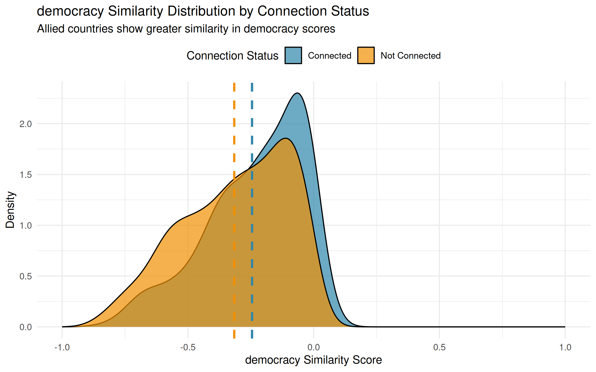
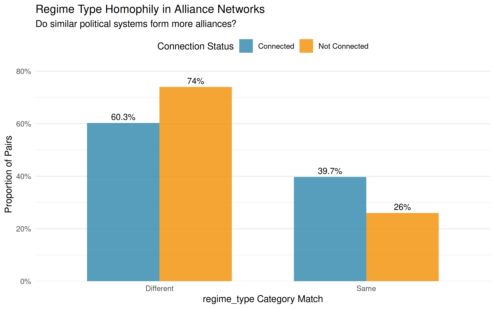
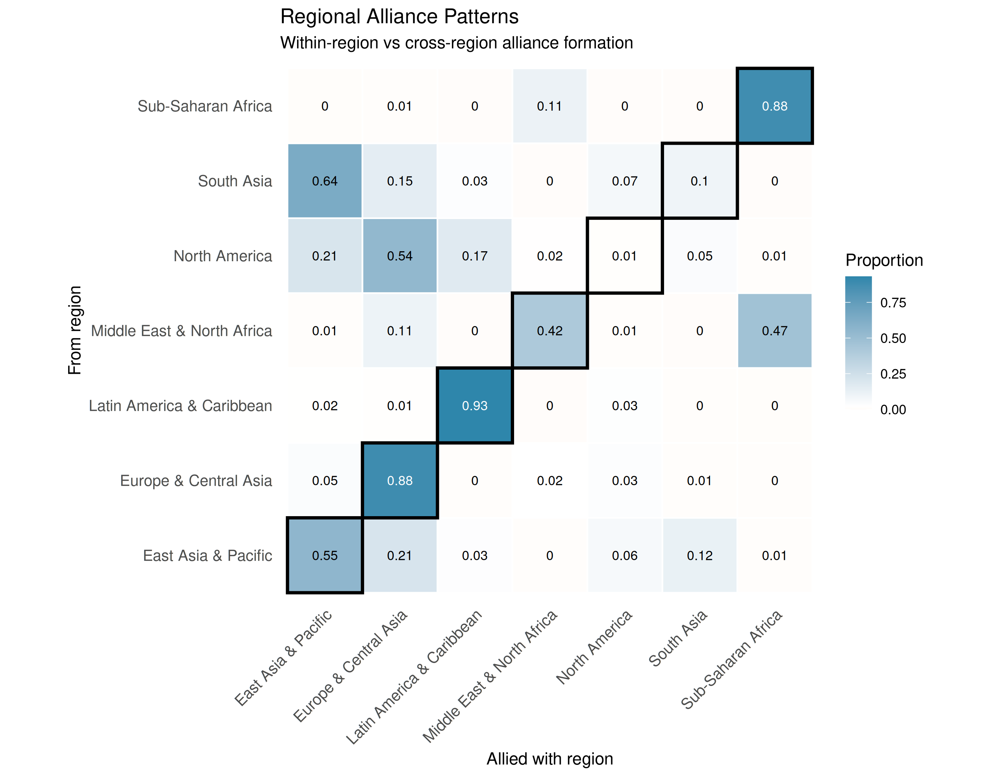
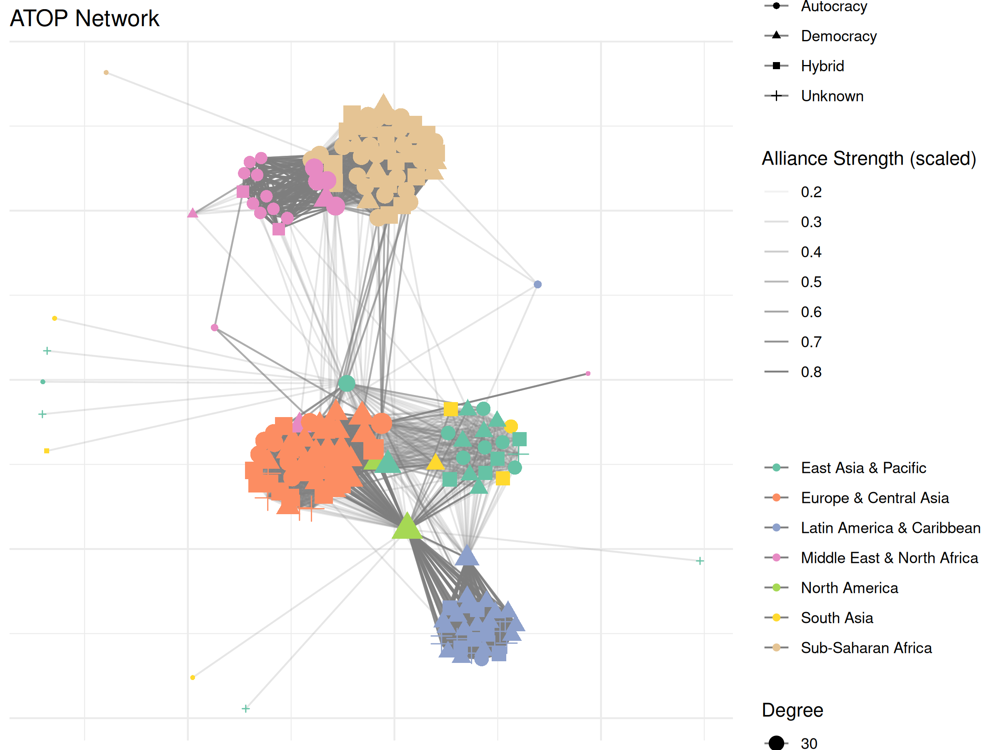
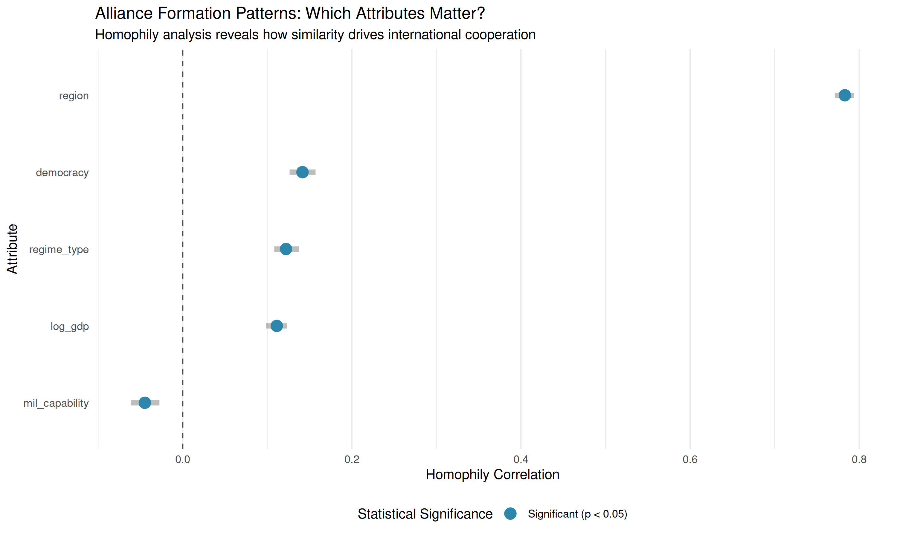
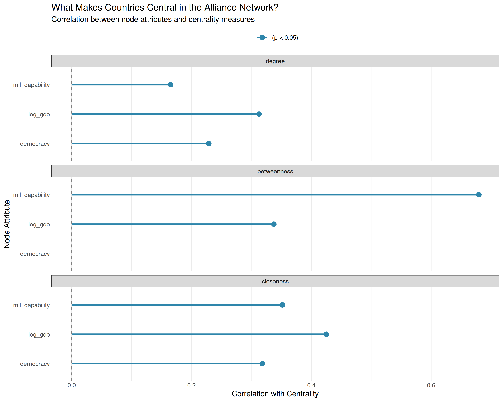
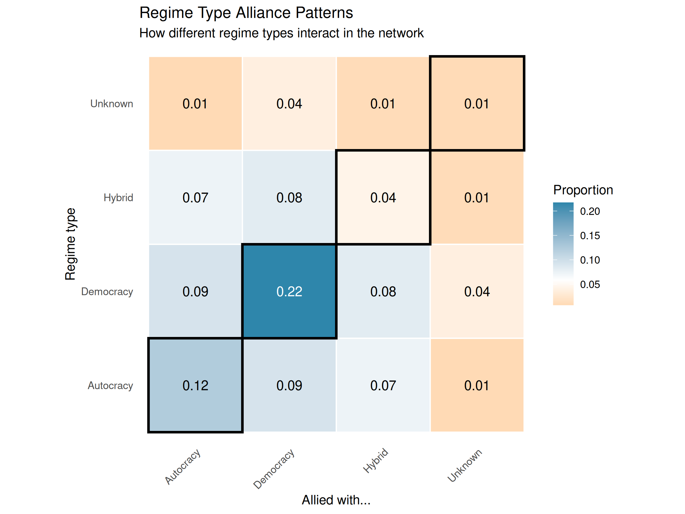
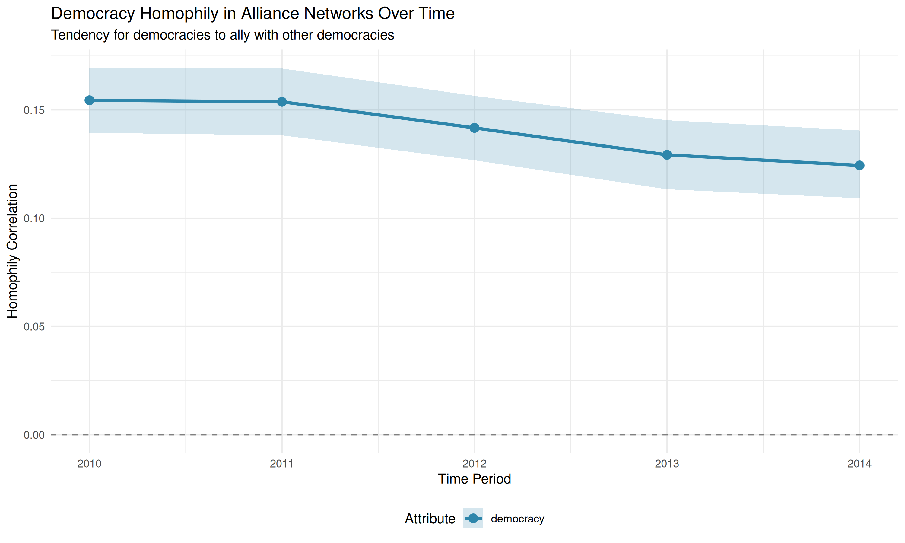
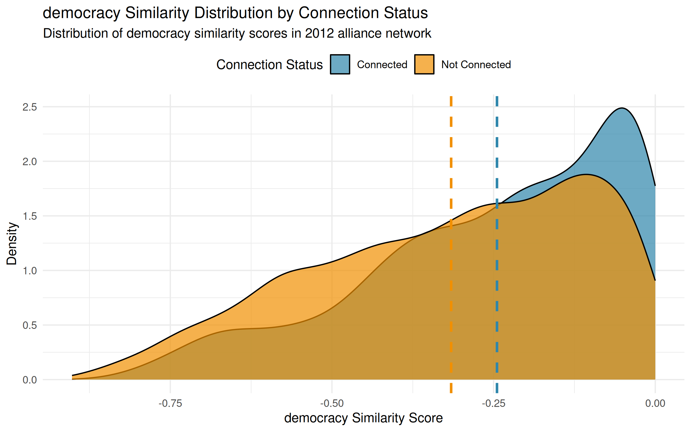

# Measuring Who Connects with Whom: Homophily & Dyadic Analysis

## vignette summary

This vignette shows how to use **netify** to explore relationships
between international alliance patterns and country characteristics
using data from the Correlates of War (COW) project and Alliance Treaty
Obligations and Provisions (ATOP) data. The examples focus on four
common international relations questions:

1.  **Democratic Peace**: Do democracies cooperate more with each other
    than with non-democracies?
2.  **Economic Interdependence**: Do countries with similar economic
    development levels cooperate more?
3.  **Geographic Proximity**: Does geographic distance affect
    cooperation patterns?
4.  **Regional Clustering**: Do countries primarily cooperate within
    their own regions?

We’ll focus on how to do some exploratory statistical analysis with
**netify**:

1.  [`homophily()`](https://netify-dev.github.io/netify/reference/homophily.md):
    Do Birds of a Feather Flock Together?

    - Tests whether similar countries tend to form alliances with each
      other. For example, do democracies primarily ally with other
      democracies? Do rich countries mainly partner with other rich
      countries?
    - Calculates correlations between attribute similarity and network
      tie presence using multiple similarity metrics. The optional
      permutation test compares the observed dyad-level association to a
      permuted similarity vector.
    - Function notes:
      - **Flexible similarity metrics**: Correlation, euclidean,
        categorical, cosine and other methods
      - **Permutation summaries**: P-values and confidence intervals for
        exploratory comparisons
      - **Missing data handling**: Uses dyads with the needed edge and
        attribute values
      - **Multi-network ready**: Works across time periods and layers

2.  [`mixing_matrix()`](https://netify-dev.github.io/netify/reference/mixing_matrix.md):
    Who Actually Partners With Whom?

    - Creates detailed “who allies with whom” tables. Shows not just
      whether democracies ally with democracies, but how much they
      interact with autocracies, hybrid regimes, and other categories.
    - Constructs mixing matrices showing tie distributions across
      attribute combinations. Calculates assortativity coefficients,
      modularity scores, and entropy measures to quantify mixing
      patterns with optional normalization schemes.
    - Function notes:
      - **Cross-dimensional analysis**: How regime types mix across
        regions
      - **Rich summary statistics**: Assortativity, modularity, entropy,
        diagonal proportions  
      - **Flexible normalization**: Raw counts, proportions, or
        row-normalized
      - **Weighted network support**: Incorporates alliance strength,
        not just presence

3.  [`dyad_correlation()`](https://netify-dev.github.io/netify/reference/dyad_correlation.md):
    Which Relationship Factors Are Associated with Alliances?

    - Tests how characteristics of country pairs (like geographic
      distance, trade volume, or cultural similarity) are associated
      with alliance ties. Answers questions like “Do nearby countries
      ally more often?”
    - Correlates dyadic (pairwise) variables with network ties using
      multiple correlation methods. Supports partial correlation
      analysis to control for confounding dyadic factors while handling
      missing data through pairwise deletion.
    - Function notes:
      - **Partial correlation support**: Isolate specific effects while
        controlling for others
      - **Multiple correlation methods**: Pearson, Spearman, Kendall
        with significance testing
      - **Binary network options**: Analyze tie presence vs. strength
        separately
      - **Attribute diagnostics**: Descriptive stats for all variables

4.  [`attribute_report()`](https://netify-dev.github.io/netify/reference/attribute_report.md):
    Attribute Report Summary

    - Runs the main attribute-oriented analyses from one interface and
      returns results on actor position, mixing patterns, and dyadic
      associations.
    - Runs homophily analysis, mixing matrices, dyadic correlations, and
      centrality-attribute relationships from one call. Tries to
      automatically determine appropriate methods based on variable
      types.

``` r

library(netify)
library(ggplot2)
library(peacesciencer)
library(dplyr)
library(countrycode)

fmt_p <- function(p, digits = 3) {
  cutoff <- 10^-digits
  ifelse(
    is.na(p),
    NA_character_,
    ifelse(
      p < cutoff,
      paste0("< ", formatC(cutoff, format = "f", digits = digits)),
      formatC(p, format = "f", digits = digits)
    )
  )
}
```

## data preparation

We’ll use the Correlates of War data via the `peacesciencer` package to
build a network of international alliances. This data includes measures
of democracy, economic development, military capabilities, geographic
relationships between countries, and alliance commitments from the ATOP
dataset.

### cow data

``` r

# download peacesciencer external data if needed
peacesciencer::download_extdata()

# build dyadic dataset for a recent 5-year period
cow_dyads <- create_dyadyears(subset_years = c(2010:2014)) |>
  add_cow_mids() |>
  add_capital_distance() |>
  add_democracy() |>
  add_sim_gdp_pop(keep = "pwtrgdp") |>
  add_nmc() |>
  add_atop_alliance()

# build alliance cooperation measure from atop alliance types
cow_dyads <- cow_dyads |>
  mutate(
    alliance_score = atop_defense + atop_offense + atop_neutral + atop_nonagg + atop_consul,
    alliance_norm = alliance_score / 5,
    cooperation = alliance_norm,
    region1 = countrycode(ccode1, "cown", "region"),
    region2 = countrycode(ccode2, "cown", "region"),
    log_gdp1 = log(pwtrgdp1 + 1),
    log_gdp2 = log(pwtrgdp2 + 1),
    log_capdist = log(capdist + 1),
    alliance_intensity = alliance_norm,
    defense_alliance = atop_defense
  )

# filter to 2012 for cross-sectional analysis
cow_2012 <- cow_dyads |>
  filter(year == 2012)
```

``` r

# create alliance network
alliance_net <- netify(
  cow_2012,
  actor1 = 'ccode1', actor2 = 'ccode2',
  symmetric = TRUE,
  weight = 'cooperation'
)

alliance_net
```

**Nodal data** is one row per actor (here, per country) describing
actor-level attributes — distinct from dyadic (pair-level) variables.

``` r

# prepare nodal data with country attributes
nodal_data <- cow_2012 |>
  select(
    ccode1, region1, v2x_polyarchy1,
    log_gdp1, cinc1
    ) |>
  distinct() |>
  rename(
    actor = ccode1,
    region = region1,
    democracy = v2x_polyarchy1,
    log_gdp = log_gdp1,
    mil_capability = cinc1
  ) |>
  mutate(
    regime_type = case_when(
      democracy >= 0.6 ~ "Democracy",
      democracy >= 0.4 ~ "Hybrid",
      democracy < 0.4 ~ "Autocracy",
      TRUE ~ "Unknown"
    ),
    development = case_when(
      log_gdp >= quantile(log_gdp, 0.75, na.rm = TRUE) ~ "High",
      log_gdp >= quantile(log_gdp, 0.25, na.rm = TRUE) ~ "Medium",
      TRUE ~ "Low"
    )
  )

nodal_data$country_name <- countrycode(nodal_data$actor, "cown", "country.name")

alliance_net <- add_node_vars(alliance_net, nodal_data, actor = "actor")
```

Add dyadic (relationship-level) variables. A **dyad** is a pair of
actors and a **dyadic variable** describes the relationship itself
(e.g., distance between two capitals) rather than either actor alone.

``` r

# prepare dyadic data
dyad_data <- cow_2012 |>
  select(ccode1, ccode2, log_capdist, alliance_norm, atop_defense) |>
  rename(
    actor1 = ccode1,
    actor2 = ccode2,
    geographic_distance = log_capdist,
    alliance_intensity = alliance_norm,
    defense_alliance = atop_defense
  )

alliance_net <- add_dyad_vars(
  alliance_net,
  dyad_data = dyad_data,
  actor1 = "actor1",
  actor2 = "actor2",
  dyad_vars = c("geographic_distance", "alliance_intensity", "defense_alliance"),
  dyad_vars_symmetric = c(TRUE, TRUE, TRUE)
)
```

## 1. testing the democratic peace with `homophily()`

Democratic peace arguments often lead researchers to ask whether
democracies are more likely to cooperate with one another. Here we use
alliance data to examine a narrower descriptive question: are allied
country pairs more similar in democracy scores than non-allied pairs?

### 🔍 using `homophily()` for continuous variables

**Homophily** is the tendency for connected actors to be similar to each
other on some attribute – “birds of a feather flock together.” The
[`homophily()`](https://netify-dev.github.io/netify/reference/homophily.md)
function is a tool in **netify** that tests whether similar actors tend
to connect more in a network. It can handle both continuous and
categorical attributes.

The function’s optional **permutation test** permutes the dyad-level
similarity values relative to tie indicators. The p-value is useful as
an exploratory comparison, not as evidence that the network came from
independent dyads or that similarity caused ties.

``` r

# test whether countries with similar democracy levels form more alliances
democracy_homophily <- homophily(
  alliance_net,
  attribute = "democracy",
  method = "correlation",
  significance_test = TRUE
)

knitr::kable(democracy_homophily, digits=3, align='c')
```

| net | layer | attribute | method | threshold_value | homophily_correlation | mean_similarity_connected | mean_similarity_unconnected | similarity_difference | p_value | ci_lower | ci_upper | n_connected_pairs | n_unconnected_pairs | n_missing | n_pairs |
|:--:|:--:|:--:|:--:|:--:|:--:|:--:|:--:|:--:|:--:|:--:|:--:|:--:|:--:|:--:|:--:|
| 1 | cooperation | democracy | correlation | 0 | 0.142 | -0.245 | -0.316 | 0.07 | 0.001 | 0.127 | 0.157 | 3571 | 11480 | 21 | 15051 |

``` r

democracy_summary <- paste0(
  "**Democracy Homophily Results:**\n\n",
  "- Homophily correlation: ", round(democracy_homophily$homophily_correlation, 3), "\n",
  "- Avg similarity among allies: ", round(democracy_homophily$mean_similarity_connected, 3), "\n",
  "- Avg similarity among non-allies: ", round(democracy_homophily$mean_similarity_unconnected, 3), "\n",
  "- P-value: ", fmt_p(democracy_homophily$p_value), "\n",
  if(democracy_homophily$p_value < 0.05) {
    "→ Alliance ties are more common among similarly democratic country pairs\n"
  } else {
    "→ No detectable democracy-similarity association in these alliance ties\n"
  }
)
```

**Democracy Homophily Results:**

- Homophily correlation: 0.142
- Avg similarity among allies: -0.245
- Avg similarity among non-allies: -0.316
- P-value: \< 0.001 → Alliance ties are more common among similarly
  democratic country pairs

#### understanding the output:

- **homophily_correlation**: Measures tendency for similar values to
  connect (0 to 1)
- **mean_similarity_connected**: Average similarity among connected
  pairs
- **mean_similarity_unconnected**: Average similarity among unconnected
  pairs
- **p_value**: Statistical significance of the homophily pattern

The democracy homophily analysis returns a small but statistically
detectable association: countries with more similar democracy scores are
slightly more likely to be alliance partners. The homophily correlation
of about 0.14 (p \< 0.05) is a modest positive association, not a causal
estimate of why alliances form. The negative similarity values (roughly
-0.25 for allies vs -0.32 for non-allies) reflect the correlation
method’s transformed distance metric, where higher (less negative)
values indicate greater similarity. The ~0.07 difference between allied
and non-allied pairs means that allied countries are, on average,
modestly closer in regime score than non-allied ones. This descriptive
comparison does not adjust for geography, power, timing, or other
network dependence.

#### visualizing homophily patterns

We can visualize the homophily pattern to better understand how
democracy similarity relates to alliance formation:

``` r

plot_homophily(democracy_homophily, alliance_net,
               type = "distribution",
               attribute = "democracy",
               method = "correlation",
               sample_size = 5000) +
  labs(subtitle = "Allied countries show greater similarity in democracy scores") +
  xlim(c(-1, 1))
```



#### understanding the distribution shape

The distribution plot reveals the empirical density of pairwise
similarity scores computed using the correlation method from
`calculate_similarity_matrix()`. The distinctly non-normal shape arises
from the specific calculation procedure:

**Details of the Similarity Calculation:**

For continuous attributes like democracy scores, when
`method = "correlation"` is specified, the homophily function computes
pairwise similarities as a negative absolute difference:

``` r

# for each dyad (i,j), similarity is calculated as:
similarity[i,j] = -abs(attr[i] - attr[j])
```

This produces similarity scores that:

- Equal `0` when two actors have the same attribute value
- Become more negative as the attribute difference grows
- Generate the observed multimodal distribution due to the discrete
  clustering of democracy scores

#### interpretation of the result

The observed homophily correlation of about 0.14 indicates that, despite
these distributional complexities, allied countries have higher
democracy similarity scores than non-allied pairs in this snapshot. The
mean difference (roughly -0.25 vs -0.32) is detectable in the dyad-level
permutation summary even though both distributions have similar
non-normal shapes.

However, the extensive overlap between distributions shows that
democracy similarity alone does not explain alliance formation. Many
democratic countries ally with non-democracies (left side of the blue
distribution), while many similar democracies remain unallied (right
side of the gold distribution). Geographic, security, economic, and
temporal factors would need to be modeled separately before making
stronger claims.

### using `homophily()` for categorical variables

Now let’s move onto the categorical regime type variable we made:

``` r

head(attr(alliance_net, 'nodal_data'))
```

    ##   actor                    region democracy   log_gdp mil_capability
    ## 1   100 Latin America & Caribbean     0.664 13.376060   6.695519e-03
    ## 2   101 Latin America & Caribbean     0.401 13.129611   4.859170e-03
    ## 3   110 Latin America & Caribbean     0.579  8.887165   3.355918e-05
    ## 4   115 Latin America & Caribbean     0.753  8.912825   4.996089e-05
    ## 5   130 Latin America & Caribbean     0.589 12.028537   1.530854e-03
    ## 6   135 Latin America & Caribbean     0.823 12.706243   3.378733e-03
    ##   regime_type development country_name
    ## 1   Democracy        High     Colombia
    ## 2      Hybrid        High    Venezuela
    ## 3      Hybrid         Low       Guyana
    ## 4   Democracy         Low     Suriname
    ## 5      Hybrid      Medium      Ecuador
    ## 6   Democracy        High         Peru

``` r

regime_homophily <- homophily(
  alliance_net,
  attribute = "regime_type",
  method = "categorical",
  significance_test = TRUE)

knitr::kable(regime_homophily, digits=3, align='c')
```

| net | layer | attribute | method | threshold_value | homophily_correlation | mean_similarity_connected | mean_similarity_unconnected | similarity_difference | p_value | ci_lower | ci_upper | n_connected_pairs | n_unconnected_pairs | n_missing | n_pairs |
|:--:|:--:|:--:|:--:|:--:|:--:|:--:|:--:|:--:|:--:|:--:|:--:|:--:|:--:|:--:|:--:|
| 1 | cooperation | regime_type | categorical | 0 | 0.122 | 0.394 | 0.259 | 0.135 | 0.001 | 0.107 | 0.137 | 4046 | 14869 | 0 | 18915 |

``` r

regime_summary <- paste0(
  "**Regime Type Homophily Results:**\n\n",
  "- Homophily score: ", round(regime_homophily$homophily_correlation, 3), "\n",
  "- Same-regime alliances: ", round(regime_homophily$mean_similarity_connected * 100, 1), "%\n",
  "- Different-regime alliances: ", round((1 - regime_homophily$mean_similarity_connected) * 100, 1), "%\n",
  "- Expected if random: ", round(regime_homophily$mean_similarity_unconnected * 100, 1), "%\n",
  "- P-value: ", fmt_p(regime_homophily$p_value), "\n",
  if(regime_homophily$p_value < 0.05 && regime_homophily$homophily_correlation > 0.15) {
    "→ Same-regime alliance ties are clearly more common in this network\n"
  } else if(regime_homophily$p_value < 0.05 && regime_homophily$homophily_correlation > 0) {
    "→ Same-regime alliance ties are modestly more common in this network\n"
  } else {
    "→ No detectable regime-type association in these alliance ties\n"
  }
)
```

**Regime Type Homophily Results:**

- Homophily score: 0.122
- Same-regime alliances: 39.4%
- Different-regime alliances: 60.6%
- Expected if random: 25.9%
- P-value: \< 0.001 → Same-regime alliance ties are modestly more common
  in this network

The regime type analysis shows a small but detectable pattern of
political homophily in alliance formation. With a homophily score of
about 0.12 (p \< 0.05), alliance ties are modestly more common within
the same regime type. The similarity scores show that roughly 39% of
allied pairs share the same regime type, compared to only 26% of
non-allied pairs – a roughly 13 percentage point difference. Treat this
as a descriptive association unless a design explicitly accounts for
alternative explanations.

The categorical nature of this analysis provides a clearer
interpretation than continuous measures: when countries form alliances,
there is about a 39% chance their partner shares the same regime type,
compared to 26% for non-allied pairs. The modest association leaves
plenty of room for cross-regime alliances tied to strategic, geographic,
and economic considerations. Note that we are not testing the democratic
peace idea specifically here, since we are amalgamating
autocracy-autocracy and democracy-democracy pairs into the same-regime
bucket.

#### visualizing categorical homophily

For categorical variables like regime type, the visualization looks
different. Instead of continuous similarity distributions, we see
discrete categories:

``` r

plot_homophily(regime_homophily, alliance_net,
               type = "distribution",
               attribute = "regime_type",
               method = "categorical",
               sample_size = 5000) +
  labs(title = "Regime Type Homophily in Alliance Networks",
       subtitle = "Do similar political systems form more alliances?")
```



Unlike the continuous democracy score, regime type similarity is binary:
country pairs either share the same regime type (similarity = 1) or they
don’t (similarity = 0). The visualization shows two bars comparing the
proportion of alliances within each category. A higher blue bar at
similarity = 1 indicates that countries with the same regime type are
more likely to form alliances than those with different regime types.
This categorical approach provides a clearer test of the “democracies
ally with democracies” hypothesis, though it loses the nuance of how
similar countries are on the democracy spectrum.

## 2. economic interdependence and development

International relations theory often asks whether countries at similar
levels of economic development are more likely to cooperate. We can
summarize that relationship with
[`homophily()`](https://netify-dev.github.io/netify/reference/homophily.md):

``` r

gdp_homophily <- homophily(
  alliance_net,
  attribute = "log_gdp",
  method = "correlation",
  significance_test = TRUE)

knitr::kable(gdp_homophily, digits=3, align='c')
```

| net | layer | attribute | method | threshold_value | homophily_correlation | mean_similarity_connected | mean_similarity_unconnected | similarity_difference | p_value | ci_lower | ci_upper | n_connected_pairs | n_unconnected_pairs | n_missing | n_pairs |
|:--:|:--:|:--:|:--:|:--:|:--:|:--:|:--:|:--:|:--:|:--:|:--:|:--:|:--:|:--:|:--:|
| 1 | cooperation | log_gdp | correlation | 0 | 0.118 | -2.209 | -2.796 | 0.587 | 0.001 | 0.106 | 0.131 | 4046 | 14869 | 0 | 18915 |

``` r

# gate substantive claims on magnitude (|r| >= 0.15) so a near-zero
# correlation does not get described as substantively large just because n is large
economic_summary <- paste0(
  "**Economic Development Homophily Results:**\n\n",
  "- Homophily correlation: ", round(gdp_homophily$homophily_correlation, 3), "\n",
  "- Similarity among allies: ", round(gdp_homophily$mean_similarity_connected, 3), "\n",
  "- Similarity among non-allies: ", round(gdp_homophily$mean_similarity_unconnected, 3), "\n",
  "- P-value: ", fmt_p(gdp_homophily$p_value), "\n",
    dplyr::case_when(
      gdp_homophily$p_value >= 0.05 ~
        "→ No detectable association between economic development similarity and alliance patterns\n",
      gdp_homophily$homophily_correlation >= 0.15 ~
        "→ Alliance ties are more common among countries at similar development levels\n",
      gdp_homophily$homophily_correlation > 0 ~
        "→ Detectable but very small (|r| < 0.15); the dyad count is doing most of the work behind the p-value\n",
      TRUE ~
        "→ Slight association with alliances between countries at different development levels (small heterophily)\n"
    )
)
```

**Economic Development Homophily Results:**

- Homophily correlation: 0.118
- Similarity among allies: -2.209
- Similarity among non-allies: -2.796
- P-value: \< 0.001 → Detectable but very small (\|r\| \< 0.15); the
  dyad count is doing most of the work behind the p-value

## 3. regional clustering in international cooperation

Do countries primarily form alliances within their own regions, or are
alliances more globally distributed? Regional patterns provide another
example of categorical homophily:

``` r

region_homophily <- homophily(
  alliance_net,
  attribute = "region",
  method = "categorical",
  significance_test = TRUE)

knitr::kable(region_homophily, digits=3, align='c')
```

| net | layer | attribute | method | threshold_value | homophily_correlation | mean_similarity_connected | mean_similarity_unconnected | similarity_difference | p_value | ci_lower | ci_upper | n_connected_pairs | n_unconnected_pairs | n_missing | n_pairs |
|:--:|:--:|:--:|:--:|:--:|:--:|:--:|:--:|:--:|:--:|:--:|:--:|:--:|:--:|:--:|:--:|
| 1 | cooperation | region | categorical | 0 | 0.783 | 0.793 | 0.034 | 0.759 | 0.001 | 0.772 | 0.794 | 4046 | 14869 | 0 | 18915 |

``` r

regional_summary <- paste0(
  "**Regional Clustering Results:**\n\n",
  "- Homophily score: ", round(region_homophily$homophily_correlation, 3), "\n",
  "- Within-region alliances: ", round(region_homophily$mean_similarity_connected, 3), "\n",
  "- Cross-region alliances: ", round(region_homophily$mean_similarity_unconnected, 3), "\n"
)
```

**Regional Clustering Results:**

- Homophily score: 0.783
- Within-region alliances: 0.793
- Cross-region alliances: 0.034

## 4. who forms alliances with whom? using `mixing_matrix()`

The
[`mixing_matrix()`](https://netify-dev.github.io/netify/reference/mixing_matrix.md)
function reveals detailed interaction patterns between different types
of actors in your network. This is crucial for understanding not just
*if* certain types connect, but *how much* and *with whom*.

A few summary statistics will show up below: **assortativity** is a -1
to 1 coefficient that captures how strongly ties prefer same-attribute
partners (positive = same-type, 0 = random, negative =
opposites-attract). **Modularity** rewards within-group edges over what
you’d expect by chance, so higher values mean ties cluster more strongly
within attribute groups. **Entropy** quantifies how spread out (versus
concentrated) the mixing pattern is across the cells. **Diagonal
proportion** is the share of ties that fall on the diagonal of the
mixing matrix (i.e., within the same category).

### 📊 democracy mixing matrix

``` r

regime_mixing <- mixing_matrix(
  alliance_net,
  attribute = "regime_type",
  normalized = TRUE
)

knitr::kable(round(regime_mixing$mixing_matrices[[1]], 3),
             caption = "Regime Type Alliance Matrix (normalized)",
             align = "c")
```

|           | Autocracy | Democracy | Hybrid | Unknown |
|:----------|:---------:|:---------:|:------:|:-------:|
| Autocracy |   0.123   |   0.091   | 0.073  |  0.006  |
| Democracy |   0.091   |   0.217   | 0.085  |  0.037  |
| Hybrid    |   0.073   |   0.085   | 0.045  |  0.011  |
| Unknown   |   0.006   |   0.037   | 0.011  |  0.008  |

Regime Type Alliance Matrix (normalized) {.table}

``` r

regime_mixing_summary <- paste0(
  "**Key Insights from mixing_matrix():**\n\n",
  "- Assortativity: ", round(regime_mixing$summary_stats$assortativity, 3), "\n",
  "  (Positive = similar types connect more; Negative = different types connect more)\n",
  "- Proportion of within-type alliances: ", round(regime_mixing$summary_stats$diagonal_proportion, 3), "\n",
  "  (Higher values indicate more homophily)\n"
)
```

**Key Insights from mixing_matrix():**

- Assortativity: 0.108 (Positive = similar types connect more; Negative
  = different types connect more)
- Proportion of within-type alliances: 0.394 (Higher values indicate
  more homophily)

#### how to read the mixing matrix:

- **Rows**: Source regime type
- **Columns**: Target regime type  
- **Values**: Proportion of ties from row type to column type
- **Diagonal**: Within-type alliances (homophily)

### 🌍 regional alliance patterns with row normalization

``` r

region_mixing <- mixing_matrix(
  alliance_net,
  attribute = "region",
  normalized = TRUE,
  by_row = TRUE)

regional_mixing_header <- "**Regional Alliance Matrix (row-normalized):**\n\n"
```

**Regional Alliance Matrix (row-normalized):**

``` r

knitr::kable(round(region_mixing$mixing_matrices[[1]], 3),
             caption = "Regional Alliance Matrix (row-normalized)",
             align = "c")
```

|  | East Asia & Pacific | Europe & Central Asia | Latin America & Caribbean | Middle East & North Africa | North America | South Asia | Sub-Saharan Africa |
|:---|:--:|:--:|:--:|:--:|:--:|:--:|:--:|
| East Asia & Pacific | 0.549 | 0.221 | 0.032 | 0.005 | 0.063 | 0.123 | 0.008 |
| Europe & Central Asia | 0.047 | 0.882 | 0.004 | 0.022 | 0.035 | 0.006 | 0.004 |
| Latin America & Caribbean | 0.019 | 0.012 | 0.931 | 0.000 | 0.031 | 0.004 | 0.003 |
| Middle East & North Africa | 0.005 | 0.111 | 0.000 | 0.411 | 0.005 | 0.002 | 0.467 |
| North America | 0.208 | 0.542 | 0.172 | 0.016 | 0.010 | 0.047 | 0.005 |
| South Asia | 0.639 | 0.148 | 0.033 | 0.008 | 0.074 | 0.098 | 0.000 |
| Sub-Saharan Africa | 0.002 | 0.005 | 0.001 | 0.114 | 0.000 | 0.000 | 0.877 |

Regional Alliance Matrix (row-normalized) {.table}

#### visualizing regional alliance patterns

``` r

plot_mixing_matrix(
    region_mixing,
    show_values = TRUE,
    value_digits = 2,
    text_size = 3,
    text_color_threshold = .7,
    diagonal_emphasis = TRUE,
    reorder_categories = FALSE
) +
  labs(title = "Regional Alliance Patterns",
       subtitle = "Within-region vs cross-region alliance formation",
       x = "Allied with region",
       y = "From region") +
  theme(axis.text.x = element_text(angle = 45, hjust = 1, size = 10),
        axis.text.y = element_text(size = 10))
```

    ## Warning: Using `size` aesthetic for lines was deprecated in ggplot2 3.4.0.
    ## ℹ Please use `linewidth` instead.
    ## ℹ The deprecated feature was likely used in the netify package.
    ##   Please report the issue at <https://github.com/netify-dev/netify/issues>.
    ## This warning is displayed once per session.
    ## Call `lifecycle::last_lifecycle_warnings()` to see where this warning was
    ## generated.



The regional mixing matrix shows strong regional clustering in alliance
formation. The emphasized diagonal shows that most regions primarily
form alliances within their own geographic area, with some notable
cross-regional partnerships.

### 🔀 cross-dimensional analysis: region × regime type

[`mixing_matrix()`](https://netify-dev.github.io/netify/reference/mixing_matrix.md)
can analyze interactions across different attributes:

``` r

cross_mixing <- mixing_matrix(
  alliance_net,
  attribute = "regime_type",
  row_attribute = "region",
  normalized = TRUE)

cross_mixing_header <- "**How different regime types form alliances across regions:**\n\n"
```

**How different regime types form alliances across regions:**

``` r

knitr::kable(round(cross_mixing$mixing_matrices[[1]], 3),
             caption = "Cross-dimensional Analysis: Regime Types Across Regions",
             align = "c")
```

|                            | Autocracy | Democracy | Hybrid | Unknown |
|:---------------------------|:---------:|:---------:|:------:|:-------:|
| East Asia & Pacific        |   0.023   |   0.035   | 0.018  |  0.003  |
| Europe & Central Asia      |   0.058   |   0.227   | 0.061  |  0.026  |
| Latin America & Caribbean  |   0.006   |   0.071   | 0.024  |  0.031  |
| Middle East & North Africa |   0.043   |   0.014   | 0.017  |  0.000  |
| North America              |   0.004   |   0.012   | 0.005  |  0.002  |
| South Asia                 |   0.005   |   0.006   | 0.003  |  0.000  |
| Sub-Saharan Africa         |   0.154   |   0.065   | 0.086  |  0.000  |

Cross-dimensional Analysis: Regime Types Across Regions {.table}

## 5. analyzing relationship-level factors with `dyad_correlation()`

A **dyad** is just a pair of actors (here, a pair of countries), and a
**dyadic variable** describes the relationship itself (e.g., distance
between two capitals, shared language) rather than either actor alone.
The
[`dyad_correlation()`](https://netify-dev.github.io/netify/reference/dyad_correlation.md)
function examines how relationship-level (dyadic) variables correlate
with network ties. This is useful for identifying pair-level factors
associated with connections.

### 🌍 geographic distance and alliance formation

``` r

geo_correlation <- dyad_correlation(
  alliance_net,
  dyad_vars = "geographic_distance",
  method = "pearson",
  significance_test = TRUE
)

geo_summary <- paste0(
  "**Geographic Distance and Alliance Formation (dyad_correlation results):**\n\n",
  "- Correlation coefficient: ", round(geo_correlation$correlation, 3), "\n",
  "- P-value: ", fmt_p(geo_correlation$p_value), "\n",
  "- Number of dyads analyzed: ", geo_correlation$n_pairs[1], "\n\n",
  if(geo_correlation$correlation < -0.1 && geo_correlation$p_value < 0.05) {
    "→ Alliance ties are more common among geographically closer country pairs.\n  (Negative correlation = shorter distance, more alliances)\n"
  } else if(geo_correlation$correlation > 0.1 && geo_correlation$p_value < 0.05) {
    "→ Greater distance is associated with more alliance ties in this dyad-level summary.\n  (Positive correlation = greater distance, more alliances)\n"
  } else {
    "→ No clear geographic-distance association appears in these alliance ties.\n  (No detectable correlation)\n"
  }
)
```

The reported p-value comes from the ordinary correlation test on dyad
vectors. Use it as a descriptive screen; network dependence and omitted
dyadic structure require a more explicit modeling strategy for stronger
inference.

**Geographic Distance and Alliance Formation (dyad_correlation
results):**

- Correlation coefficient: -0.586
- P-value: \< 0.001
- Number of dyads analyzed: 18915

→ Alliance ties are more common among geographically closer country
pairs. (Negative correlation = shorter distance, more alliances)

### 🤝 analyzing multiple dyadic variables

``` r

multi_dyad_correlation <- dyad_correlation(
  alliance_net,
  dyad_vars = c("geographic_distance", "alliance_intensity", "defense_alliance"),
  method = "pearson",
  significance_test = TRUE
)

multi_dyad_summary <- paste0(
  "**Multiple Dyadic Variables Analysis:**\n\n",
  paste(sapply(1:nrow(multi_dyad_correlation), function(i) {
    paste0(
      "**", multi_dyad_correlation$dyad_var[i], ":**\n",
      "  - Correlation: ", round(multi_dyad_correlation$correlation[i], 3), "\n",
      "  - P-value: ", fmt_p(multi_dyad_correlation$p_value[i]), "\n"
    )
  }), collapse = "\n")
)
```

**Multiple Dyadic Variables Analysis:**

**geographic_distance:** - Correlation: -0.586 - P-value: \< 0.001

**alliance_intensity:** - Correlation: 1 - P-value: \< 0.001

**defense_alliance:** - Correlation: 0.892 - P-value: \< 0.001

## 6. attribute reports with `attribute_report()`

**Centrality** measures how important / well-positioned each actor is in
the network – e.g., `degree` counts a node’s ties, `betweenness` counts
how often a node lies on the shortest path between two others, and
`closeness` measures how short the average distance is from a node to
everyone else. **Heterophily** is the opposite of homophily: ties are
more common between unlike partners.

The
[`attribute_report()`](https://netify-dev.github.io/netify/reference/attribute_report.md)
function combines the previous analyses into one report.

### running the report

``` r

attribute_results <- attribute_report(
  alliance_net,
  node_vars = c("region", "regime_type", "democracy", "log_gdp", "mil_capability"),
  dyad_vars = c("geographic_distance", "alliance_intensity", "defense_alliance"),
  include_centrality = TRUE,
  include_homophily = TRUE,
  include_mixing = TRUE,
  include_dyadic_correlations = TRUE,
  centrality_measures = c("degree", "betweenness", "closeness"),
  significance_test = TRUE
)
```

`attribute_report` returns a list with multiple components:

- **`homophily_analysis`**: Tests for each node attribute
- **`mixing_matrices`**: Interaction patterns for categorical variables
- **`centrality_correlations`**: How attributes relate to network
  position
- **`dyadic_correlations`**: How dyad attributes are associated with
  ties

### extracting results

``` r

homophily_header <- paste0(
  "**=== HOMOPHILY ANALYSIS ===**\n\n",
  "Do similar countries form more alliances?\n\n"
)
```

**=== HOMOPHILY ANALYSIS ===**

Do similar countries form more alliances?

|  | Attribute | Method | Homophily Correlation | P-value | Significance | Interpretation |
|:---|:--:|:--:|:--:|:--:|:--:|:--:|
| region | region | categorical | 0.783 | 0.001 | \*\*\* | Strong homophily |
| regime_type | regime_type | categorical | 0.122 | 0.001 | \*\*\* | Very weak (sig. but small) |
| democracy | democracy | correlation | 0.142 | 0.001 | \*\*\* | Very weak (sig. but small) |
| log_gdp | log_gdp | correlation | 0.118 | 0.001 | \*\*\* | Very weak (sig. but small) |
| mil_capability | mil_capability | correlation | -0.045 | 0.001 | \*\*\* | Heterophily |

Homophily Analysis Results {.table}

``` r

power_header <- paste0(
  "**=== POWER AND INFLUENCE ===**\n\n",
  "What makes countries central in the alliance network?\n\n"
)
```

**=== POWER AND INFLUENCE ===**

What makes countries central in the alliance network?

|  | Node Variable | Centrality Measure | Correlation | P-value | Interpretation |
|:---|:--:|:--:|:--:|:--:|:--:|
| cor7 | mil_capability | betweenness | 0.680 | 0.000 | Strongly associated with centrality |
| cor5 | log_gdp | closeness | 0.425 | 0.000 | Strongly associated with centrality |
| cor8 | mil_capability | closeness | 0.352 | 0.000 | Strongly associated with centrality |
| cor4 | log_gdp | betweenness | 0.338 | 0.000 | Strongly associated with centrality |
| cor3 | log_gdp | degree | 0.313 | 0.000 | Strongly associated with centrality |
| cor2 | democracy | closeness | 0.318 | 0.000 | Strongly associated with centrality |
| cor | democracy | degree | 0.229 | 0.002 | Moderately associated with centrality |
| cor6 | mil_capability | degree | 0.165 | 0.021 | Moderately associated with centrality |
| cor1 | democracy | betweenness | 0.070 | 0.357 | Not significantly related to centrality |
| NA | NA | NA | NA | NA | NA |

Top 10 Centrality-Attribute Correlations {.table}

``` r

relationship_header <- paste0(
  "**=== RELATIONSHIP FACTORS ===**\n\n",
  "What dyadic factors are associated with alliance formation?\n\n"
)
```

**=== RELATIONSHIP FACTORS ===**

What dyadic factors are associated with alliance formation?

|   Dyadic Variable   | Correlation | P-value |
|:-------------------:|:-----------:|:-------:|
| geographic_distance |   -0.586    |    0    |
| alliance_intensity  |    1.000    |    0    |
|  defense_alliance   |    0.892    |    0    |

Dyadic Variables Analysis {.table}

## 7. testing specific ir hypotheses

### hypothesis 1: democratic peace

``` r

# binary democracy indicator
nodal_data_binary <- nodal_data |>
  mutate(is_democracy = ifelse(regime_type == "Democracy", 1, 0))

alliance_net_binary <- add_node_vars(
  alliance_net,
  nodal_data_binary[, c("actor", "is_democracy")],
  actor = "actor")

dem_peace_test <- homophily(
  alliance_net_binary,
  attribute = "is_democracy",
  method = "categorical",
  significance_test = TRUE)

# flag both significance and magnitude so a tiny r does not get described
# as a clean "democracies prefer democracies" pattern just because p<0.05
dem_peace_summary <- paste0(
  "**Democratic Peace Hypothesis Test:**\n\n",
  "- Effect size: ", round(dem_peace_test$homophily_correlation, 3), "\n",
  "- P-value: ", fmt_p(dem_peace_test$p_value), "\n",
    "- Conclusion: ", dplyr::case_when(
      dem_peace_test$p_value >= 0.05 ~
        "No detectable democracy-based alliance pattern",
      dem_peace_test$homophily_correlation >= 0.15 ~
        "Democracy-democracy alliance ties are clearly more common",
      dem_peace_test$homophily_correlation > 0 ~
        "Detectable but very small same-regime pattern; the dyad count explains the significance flag more than the association size",
      TRUE ~
        "Detectable heterophily: democracy/non-democracy ties are more common"
    ), "\n"
)
```

**Democratic Peace Hypothesis Test:**

- Effect size: 0.05
- P-value: \< 0.001
- Conclusion: Detectable but very small same-regime pattern; the dyad
  count explains the significance flag more than the association size

### hypothesis 2: power politics

Do powerful countries (high military capability) primarily form
alliances with other powerful countries?

``` r

power_homophily <- homophily(
  alliance_net,
  attribute = "mil_capability",
  method = "correlation",
  significance_test = TRUE)

# gate substantive claims on |r| so a near-zero correlation does not get
# labeled "heterophily" simply because the dyad count makes every p tiny
power_politics_summary <- paste0(
  "**Power Politics Hypothesis:**\n\n",
  "- Correlation: ", round(power_homophily$homophily_correlation, 3), "\n",
  "- P-value: ", fmt_p(power_homophily$p_value), "\n",
    "- Interpretation: ", dplyr::case_when(
      power_homophily$p_value >= 0.05 ~
        "No detectable power-based alliance pattern",
      power_homophily$homophily_correlation >= 0.15 ~
        "Alliance ties are more common among similarly powerful countries",
      power_homophily$homophily_correlation <= -0.15 ~
        "Alliance ties are more common between high- and low-power countries (heterophily)",
      TRUE ~
        "Detectable but very small (|r| < 0.15); read as mild power-mixing rather than a clear homophily/heterophily pattern"
    ), "\n"
)
```

**Power Politics Hypothesis:**

- Correlation: -0.045
- P-value: \< 0.001
- Interpretation: Detectable but very small (\|r\| \< 0.15); read as
  mild power-mixing rather than a clear homophily/heterophily pattern

## 8. visualizing network patterns

And as seen in other vignettes we can use the
[`plot()`](https://rdrr.io/r/graphics/plot.default.html) function to
visualize the network with node attributes and edge weights:

### network visualization by attributes

``` r

# attach degree and other actor stats so we can map them to node aesthetics
alliance_net <- add_node_vars(
  alliance_net,
  summary_actor(alliance_net),
  actor = "actor"
)
```

``` r

plot(alliance_net,
     node_color_by = "region",
     node_color_label = "",
     node_shape_by = "regime_type",
     node_shape_label = "",
     node_size_by = "degree",
     node_size_label = "Degree",
     node_fill = "white",
     edge_color = "grey50",
     edge_linewidth = 0.5,
     edge_alpha_label = 'Alliance Strength (scaled)',
     layout = "nicely",
     seed = 6886) +
  ggtitle("ATOP Network") +
  theme(legend.position = 'right')
```



### visualizing homophily results

``` r

plot_homophily(attribute_results$homophily_analysis,
               type = "comparison") +
  labs(title = "Alliance Formation Patterns: Which Attributes Matter?",
       subtitle = "Homophily analysis summarizes similarity patterns in international cooperation")
```



### visualizing centrality patterns

``` r

centrality_viz <- attribute_results$centrality_correlations |>
  filter(p_value < 0.1) |>
  mutate(
    significant = p_value < 0.05,
    node_var = factor(node_var),
    centrality_measure = factor(
      centrality_measure,
      levels = c("degree", "betweenness", "closeness"))
  )

if(nrow(centrality_viz) > 0) {
  ggplot(centrality_viz, aes(x = correlation, y = node_var, color = significant)) +
    geom_segment(
      aes(
        x = 0, xend = correlation, y = node_var, yend = node_var),
      size = 1) +
    geom_point(size = 3) +
    facet_wrap(~centrality_measure, ncol = 1) +
    geom_vline(xintercept = 0, linetype = "dashed", color = "gray50") +
    scale_color_manual(
        values = c("FALSE" = "gray60", "TRUE" = "#2E86AB"),
        labels = c("FALSE" = "Not significant", "TRUE" = "(p < 0.05)")
    ) +
    labs(title = "What Makes Countries Central in the Alliance Network?",
         subtitle = "Correlation between node attributes and centrality measures",
         x = "Correlation with Centrality",
         y = "Node Attribute",
         color = "") +
    theme_bw() +
    theme(
        panel.border = element_blank(),
        axis.ticks = element_blank(),
        legend.position = "top",
        panel.grid.major.y = element_blank()
    )
} else {
  no_centrality_msg <- "**No significant centrality correlations to visualize.**\n"
  cat(no_centrality_msg)
}
```



### mixing matrix heatmap

We can use the
[`plot_mixing_matrix()`](https://netify-dev.github.io/netify/reference/plot_mixing_matrix.md)
function to visualize the mixing patterns as a heatmap:

``` r

plot_mixing_matrix(
    regime_mixing,
    show_values = TRUE,
    diagonal_emphasis = TRUE,
    text_color_threshold=.9
  ) +
  labs(title = "Regime Type Alliance Patterns",
       subtitle = "How different regime types interact in the network",
       x = "Allied with...",
       y = "Regime type")
```



The heatmap shows the alliance patterns between different regime types.
The diagonal cells (emphasized with black borders) represent within-type
alliances, while off-diagonal cells show cross-type alliances. Darker
blue indicates higher proportions of alliances, consistent with the
small but detectable regime-type homophily in alliance formation.

## 9. working with longitudinal networks

A **longitudinal network** is a network observed over multiple time
periods (one snapshot per period), in contrast to a **cross-sectional
network** that captures a single point in time. The attribute analysis
functions in netify work with longitudinal networks. The example below
creates a longitudinal alliance network and runs the same analyses
across multiple time periods.

### creating a longitudinal network

``` r

# longitudinal alliance network for 2010-2014
alliance_net_longit <- netify(
  cow_dyads,
  actor1 = 'ccode1',
  actor2 = 'ccode2',
  time = 'year',
  symmetric = TRUE,
  weight = 'cooperation'
)

alliance_net_longit
```

### adding attributes to longitudinal networks

``` r

# nodal data for all time periods
nodal_data_longit <- cow_dyads |>
  select(year, ccode1, region1, v2x_polyarchy1, log_gdp1, cinc1) |>
  distinct() |>
  rename(
    time = year,
    actor = ccode1,
    region = region1,
    democracy = v2x_polyarchy1,
    log_gdp = log_gdp1,
    mil_capability = cinc1
  ) |>
  mutate(
    regime_type = case_when(
      democracy >= 0.6 ~ "Democracy",
      democracy >= 0.4 ~ "Hybrid",
      democracy < 0.4 ~ "Autocracy",
      TRUE ~ "Unknown"
    )
  )

alliance_net_longit <- add_node_vars(
  alliance_net_longit,
  nodal_data_longit,
  actor = "actor",
  time = "time"
)

dyad_data_longit <- cow_dyads |>
  select(year, ccode1, ccode2, log_capdist, alliance_intensity, defense_alliance) |>
  rename(
    time = year,
    actor1 = ccode1,
    actor2 = ccode2,
    geographic_distance = log_capdist
  )

alliance_net_longit <- add_dyad_vars(
  alliance_net_longit,
  dyad_data = dyad_data_longit,
  actor1 = "actor1",
  actor2 = "actor2",
  time = "time",
  dyad_vars = c("geographic_distance", "alliance_intensity", "defense_alliance"),
  dyad_vars_symmetric = c(TRUE, TRUE, TRUE)
)
```

### homophily analysis across time

``` r

democracy_homophily_longit <- homophily(
  alliance_net_longit,
  attribute = "democracy",
  method = "correlation",
  significance_test = TRUE
)

democracy_homophily_longit
```

    ##    net       layer attribute      method threshold_value homophily_correlation
    ## 1 2010 cooperation democracy correlation               0             0.1544304
    ## 2 2011 cooperation democracy correlation               0             0.1537066
    ## 3 2012 cooperation democracy correlation               0             0.1416613
    ## 4 2013 cooperation democracy correlation               0             0.1292206
    ## 5 2014 cooperation democracy correlation               0             0.1243436
    ##   mean_similarity_connected mean_similarity_unconnected similarity_difference
    ## 1                -0.2443592                  -0.3226836            0.07832443
    ## 2                -0.2409122                  -0.3181384            0.07722618
    ## 3                -0.2452764                  -0.3156274            0.07035096
    ## 4                -0.2504444                  -0.3140721            0.06362762
    ## 5                -0.2520272                  -0.3131798            0.06115268
    ##       p_value  ci_lower  ci_upper n_connected_pairs n_unconnected_pairs
    ## 1 0.000999001 0.1395075 0.1700197              3497               11381
    ## 2 0.000999001 0.1383078 0.1682909              3497               11554
    ## 3 0.000999001 0.1270532 0.1562951              3571               11480
    ## 4 0.000999001 0.1137038 0.1437508              3645               11406
    ## 5 0.000999001 0.1089608 0.1399076              3646               11405
    ##   n_missing n_pairs
    ## 1        22   14878
    ## 2        21   15051
    ## 3        21   15051
    ## 4        21   15051
    ## 5        21   15051

``` r

# summary of trends across time periods
homophily_trends <- democracy_homophily_longit |>
  group_by(net) |>
  summarise(
    avg_homophily = mean(homophily_correlation, na.rm = TRUE),
    significant = any(p_value < 0.05, na.rm = TRUE)
  )

knitr::kable(homophily_trends, 
             caption = "Democracy Homophily Trends Over Time",
             digits = 3)
```

| net  | avg_homophily | significant |
|:-----|--------------:|:------------|
| 2010 |         0.154 | TRUE        |
| 2011 |         0.154 | TRUE        |
| 2012 |         0.142 | TRUE        |
| 2013 |         0.129 | TRUE        |
| 2014 |         0.124 | TRUE        |

Democracy Homophily Trends Over Time {.table}

### visualizing longitudinal homophily

``` r

plot_homophily(democracy_homophily_longit, type = "temporal") +
  labs(title = "Democracy Homophily in Alliance Networks Over Time",
       subtitle = "Tendency for democracies to ally with other democracies")
```



If you want to see the distribution for a specific time period, you can
extract that period first:

``` r

# extract 2012 slice for a single-period distribution plot
alliance_2012 <- subset(alliance_net_longit, time = '2012')
democracy_homo_2012 <- homophily(
  alliance_2012,
  attribute = "democracy",
  method = "correlation"
)

plot_homophily(democracy_homo_2012, alliance_2012,
               type = "distribution",
               attribute = "democracy",
               method = "correlation") +
  labs(subtitle = "Distribution of democracy similarity scores in 2012 alliance network")
```



### mixing matrices over time

``` r

regime_mixing_longit <- mixing_matrix(
  alliance_net_longit,
  attribute = "regime_type",
  normalized = TRUE
)

# summary statistics across each time period
mixing_summary <- regime_mixing_longit$summary_stats |>
  select(net, assortativity, diagonal_proportion) |>
  mutate(across(where(is.numeric), \(x) round(x, 3)))

knitr::kable(mixing_summary,
             caption = "Regime Type Mixing Patterns Over Time",
             col.names = c("Year", "Assortativity", "Within-Type %"))
```

| Year | Assortativity | Within-Type % |
|:-----|--------------:|--------------:|
| 2010 |         0.121 |         0.404 |
| 2011 |         0.120 |         0.400 |
| 2012 |         0.108 |         0.394 |
| 2013 |         0.096 |         0.392 |
| 2014 |         0.094 |         0.389 |

Regime Type Mixing Patterns Over Time {.table}

### dyadic correlations across time

``` r

geo_correlation_longit <- dyad_correlation(
  alliance_net_longit,
  dyad_vars = "geographic_distance",
  method = "pearson",
  significance_test = TRUE
)

geo_summary_longit <- geo_correlation_longit |>
  select(net, correlation, p_value, n_pairs) |>
    mutate(
      significant = ifelse(p_value < 0.05, "*", ""),
      correlation = round(correlation, 3),
      p_value = fmt_p(p_value)
    )

knitr::kable(geo_summary_longit,
             caption = "Geographic Distance and Alliance Formation Over Time",
             col.names = c("Year", "Correlation", "P-value", "N Dyads", "Sig."))
```

| Year | Correlation | P-value  | N Dyads | Sig. |
|:-----|------------:|:---------|--------:|:-----|
| 2010 |      -0.363 | \< 0.001 |   18915 | \*   |
| 2011 |      -0.592 | \< 0.001 |   18915 | \*   |
| 2012 |      -0.586 | \< 0.001 |   18915 | \*   |
| 2013 |      -0.590 | \< 0.001 |   18915 | \*   |
| 2014 |      -0.590 | \< 0.001 |   18915 | \*   |

Geographic Distance and Alliance Formation Over Time {.table}

### longitudinal attribute report

``` r

longit_attribute_results <- attribute_report(
  alliance_net_longit,
  node_vars = c("region", "regime_type", "democracy", "log_gdp"),
  dyad_vars = c("geographic_distance", "alliance_intensity"),
  include_centrality = TRUE,
  include_homophily = TRUE,
  include_mixing = TRUE,
  include_dyadic_correlations = TRUE,
  centrality_measures = c("degree", "betweenness"),
  significance_test = TRUE
)

if (!is.null(longit_attribute_results$homophily_analysis)) {
  longit_patterns <- longit_attribute_results$homophily_analysis |>
    filter(attribute == "democracy") |>
    select(net, homophily_correlation, p_value) |>
    mutate(
      trend = case_when(
        net == min(net) ~ "Start",
        net == max(net) ~ "End",
        TRUE ~ "Middle"
      )
    )

  longit_patterns
} else {
  knitr::asis_output(
    "Note: homophily for longitudinal networks is currently limited. For full coverage, analyze each time period separately.\n"
  )
}
```

    ##              net homophily_correlation     p_value  trend
    ## democracy.1 2010             0.1544304 0.000999001  Start
    ## democracy.2 2011             0.1537066 0.000999001 Middle
    ## democracy.3 2012             0.1416613 0.000999001 Middle
    ## democracy.4 2013             0.1292206 0.000999001 Middle
    ## democracy.5 2014             0.1243436 0.000999001    End

## tl;dr

1.  **From
    [`homophily()`](https://netify-dev.github.io/netify/reference/homophily.md)**:
    - Whether democracies truly form more alliances with each other
    - Whether economic similarity is associated with alliance patterns
    - The strength of regional clustering in alliance formation
2.  **From
    [`mixing_matrix()`](https://netify-dev.github.io/netify/reference/mixing_matrix.md)**:
    - Detailed patterns of who forms alliances with whom
    - Whether alliances cross regime type boundaries
    - How different regions form alliances globally
3.  **From
    [`dyad_correlation()`](https://netify-dev.github.io/netify/reference/dyad_correlation.md)**:
    - The role of geographic distance in shaping alliance formation
    - How alliance types (defense, offense, etc.) cluster
    - Which relationship factors matter most for alliances
4.  **From
    [`attribute_report()`](https://netify-dev.github.io/netify/reference/attribute_report.md)**:
    - What attributes make countries central/influential
    - Complete homophily patterns across all variables
    - One view of the main network-attribute relationships

## references

1.  Leeds, B. A., Ritter, J. M., Mitchell, S. M., & Long, A. G. (2002).
    Alliance Treaty Obligations and Provisions, 1815–1944. International
    Interactions, 28(3), 237–260. DOI 10.1080/03050620213653.

2.  Miller, S. V. (2022). peacesciencer: An R Package for Quantitative
    Peace Science Research. Conflict Management and Peace Science,
    39(6), 755–779. DOI 10.1177/07388942221077926.
