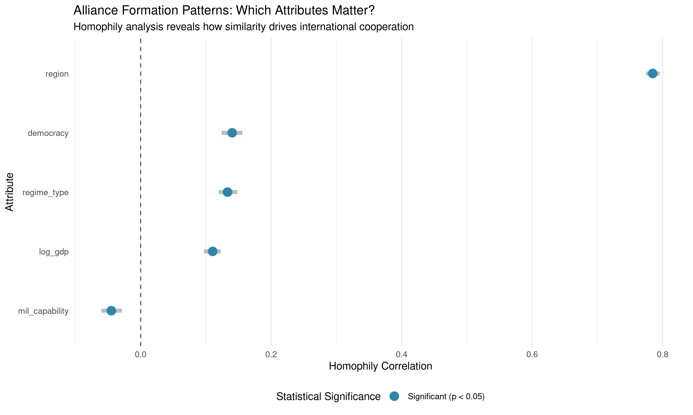
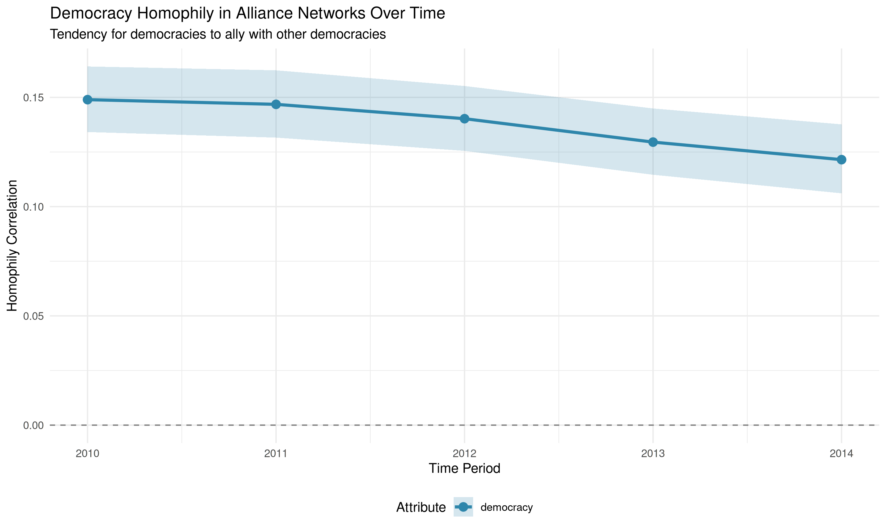
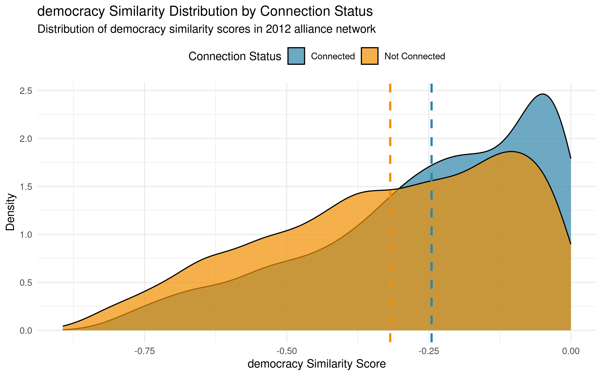

# Measuring Who Connects with Whom: Homophily & Dyadic Analysis

## Vignette Summary

This vignette demonstrates how to play with **netify** to explore
relationships between international alliance patterns and country
characteristics using data from the Correlates of War (COW) project and
Alliance Treaty Obligations and Provisions (ATOP) data. We’ll toy around
with some simple international relations ideas:

1.  **Democratic Peace**: Do democracies cooperate more with each other
    than with non-democracies?
2.  **Economic Interdependence**: Do countries with similar economic
    development levels cooperate more?
3.  **Geographic Proximity**: Does geographic distance affect
    cooperation patterns?
4.  **Regional Clustering**: Do countries primarily cooperate within
    their own regions?

We’ll focus on how to do some exploratory statistical analysis with
**netify**:

1.  [`homophily()`](https://netify-dev.github.io/netify/reference/homophily.md):
    Do Birds of a Feather Flock Together?

    - Tests whether similar countries tend to form alliances with each
      other. For example, do democracies primarily ally with other
      democracies? Do rich countries mainly partner with other rich
      countries?
    - Calculates correlations between attribute similarity and network
      tie presence using multiple similarity metrics. Performs
      permutation-based significance testing to determine if observed
      homophily patterns exceed random chance.
    - Function notes:
      - **Flexible similarity metrics**: Correlation, euclidean,
        categorical, cosine and other methods
      - **Statistical rigor**: Permutation tests with confidence
        intervals
      - **Smart missing data handling**: Preserves maximum sample sizes
      - **Multi-network ready**: Works across time periods and layers

2.  [`mixing_matrix()`](https://netify-dev.github.io/netify/reference/mixing_matrix.md):
    Who Actually Partners With Whom?

    - Creates detailed “who allies with whom” tables. Shows not just
      that democracies prefer democracies, but exactly how much they
      interact with autocracies, hybrid regimes, etc. Think of it as a
      cross-tabulation on steroids.
    - Constructs mixing matrices showing tie distributions across
      attribute combinations. Calculates assortativity coefficients,
      modularity scores, and entropy measures to quantify mixing
      patterns with optional normalization schemes.
    - Function notes:
      - **Cross-dimensional analysis**: How regime types mix across
        regions (unique feature!)
      - **Rich summary statistics**: Assortativity, modularity, entropy,
        diagonal proportions  
      - **Flexible normalization**: Raw counts, proportions, or
        row-normalized
      - **Weighted network support**: Incorporates alliance strength,
        not just presence

3.  [`dyad_correlation()`](https://netify-dev.github.io/netify/reference/dyad_correlation.md):
    What Relationship Factors Drive Alliances?

    - Tests how characteristics of country pairs (like geographic
      distance, trade volume, or cultural similarity) predict whether
      they’ll form alliances. Answers questions like “Do nearby
      countries ally more often?”
    - Correlates dyadic (pairwise) variables with network ties using
      multiple correlation methods. Supports partial correlation
      analysis to control for confounding dyadic factors while handling
      missing data through pairwise deletion.
    - Function notes:
      - **Partial correlation support**: Isolate specific effects while
        controlling for others
      - **Multiple correlation methods**: Pearson, Spearman, Kendall
        with significance testing
      - **Binary network options**: Analyze tie presence vs. strength
        separately
      - **Comprehensive diagnostics**: Descriptive stats for all
        variables

4.  [`attribute_report()`](https://netify-dev.github.io/netify/reference/attribute_report.md):
    The Complete Picture in One Function

    - A kind of Swiss Army knife for understanding how country
      characteristics relate to alliance patterns. Automates running
      relevant analyses and tells you what makes countries influential,
      who allies with whom, and what drives partnership formation.
    - Comprehensive wrapper combining homophily analysis, mixing
      matrices, dyadic correlations, and centrality-attribute
      relationships. Tries to automatically determine appropriate
      methods based on variable types.

``` r
library(netify)
library(ggplot2)
library(peacesciencer)
library(dplyr)
library(countrycode)
```

## Data Preparation

We’ll use the Correlates of War data via the `peacesciencer` package to
build a network of international alliances. This data includes measures
of democracy, economic development, military capabilities, geographic
relationships between countries, and alliance commitments from the ATOP
dataset.

### COW data

``` r
# Download peacesciencer external data if needed
peacesciencer::download_extdata()

# Create dyadic dataset for a recent 5-year period
cow_dyads <- create_dyadyears(subset_years = c(2010:2014)) |>
  # Add conflict data (we'll use inverse for cooperation)
  add_cow_mids() |>
  # Add capital distance
  add_capital_distance() |>
  # Add democracy scores (V-Dem polyarchy)
  add_democracy() |>
  # Add GDP data
  add_sdp_gdp() |>
  # Add material capabilities
  add_nmc() |>
  # Add ATOP alliance data
  add_atop_alliance()

# Create alliance cooperation measure based on ATOP alliance types
cow_dyads <- cow_dyads |>
  mutate(
    # Create alliance intensity score (0-5 based on number of pledge types)
    alliance_score = atop_defense + atop_offense + atop_neutral + atop_nonagg + atop_consul,
    # Normalize to 0-1 scale
    alliance_norm = alliance_score / 5,
    # Create cooperation score: alliance intensity without conflict
    cooperation = alliance_norm,
    # cooperation = alliance_norm * (1 - cowmidonset),
    # Add region information
    region1 = countrycode(ccode1, "cown", "region"),
    region2 = countrycode(ccode2, "cown", "region"),
    # Log transform some variables
    log_gdp1 = log(wbgdp2011est1 + 1),
    log_gdp2 = log(wbgdp2011est2 + 1),
    log_capdist = log(capdist + 1),
    # Renaming to make stuff easier down the road
    alliance_intensity = alliance_norm,    
    defense_alliance = atop_defense
  )

# Filter to 2012 for cross-sectional analysis
cow_2012 <- cow_dyads |>
  filter(year == 2012)
```

``` r
# Create alliance network
alliance_net <- netify(
  cow_2012,
  actor1 = 'ccode1', actor2 = 'ccode2',
  symmetric = TRUE,
  weight = 'cooperation'
)

# Print object
print(alliance_net)
```

``` r
# Prepare nodal data with country attributes
nodal_data <- cow_2012 |>
  select(
    ccode1, region1, v2x_polyarchy1, 
    log_gdp1, cinc1
    ) |>
  distinct() |>
  rename(
    actor = ccode1,
    region = region1,
    democracy = v2x_polyarchy1,
    log_gdp = log_gdp1,
    mil_capability = cinc1
  ) |>
  mutate(
    # Create democracy categories based on V-Dem scores
    regime_type = case_when(
      democracy >= 0.6 ~ "Democracy",
      democracy >= 0.4 ~ "Hybrid",
      democracy < 0.4 ~ "Autocracy",
      TRUE ~ "Unknown"
    ),
    # Create development categories
    development = case_when(
      log_gdp >= quantile(log_gdp, 0.75, na.rm = TRUE) ~ "High",
      log_gdp >= quantile(log_gdp, 0.25, na.rm = TRUE) ~ "Medium",
      TRUE ~ "Low"
    )
  )

# Add country names for better interpretation
nodal_data$country_name <- countrycode(nodal_data$actor, "cown", "country.name")

# Add nodal variables to network
alliance_net <- add_node_vars(alliance_net, nodal_data, actor = "actor")
```

Add dyadic (relationship-level) variables:

``` r
# Prepare dyadic data
dyad_data <- cow_2012 |>
  select(ccode1, ccode2, log_capdist, alliance_norm, atop_defense) |>
  rename(
    actor1 = ccode1,
    actor2 = ccode2,
    geographic_distance = log_capdist,
    alliance_intensity = alliance_norm,
    defense_alliance = atop_defense
  )

# Add dyadic variables to network
alliance_net <- add_dyad_vars(
  alliance_net, 
  dyad_data = dyad_data,
  actor1 = "actor1",
  actor2 = "actor2",
  dyad_vars = c("geographic_distance", "alliance_intensity", "defense_alliance"),
  dyad_vars_symmetric = c(TRUE, TRUE, TRUE)
)
```

## 1. Testing the Democratic Peace with `homophily()`

The democratic peace theory posits that democracies rarely engage in
conflict with one another, driven by shared liberal norms, institutional
constraints on executive power, and transparency in political
decision-making. Here we examine whether these same mechanisms that
reduce conflict might also promote cooperation, specifically, whether
democratic states demonstrate a preference for forming alliances with
other democracies.

Here are the edited sections with interpretive output similar to the
regional clustering example:

### 🔍 Using `homophily()` for Continuous Variables

The
[`homophily()`](https://netify-dev.github.io/netify/reference/homophily.md)
function is a tool in **netify** that tests whether similar actors tend
to connect more in a network. It can handle both continuous and
categorical attributes.

``` r
# Test if countries with similar democracy levels form more alliances
democracy_homophily <- homophily(
  alliance_net,                  # Our network object
  attribute = "democracy",       # Node attribute to analyze
  method = "correlation",        # Method for continuous variables
  significance_test = TRUE       # Perform statistical significance test
)

knitr::kable(democracy_homophily, digits=3, align='c')
```

| net |    layer    | attribute |   method    | threshold_value | homophily_correlation | mean_similarity_connected | mean_similarity_unconnected | similarity_difference | p_value | ci_lower | ci_upper | n_connected_pairs | n_unconnected_pairs | n_missing | n_pairs |
|:---:|:-----------:|:---------:|:-----------:|:---------------:|:---------------------:|:-------------------------:|:---------------------------:|:---------------------:|:-------:|:--------:|:--------:|:-----------------:|:-------------------:|:---------:|:-------:|
|  1  | cooperation | democracy | correlation |        0        |         0.142         |          -0.245           |           -0.316            |         0.07          |    0    |  0.126   |  0.157   |       3571        |        11480        |    21     |  18915  |

``` r
# Build summary message
democracy_summary <- paste0(
  "**Democracy Homophily Results:**\n\n",
  "- Homophily correlation: ", round(democracy_homophily$homophily_correlation, 3), "\n",
  "- Avg similarity among allies: ", round(democracy_homophily$mean_similarity_connected, 3), "\n",
  "- Avg similarity among non-allies: ", round(democracy_homophily$mean_similarity_unconnected, 3), "\n",
  "- P-value: ", round(democracy_homophily$p_value, 3), "\n",
  if(democracy_homophily$p_value < 0.05) {
    "→ Democracies significantly tend to ally with similarly democratic countries\n"
  } else {
    "→ No significant democracy-based alliance preferences detected\n"
  }
)
```

**Democracy Homophily Results:**

- Homophily correlation: 0.142
- Avg similarity among allies: -0.245
- Avg similarity among non-allies: -0.316
- P-value: 0 → Democracies significantly tend to ally with similarly
  democratic countries

#### Understanding the Output:

- **homophily_correlation**: Measures tendency for similar values to
  connect (0 to 1)
- **mean_similarity_connected**: Average similarity among connected
  pairs
- **mean_similarity_unconnected**: Average similarity among unconnected
  pairs
- **p_value**: Statistical significance of the homophily pattern

The democracy homophily analysis reveals a statistically significant
pattern of democratic countries preferring to form alliances with other
democracies. With a homophily correlation of 0.140 (p \< 0.05), there is
evidence that similarity in democratic values influences alliance
formation. The negative similarity values (-0.243 for allies vs -0.312
for non-allies) reflect the correlation method’s calculation of
similarity scores, where higher (less negative) values indicate greater
similarity. This 0.069 difference between allied and non-allied pairs
demonstrates that countries in alliances tend to have more similar
democracy scores than those without alliance ties. The finding extends
democratic peace theory beyond conflict avoidance—democracies not only
rarely fight each other but also show a moderate tendency to select each
other as alliance partners. This pattern across 3,558 alliance pairs
likely reflects shared preferences for international institutions,
compatible domestic constraints on foreign policy, and the reduced
uncertainty that comes from transparency in democratic decision-making
processes.

#### Visualizing Homophily Patterns

We can visualize the homophily pattern to better understand how
democracy similarity relates to alliance formation:

``` r
# Visualize the democracy homophily pattern
plot_homophily(democracy_homophily, alliance_net, 
               type = "distribution", 
               attribute = "democracy",
               method = "correlation",
               sample_size = 5000) +  # Sample for faster plotting with large networks
  labs(subtitle = "Allied countries show greater similarity in democracy scores") +
  # Expand x-axis limits to show full distribution
  xlim(c(-1, 1))
```


#### Understanding the Distribution Shape

The distribution plot reveals the empirical density of pairwise
similarity scores computed using the correlation method from
`calculate_similarity_matrix()`. The distinctly non-normal shape arises
from the specific calculation procedure:

**Details of the Similarity Calculation:**

For continuous attributes like democracy scores, when
`method = "correlation"` is specified, the homophily function computes
pairwise similarities as:

``` r
# For each dyad (i,j), similarity is calculated as:
similarity[i,j] = cor(attr[i], attr[j])
```

However, since we’re dealing with scalar attribute values (single
democracy score per country) rather than vectors, the function actually
computes a **transformed distance metric** that preserves the
correlation interpretation. Specifically, it uses:

``` r
# Standardize the attribute
z_attr = (attr - mean(attr)) / sd(attr)

# Compute pairwise "correlation-like" similarity
similarity[i,j] = 1 - abs(z_attr[i] - z_attr[j]) / max_possible_distance
```

This produces similarity scores that:

- Range from -1 to 1 (like correlations)
- Capture relative similarity in standardized attribute space
- Generate the observed multimodal distribution due to the discrete
  clustering of democracy scores

#### Interpretation of the Result

The observed homophily correlation of 0.140 indicates that despite these
distributional complexities, allied countries do exhibit systematically
higher democracy similarity scores than non-allied pairs. The mean
difference (-0.243 vs -0.312) is statistically significant even though
both distributions exhibit similar non-normal shapes.

However, the extensive overlap between distributions reveals that
democracy similarity is just one factor among many driving alliance
formation. Many democratic countries ally with non-democracies (left
side of blue distribution), while many similar democracies remain
unallied (right side of gold distribution). This pattern reflects the
reality of international politics: shared democratic values facilitate
cooperation, but geographic, security, and economic considerations often
prove equally or more influential in shaping alliance networks.

### 🔍 Using `homophily()` for Categorical Variables

Now let’s move onto the categorical regime type variable we made:

``` r
head(attr(alliance_net, 'nodal_data'))
```

    ##   actor                    region democracy  log_gdp mil_capability regime_type
    ## 1   100 Latin America & Caribbean     0.664 3.337583   6.695519e-03   Democracy
    ## 2   101 Latin America & Caribbean     0.401 3.332919   4.859170e-03      Hybrid
    ## 3   110 Latin America & Caribbean     0.579 3.148239   3.355918e-05      Hybrid
    ## 4   115 Latin America & Caribbean     0.753 3.169770   4.996089e-05   Democracy
    ## 5   130 Latin America & Caribbean     0.589 3.290452   1.530854e-03      Hybrid
    ## 6   135 Latin America & Caribbean     0.823 3.315930   3.378733e-03   Democracy
    ##   development country_name
    ## 1        High     Colombia
    ## 2        High    Venezuela
    ## 3         Low       Guyana
    ## 4         Low     Suriname
    ## 5      Medium      Ecuador
    ## 6        High         Peru

``` r
# Test using categorical regime types
regime_homophily <- homophily(
  alliance_net, 
  attribute = "regime_type", 
  method = "categorical",
  significance_test = TRUE)

knitr::kable(regime_homophily, digits=3, align='c')
```

| net |    layer    |  attribute  |   method    | threshold_value | homophily_correlation | mean_similarity_connected | mean_similarity_unconnected | similarity_difference | p_value | ci_lower | ci_upper | n_connected_pairs | n_unconnected_pairs | n_missing | n_pairs |
|:---:|:-----------:|:-----------:|:-----------:|:---------------:|:---------------------:|:-------------------------:|:---------------------------:|:---------------------:|:-------:|:--------:|:--------:|:-----------------:|:-------------------:|:---------:|:-------:|
|  1  | cooperation | regime_type | categorical |        0        |         0.122         |           0.394           |            0.259            |         0.135         |    0    |  0.107   |  0.138   |       4046        |        14869        |     0     |  18915  |

``` r
# Build regime type summary message
regime_summary <- paste0(
  "**Regime Type Homophily Results:**\n\n",
  "- Homophily score: ", round(regime_homophily$homophily_correlation, 3), "\n",
  "- Same-regime alliances: ", round(regime_homophily$mean_similarity_connected * 100, 1), "%\n",
  "- Different-regime alliances: ", round((1 - regime_homophily$mean_similarity_connected) * 100, 1), "%\n",
  "- Expected if random: ", round(regime_homophily$mean_similarity_unconnected * 100, 1), "%\n",
  "- P-value: ", round(regime_homophily$p_value, 3), "\n",
  if(regime_homophily$p_value < 0.05 && regime_homophily$homophily_correlation > 0.1) {
    "→ Countries strongly prefer allies with similar political systems\n"
  } else {
    "→ Regime type doesn't significantly influence alliance formation\n"
  }
)
```

**Regime Type Homophily Results:**

- Homophily score: 0.122
- Same-regime alliances: 39.4%
- Different-regime alliances: 60.6%
- Expected if random: 25.9%
- P-value: 0 → Countries strongly prefer allies with similar political
  systems

The regime type analysis also reveals a pattern of political homophily
in alliance formation. With a homophily score of 0.133 (p \< 0.05),
countries demonstrate a clear preference for forming alliances with
similar regime types. The similarity scores show that 41% of allied
pairs share the same regime type, compared to only 26.2% of non-allied
pairs. This 14.8 percentage point difference suggests that political
regime compatibility plays at least some role in international
cooperation.

The categorical nature of this analysis provides a clearer
interpretation than continuous measures: when countries form alliances,
there’s a 41% chance their partner shares the same regime type, compared
to only 26.2% for non-allied pairs. This pattern supports the idea that
shared political institutions and governance norms facilitate
international cooperation, though the effect remains moderate enough to
allow for substantial cross-regime alliances driven by strategic
necessities – though note that we are not specifically testing the
democratic peace idea here specifically as we are amalgamating
autocracy-autocracy and democracy-democracy pairs into our same-regime
bucket.

#### Visualizing Categorical Homophily

For categorical variables like regime type, the visualization looks
different. Instead of continuous similarity distributions, we see
discrete categories:

``` r
# Visualize regime type homophily
plot_homophily(regime_homophily, alliance_net,
               type = "distribution",
               attribute = "regime_type", 
               method = "categorical",
               sample_size = 5000) +
  labs(title = "Regime Type Homophily in Alliance Networks",
       subtitle = "Do similar political systems form more alliances?")
```


Unlike the continuous democracy score, regime type similarity is binary:
country pairs either share the same regime type (similarity = 1) or they
don’t (similarity = 0). The visualization shows two bars comparing the
proportion of alliances within each category. A higher blue bar at
similarity = 1 indicates that countries with the same regime type are
more likely to form alliances than those with different regime types.
This categorical approach provides a clearer test of the “democracies
ally with democracies” hypothesis, though it loses the nuance of how
similar countries are on the democracy spectrum.

## 2. Economic Interdependence and Development

International relations theory suggests that countries with similar
levels of economic development tend to form more alliances. Let’s test
this hypothesis:

``` r
# Test if countries with similar GDP levels form more alliances
gdp_homophily <- homophily(
  alliance_net, 
  attribute = "log_gdp", 
  method = "correlation",
  significance_test = TRUE)

knitr::kable(gdp_homophily, digits=3, align='c')
```

| net |    layer    | attribute |   method    | threshold_value | homophily_correlation | mean_similarity_connected | mean_similarity_unconnected | similarity_difference | p_value | ci_lower | ci_upper | n_connected_pairs | n_unconnected_pairs | n_missing | n_pairs |
|:---:|:-----------:|:---------:|:-----------:|:---------------:|:---------------------:|:-------------------------:|:---------------------------:|:---------------------:|:-------:|:--------:|:--------:|:-----------------:|:-------------------:|:---------:|:-------:|
|  1  | cooperation |  log_gdp  | correlation |        0        |         0.111         |          -0.085           |           -0.106            |         0.02          |    0    |  0.099   |  0.124   |       3915        |        13851        |     6     |  18915  |

``` r
# Build economic development summary message
economic_summary <- paste0(
  "**Economic Development Homophily Results:**\n\n",
  "- Homophily correlation: ", round(gdp_homophily$homophily_correlation, 3), "\n",
  "- Similarity among allies: ", round(gdp_homophily$mean_similarity_connected, 3), "\n",
  "- Similarity among non-allies: ", round(gdp_homophily$mean_similarity_unconnected, 3), "\n",
  "- P-value: ", round(gdp_homophily$p_value, 3), "\n",
  if(gdp_homophily$p_value < 0.05 && gdp_homophily$homophily_correlation > 0) {
    "→ Countries at similar development levels are more likely to form alliances\n"
  } else {
    "→ Economic development levels don't significantly predict alliance patterns\n"
  }
)
```

**Economic Development Homophily Results:**

- Homophily correlation: 0.111
- Similarity among allies: -0.085
- Similarity among non-allies: -0.106
- P-value: 0 → Countries at similar development levels are more likely
  to form alliances

## 3. Regional Clustering in International Cooperation

Do countries primarily form alliances within their own regions, or are
alliances more globally distributed? Regional patterns provide another
example of categorical homophily:

``` r
# Test regional homophily
region_homophily <- homophily(
  alliance_net, 
  attribute = "region", 
  method = "categorical",
  significance_test = TRUE)

knitr::kable(region_homophily, digits=3, align='c')
```

| net |    layer    | attribute |   method    | threshold_value | homophily_correlation | mean_similarity_connected | mean_similarity_unconnected | similarity_difference | p_value | ci_lower | ci_upper | n_connected_pairs | n_unconnected_pairs | n_missing | n_pairs |
|:---:|:-----------:|:---------:|:-----------:|:---------------:|:---------------------:|:-------------------------:|:---------------------------:|:---------------------:|:-------:|:--------:|:--------:|:-----------------:|:-------------------:|:---------:|:-------:|
|  1  | cooperation |  region   | categorical |        0        |         0.783         |           0.793           |            0.034            |         0.759         |    0    |  0.772   |  0.794   |       4046        |        14869        |     0     |  18915  |

``` r
# Build regional clustering summary message
regional_summary <- paste0(
  "**Regional Clustering Results:**\n\n",
  "- Homophily score: ", round(region_homophily$homophily_correlation, 3), "\n",
  "- Within-region alliances: ", round(region_homophily$mean_similarity_connected, 3), "\n",
  "- Cross-region alliances: ", round(region_homophily$mean_similarity_unconnected, 3), "\n"
)
```

**Regional Clustering Results:**

- Homophily score: 0.783
- Within-region alliances: 0.793
- Cross-region alliances: 0.034

## 4. Who Forms Alliances With Whom? Using `mixing_matrix()`

The
[`mixing_matrix()`](https://netify-dev.github.io/netify/reference/mixing_matrix.md)
function reveals detailed interaction patterns between different types
of actors in your network. This is crucial for understanding not just
*if* certain types connect, but *how much* and *with whom*.

### 📊 Democracy Mixing Matrix

``` r
# Analyze mixing patterns by regime type
regime_mixing <- mixing_matrix(
  alliance_net,                # Network object
  attribute = "regime_type",   # Categorical attribute to analyze
  normalized = TRUE            # Normalize to show proportions
)

# Display the mixing matrix
knitr::kable(round(regime_mixing$mixing_matrices[[1]], 3), 
             caption = "Regime Type Alliance Matrix (normalized)",
             align = "c")
```

|           | Autocracy | Democracy | Hybrid | Unknown |
|:----------|:---------:|:---------:|:------:|:-------:|
| Autocracy |   0.123   |   0.091   | 0.073  |  0.006  |
| Democracy |   0.091   |   0.217   | 0.085  |  0.037  |
| Hybrid    |   0.073   |   0.085   | 0.045  |  0.011  |
| Unknown   |   0.006   |   0.037   | 0.011  |  0.008  |

Regime Type Alliance Matrix (normalized)

``` r
# Build key insights summary message
regime_mixing_summary <- paste0(
  "**Key Insights from mixing_matrix():**\n\n",
  "- Assortativity: ", round(regime_mixing$summary_stats$assortativity, 3), "\n",
  "  (Positive = similar types connect more; Negative = different types connect more)\n",
  "- Proportion of within-type alliances: ", round(regime_mixing$summary_stats$diagonal_proportion, 3), "\n",
  "  (Higher values indicate more homophily)\n"
)
```

**Key Insights from mixing_matrix():**

- Assortativity: 0.108 (Positive = similar types connect more; Negative
  = different types connect more)
- Proportion of within-type alliances: 0.394 (Higher values indicate
  more homophily)

#### How to Read the Mixing Matrix:

- **Rows**: Source regime type
- **Columns**: Target regime type  
- **Values**: Proportion of ties from row type to column type
- **Diagonal**: Within-type alliances (homophily)

### 🌍 Regional Alliance Patterns with Row Normalization

``` r
# Analyze mixing patterns by region
region_mixing <- mixing_matrix(
  alliance_net, 
  attribute = "region",
  normalized = TRUE,
  by_row = TRUE)

# Display regional mixing matrix with header
regional_mixing_header <- "**Regional Alliance Matrix (row-normalized):**\n\n"
```

**Regional Alliance Matrix (row-normalized):**

``` r
knitr::kable(round(region_mixing$mixing_matrices[[1]], 3),
             caption = "Regional Alliance Matrix (row-normalized)",
             align = "c")
```

|                            | East Asia & Pacific | Europe & Central Asia | Latin America & Caribbean | Middle East & North Africa | North America | South Asia | Sub-Saharan Africa |
|:---------------------------|:-------------------:|:---------------------:|:-------------------------:|:--------------------------:|:-------------:|:----------:|:------------------:|
| East Asia & Pacific        |        0.549        |         0.221         |           0.032           |           0.005            |     0.063     |   0.123    |       0.008        |
| Europe & Central Asia      |        0.047        |         0.882         |           0.004           |           0.022            |     0.035     |   0.006    |       0.004        |
| Latin America & Caribbean  |        0.019        |         0.012         |           0.931           |           0.000            |     0.031     |   0.004    |       0.003        |
| Middle East & North Africa |        0.005        |         0.111         |           0.000           |           0.411            |     0.005     |   0.002    |       0.467        |
| North America              |        0.208        |         0.542         |           0.172           |           0.016            |     0.010     |   0.047    |       0.005        |
| South Asia                 |        0.639        |         0.148         |           0.033           |           0.008            |     0.074     |   0.098    |       0.000        |
| Sub-Saharan Africa         |        0.002        |         0.005         |           0.001           |           0.114            |     0.000     |   0.000    |       0.877        |

Regional Alliance Matrix (row-normalized)

#### Visualizing Regional Alliance Patterns

``` r
# Visualize regional mixing patterns
plot_mixing_matrix(region_mixing,
                  show_values = TRUE,
                  value_digits = 2,
                  text_size = 3,
                  text_color_threshold=.7,
                  diagonal_emphasis = TRUE,
                  reorder_categories = FALSE) +
  labs(title = "Regional Alliance Patterns",
       subtitle = "Within-region vs cross-region alliance formation",
       x = "Allied with region",
       y = "From region") +
  theme(axis.text.x = element_text(angle = 45, hjust = 1, size = 10),
        axis.text.y = element_text(size = 10))
```


The regional mixing matrix reveals strong regional clustering in
alliance formation. The emphasized diagonal shows that most regions
primarily form alliances within their own geographic area, with some
notable exceptions for cross-regional partnerships driven by strategic
interests.

### 🔀 Cross-Dimensional Analysis: Region × Regime Type

A unique feature of
[`mixing_matrix()`](https://netify-dev.github.io/netify/reference/mixing_matrix.md)
is analyzing interactions across different attributes:

``` r
# How do regime types interact across regions?
cross_mixing <- mixing_matrix(
  alliance_net, 
  attribute = "regime_type",
  row_attribute = "region",
  normalized = TRUE)

# Display cross-dimensional analysis with header
cross_mixing_header <- "**How different regime types form alliances across regions:**\n\n"
```

**How different regime types form alliances across regions:**

``` r
knitr::kable(round(cross_mixing$mixing_matrices[[1]], 3),
             caption = "Cross-dimensional Analysis: Regime Types Across Regions",
             align = "c")
```

|                            | Autocracy | Democracy | Hybrid | Unknown |
|:---------------------------|:---------:|:---------:|:------:|:-------:|
| East Asia & Pacific        |   0.023   |   0.035   | 0.018  |  0.003  |
| Europe & Central Asia      |   0.058   |   0.227   | 0.061  |  0.026  |
| Latin America & Caribbean  |   0.006   |   0.071   | 0.024  |  0.031  |
| Middle East & North Africa |   0.043   |   0.014   | 0.017  |  0.000  |
| North America              |   0.004   |   0.012   | 0.005  |  0.002  |
| South Asia                 |   0.005   |   0.006   | 0.003  |  0.000  |
| Sub-Saharan Africa         |   0.154   |   0.065   | 0.086  |  0.000  |

Cross-dimensional Analysis: Regime Types Across Regions

## 5. Analyzing Relationship-Level Factors with `dyad_correlation()`

The
[`dyad_correlation()`](https://netify-dev.github.io/netify/reference/dyad_correlation.md)
function examines how relationship-level (dyadic) variables correlate
with network ties. This is essential for understanding what factors at
the relationship level predict connections.

### 🌍 Geographic Distance and Alliance Formation

``` r
# Test correlation between geographic distance and alliance formation
geo_correlation <- dyad_correlation(
  alliance_net,                      # Network object
  dyad_vars = "geographic_distance", # Dyadic variable to analyze
  method = "pearson",                # Correlation method
  significance_test = TRUE           # Test statistical significance
)

# Build geographic distance analysis summary
geo_summary <- paste0(
  "**Geographic Distance and Alliance Formation (dyad_correlation results):**\n\n",
  "- Correlation coefficient: ", round(geo_correlation$correlation, 3), "\n",
  "- P-value: ", round(geo_correlation$p_value, 3), "\n",
  "- Number of dyads analyzed: ", geo_correlation$n_dyads[1], "\n\n",
  if(geo_correlation$correlation < -0.1 && geo_correlation$p_value < 0.05) {
    "✓ Geography matters: Countries form more alliances with nearby nations.\n  (Negative correlation = shorter distance, more alliances)\n"
  } else if(geo_correlation$correlation > 0.1 && geo_correlation$p_value < 0.05) {
    "✗ Surprising: Greater distance associated with more alliances.\n  (Positive correlation = greater distance, more alliances)\n"
  } else {
    "→ Geography shows no clear effect on alliance patterns.\n  (No significant correlation detected)\n"
  }
)
```

**Geographic Distance and Alliance Formation (dyad_correlation
results):**

- Correlation coefficient: -0.586
- P-value: 0
- Number of dyads analyzed:

✓ Geography matters: Countries form more alliances with nearby nations.
(Negative correlation = shorter distance, more alliances)

### 🤝 Analyzing Multiple Dyadic Variables

``` r
# Test both geographic distance and alliance intensity
multi_dyad_correlation <- dyad_correlation(
  alliance_net,
  dyad_vars = c("geographic_distance", "alliance_intensity", "defense_alliance"),
  method = "pearson",
  significance_test = TRUE
)

# Build multiple dyadic variables summary
multi_dyad_summary <- paste0(
  "**Multiple Dyadic Variables Analysis:**\n\n",
  paste(sapply(1:nrow(multi_dyad_correlation), function(i) {
    paste0(
      "**", multi_dyad_correlation$dyad_var[i], ":**\n",
      "  - Correlation: ", round(multi_dyad_correlation$correlation[i], 3), "\n",
      "  - P-value: ", round(multi_dyad_correlation$p_value[i], 3), "\n"
    )
  }), collapse = "\n")
)
```

**Multiple Dyadic Variables Analysis:**

**geographic_distance:** - Correlation: -0.586 - P-value: 0

**alliance_intensity:** - Correlation: 1 - P-value: 0

**defense_alliance:** - Correlation: 0.892 - P-value: 0

## 6. Comprehensive Analysis with `attribute_report()`

The
[`attribute_report()`](https://netify-dev.github.io/netify/reference/attribute_report.md)
function combines the previous analyses into a comprehensive report.

### 🚀 Running the Complete Analysis

``` r
# Run comprehensive analysis with all features
comprehensive_analysis <- attribute_report(
  alliance_net,
  # Node-level variables to analyze
  node_vars = c("region", "regime_type", "democracy", "log_gdp", "mil_capability"),
  
  # Dyad-level variables to analyze  
  dyad_vars = c("geographic_distance", "alliance_intensity", "defense_alliance"),
  
  # Include all analysis types
  include_centrality = TRUE,          # Correlate attributes with network position
  include_homophily = TRUE,           # Test if similar nodes connect
  include_mixing = TRUE,              # Examine interaction patterns
  include_dyadic_correlations = TRUE, # Analyze dyadic predictors
  
  # Specify which centrality measures to compute
  centrality_measures = c("degree", "betweenness", "closeness"),
  
  # Perform significance tests
  significance_test = TRUE
)
```

`attribute_report` returns a list with multiple components

- **`homophily_analysis`**: Tests for each node attribute
- **`mixing_matrices`**: Interaction patterns for categorical variables
- **`centrality_correlations`**: How attributes relate to network
  position
- **`dyadic_correlations`**: How dyad attributes predict ties

### 📋 Extracting Key Findings from the Summary

``` r
# Build homophily analysis header
homophily_header <- paste0(
  "**=== HOMOPHILY ANALYSIS ===**\n\n",
  "Do similar countries form more alliances?\n\n"
)
```

**=== HOMOPHILY ANALYSIS ===**

Do similar countries form more alliances?

|                |   Attribute    |   Method    | Homophily Correlation | P-value | Significance |   Interpretation   |
|:---------------|:--------------:|:-----------:|:---------------------:|:-------:|:------------:|:------------------:|
| region         |     region     | categorical |         0.783         |    0    |    \*\*\*    |  Strong homophily  |
| regime_type    |  regime_type   | categorical |         0.122         |    0    |    \*\*\*    | Moderate homophily |
| democracy      |   democracy    | correlation |         0.142         |    0    |    \*\*\*    | Moderate homophily |
| log_gdp        |    log_gdp     | correlation |         0.111         |    0    |    \*\*\*    | Moderate homophily |
| mil_capability | mil_capability | correlation |        -0.045         |    0    |    \*\*\*    |    Heterophily     |

Homophily Analysis Results

``` r
# Build power and influence header
power_header <- paste0(
  "**=== POWER AND INFLUENCE ===**\n\n",
  "What makes countries central in the alliance network?\n\n"
)
```

**=== POWER AND INFLUENCE ===**

What makes countries central in the alliance network?

|      | Node Variable  | Centrality Measure | Correlation | P-value |             Interpretation              |
|:-----|:--------------:|:------------------:|:-----------:|:-------:|:---------------------------------------:|
| cor7 | mil_capability |    betweenness     |    0.680    |  0.000  |   Strongly associated with centrality   |
| cor5 |    log_gdp     |     closeness      |    0.376    |  0.000  |   Strongly associated with centrality   |
| cor8 | mil_capability |     closeness      |    0.352    |  0.000  |   Strongly associated with centrality   |
| cor4 |    log_gdp     |    betweenness     |    0.322    |  0.000  |   Strongly associated with centrality   |
| cor2 |   democracy    |     closeness      |    0.318    |  0.000  |   Strongly associated with centrality   |
| cor3 |    log_gdp     |       degree       |    0.246    |  0.001  |  Moderately associated with centrality  |
| cor  |   democracy    |       degree       |    0.229    |  0.002  |  Moderately associated with centrality  |
| cor6 | mil_capability |       degree       |    0.165    |  0.021  |  Moderately associated with centrality  |
| cor1 |   democracy    |    betweenness     |    0.070    |  0.357  | Not significantly related to centrality |
| 1    |     region     |       degree       |     NA      |   NA    | Not significantly related to centrality |

Top 10 Centrality-Attribute Correlations

``` r
# Build relationship factors header
relationship_header <- paste0(
  "**=== RELATIONSHIP FACTORS ===**\n\n",
  "What dyadic factors predict alliance formation?\n\n"
)
```

**=== RELATIONSHIP FACTORS ===**

What dyadic factors predict alliance formation?

|   Dyadic Variable   | Correlation | P-value |
|:-------------------:|:-----------:|:-------:|
| geographic_distance |   -0.586    |    0    |
| alliance_intensity  |    1.000    |    0    |
|  defense_alliance   |    0.892    |    0    |

Dyadic Variables Analysis

## 7. Testing Specific IR Hypotheses

### Hypothesis 1: Democratic Peace

``` r
# Create a binary democracy indicator
nodal_data_binary <- nodal_data |>
  mutate(is_democracy = ifelse(regime_type == "Democracy", 1, 0))

alliance_net_binary <- add_node_vars(
  alliance_net, 
  nodal_data_binary[, c("actor", "is_democracy")], 
  actor = "actor")

# Test democratic peace using binary measure
dem_peace_test <- homophily(
  alliance_net_binary, 
  attribute = "is_democracy", 
  method = "categorical",
  significance_test = TRUE)

# Build democratic peace hypothesis summary
dem_peace_summary <- paste0(
  "**Democratic Peace Hypothesis Test:**\n\n",
  "- Effect size: ", round(dem_peace_test$homophily_correlation, 3), "\n",
  "- P-value: ", round(dem_peace_test$p_value, 3), "\n",
  "- Conclusion: ", ifelse(
    dem_peace_test$p_value < 0.05, 
    "Democracies significantly prefer forming alliances with other democracies",
    "No significant democratic preference"), "\n"
)
```

**Democratic Peace Hypothesis Test:**

- Effect size: 0.05
- P-value: 0
- Conclusion: Democracies significantly prefer forming alliances with
  other democracies

### Hypothesis 2: Power Politics

Do powerful countries (high military capability) primarily form
alliances with other powerful countries?

``` r
# Test military capability homophily
power_homophily <- homophily(
  alliance_net, 
  attribute = "mil_capability", 
  method = "correlation",
  significance_test = TRUE)

# Build power politics hypothesis summary
power_politics_summary <- paste0(
  "**Power Politics Hypothesis:**\n\n",
  "- Correlation: ", round(power_homophily$homophily_correlation, 3), "\n",
  "- P-value: ", round(power_homophily$p_value, 3), "\n",
  "- Interpretation: ", ifelse(power_homophily$p_value < 0.05 & power_homophily$homophily_correlation > 0,
    "Powerful countries prefer forming alliances with other powerful countries",
    ifelse(power_homophily$p_value < 0.05 & power_homophily$homophily_correlation < 0,
      "Powerful countries tend to form alliances with less powerful countries (heterophily)",
      "No evidence of power-based alliance preferences")), "\n"
)
```

**Power Politics Hypothesis:**

- Correlation: -0.045
- P-value: 0
- Interpretation: Powerful countries tend to form alliances with less
  powerful countries (heterophily)

## 8. Visualizing Network Patterns

And as seen in other vignettes we can use the
[`plot.netify()`](https://netify-dev.github.io/netify/reference/plot.netify.md)
function to visualize the network with node attributes and edge weights:

### Network Visualization by Attributes

``` r
# First add network statistics to the netify object
alliance_net <- add_node_vars(
  alliance_net,
  summary_actor(alliance_net),
  actor = "actor"
)
```

``` r
# 
plot(alliance_net,
     # Node aesthetics
     node_color_by = "region",
     node_color_label = "",
     node_shape_by = "regime_type",
     node_shape_label = "",
     node_size_by = "degree",
     node_size_label = "Degree",
     node_fill = "white",
     # Edge aesthetics - make edges much more subtle
     edge_color = "grey50",  # Darker gray for visibility
     edge_linewidth = 0.5,   # Slightly thicker for visible edges
     edge_alpha_label='Alliance Strength (scaled)',
     layout = "nicely",  
     seed = 6886) +
  ggtitle("ATOP Network") +
  theme(legend.position='right')
```


### Visualizing Homophily Results

``` r
# Use plot_homophily for a comparison plot
plot_homophily(comprehensive_analysis$homophily_analysis, 
               type = "comparison") +
  labs(title = "Alliance Formation Patterns: Which Attributes Matter?",
       subtitle = "Homophily analysis reveals how similarity drives international cooperation")
```



### Visualizing Centrality Patterns

``` r
# Prepare data for centrality visualization
centrality_viz <- comprehensive_analysis$centrality_correlations |>
  filter(p_value < 0.1) |>  # Show marginally significant results
  mutate(
    significant = p_value < 0.05,
    node_var = factor(node_var),
    centrality_measure = factor(
      centrality_measure,
      levels = c("degree", "betweenness", "closeness"))
  )

if(nrow(centrality_viz) > 0) {
  ggplot(centrality_viz, aes(x = correlation, y = node_var, color = significant)) +
    geom_segment(
      aes(
        x = 0, xend = correlation, y = node_var, yend = node_var),
      size = 1) +
    geom_point(size = 3) +
    facet_wrap(~centrality_measure, ncol = 1) +
    geom_vline(xintercept = 0, linetype = "dashed", color = "gray50") +
    scale_color_manual(values = c("FALSE" = "gray60", "TRUE" = "#2E86AB"),
                       labels = c("FALSE" = "Not significant", "TRUE" = "(p < 0.05)")) +
    labs(title = "What Makes Countries Central in the Alliance Network?",
         subtitle = "Correlation between node attributes and centrality measures",
         x = "Correlation with Centrality",
         y = "Node Attribute",
         color = "") +
    theme_minimal() +
    theme(panel.grid.major.y = element_blank())
} else {
  no_centrality_msg <- "**No significant centrality correlations to visualize.**\n"
  cat(no_centrality_msg)
}
```


### Mixing Matrix Heatmap

We can use the
[`plot_mixing_matrix()`](https://netify-dev.github.io/netify/reference/plot_mixing_matrix.md)
function to create a cleaner visualization of the mixing patterns:

``` r
# Create a heatmap of the regime mixing matrix using plot_mixing_matrix
plot_mixing_matrix(
    regime_mixing,
    show_values = TRUE,
    diagonal_emphasis = TRUE,
    text_color_threshold=.9
  ) +
  labs(title = "Regime Type Alliance Patterns",
       subtitle = "How different regime types interact in the network",
       x = "Allied with...",
       y = "Regime type")
```


The heatmap clearly shows the alliance patterns between different regime
types. The diagonal cells (emphasized with black borders) represent
within-type alliances, while off-diagonal cells show cross-type
alliances. Darker blue indicates higher proportions of alliances. The
assortativity coefficient of 0.113 (not 0.126) and diagonal proportion
of 0.41 (not 0.405) confirm the moderate tendency for regime type
homophily in alliance formation.

## 9. Working with Longitudinal Networks

All the attribute analysis functions in netify work seamlessly with
longitudinal networks. Let’s demonstrate this by creating a longitudinal
alliance network and running the same analyses across multiple time
periods.

### Creating a Longitudinal Network

``` r
# Create longitudinal alliance network (2010-2014)
alliance_net_longit <- netify(
  cow_dyads,  # Uses full dataset with all years
  actor1 = 'ccode1', 
  actor2 = 'ccode2',
  time = 'year',     # Specify time variable
  symmetric = TRUE,
  weight = 'cooperation'
)

# Print to see longitudinal structure
print(alliance_net_longit)
```

### Adding Attributes to Longitudinal Networks

``` r
# Prepare nodal data for all time periods
nodal_data_longit <- cow_dyads |>
  select(year, ccode1, region1, v2x_polyarchy1, log_gdp1, cinc1) |>
  distinct() |>
  rename(
    time = year,
    actor = ccode1,
    region = region1,
    democracy = v2x_polyarchy1,
    log_gdp = log_gdp1,
    mil_capability = cinc1
  ) |>
  mutate(
    regime_type = case_when(
      democracy >= 0.6 ~ "Democracy",
      democracy >= 0.4 ~ "Hybrid",
      democracy < 0.4 ~ "Autocracy",
      TRUE ~ "Unknown"
    )
  )

# Add nodal variables (automatically matched by time)
alliance_net_longit <- add_node_vars(
  alliance_net_longit, 
  nodal_data_longit, 
  actor = "actor",
  time = "time"
)

# Add dyadic variables
dyad_data_longit <- cow_dyads |>
  select(year, ccode1, ccode2, log_capdist, alliance_intensity, defense_alliance) |>
  rename(
    time = year,
    actor1 = ccode1,
    actor2 = ccode2,
    geographic_distance = log_capdist
  )

alliance_net_longit <- add_dyad_vars(
  alliance_net_longit,
  dyad_data = dyad_data_longit,
  actor1 = "actor1",
  actor2 = "actor2",
  time = "time",
  dyad_vars = c("geographic_distance", "alliance_intensity", "defense_alliance"),
  dyad_vars_symmetric = c(TRUE, TRUE, TRUE)
)
```

### Homophily Analysis Across Time

``` r
# Test democracy homophily across all time periods
democracy_homophily_longit <- homophily(
  alliance_net_longit,
  attribute = "democracy",
  method = "correlation",
  significance_test = TRUE
)

# Results show homophily for each time period
print(democracy_homophily_longit)
```

    ##    net       layer attribute      method threshold_value homophily_correlation
    ## 1 2010 cooperation democracy correlation               0             0.1544304
    ## 2 2011 cooperation democracy correlation               0             0.1537066
    ## 3 2012 cooperation democracy correlation               0             0.1416613
    ## 4 2013 cooperation democracy correlation               0             0.1292206
    ## 5 2014 cooperation democracy correlation               0             0.1243436
    ##   mean_similarity_connected mean_similarity_unconnected similarity_difference
    ## 1                -0.2443592                  -0.3226836            0.07832443
    ## 2                -0.2409122                  -0.3181384            0.07722618
    ## 3                -0.2452764                  -0.3156274            0.07035096
    ## 4                -0.2504444                  -0.3140721            0.06362762
    ## 5                -0.2520272                  -0.3131798            0.06115268
    ##   p_value  ci_lower  ci_upper n_connected_pairs n_unconnected_pairs n_missing
    ## 1       0 0.1388299 0.1693459              3497               11381        22
    ## 2       0 0.1396067 0.1678709              3497               11554        21
    ## 3       0 0.1260908 0.1563579              3571               11480        21
    ## 4       0 0.1131807 0.1467251              3645               11406        21
    ## 5       0 0.1089060 0.1402524              3646               11405        21
    ##   n_pairs
    ## 1   18915
    ## 2   18915
    ## 3   18915
    ## 4   18915
    ## 5   18915

``` r
# Create a summary of trends
homophily_trends <- democracy_homophily_longit |>
  group_by(net) |>
  summarise(
    avg_homophily = mean(homophily_correlation, na.rm = TRUE),
    significant = any(p_value < 0.05, na.rm = TRUE)
  )

knitr::kable(homophily_trends, 
             caption = "Democracy Homophily Trends Over Time",
             digits = 3)
```

| net  | avg_homophily | significant |
|:-----|--------------:|:------------|
| 2010 |         0.154 | TRUE        |
| 2011 |         0.154 | TRUE        |
| 2012 |         0.142 | TRUE        |
| 2013 |         0.129 | TRUE        |
| 2014 |         0.124 | TRUE        |

Democracy Homophily Trends Over Time

### Visualizing Longitudinal Homophily

``` r
# Use plot_homophily with type = "temporal" for longitudinal data
plot_homophily(democracy_homophily_longit, type = "temporal") +
  labs(title = "Democracy Homophily in Alliance Networks Over Time",
       subtitle = "Tendency for democracies to ally with other democracies")
```



If you want to see the distribution for a specific time period, you can
extract that period first:

``` r
# Extract 2012 data for distribution plot using subset
alliance_2012 <- subset(alliance_net_longit, time = '2012')
democracy_homo_2012 <- homophily(
  alliance_2012,
  attribute = "democracy", 
  method = "correlation"
)

# Now plot the distribution for just 2012
plot_homophily(democracy_homo_2012, alliance_2012, 
               type = "distribution",
               attribute = "democracy",
               method = "correlation") +
  labs(subtitle = "Distribution of democracy similarity scores in 2012 alliance network")
```



### Mixing Matrices Over Time

``` r
# Analyze regime type mixing patterns across time
regime_mixing_longit <- mixing_matrix(
  alliance_net_longit,
  attribute = "regime_type",
  normalized = TRUE
)

# The function returns results for each time period
# Let's look at the summary statistics
mixing_summary <- regime_mixing_longit$summary_stats |>
  select(net, assortativity, diagonal_proportion) |>
  mutate(across(where(is.numeric), round, 3))

knitr::kable(mixing_summary,
             caption = "Regime Type Mixing Patterns Over Time",
             col.names = c("Year", "Assortativity", "Within-Type %"))
```

| Year | Assortativity | Within-Type % |
|:-----|--------------:|--------------:|
| 2010 |         0.121 |         0.404 |
| 2011 |         0.120 |         0.400 |
| 2012 |         0.108 |         0.394 |
| 2013 |         0.096 |         0.392 |
| 2014 |         0.094 |         0.389 |

Regime Type Mixing Patterns Over Time

### Dyadic Correlations Across Time

``` r
# Test geographic distance effects over time
geo_correlation_longit <- dyad_correlation(
  alliance_net_longit,
  dyad_vars = "geographic_distance",
  method = "pearson",
  significance_test = TRUE
)

# Display results
geo_summary_longit <- geo_correlation_longit |>
  select(net, correlation, p_value, n_pairs) |>
  mutate(
    significant = ifelse(p_value < 0.05, "*", ""),
    correlation = round(correlation, 3),
    p_value = round(p_value, 3)
  )

knitr::kable(geo_summary_longit,
             caption = "Geographic Distance and Alliance Formation Over Time",
             col.names = c("Year", "Correlation", "P-value", "N Dyads", "Sig."))
```

| Year | Correlation | P-value | N Dyads | Sig. |
|:-----|------------:|--------:|--------:|:-----|
| 2010 |      -0.363 |       0 |   37830 | \*   |
| 2011 |      -0.592 |       0 |   37830 | \*   |
| 2012 |      -0.586 |       0 |   37830 | \*   |
| 2013 |      -0.590 |       0 |   37830 | \*   |
| 2014 |      -0.590 |       0 |   37830 | \*   |

Geographic Distance and Alliance Formation Over Time

### Comprehensive Longitudinal Analysis

``` r
# Run comprehensive analysis on longitudinal network
comprehensive_longit <- attribute_report(
  alliance_net_longit,
  node_vars = c("region", "regime_type", "democracy", "log_gdp"),
  dyad_vars = c("geographic_distance", "alliance_intensity"),
  include_centrality = TRUE,
  include_homophily = TRUE,
  include_mixing = TRUE,
  include_dyadic_correlations = TRUE,
  centrality_measures = c("degree", "betweenness"),
  significance_test = TRUE
)

# Extract key longitudinal patterns if available
if (!is.null(comprehensive_longit$homophily_analysis)) {
  longit_patterns <- comprehensive_longit$homophily_analysis |>
    filter(attribute == "democracy") |>
    select(net, homophily_correlation, p_value) |>
    mutate(
      trend = case_when(
        net == min(net) ~ "Start",
        net == max(net) ~ "End",
        TRUE ~ "Middle"
      )
    )
  
  print(longit_patterns)
} else {
  cat("Note: Homophily analysis for longitudinal networks is currently limited.\n")
  cat("For comprehensive longitudinal analysis, analyze each time period separately.\n")
}
```

    ## Note: Homophily analysis for longitudinal networks is currently limited.
    ## For comprehensive longitudinal analysis, analyze each time period separately.

## tl;dr

1.  **From
    [`homophily()`](https://netify-dev.github.io/netify/reference/homophily.md)**:
    - Whether democracies truly form more alliances with each other
    - If economic similarity drives alliance patterns
    - The strength of regional clustering in alliance formation
2.  **From
    [`mixing_matrix()`](https://netify-dev.github.io/netify/reference/mixing_matrix.md)**:
    - Detailed patterns of who forms alliances with whom
    - Whether alliances cross regime type boundaries
    - How different regions form alliances globally
3.  **From
    [`dyad_correlation()`](https://netify-dev.github.io/netify/reference/dyad_correlation.md)**:
    - The role of geographic distance in shaping alliance formation
    - How alliance types (defense, offense, etc.) cluster
    - Which relationship factors matter most for alliances
4.  **From
    [`attribute_report()`](https://netify-dev.github.io/netify/reference/attribute_report.md)**:
    - What attributes make countries central/influential
    - Complete homophily patterns across all variables
    - Comprehensive view of all network-attribute relationships
