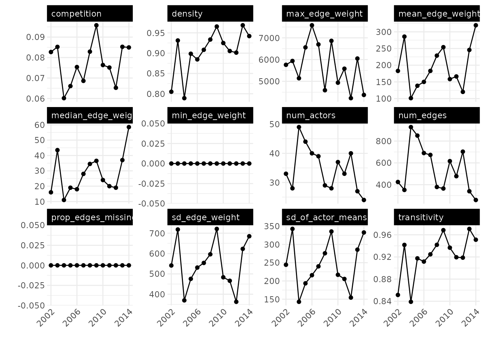
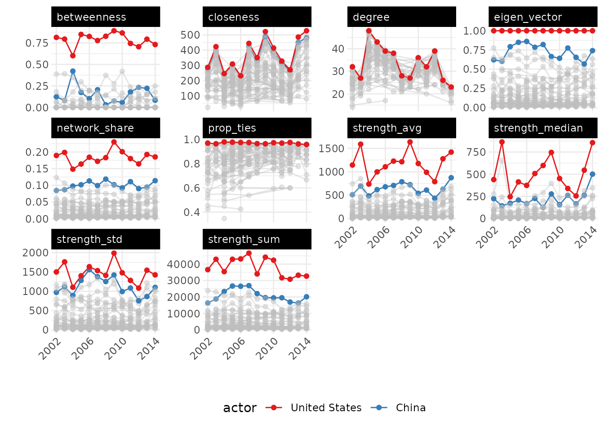
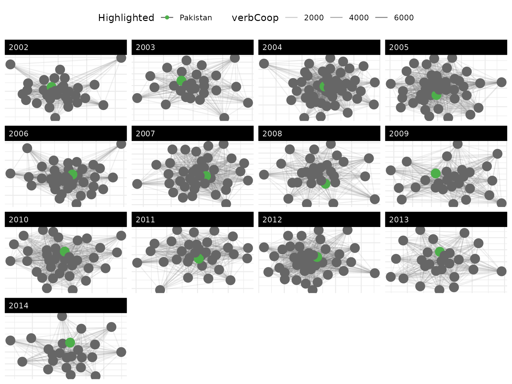
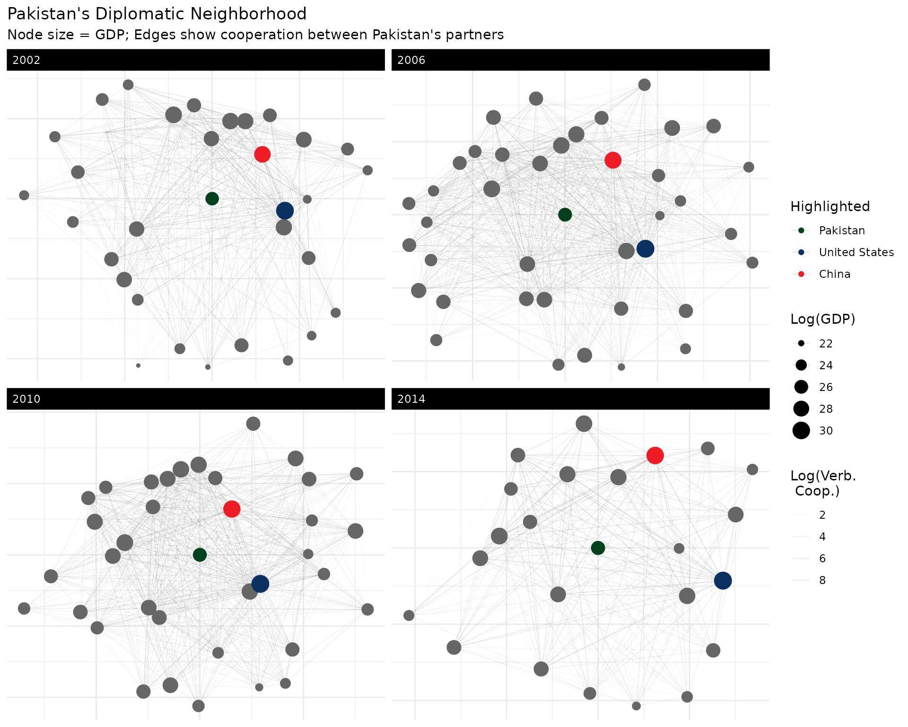
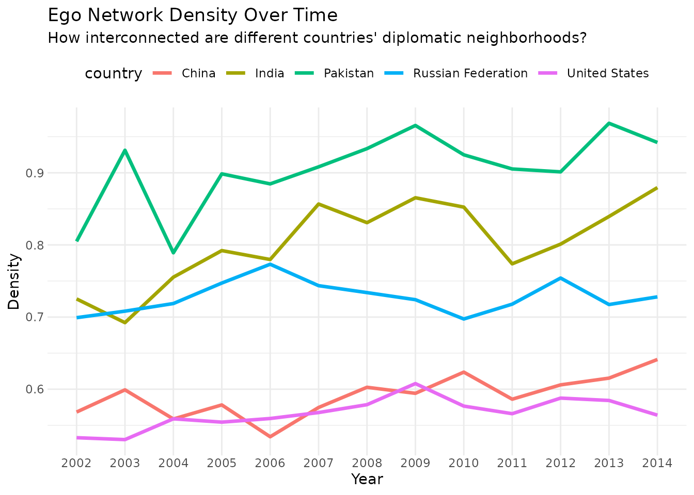
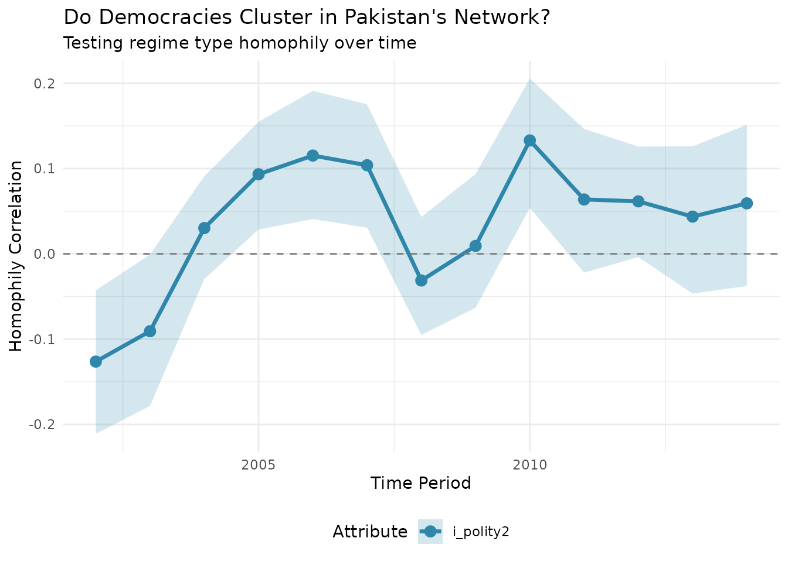
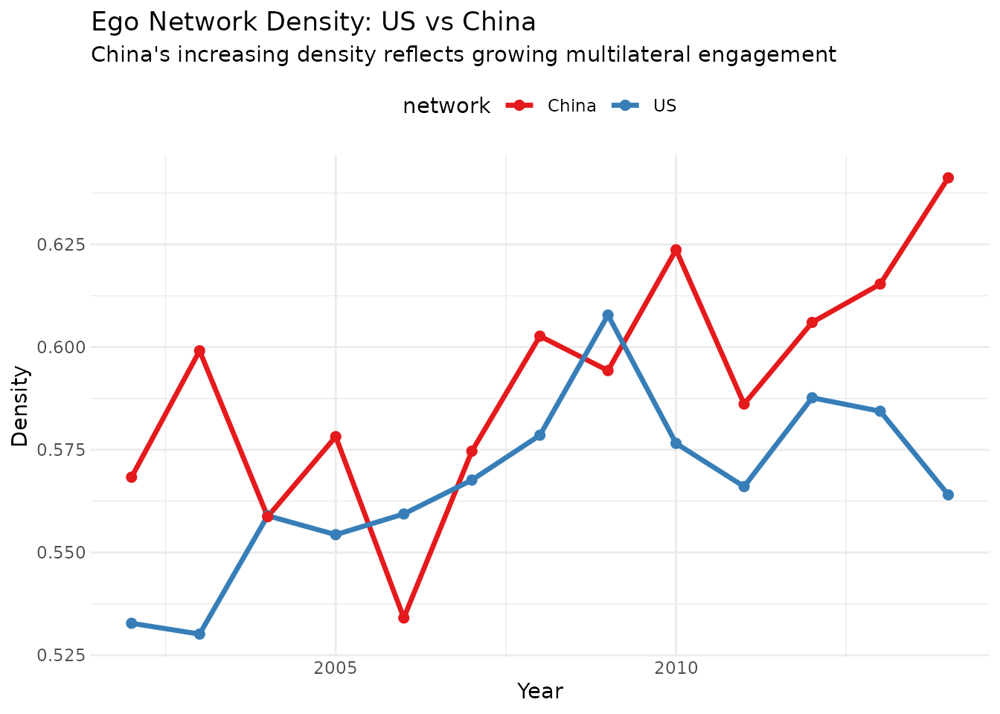

# Ego Networks

This vignette shows how `netify` handles ego networks—the network
surrounding a specific actor and their immediate connections.

## what are ego networks?

An **ego network** focuses on one actor (the “ego”) and includes:

- The **ego**: Your focal actor
- The **alters**: Actors directly connected to the ego  
- **Alter-alter ties**: Connections between the ego’s neighbors

Think of it as zooming in on one node and asking: “Who are their
connections, and how are those connections related to each other?”

## examples

Pakistan’s diplomatic neighborhood includes not just major powers (US,
China) but regional rivals (India) and neighbors (Afghanistan). The
connections *between* these alters matter—does Pakistan broker between
disconnected partners or navigate a densely connected region?

A senator’s ego network reveals their coalition partners, but also
whether those partners work together or represent distinct
constituencies the senator must balance.

An activist organization’s ego network shows both allies and the broader
movement structure—are they bridging disconnected groups or embedded in
a tight cluster?

## why ego networks matter

Ego networks let you apply network thinking without needing complete
network data. You can study:

- How actors manage competing relationships
- Whether similar actors cluster together (homophily)
- How an actor’s position changes across relationships
- Whether an actor brokers between otherwise disconnected groups

``` r

library(netify)
library(dplyr)
library(ggplot2)
```

## getting started: extract an ego network

We’ll use data from the Integrated Crisis Early Warning System (ICEWS)
to demonstrate:

``` r

data(icews)

# verbal cooperation between countries
netlet <- netify(
    icews,
    actor1 = "i", actor2 = "j",
    time = "year",
    weight = "verbCoop",
    nodal_vars = c("i_polity2", "i_log_gdp", 'i_region'),
    dyad_vars = c("matlCoop", "verbConf")
)
```

### extract your first ego network

The
[`ego_netify()`](https://netify-dev.github.io/netify/reference/ego_netify.md)
function makes extraction straightforward:

``` r

pakistan_ego_net <- ego_netify(
    netlet,
    ego = "Pakistan"
    )

print(pakistan_ego_net)
head(summary(pakistan_ego_net)[, c("net", "num_actors", "density", "num_edges")])
#>    net num_actors   density num_edges
#> 1 2002         33 0.8049242       425
#> 2 2003         28 0.9312169       352
#> 3 2004         49 0.7891156       928
#> 4 2005         44 0.8985201       850
#> 5 2006         40 0.8846154       690
#> 6 2007         39 0.9082321       673
```

## key features

### 1. network statistics

``` r

ngbd_summ <- summary(pakistan_ego_net)
head(ngbd_summ)
#>    net    layer num_actors   density num_edges prop_edges_missing
#> 1 2002 Pakistan         33 0.8049242       425                  0
#> 2 2003 Pakistan         28 0.9312169       352                  0
#> 3 2004 Pakistan         49 0.7891156       928                  0
#> 4 2005 Pakistan         44 0.8985201       850                  0
#> 5 2006 Pakistan         40 0.8846154       690                  0
#> 6 2007 Pakistan         39 0.9082321       673                  0
#>   mean_edge_weight sd_edge_weight median_edge_weight min_edge_weight
#> 1         227.2941       595.2732                 35               1
#> 2         306.7926       740.5199                 51               1
#> 3         128.4300       412.2462                 22               1
#> 4         154.1388       499.4925                 25               1
#> 5         169.6478       561.8834                 25               1
#> 6         201.4740       578.2115                 35               1
#>   max_edge_weight competition sd_of_actor_means transitivity
#> 1            5760  0.08270328          244.3143    0.8513921
#> 2            5937  0.08521930          342.5283    0.9417385
#> 3            5141  0.06014910          142.8899    0.8390159
#> 4            6561  0.06605279          193.4328    0.9174501
#> 5            7579  0.07536095          215.7135    0.9116163
#> 6            6698  0.06860271          239.9547    0.9247124
```

Pakistan’s network shows high density (0.79-0.97)—most countries that
interact with Pakistan also interact with each other. The network size
fluctuates between 24-49 actors across years, but that high density
persists. This isn’t a hub-and-spoke pattern where Pakistan connects
otherwise isolated actors; it’s a dense web where multilateral dynamics
likely matter.

``` r

plot_graph_stats(ngbd_summ) +
    scale_x_discrete(
        breaks = seq(2002, 2014, by = 4)
    ) +
    theme(
        axis.text.x=element_text(angle=45, hjust=1)
    )
```



Notice the consistently high transitivity (~0.84-0.97). Pakistan’s
partners tend to cooperate with each other, creating a tightly clustered
neighborhood rather than structural holes Pakistan could exploit.

### 2. actor-level analysis

``` r

ngbd_actor_summ <- summary_actor(pakistan_ego_net)
head(ngbd_actor_summ)
#>         actor    layer time degree prop_ties strength_sum strength_avg
#> 1    Pakistan Pakistan 2002     32    1.0000        10766    336.43750
#> 2 Afghanistan Pakistan 2002     30    0.9375         8864    295.46667
#> 3  Azerbaijan Pakistan 2002     24    0.7500         2435    101.45833
#> 4  Bangladesh Pakistan 2002     24    0.7500         1457     60.70833
#> 5      Canada Pakistan 2002     28    0.8750         1587     56.67857
#> 6       China Pakistan 2002     32    1.0000        16311    509.71875
#>   strength_std strength_median network_share closeness betweenness eigen_vector
#> 1    671.72383           102.5   0.055724638  267.8291   0.0625000   0.37512591
#> 2    443.71921            73.5   0.045879917  253.9336   0.0625000   0.28240824
#> 3    219.03682            16.0   0.012603520  215.1176   0.0000000   0.08126347
#> 4     98.21869            13.5   0.007541408  157.0965   0.0000000   0.04026397
#> 5    104.11996            15.5   0.008214286  180.4695   0.0000000   0.06184088
#> 6    971.41673           223.5   0.084425466  273.2608   0.1229839   0.62166587
```

Beyond degree (number of connections), look at eigenvector centrality—it
captures importance based on connections to other important actors.
China’s high and growing eigenvector centrality reflects not just
bilateral ties with Pakistan but its connections to other key players in
Pakistan’s neighborhood.

``` r

plot_actor_stats(ngbd_actor_summ,
    across_actor=FALSE,
    specific_actors=c('United States', 'China')
    ) +
    scale_x_discrete(
        breaks = seq(2002, 2014, by = 4)
    ) +
    theme(
        axis.text.x=element_text(angle=45, hjust=1)
    )
```



The diverging trajectories are striking. China’s rising centrality
measures show growing connectedness in Pakistan’s neighborhood, while
the US shows more variable engagement despite maintaining presence.

### 3. visualization

By default, [`plot()`](https://rdrr.io/r/graphics/plot.default.html)
highlights the ego:

``` r

plot(pakistan_ego_net)
#> Warning: Removed 1525 rows containing missing values or values outside the scale range
#> (`geom_point()`).
```



### 4. advanced visualization

For clearer visualization of alter-alter relationships, remove the ego’s
edges—we already know everyone connects to Pakistan:

``` r

# attach actor stats so we can map them to node aesthetics
pakistan_ego_net <- add_node_vars(
    pakistan_ego_net,
    summary_actor(pakistan_ego_net),
    "actor", "time"
)

# strip ties incident to ego so the alter-alter structure stands on its own
pakistan_no_ego_edges <- remove_ego_edges(pakistan_ego_net)
```

``` r

plot(pakistan_no_ego_edges,
    layout = "hierarchical",  
    node_size_by = "i_log_gdp",
    node_size_label = "Log(GDP)",
    highlight = c("Pakistan", "United States", "China"),
    highlight_color = c(
        "Pakistan" = '#01411cff', 
        "United States" = "#0A3161",
        "China" = "#EE1C25",
        "Other" = 'grey40'),
    edge_linewidth = 0.05,
    mutate_weight = log1p,
    edge_alpha_label = 'Log(Verb.\n Coop.)',
    time_filter = as.character(seq(2002, 2014, 4))
    ) +
    labs(
        title = "Pakistan's Diplomatic Neighborhood",
        subtitle = "Node size = GDP; Edges show cooperation between Pakistan's partners") +
    theme(legend.position = 'right')
#> Warning: Removed 87 rows containing missing values or values outside the scale range
#> (`geom_point()`).
```



The visualization reveals how Pakistan’s partners form a dense web of
relationships among themselves, with major powers like the US and China
occupying central positions.

## comparing ego networks

### 5. compare across actors

One strength of ego network analysis is systematic comparison:

``` r

powers <- c("United States", "China", "Russian Federation", "India", "Pakistan")
ego_networks <- lapply(powers, function(country) {
    ego_netify(netlet, ego = country)
})
names(ego_networks) <- powers

summaries <- lapply(ego_networks, summary)
comparison_df <- bind_rows(summaries, .id = "country")

ggplot(comparison_df,
    aes(x = net, y = density, color = country, group = country)) +
    geom_line(linewidth = 1.2) +
    labs(title = "Ego Network Density Over Time",
         subtitle = "How interconnected are different countries' diplomatic neighborhoods?",
         x = "Year", y = "Density") +
    theme_bw() +
    theme(
        panel.border = element_blank(),
        axis.ticks = element_blank(),
        legend.position = "top"
    )
```



Pakistan and India maintain the highest density—their partners are
highly interconnected. The US shows lower density, suggesting more of a
hub-and-spoke pattern. Russia’s volatile pattern may reflect shifting
alliances during this period.

### 6. test for homophily

Do birds of a feather flock together? Let’s test if similar regime types
cluster:

``` r

pakistan_homophily <- homophily(
    pakistan_ego_net,
    attribute = "i_polity2",
    method = "correlation"
)

plot_homophily(pakistan_homophily, type = "temporal") +
    labs(title = "Do Democracies Cluster in Pakistan's Network?",
         subtitle = "Testing regime type homophily over time")
```



The results show weak and fluctuating homophily: regime type is not
consistently associated with cooperation patterns in Pakistan’s
neighborhood. Geopolitics appears more central than ideological
alignment in this example.

### 7. control neighborhood boundaries

Sometimes you want to focus on only the strongest relationships:

``` r

# default includes all connections
pakistan_all <- ego_netify(netlet, ego = "Pakistan")

# only strong connections (threshold = 50 cooperation events)
pakistan_strong <- ego_netify(netlet, ego = "Pakistan", threshold = 50)

all_size <- mean(summary(pakistan_all)$num_actors)
strong_size <- mean(summary(pakistan_strong)$num_actors)

tibble(
  Network = c("All connections", "Strong only (>50)"),
  `Average Size` = round(c(all_size, strong_size), 1)
) |>
  knitr::kable()
```

| Network            | Average Size |
|:-------------------|-------------:|
| All connections    |         34.7 |
| Strong only (\>50) |         20.1 |

### 8. different relationship types

Networks of cooperation and conflict often follow different logics:

``` r

conflict_net <- netify(
    icews,
    actor1 = "i", actor2 = "j",
    time = "year",
    weight = "verbConf"
)

# cooperation vs conflict ego networks for pakistan
pak_coop_ego <- ego_netify(netlet, ego = "Pakistan")
pak_conf_ego <- ego_netify(conflict_net, ego = "Pakistan")

coop_stats <- summary(pak_coop_ego)
conf_stats <- summary(pak_conf_ego)

comparison <- tibble(
  Metric = c("Average actors", "Average density"),
  Cooperation = c(
    round(mean(coop_stats$num_actors), 1),
    round(mean(coop_stats$density), 3)
  ),
  Conflict = c(
    round(mean(conf_stats$num_actors), 1),
    round(mean(conf_stats$density), 3)
  )
)

knitr::kable(comparison)
```

| Metric          | Cooperation | Conflict |
|:----------------|------------:|---------:|
| Average actors  |      34.700 |   26.800 |
| Average density |       0.904 |    0.646 |

Pakistan’s conflict network is smaller but still substantial. The lower
average density in conflict (about 0.65 vs 0.90) suggests conflicts are
more bilateral while cooperation tends to be multilateral.

### 9. track network evolution

How stable are relationships over time?

``` r

pakistan_comparison <- compare_networks(pakistan_ego_net, what = "edges")

# zoom in on one transition
changes_2010_2011 <- pakistan_comparison$edge_changes$`2010_vs_2011`

stability_ratio <- round(
  changes_2010_2011$maintained / 
  (changes_2010_2011$maintained + changes_2010_2011$removed), 3)

tibble(
  Transition = "2010 to 2011",
  Added = changes_2010_2011$added,
  Removed = changes_2010_2011$removed,
  Maintained = changes_2010_2011$maintained,
  `Stability Ratio` = stability_ratio
) |>
  knitr::kable()
```

| Transition   | Added | Removed | Maintained | Stability Ratio |
|:-------------|------:|--------:|-----------:|----------------:|
| 2010 to 2011 |   444 |     720 |        512 |           0.416 |

A stability ratio of 0.416 indicates moderate turnover – about 58% of
relationships don’t persist year-to-year.

### 10. compare network structures: rising vs established powers

How do the US and China structure their diplomatic neighborhoods
differently?

``` r

us_ego <- ego_netify(netlet, ego = "United States")
china_ego <- ego_netify(netlet, ego = "China")

structural_comp <- compare_networks(
    list("US" = us_ego, "China" = china_ego),
    what = 'structure'
)
#> Warning: Network US appears to be longitudinal. Using first time period for structural
#> comparison.
#> Warning: Network China appears to be longitudinal. Using first time period for
#> structural comparison.

comp_summary <- structural_comp$summary
avg_props <- comp_summary |>
    group_by(network) |>
    summarise(
        `Avg. Nodes` = round(mean(num_actors), 0),
        `Avg. Density` = round(mean(density), 3),
        `Avg. Transitivity` = round(mean(transitivity), 3),
        .groups = 'drop'
    )

knitr::kable(avg_props)
```

| network | Avg. Nodes | Avg. Density | Avg. Transitivity |
|:--------|-----------:|-------------:|------------------:|
| China   |        104 |        0.568 |             0.698 |
| US      |        120 |        0.533 |             0.682 |

The US maintains a larger but less dense network—more of a hub-and-spoke
pattern. China’s denser network suggests its partners are more
interconnected, potentially reflecting regional concentration.

Let’s look at the temporal patterns:

``` r

us_summary <- summary(us_ego)
china_summary <- summary(china_ego)

temporal_comparison <- bind_rows(
    us_summary |> mutate(network = "US"),
    china_summary |> mutate(network = "China")
)

temporal_comparison$year <- as.integer(temporal_comparison$net)

ggplot(temporal_comparison, aes(x = year, y = density, color = network)) +
    geom_line(linewidth = 1.2) +
    geom_point(size = 2) +
    scale_color_manual(values = c("US" = "#377eb8", "China" = "#e41a1c")) +
    labs(title = "Ego Network Density: US vs China",
         subtitle = "China's increasing density reflects growing multilateral engagement",
         x = "Year", y = "Density") +
    theme_bw() +
    theme(
        panel.border = element_blank(),
        axis.ticks = element_blank(),
        legend.position = "top"
    )
```



Now let’s examine how similar their cooperation patterns are:

``` r

comp_2012 <- compare_networks(
    list(
        "US_2012" = subset(us_ego, time = "2012"),
        "China_2012" = subset(china_ego, time = "2012")
    ),
    what = "edges",
    method = "all"
)

edge_stats <- comp_2012$summary
edge_changes <- comp_2012$edge_changes[[1]]

tibble(
  Metric = c("Edge correlation", "Jaccard similarity", 
             "Unique to US", "Unique to China", "Shared"),
  Value = c(
    round(edge_stats$correlation, 3),
    round(edge_stats$jaccard, 3),
    edge_changes$removed,
    edge_changes$added,
    edge_changes$maintained
  )
) |>
  knitr::kable()
```

| Metric             |    Value |
|:-------------------|---------:|
| Edge correlation   |    0.991 |
| Jaccard similarity |    0.645 |
| Unique to US       | 2222.000 |
| Unique to China    | 1104.000 |
| Shared             | 6030.000 |

The very high correlation (0.991) but moderate Jaccard similarity
(0.645) tells an interesting story: when both countries engage with a
partner, they do so in similar ways, but the US maintains many more
unique relationships (2,222 vs 1,104).

Finally, who’s in these networks?

``` r

# compare node composition
node_comp <- compare_networks(
    list("US" = us_ego, "China" = china_ego),
    what = "nodes"
)

# the 75% overlap reflects shared major partners
# but the us's 24 unique partners vs china's 8 shows its broader global reach
knitr::kable(node_comp$summary)
```

| comparison | nodes_net1 | nodes_net2 | common_nodes | jaccard_similarity | nodes_added | nodes_removed |
|:---|---:|---:|---:|---:|---:|---:|
| US vs China | 120 | 104 | 96 | 0.75 | 8 | 24 |

## tl;dr

``` r

# extract ego network
ego_net <- ego_netify(netlet, ego = "Actor Name")

# basic analysis
summary(ego_net)                    # network-level stats
summary_actor(ego_net)              # actor-level stats
plot(ego_net)                       # visualize
plot(remove_ego_edges(ego_net))     # focus on alter-alter ties

# advanced analysis
homophily(ego_net, attribute = "democracy")     # test homophily
compare_networks(ego_net, what = "edges")       # temporal comparison
compare_networks(list(ego1, ego2), what = "edges")  # cross-sectional comparison
```

## references

Boschee, E., Lautenschlager, J., O’Brien, S., Shellman, S., Starz, J., &
Ward, M. (2015). ICEWS Coded Event Data. Harvard Dataverse. DOI
10.7910/DVN/28075.
