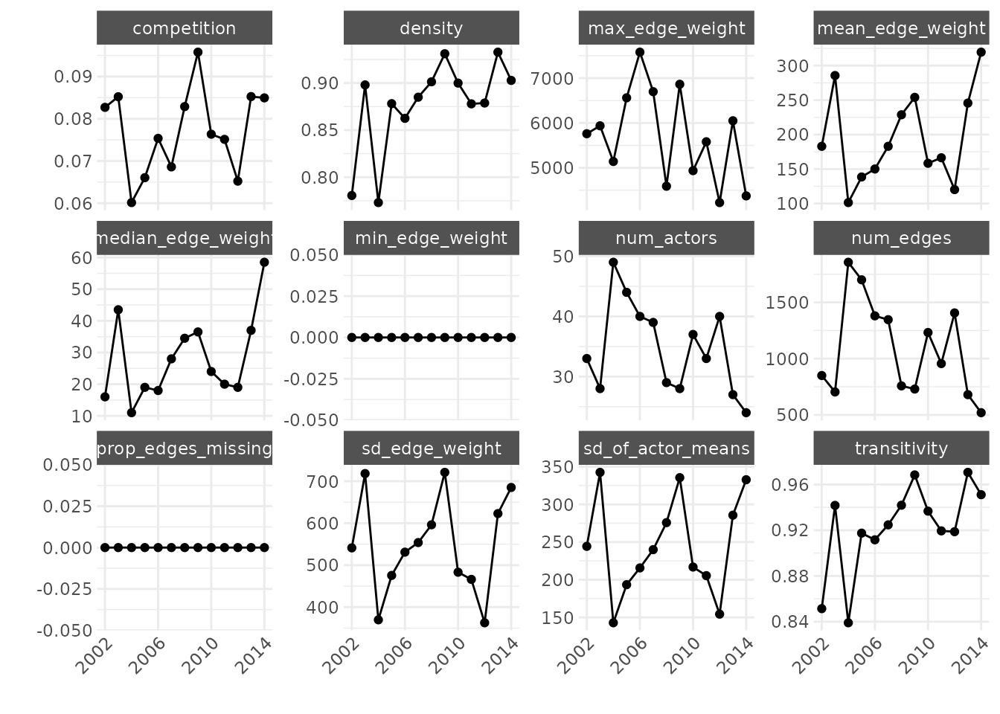
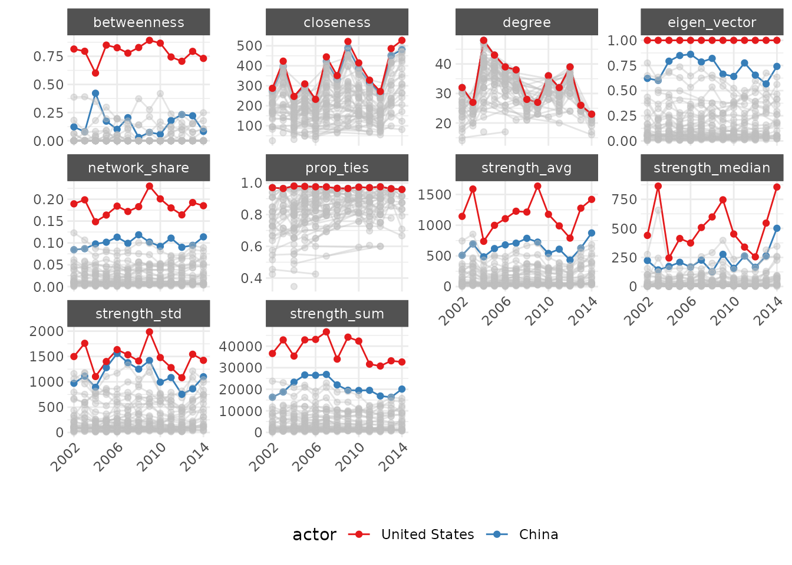
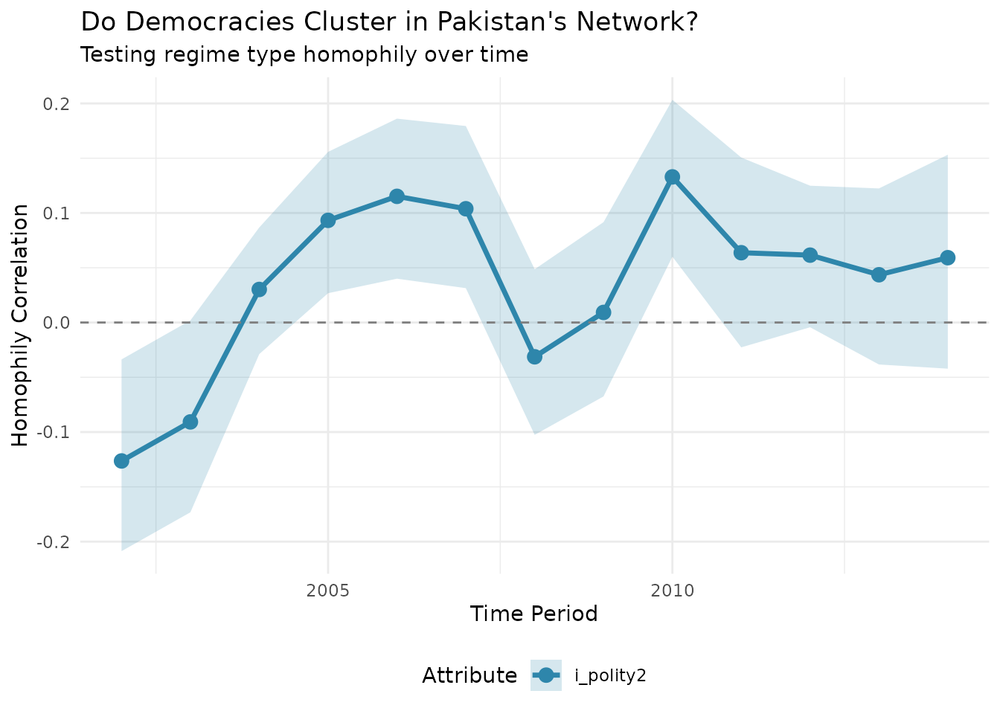

# Ego Networks

This vignette shows how `netify` handles ego networks—the network
surrounding a specific actor and their immediate connections.

## What Are Ego Networks?

An **ego network** focuses on one actor (the “ego”) and includes:

- The **ego**: Your focal actor
- The **alters**: Actors directly connected to the ego  
- **Alter-alter ties**: Connections between the ego’s neighbors

Think of it as zooming in on one node and asking: “Who are their
connections, and how are those connections related to each other?”

## Examples

Pakistan’s diplomatic neighborhood includes not just major powers (US,
China) but regional rivals (India) and neighbors (Afghanistan). The
connections *between* these alters matter—does Pakistan broker between
disconnected partners or navigate a densely connected region?

A senator’s ego network reveals their coalition partners, but also
whether those partners work together or represent distinct
constituencies the senator must balance.

An activist organization’s ego network shows both allies and the broader
movement structure—are they bridging disconnected groups or embedded in
a tight cluster?

## Why Ego Networks Matter

Ego networks let you apply network thinking without needing complete
network data. You can study:

- How actors manage competing relationships
- Whether similar actors cluster together (homophily)
- How an actor’s position affects their influence
- Whether an actor brokers between otherwise disconnected groups

``` r
library(netify)
library(dplyr)
library(ggplot2)
```

## Getting Started: Extract an Ego Network

We’ll use data from the Integrated Crisis Early Warning System (ICEWS)
to demonstrate:

``` r
# Load ICEWS data
data(icews)

# Create a network of verbal cooperation between countries
netlet <- netify(
    icews,
    actor1 = "i", actor2 = "j", 
    time = "year",
    weight = "verbCoop",
    nodal_vars = c("i_polity2", "i_log_gdp", 'i_region'),
    dyad_vars = c("matlCoop", "verbConf")
)
```

### Extract Your First Ego Network

The
[`ego_netify()`](https://netify-dev.github.io/netify/reference/ego_netify.md)
function makes extraction straightforward:

``` r
# Extract Pakistan's ego network
pakistan_ego_net <- ego_netify(
    netlet, 
    ego = "Pakistan"
    )

# That's it! You now have Pakistan's ego network across all years
print(pakistan_ego_net)
```

## Key Features

### 1. Network Statistics

``` r
# Get network-level stats
ngbd_summ <- summary(pakistan_ego_net)
head(ngbd_summ)
#>    net num_actors   density num_edges prop_edges_missing mean_edge_weight
#> 1 2002         33 0.7805326       850                  0         182.9545
#> 2 2003         28 0.8979592       704                  0         285.6905
#> 3 2004         49 0.7730112      1856                  0         101.3461
#> 4 2005         44 0.8780992      1700                  0         138.4968
#> 5 2006         40 0.8625000      1380                  0         150.0731
#> 6 2007         39 0.8849441      1346                  0         182.9852
#>   sd_edge_weight median_edge_weight min_edge_weight max_edge_weight competition
#> 1       541.2426               16.0               0            5760  0.08270328
#> 2       718.2698               43.5               0            5937  0.08521930
#> 3       369.8192               11.0               0            5141  0.06014910
#> 4       475.6012               19.0               0            6561  0.06605279
#> 5       531.0351               18.0               0            7579  0.07536095
#> 6       553.8835               28.0               0            6698  0.06860271
#>   sd_of_actor_means transitivity
#> 1          244.3143    0.8513921
#> 2          342.5283    0.9417385
#> 3          142.8899    0.8390159
#> 4          193.4328    0.9174501
#> 5          215.7135    0.9116163
#> 6          239.9547    0.9247124
```

Pakistan’s network shows remarkably high density (0.78-0.89)—most
countries that interact with Pakistan also interact with each other. The
network size fluctuates between 28-49 actors across years, but that high
density persists. This isn’t a hub-and-spoke pattern where Pakistan
connects otherwise isolated actors; it’s a dense web where multilateral
dynamics likely matter.

``` r
# Visualize trends
plot_graph_stats(ngbd_summ) +
    scale_x_discrete(
        breaks = seq(2002, 2014, by = 4)
    ) +
    theme(
        axis.text.x=element_text(angle=45, hjust=1)
    )
```



Notice the consistently high transitivity (~0.85-0.94). Pakistan’s
partners tend to cooperate with each other, creating a tightly clustered
neighborhood rather than structural holes Pakistan could exploit.

### 2. Actor-Level Analysis

``` r
# Who matters in Pakistan's network?
ngbd_actor_summ <- summary_actor(pakistan_ego_net)
head(ngbd_actor_summ)
#>         actor time degree prop_ties strength_sum strength_avg strength_std
#> 1    Pakistan 2002     32 0.9696970        10766    336.43750    671.72383
#> 2 Afghanistan 2002     30 0.9090909         8864    277.00000    435.27537
#> 3  Azerbaijan 2002     24 0.7272727         2435     76.09375    193.87697
#> 4  Bangladesh 2002     24 0.7272727         1457     45.53125     88.71701
#> 5      Canada 2002     28 0.8484848         1587     49.59375     99.01934
#> 6       China 2002     32 0.9696970        16311    509.71875    971.41673
#>   strength_median network_share closeness betweenness eigen_vector
#> 1           102.5   0.055724638  267.8291   0.0625000   0.37512591
#> 2            45.0   0.045879917  253.9336   0.0625000   0.28240824
#> 3             7.0   0.012603520  215.1176   0.0000000   0.08126347
#> 4             4.0   0.007541408  157.0965   0.0000000   0.04026397
#> 5            14.5   0.008214286  180.4695   0.0000000   0.06184088
#> 6           223.5   0.084425466  273.2608   0.1229839   0.62166587
```

Beyond degree (number of connections), look at eigenvector centrality—it
captures importance based on connections to other important actors.
China’s high and growing eigenvector centrality reflects not just
bilateral ties with Pakistan but its connections to other key players in
Pakistan’s neighborhood.

``` r
# Track key players over time
plot_actor_stats(ngbd_actor_summ, 
    across_actor=FALSE,
    specific_actors=c('United States', 'China')
    ) +
    scale_x_discrete(
        breaks = seq(2002, 2014, by = 4)
    ) +
    theme(
        axis.text.x=element_text(angle=45, hjust=1)
    )
```



The diverging trajectories are striking. China’s rising centrality
measures across the board reflect its growing influence in Pakistan’s
neighborhood, while the US shows more variable engagement despite
maintaining presence.

### 3. Visualization

By default, [`plot()`](https://rdrr.io/r/graphics/plot.default.html)
highlights the ego:

``` r
plot(pakistan_ego_net)
```


### 4. Advanced Visualization

For clearer visualization of alter-alter relationships, remove the ego’s
edges—we already know everyone connects to Pakistan:

``` r
# Add node statistics for visualization
pakistan_ego_net <- add_node_vars(
    pakistan_ego_net,
    summary_actor(pakistan_ego_net),
    "actor", "time"
)

# Remove ego edges for cleaner visualization
pakistan_no_ego_edges <- remove_ego_edges(pakistan_ego_net)
```

``` r
# Create a more informative plot
plot(pakistan_no_ego_edges,
    layout = "hierarchical",  
    node_size_by = "i_log_gdp",
    node_size_label = "Log(GDP)",
    highlight = c("Pakistan", "United States", "China"),
    highlight_color = c(
        "Pakistan" = '#01411cff', 
        "United States" = "#0A3161",
        "China" = "#EE1C25",
        "Other" = 'grey40'),
    edge_linewidth = 0.05,
    mutate_weight = log1p,
    edge_alpha_label = 'Log(Verb.\n Coop.)',
    time_filter = as.character(seq(2002, 2014, 4))
    ) +
    labs(
        title = "Pakistan's Diplomatic Neighborhood",
        subtitle = "Node size = GDP; Edges show cooperation between Pakistan's partners") +
    theme(legend.position = 'right')
```


The visualization reveals how Pakistan’s partners form a dense web of
relationships among themselves, with major powers like the US and China
occupying central positions.

## Comparing Ego Networks

### 5. Compare Across Actors

One strength of ego network analysis is systematic comparison:

``` r
# Extract multiple ego networks
powers <- c("United States", "China", "Russian Federation", "India", "Pakistan")
ego_networks <- lapply(powers, function(country) {
    ego_netify(netlet, ego = country)
})
names(ego_networks) <- powers

# Compare network properties
summaries <- lapply(ego_networks, summary)
comparison_df <- bind_rows(summaries, .id = "country")

# Visualize differences
ggplot(comparison_df, 
    aes(x = net, y = density, color = country, group = country)) +
    geom_line(linewidth = 1.2) +
    labs(title = "Ego Network Density Over Time",
         subtitle = "How interconnected are different countries' diplomatic neighborhoods?",
         x = "Year", y = "Density") +
    theme_minimal()
```


Pakistan and India maintain the highest density—their partners are
highly interconnected. The US shows lower density, suggesting more of a
hub-and-spoke pattern. Russia’s volatile pattern may reflect shifting
alliances during this period.

### 6. Test for Homophily

Do birds of a feather flock together? Let’s test if similar regime types
cluster:

``` r
# Test regime type homophily
pakistan_homophily <- homophily(
    pakistan_ego_net,
    attribute = "i_polity2",
    method = "correlation"
)

# Visualize over time
plot_homophily(pakistan_homophily, type = "temporal") +
    labs(title = "Do Democracies Cluster in Pakistan's Network?",
         subtitle = "Testing regime type homophily over time")
```



The results show weak and fluctuating homophily—regime type doesn’t
consistently predict cooperation patterns in Pakistan’s neighborhood.
Geopolitics seems to override ideological alignment.

### 7. Control Neighborhood Boundaries

Sometimes you want to focus on only the strongest relationships:

``` r
# Default includes all connections
pakistan_all <- ego_netify(netlet, ego = "Pakistan")

# Only strong connections (threshold = 50 cooperation events)
pakistan_strong <- ego_netify(netlet, ego = "Pakistan", threshold = 50)

# Compare sizes
all_size <- mean(summary(pakistan_all)$num_actors)
strong_size <- mean(summary(pakistan_strong)$num_actors)

tibble(
  Network = c("All connections", "Strong only (>50)"),
  `Average Size` = round(c(all_size, strong_size), 1)
) |>
  knitr::kable()
```

| Network            | Average Size |
|:-------------------|-------------:|
| All connections    |         34.7 |
| Strong only (\>50) |         20.1 |

### 8. Different Relationship Types

Networks of cooperation and conflict often follow different logics:

``` r
# Create a conflict network
conflict_net <- netify(
    icews,
    actor1 = "i", actor2 = "j",
    time = "year",
    weight = "verbConf"
)

# Compare cooperation vs conflict ego networks
pak_coop_ego <- ego_netify(netlet, ego = "Pakistan")
pak_conf_ego <- ego_netify(conflict_net, ego = "Pakistan")

# Summarize differences
coop_stats <- summary(pak_coop_ego)
conf_stats <- summary(pak_conf_ego)

comparison <- tibble(
  Metric = c("Average actors", "Average density"),
  Cooperation = c(
    round(mean(coop_stats$num_actors), 1),
    round(mean(coop_stats$density), 3)
  ),
  Conflict = c(
    round(mean(conf_stats$num_actors), 1),
    round(mean(conf_stats$density), 3)
  )
)

knitr::kable(comparison)
```

| Metric          | Cooperation | Conflict |
|:----------------|------------:|---------:|
| Average actors  |      34.700 |    26.80 |
| Average density |       0.877 |     0.62 |

Pakistan’s conflict network is smaller but still substantial. The lower
density in conflict (0.62 vs 0.88) suggests conflicts are more bilateral
while cooperation tends to be multilateral.

### 9. Track Network Evolution

How stable are relationships over time?

``` r
# Analyze year-to-year changes
pakistan_comparison <- compare_networks(pakistan_ego_net, what = "edges")

# Look at a specific transition
changes_2010_2011 <- pakistan_comparison$edge_changes$`2010_vs_2011`

stability_ratio <- round(
  changes_2010_2011$maintained / 
  (changes_2010_2011$maintained + changes_2010_2011$removed), 3)

tibble(
  Transition = "2010 to 2011",
  Added = changes_2010_2011$added,
  Removed = changes_2010_2011$removed,
  Maintained = changes_2010_2011$maintained,
  `Stability Ratio` = stability_ratio
) |>
  knitr::kable()
```

| Transition   | Added | Removed | Maintained | Stability Ratio |
|:-------------|------:|--------:|-----------:|----------------:|
| 2010 to 2011 |   114 |     204 |        324 |           0.614 |

A stability ratio of 0.614 indicates moderate turnover—about 40% of
relationships don’t persist year-to-year.

### 10. Compare Network Structures: Rising vs Established Powers

How do the US and China structure their diplomatic neighborhoods
differently?

``` r
# Extract ego networks
us_ego <- ego_netify(netlet, ego = "United States")
china_ego <- ego_netify(netlet, ego = "China")

# Compare structural properties
structural_comp <- compare_networks(
    list("US" = us_ego, "China" = china_ego), 
    what = 'structure'
)

# Summarize average properties
comp_summary <- structural_comp$summary
avg_props <- comp_summary |>
    group_by(network) |>
    summarise(
        `Avg. Nodes` = round(mean(num_actors), 0),
        `Avg. Density` = round(mean(density), 3),
        `Avg. Transitivity` = round(mean(transitivity), 3),
        .groups = 'drop'
    )

knitr::kable(avg_props)
```

| network | Avg. Nodes | Avg. Density | Avg. Transitivity |
|:--------|-----------:|-------------:|------------------:|
| China   |        104 |        0.563 |             0.698 |
| US      |        120 |        0.528 |             0.682 |

The US maintains a larger but less dense network—more of a hub-and-spoke
pattern. China’s denser network suggests its partners are more
interconnected, potentially reflecting regional concentration.

Let’s look at the temporal patterns:

``` r
# Get temporal summaries for each ego network
us_summary <- summary(us_ego)
china_summary <- summary(china_ego)

# Combine for visualization
temporal_comparison <- bind_rows(
    us_summary |> mutate(network = "US"),
    china_summary |> mutate(network = "China")
)

# Extract year from net column (assuming format like "2002", "2003", etc.)
temporal_comparison$year <- as.integer(temporal_comparison$net)

# Density comparison
ggplot(temporal_comparison, aes(x = year, y = density, color = network)) +
    geom_line(linewidth = 1.2) +
    geom_point(size = 2) +
    scale_color_manual(values = c("US" = "#377eb8", "China" = "#e41a1c")) +
    labs(title = "Ego Network Density: US vs China",
         subtitle = "China's increasing density reflects growing multilateral engagement",
         x = "Year", y = "Density") +
    theme_minimal() +
    theme(legend.position = "top")
```


Now let’s examine how similar their cooperation patterns are:

``` r
# Compare 2012 networks
comp_2012 <- compare_networks(
    list(
        "US_2012" = subset(us_ego, time = "2012"),
        "China_2012" = subset(china_ego, time = "2012")
    ),
    what = "edges",
    method = "all"
)

# Extract key statistics
edge_stats <- comp_2012$summary
edge_changes <- comp_2012$edge_changes[[1]]

# Create summary table
tibble(
  Metric = c("Edge correlation", "Jaccard similarity", 
             "Unique to US", "Unique to China", "Shared"),
  Value = c(
    round(edge_stats$correlation, 3),
    round(edge_stats$jaccard, 3),
    edge_changes$removed,
    edge_changes$added,
    edge_changes$maintained
  )
) |>
  knitr::kable()
```

| Metric             |    Value |
|:-------------------|---------:|
| Edge correlation   |    0.991 |
| Jaccard similarity |    0.645 |
| Unique to US       | 2222.000 |
| Unique to China    | 1104.000 |
| Shared             | 6030.000 |

The very high correlation (0.991) but moderate Jaccard similarity
(0.645) tells an interesting story: when both countries engage with a
partner, they do so in similar ways, but the US maintains many more
unique relationships (2,222 vs 1,104).

Finally, who’s in these networks?

``` r
# Compare node composition
node_comp <- compare_networks(
    list("US" = us_ego, "China" = china_ego),
    what = "nodes"
)

# The 75% overlap reflects shared major partners
# but the US's 24 unique partners vs China's 8 shows its broader global reach
knitr::kable(node_comp$summary)
```

| comparison  | nodes_net1 | nodes_net2 | common_nodes | jaccard_similarity | nodes_added | nodes_removed |
|:------------|-----------:|-----------:|-------------:|-------------------:|------------:|--------------:|
| US vs China |        120 |        104 |           96 |               0.75 |           8 |            24 |

## tl;dr

``` r
# Extract ego network
ego_net <- ego_netify(netlet, ego = "Actor Name")

# Basic analysis
summary(ego_net)                    # Network-level stats
summary_actor(ego_net)              # Actor-level stats
plot(ego_net)                       # Visualize
plot(remove_ego_edges(ego_net))     # Focus on alter-alter ties

# Advanced analysis
homophily(ego_net, attribute = "democracy")     # Test homophily
compare_networks(ego_net, what = "edges")       # Temporal comparison
compare_networks(list(ego1, ego2), what = "edges")  # Cross-sectional comparison
```
