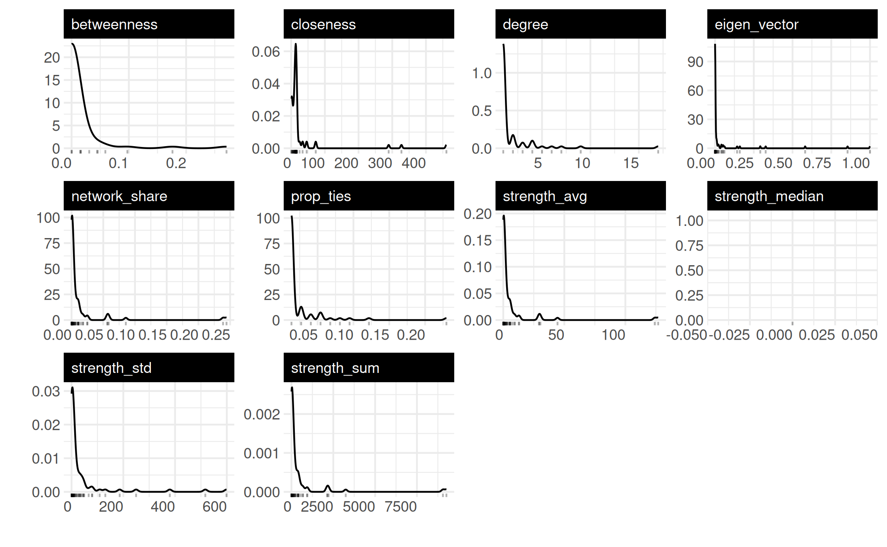
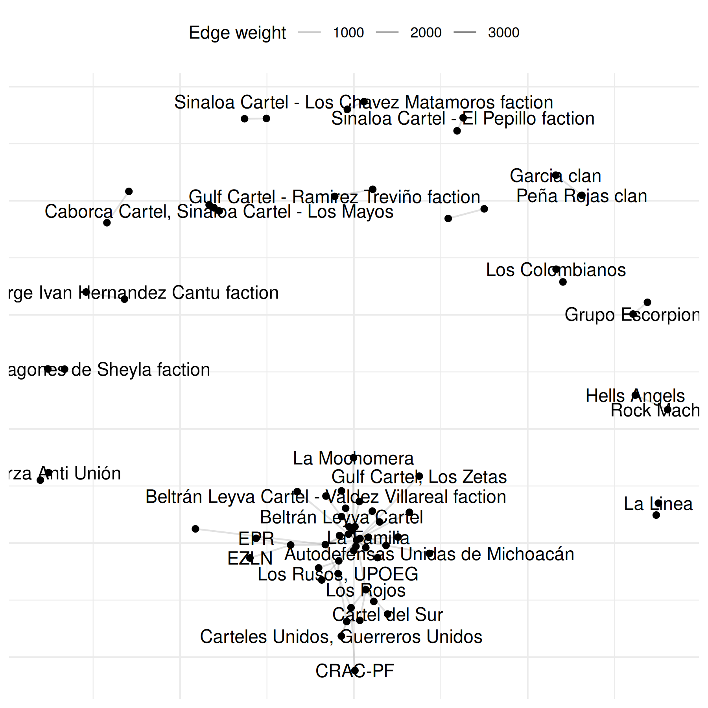
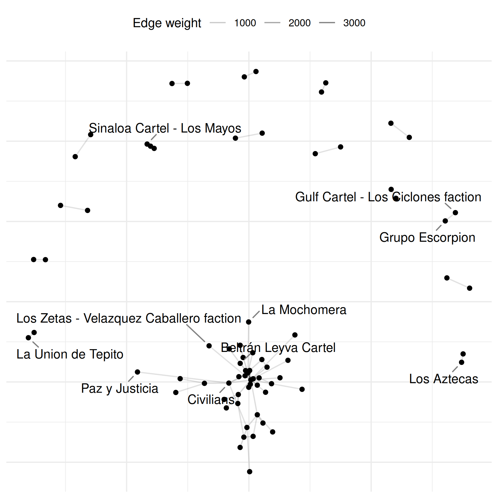
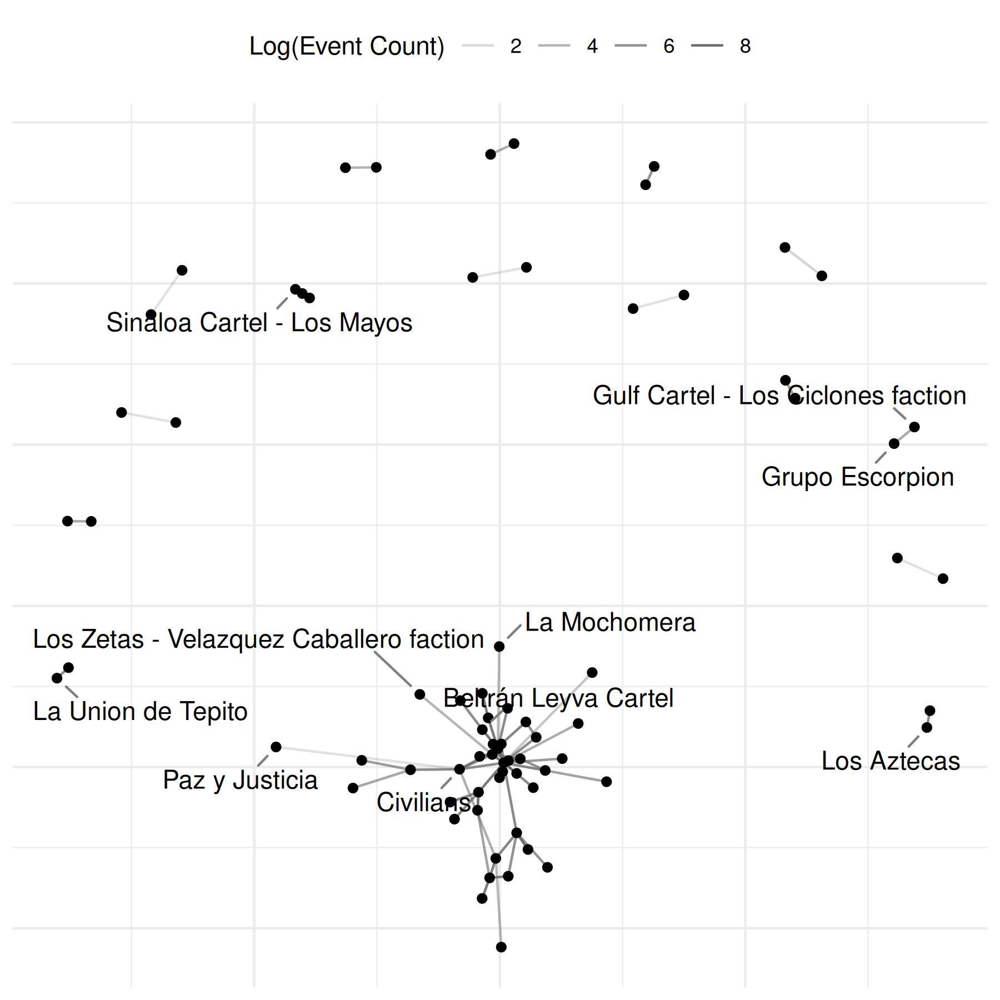
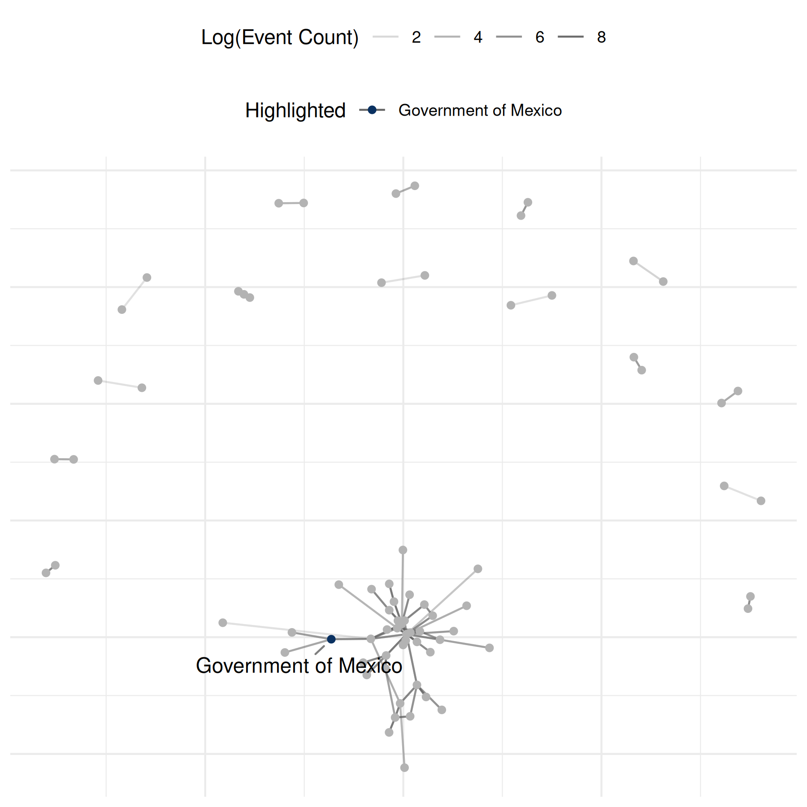
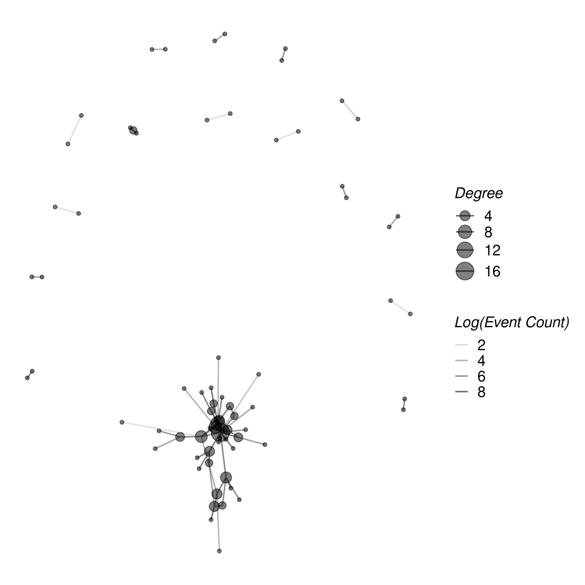
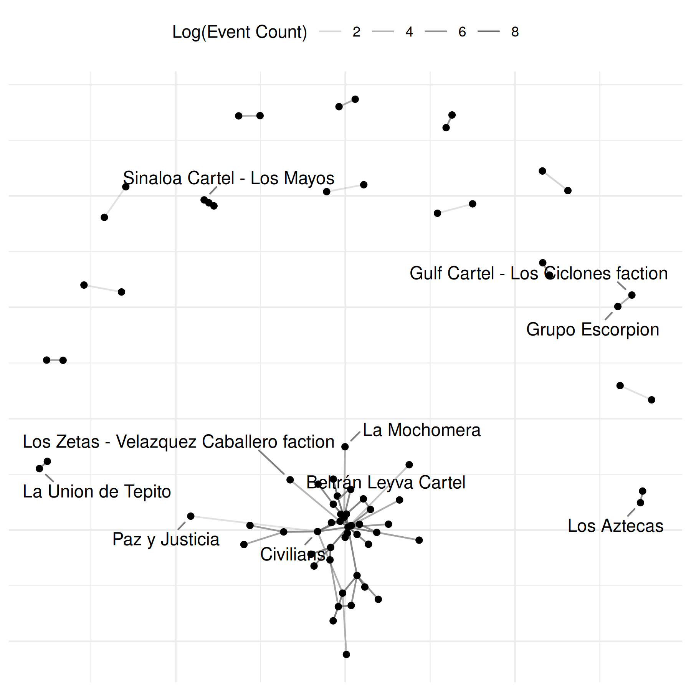
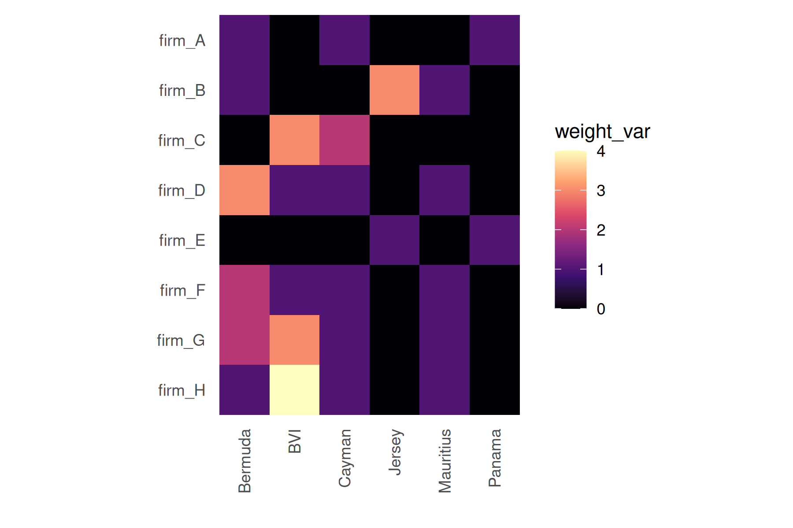
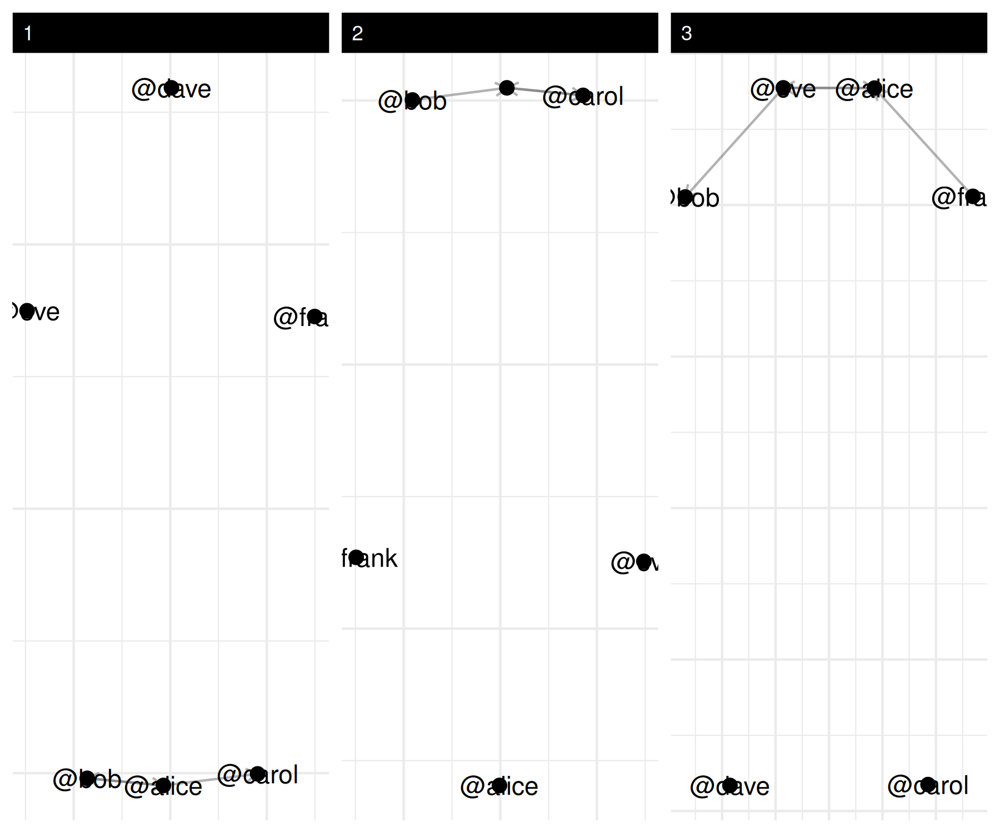

# Event Data

## tl;dr

Event data come in two flavors. **One-mode** event data (actor-on-actor:
who fought who, who cited whom) becomes a unipartite network.
**Two-mode** event data (actor-on-venue: firms in jurisdictions,
attendees at meetings) becomes a bipartite network. This vignette walks
through both. Along the way we cover transforming weights, single-actor
highlighting, applying a ggplot theme, and how to export a figure with
[`ggsave()`](https://ggplot2.tidyverse.org/reference/ggsave.html). Have
fun!

``` r

library(netify)
library(ggplot2)
```

## One-mode event data: UCDP conflict in Mexico

A common data type used to build conflict networks is **event data**,
where actors are repeated across rows but no single column explicitly
encodes an edge weight.
[`netify()`](https://netify-dev.github.io/netify/reference/netify.md)
handles this case by counting interactions when no `weight` is provided.

We use UCDP GED data on Mexico as one example of an application to
intrastate event data. The data come from
<https://ucdp.uu.se/downloads/> (version 23.1, subset to Mexico); the
subset ships internally so the code below runs as-is.

1.  **Create**: generate an aggregated, weighted network of conflict
    between actors in Mexico. When the user does not supply a `weight`
    value,
    [`netify()`](https://netify-dev.github.io/netify/reference/netify.md)
    counts interactions and returns the count as the edge weight, with
    an informational message indicating that this has happened.

``` r

# load UCDP GED data on Mexico
data(mexico)

# construct count-weighted network (number_of_events by default)
mex_network <- netify(
    mexico,
    actor1 = "side_a",
    actor2 = "side_b",
    symmetric = TRUE,
    sum_dyads = TRUE,
    diag_to_NA = TRUE,
    missing_to_zero = TRUE
)
```

    ## ! Warning: there are repeating dyads within time periods in the dataset. When `sum_dyads = TRUE` and `weight` is not supplied, edges in the outputted adjacency matrix represent a count of interactions between actors.

``` r

# summaries at the graph and actor levels
summary(mex_network)
```

    ##   net num_actors    density num_edges prop_edges_missing mean_edge_weight
    ## 1   1         74 0.02554609        69                  0         7.018512
    ##   sd_edge_weight median_edge_weight min_edge_weight max_edge_weight competition
    ## 1        113.395                  0               0            3757   0.1371326
    ##   sd_of_actor_means transitivity
    ## 1          21.37264    0.1046512

``` r

actor_stats <- summary_actor(mex_network)
plot_actor_stats(actor_stats)
```



### tl;dr Sidebar: NA versus zero in event-count weights

Event counts have a sharp interpretation gap that does not show up in,
say, a 0/1 alliance network: the difference between **“these two actors
were both in the data and recorded zero events together”** and **“we
have no information on whether these two actors interacted at all”** is
the difference between a substantive zero and a missing observation. The
default `missing_to_zero = TRUE` collapses both into `0`. For routine
event-data uses this is what you want — a missing UCDP dyad really does
mean “no recorded violent event between these two sides in this slice of
the data,” which is closer to a substantive zero than a Bayesian “we
don’t know.” But for epidemiology / contact-tracing / sparse rosters,
the asymmetry matters and you’ll want `missing_to_zero = FALSE`.

A 5-actor toy makes the bookkeeping concrete. Suppose four
contact-tracing interviews surfaced four edges among five named
individuals; the remaining dyads were never asked about:

``` r

tiny <- data.frame(
    a1 = c("p1", "p1", "p2", "p3"),
    a2 = c("p2", "p3", "p3", "p4"),
    n_contacts = c(2, 1, 3, 1),
    stringsAsFactors = FALSE
)

# preserve unobserved dyads as NA
net_na <- netify(
    tiny,
    actor1 = "a1", actor2 = "a2",
    weight = "n_contacts",
    symmetric = TRUE,
    missing_to_zero = FALSE,
    nodelist = c("p1", "p2", "p3", "p4", "p5")
)

# the raw matrix carries explicit NAs for the never-asked dyads
get_raw(net_na)
```

    ##    p1 p2 p3 p4 p5
    ## p1 NA  2  1 NA NA
    ## p2  2 NA  3 NA NA
    ## p3  1  3 NA  1 NA
    ## p4 NA NA  1 NA NA
    ## p5 NA NA NA NA NA

``` r

# summary() reports the missingness fraction in its own column when
# missing_to_zero = FALSE
summary(net_na)[, c("num_actors", "density", "num_edges",
                    "prop_edges_missing", "prop_unknown_edges")]
```

    ##   num_actors density num_edges prop_edges_missing prop_unknown_edges
    ## 1          5     0.4         4                0.6                0.6

`prop_unknown_edges` only shows up when `missing_to_zero = FALSE` — that
is the cue that the netlet is actually carrying NA semantics downstream.
Build the same netlet with the default and the NAs are silently replaced
with `0`s and the column disappears; that is fine for UCDP / GED event
counts (the rest of this vignette uses the default for exactly that
reason) but it is the wrong choice when “we did not measure this dyad”
is a meaningful state. Have fun choosing!

2.  **Explore**: next we use the basic
    [`plot()`](https://rdrr.io/r/graphics/plot.default.html) method to
    visualize the network of violent interactions in Mexico. The
    dead-simple call labels every actor:

``` r

set.seed(6886)
plot(mex_network, add_text = TRUE)
```



For a less cluttered view, pass a vector of actors to `select_text` /
`select_text_display`:

``` r

# select 10 random names for plotting
select_names <- rownames(mex_network)
set.seed(6886)
random_indices <- sample(length(select_names), 10)
random_names <- select_names[random_indices]

plot(mex_network,
    select_text = random_names,
    select_text_display = random_names
)
```



The graphs above reveal the need to transform the edge weights to
increase interpretability. Logging the values is a common move. The
`netify` plot function has a built-in parameter for this — pass any
function to `mutate_weight` (see also the general
[`mutate_weights()`](https://netify-dev.github.io/netify/reference/mutate_weights.md)
function for transforming weights outside of plotting). The
`edge_alpha_label` parameter just relabels the resulting legend:

``` r

set.seed(6886)
plot(mex_network,
    select_text = random_names,
    select_text_display = random_names,
    # log(x+1) to better see the range of connections
    mutate_weight = log1p,
    edge_alpha_label = "Log(Event Count)"
)
```



### Highlighting a single actor

Often there is one actor you really want to call out — a focal group, a
state agency, a single firm.
[`plot.netify()`](https://netify-dev.github.io/netify/reference/plot.netify.md)
supports this directly via `highlight=`, which takes either a character
vector of focal actors or a named color vector mapping actor names to
colors:

``` r

focal <- "Government of Mexico"
set.seed(6886)
plot(mex_network,
    mutate_weight = log1p,
    edge_alpha_label = "Log(Event Count)",
    highlight = focal,
    highlight_color = c("Government of Mexico" = "#0A3161", "Other" = "grey70"),
    select_text = focal,
    select_text_display = focal
)
```



The focal actor is now visually distinct from the rest of the network —
useful for storytelling and for slide decks.

### Applying a theme

Drop on
[`theme_publication_netify()`](https://netify-dev.github.io/netify/reference/theme_publication_netify.md)
— a ggplot theme with a larger base font, italic legend titles, and
stripped axes (the right default for force-directed layouts):

``` r

# add degree centrality from summary_actor()
mex_network <- add_node_vars(
    mex_network,
    summary_actor(mex_network),
    actor = "actor"
)

set.seed(6886)
plot(mex_network,
    mutate_weight = log1p,
    edge_alpha_label = "Log(Event Count)",
    node_size_by = "degree",
    node_size_label = "Degree",
    node_alpha = .5,
    check_overlap = TRUE
) +
    theme_publication_netify()
```



[`theme_publication_netify()`](https://netify-dev.github.io/netify/reference/theme_publication_netify.md)
is built for network layouts (no axes). For actor-level summaries or
heatmaps — where you *do* want axes — use
[`theme_publication_netify_ts()`](https://netify-dev.github.io/netify/reference/theme_publication_netify_ts.md)
(the `_ts` is for “tables / time-series”, anything that isn’t a
node-edge layout).

### Saving the figure

Once you have a plot you like, export it with
[`ggsave()`](https://ggplot2.tidyverse.org/reference/ggsave.html). A
vector format (PDF or SVG) holds up at any size; for the web or social,
a PNG at 300 dpi is fine.

``` r

# the last plot rendered is captured by ggsave() by default
ggsave("mexico_conflict.pdf", width = 7, height = 6)

# or store the plot and pass it explicitly
p <- plot(mex_network, mutate_weight = log1p) + theme_publication_netify()
ggsave("mexico_conflict.png", plot = p, width = 7, height = 6, dpi = 300)
```

### A note on color choice

Colors matter for accessibility — roughly 8% of men and 0.5% of women
have some form of color vision deficiency. When you encode a variable in
color, prefer a colorblind-safe palette. Two easy options:

- **ColorBrewer qualitative palettes** like `Set2`, `Dark2`, and
  `Paired` are colorblind-safe by design. Use
  `scale_color_brewer(palette = "Set2")` or just pass
  `node_color_palette = "Set2"` to
  [`plot.netify()`](https://netify-dev.github.io/netify/reference/plot.netify.md).
- **viridis** (`viridis`, `magma`, `plasma`, `cividis`) gives a
  perceptually uniform, colorblind-safe gradient for continuous
  variables.

``` r

# example: colorblind-safe categorical fill via plot.netify()
plot(mex_network,
    node_color_by = "side",         # some categorical attribute
    node_color_palette = "Set2"     # ColorBrewer colorblind-safe
) +
    theme_publication_netify()

# example: colorblind-safe continuous color, manual
plot(mex_network) +
    scale_color_viridis_c(option = "cividis") +
    theme_publication_netify()
```

### Advanced: assemble the plot from components

For most uses the calls above are enough. If you want full control over
how the layers are stacked — say, to insert a custom annotation between
the edge layer and the node layer — set `return_components = TRUE` and
reassemble the pieces yourself.

``` r

# investigate each component of the plot
set.seed(6886)
comp <- plot(
    mex_network,
    remove_isolates = TRUE,
    select_text = random_names,
    select_text_display = random_names,
    mutate_weight = log1p,
    return_components = TRUE
)

comp
```

    ## 

    ## ── Netify plot components ──

    ## 

    ## • Base plot: ggplot object

    ## • Edges: geom_segment/geom_curve layer

    ## • Points: geom_point layer

    ## • Text Repel: geom_text_repel layer

    ## • Theme: theme_netify

    ## ℹ Use `assemble_netify_plot()` to build or construct manually with
    ##   `netify_edge()`, `netify_node()`, etc.

``` r

# modify component
comp$base +
    netify_edge(comp) +
    labs(alpha = "Log(Event Count)") +
    reset_scales() +
    netify_node(comp) +
    netify_text_repel(comp) +
    comp$theme
```



### A note on missingness

When you build a network from event data,
[`netify()`](https://netify-dev.github.io/netify/reference/netify.md) by
default fills unobserved dyads with 0 (`missing_to_zero = TRUE`). For
some applications — contact tracing, animal interactions,
partially-observed survey rosters — the difference between
*observed-no-interaction* (0) and *not-observed-at-all* (NA) matters.
Set `missing_to_zero = FALSE` to keep NAs as NAs. Similarly,
`actor_time_uniform = FALSE` lets actor composition vary across periods
(useful for open-cohort longitudinal data); the netlet then stores an
`actor_pds` data.frame recording each actor’s entry / exit window. See
[`?netify`](https://netify-dev.github.io/netify/reference/netify.md) for
details.

## Two-mode (bipartite) event data: offshore jurisdictions

Event data are not limited to one-mode actor-on-actor interactions.
People attending venues, students enrolling in classes, firms registered
in jurisdictions — anywhere two distinct sets of entities are linked by
observed events — calls for a **bipartite** network.

A concrete data-journalism example: leaks like the Panama Papers or
Paradise Papers connect *entities* (companies, trusts) to
*jurisdictions* (tax havens). Each entity-jurisdiction pairing is an
event (“firm X was incorporated in haven Y”). The result is a two-mode
network with firms on one side and jurisdictions on the other.

``` r

# toy offshore-leak data: firms incorporated in jurisdictions
set.seed(6886)
firms <- paste0("firm_", LETTERS[1:8])
havens <- c("BVI", "Cayman", "Bermuda", "Jersey", "Panama", "Mauritius")

offshore <- data.frame(
    firm = sample(firms, 40, replace = TRUE),
    haven = sample(havens, 40, replace = TRUE,
        prob = c(0.30, 0.25, 0.15, 0.12, 0.10, 0.08))
)
head(offshore)
```

    ##     firm     haven
    ## 1 firm_C    Cayman
    ## 2 firm_F   Bermuda
    ## 3 firm_D   Bermuda
    ## 4 firm_B Mauritius
    ## 5 firm_F    Cayman
    ## 6 firm_G       BVI

To build the bipartite netlet, set `mode = "bipartite"` and point
`actor1` / `actor2` at the two entity columns. `sum_dyads = TRUE`
aggregates repeated firm-haven incorporations into an edge weight.

``` r

bp <- netify(
    offshore,
    actor1 = "firm", actor2 = "haven",
    mode = "bipartite",
    sum_dyads = TRUE
)
```

    ## ℹ `missing_to_zero` is set to "TRUE" (the default).
    ## ! Missing dyads will be filled with zeros. For latent space or other
    ##   statistical network models, structural zeros and missing data have different
    ##   meanings. Set `missing_to_zero = FALSE` to preserve NAs if this distinction
    ##   matters for your analysis.
    ## ! Warning: there are repeating dyads within time periods in the dataset. When `sum_dyads = TRUE` and `weight` is not supplied, edges in the outputted adjacency matrix represent a count of interactions between actors.
    ## 
    ## This message is displayed once per session.

``` r

bp
```

    ## ✔ Hello, you have created network data, yay!
    ## • Bipartite
    ## • Sum of Binary Weights
    ## • Cross-Sectional
    ## • # Unique Row Actors: 8
    ## • # Unique Column Actors: 6
    ## • # Unique Actors: 8
    ## Network Summary Statistics:
    ##             dens miss  mean
    ## weight_var 0.542    0 0.833
    ## • Nodal Features: None
    ## • Dyad Features: None

Because the row actors (firms) and column actors (havens) are different
sets, the resulting adjacency is rectangular and asymmetric. The
cleanest way to read it is as a **heatmap** — one cell per firm-haven
pair, color encoding the number of incorporations.

[`plot.netify()`](https://netify-dev.github.io/netify/reference/plot.netify.md)
does not currently ship a built-in heatmap style, but the data
extraction is one call away:
[`get_raw()`](https://netify-dev.github.io/netify/reference/get_raw.md)
returns the underlying adjacency matrix, and
[`ggplot2::geom_tile()`](https://ggplot2.tidyverse.org/reference/geom_tile.html)
does the rest. Wrap it as a function and reuse it:

``` r

# turn a netify bipartite adjacency into a tidy long data.frame
heatmap_long <- function(net) {
    m <- get_raw(net)
    data.frame(
        row = factor(rep(rownames(m), times = ncol(m)),
            levels = rownames(m)),
        col = factor(rep(colnames(m), each = nrow(m)),
            levels = colnames(m)),
        value = as.numeric(m)
    )
}

bp_long <- heatmap_long(bp)

ggplot(bp_long, aes(x = col, y = row, fill = value)) +
    geom_tile(color = "white", linewidth = 0.3) +
    scale_fill_viridis_c(option = "cividis", name = "Incorporations") +
    labs(x = "Jurisdiction", y = "Firm",
         title = "Offshore footprint by jurisdiction") +
    theme_publication_netify_ts(base_size = 11) +
    theme(axis.text.x = element_text(angle = 45, hjust = 1))
```



Note the use of
[`theme_publication_netify_ts()`](https://netify-dev.github.io/netify/reference/theme_publication_netify_ts.md)
here instead of
[`theme_publication_netify()`](https://netify-dev.github.io/netify/reference/theme_publication_netify.md)
— heatmaps need their axes, so the `_ts` variant (which keeps axes on)
is the right choice. The `cividis` viridis palette is colorblind-safe
and prints well in grayscale.

Bipartite networks use a different family of summaries than unipartite
ones: there is no transitivity or mutuality (a triangle would have to
span the bipartition), and degree / centralization are reported
separately for row and column actors. Run `summary(bp)` for the full
set.

``` r

summary(bp)
```

    ##   net num_row_actors num_col_actors   density num_edges prop_edges_missing
    ## 1   1              8              6 0.5416667        26                  0
    ##   mean_edge_weight sd_edge_weight median_edge_weight min_edge_weight
    ## 1        0.8333333       1.017576                  1               0
    ##   max_edge_weight competition sd_of_actor_means
    ## 1               4     0.13875         0.2954684

To save the heatmap for a story or a slide deck:

``` r

ggsave("offshore_heatmap.pdf", width = 7, height = 5)
```

## Cookbook: Twitter `@mentions`

Event data is not just for conflict. Anything that arrives as rows of
`(source, target, time)` – a tweet that mentions another handle, an
email between coworkers, a code review that requests a reviewer – can be
netified the exact same way. Here is a tiny self-contained Twitter
`@mentions` example so you can copy/paste and adapt.

``` r

# tiny synthetic edge list: who mentioned whom, on which day
mentions <- data.frame(
    from = c("@alice", "@alice", "@bob",  "@bob",  "@carol",
             "@dave",  "@alice", "@eve",  "@eve",  "@frank"),
    to   = c("@bob",   "@carol", "@alice","@dave", "@dave",
             "@carol", "@eve",   "@bob",  "@alice","@alice"),
    day  = c(1, 1, 1, 2, 2, 2, 3, 3, 3, 3)
)

# directed (a mention has a sender and receiver); sum repeat mentions as
# the edge weight by letting netify count them for us
mention_net <- netify(
    mentions,
    actor1 = "from", actor2 = "to",
    time = "day",
    symmetric = FALSE,
    sum_dyads = TRUE
)

mention_net
```

    ## ✔ Hello, you have created network data, yay!
    ## • Unipartite
    ## • Asymmetric
    ## • Sum of Binary Weights
    ## • Longitudinal: 3 Periods
    ## • # Unique Actors: 6
    ## Network Summary Statistics (averaged across time):
    ##             dens miss recip trans
    ## weight_var 0.111    0 0.561     0
    ## • Nodal Features: None
    ## • Dyad Features: None

A quick [`plot()`](https://rdrr.io/r/graphics/plot.default.html) already
gives you the picture:

``` r

plot(mention_net)
```



And the usual `summary*` helpers tell you who is most active and who is
most mentioned:

``` r

summary(mention_net)
```

    ##   net num_actors   density num_edges prop_edges_missing competition_row
    ## 1   1          6 0.1000000         3                  0       0.5555556
    ## 2   2          6 0.1000000         3                  0       0.3333333
    ## 3   3          6 0.1333333         4                  0       0.3750000
    ##   competition_col sd_of_row_means sd_of_col_means covar_of_row_col_means
    ## 1       0.3333333       0.1673320       0.1095445              0.6546537
    ## 2       0.5555556       0.1095445       0.1673320              0.6546537
    ## 3       0.3750000       0.1632993       0.1632993              0.4000000
    ##   reciprocity    mutual transitivity
    ## 1   0.6296296 0.5000000            0
    ## 2   0.6296296 0.5000000            0
    ## 3   0.4230769 0.3333333            0

``` r

# directed networks split degree into in / out / total
mention_actor <- summary_actor(mention_net)
head(mention_actor[, c("actor", "time", "degree_in", "degree_out", "degree_total")])
```

    ##    actor time degree_in degree_out degree_total
    ## 1 @alice    1         1          2            3
    ## 2   @bob    1         1          1            2
    ## 3 @carol    1         1          0            1
    ## 4  @dave    1         0          0            0
    ## 5   @eve    1         0          0            0
    ## 6 @frank    1         0          0            0

Same recipe, different domain – the only thing that changes is the
column names you hand to
[`netify()`](https://netify-dev.github.io/netify/reference/netify.md).

## References

- Sundberg, Ralph and Erik Melander (2013) Introducing the UCDP
  Georeferenced Event Dataset. *Journal of Peace Research* 50(4).
