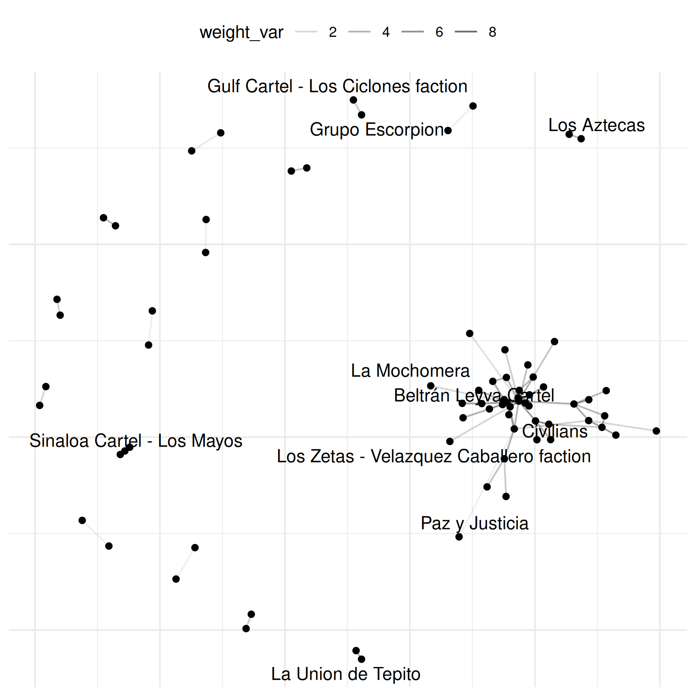
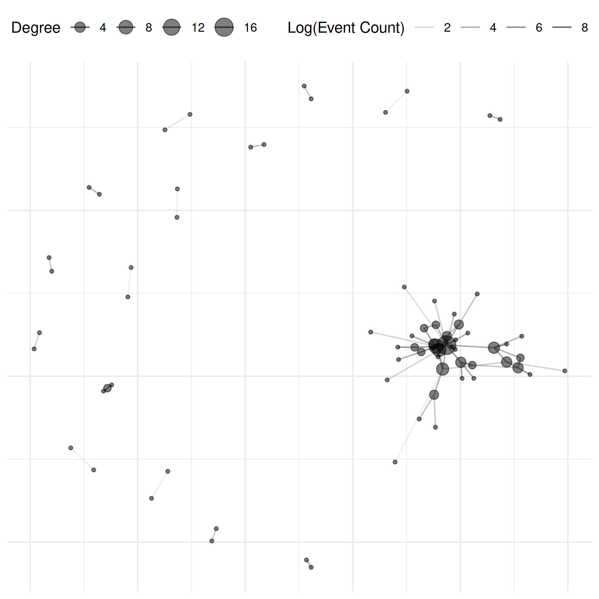

# Event Data

## Vignette Summary

Below is a demonstration of how to use the **netify** R package to build
and analyze various conflict networks. We will walk through data
preparation, network construction, summary statistics, visualizations,
and special use cases like weighted networks, longitudinal networks, and
bipartite networks.

A common data type used to create conflict networks is in the structure
of event data, where actors are repeated across rows but there is no
specific variable that denotes the ‘edge’ as shown in our previous
example.

We show how to use `netify` and UCDP data as just one example of
potential applications to intrastate event data. The first step is to go
to <https://ucdp.uu.se/downloads/> and download the data you want to
use. For this tutorial we have downloaded UCDP GED event data version
23.1 and subset the data for the case of Mexico. We also have saved this
example internal to the package to that users can easily run the code
below.

``` r
library(netify)
library(ggplot2)
```

1.  Create: generate an aggregated, weighted network of conflict between
    actors in Mexico. The default here, when the user does not supply a
    ‘weight’ value, is for the function to simply count up interactions
    and return this as the weight. When this is the case, the user will
    get the warning shown in the example below.

``` r
# Load UCDP GED data on Mexico
data(mexico)

# Construct unweighted network (number_of_events by default)
mex_network <- netify(
    mexico,
    actor1 = "side_a",
    actor2 = "side_b",
    symmetric = TRUE,
    sum_dyads = TRUE,
    diag_to_NA = TRUE,
    missing_to_zero = TRUE
)
```

    ## ! Warning: there are repeating dyads within time periods in the dataset. When `sum_dyads = TRUE` and `weight` is not supplied, edges in the outputted adjacency matrix represent a count of interactions between actors.

``` r
# Summaries at the graph and actor levels
summary(mex_network)
```

    ##   num_actors    density num_edges prop_edges_missing mean_edge_weight
    ## 1         74 0.02520088       138                  0         7.018512
    ##   sd_edge_weight median_edge_weight min_edge_weight max_edge_weight competition
    ## 1        113.395                  0               0            3757   0.1371326
    ##   sd_of_actor_means transitivity
    ## 1          21.37264    0.1046512

``` r
actor_stats <- summary_actor(mex_network)
plot_actor_stats(actor_stats)
```


2.  Explore: next we can quickly use the basic plot function in the
    `netify` package to plot network of violent interactions in Mexico.

``` r
# select 10 random names for plotting
select_names <- rownames(mex_network)
set.seed(6886)
random_indices <- sample(length(select_names), 10)
random_names <- select_names[random_indices]

plot(mex_network,
    add_text = TRUE
)
```

    ## Warning: Removed 69 rows containing missing values or values outside the scale range
    ## (`geom_segment()`).


``` r
plot(mex_network,
    select_text = random_names,
    select_text_display = random_names
)
```

    ## Warning: Removed 69 rows containing missing values or values outside the scale range
    ## (`geom_segment()`).

    ## Warning: Removed 64 rows containing missing values or values outside the scale range
    ## (`geom_text_repel()`).


The graphs above reveal the need to transform the data to increase
interpretability. To do so, we can log the values of the edges. The
`netify` plot function has a built-in parameter for this where the user
can pass the function they want to use to transform the weights of the
data (see the general `mutate_weights` function in the package to
transform weights outside of plotting.)

``` r
plot(mex_network,
    select_text = random_names,
    select_text_display = random_names,
    # log(x+1) to better see range of connects
    mutate_weight = log1p
)
```

    ## Warning: Removed 69 rows containing missing values or values outside the scale range
    ## (`geom_segment()`).

    ## Warning: Removed 64 rows containing missing values or values outside the scale range
    ## (`geom_text_repel()`).



Let’s make the same graph as above but this time make sure we remove any
isolates from the graph as well as refine the edges. In addition, there
are some points that are overlapping and difficult to see. To get ideas
about how to improve the plot, we might like to inspect each component
of the plot. This is an option when the plot parameter,
`return_components = TRUE`. We can also directly modify these
components, as shown below by adding a label specification.

``` r
# investigate each component of the plot
comp <- plot(
    mex_network,
    remove_isolates = TRUE,
    select_text = random_names,
    select_text_display = random_names,
    mutate_weight = log1p,
    return_components = TRUE
)

print(comp)
```

    ## 

    ## ── Netify plot components ──

    ## 

    ## • Base plot: ggplot object

    ## • Edges: geom_segment/geom_curve layer

    ## • Points: geom_point layer

    ## • Text Repel: geom_text_repel layer

    ## • Theme: theme_netify

    ## ℹ Use `assemble_netify_plot()` to build or construct manually with
    ##   `netify_edge()`, `netify_node()`, etc.

``` r
# modify component
comp$base +
    netify_edge(comp) +
    labs(alpha = "Log(Event Count)") +
    reset_scales() +
    netify_node(comp) +
    netify_text_repel(comp) +
    comp$theme
```

    ## Warning: Removed 69 rows containing missing values or values outside the scale range
    ## (`geom_segment()`).

    ## Warning: Removed 64 rows containing missing values or values outside the scale range
    ## (`geom_text_repel()`).


There is, however, a more straightforward way to do this which is via
the `edge_alpha_label` parameter inside the netify plot function:

``` r
# and even simpler
plot(mex_network,
    select_text = random_names,
    select_text_display = random_names,
    mutate_weight = log1p,
    edge_alpha_label = "Log(Event Count)"
)
```

    ## Warning: Removed 69 rows containing missing values or values outside the scale range
    ## (`geom_segment()`).

    ## Warning: Removed 64 rows containing missing values or values outside the scale range
    ## (`geom_text_repel()`).


For conflict data, we often like to see which actors are involved in the
most conflict. To do this, however, we’d need to calculate degree
centrality. To do this we can use the
[`add_node_vars()`](https://netify-dev.github.io/netify/reference/add_node_vars.md)
function (there is also a
[`add_dyad_vars()`](https://netify-dev.github.io/netify/reference/add_dyad_vars.md)
function) which takes a netlet object (the network of study), nodal
data, and a string to specify the column name in the nodal data that
matches with each actor in the network. Below, we use
[`summary_actor()`](https://netify-dev.github.io/netify/reference/summary_actor.md)
to create the nodal data frame.

``` r
# add degree centrality
mex_network <- add_node_vars(
    mex_network,
    summary_actor(mex_network),
    actor = "actor"
)

plot(mex_network,
    mutate_weight = log1p,
    edge_alpha_label = "Log(Event Count)",
    node_size_by = "degree",
    node_size_label = "Degree",
    node_alpha = .5,
    check_overlap = TRUE
)
```

    ## Warning: Removed 69 rows containing missing values or values outside the scale range
    ## (`geom_segment()`).



## References

- Sundberg, Ralph and Erik Melander (2013) Introducing the UCDP
  Georeferenced Event Dataset. Journal of Peace Research 50(4).
