# Foundations

## package overview

You supply dyadic data, and `netify` turns it into network objects that
work with summary, plotting, and modeling tools. The package is built
for social-science network data, especially peace science data, but the
same workflow works for many dyadic data sets.

This vignette walks through the main workflow: create a network, inspect
it, plot it, add attributes, and pass it to other network packages.

The main workflow has three parts:

1.  **Create**: Build network objects from dyadic data and attach nodal
    or dyadic variables.
2.  **Explore**: Summarize networks at the graph and actor levels, then
    visualize the results.
3.  **Model**: Prepare the network for other R network packages.

The table below lists common functions for each part of the workflow.

| Create | Explore | Model |
|----|----|----|
| [`netify()`](https://netify-dev.github.io/netify/reference/netify.md) | [`peek()`](https://netify-dev.github.io/netify/reference/peek.md) | [`netify_to_amen()`](https://netify-dev.github.io/netify/reference/netify_to_amen.md) |
| [`add_node_vars()`](https://netify-dev.github.io/netify/reference/add_node_vars.md) | [`summary_actor()`](https://netify-dev.github.io/netify/reference/summary_actor.md) | [`netify_to_igraph()`](https://netify-dev.github.io/netify/reference/netify_to_igraph.md) |
| [`add_dyad_vars()`](https://netify-dev.github.io/netify/reference/add_dyad_vars.md) | [`summary()`](https://rdrr.io/r/base/summary.html) | [`netify_to_statnet()`](https://netify-dev.github.io/netify/reference/netify_to_statnet.md) |
| [`subset_netify()`](https://netify-dev.github.io/netify/reference/subset_netify.md) | [`plot_actor_stats()`](https://netify-dev.github.io/netify/reference/plot_actor_stats.md) |  |
|  | [`plot_graph_stats()`](https://netify-dev.github.io/netify/reference/plot_graph_stats.md) |  |
|  | [`plot()`](https://rdrr.io/r/graphics/plot.default.html) |  |

`netify` begins with the user’s data input. Our core function,
[`netify()`](https://netify-dev.github.io/netify/reference/netify.md),
handles several different data inputs including data frames and
edgelists (see documentation for more detail).

- The package can also create different types of networks including:

  - cross sectional networks
  - longitudinal (with static and varying actor composition)
  - bipartite networks
  - multilayer

- As well as create networks with different edge types:

  - weighted
  - binary
  - symmetric or non-symmetric

## step 1: create

Begin by loading packages and supplying the data. We will use the
`peacesciencer` package to grab some familiar data.

``` r

# load packages
library(netify)
library(peacesciencer)
library(dplyr)
library(ggplot2)

# organize external data for peacesciencer
peacesciencer::download_extdata()

# build a dyadic panel with peacesciencer
cow_dyads <- create_dyadyears(
    subset_years = c(1995:2014)
) |>
    # add mid data
    add_cow_mids() |>
    # add capital distance
    add_capital_distance() |>
    # add democracy
    add_democracy() |>
    # add gdp
    add_sim_gdp_pop(keep = c("pwtrgdp", "pwtpop"))
```

Next, create a `netlet` object from the COW data frame with
[`netify()`](https://netify-dev.github.io/netify/reference/netify.md).
The main arguments are:

- `input` is, in this use case, a dyadic data.frame that should have at
  the following variables used to specify actors:

  - `actor1`: names the first actor column
  - `actor2`: names the second actor column

- `time` names the period variable for longitudinal data.

- `output_format` sets the storage shape when you need one explicitly
  (`"cross_sec"`, `"longit_array"`, or `"longit_list"`); otherwise
  [`netify()`](https://netify-dev.github.io/netify/reference/netify.md)
  picks from the input structure.

``` r

mid_long_network <- netify(
    input = cow_dyads,
    actor1 = "ccode1", actor2 = "ccode2", time = "year",
    weight = "cowmidonset",
    actor_time_uniform = FALSE,
    sum_dyads = FALSE, symmetric = TRUE,
    diag_to_NA = TRUE, missing_to_zero = TRUE,
    nodal_vars = c("v2x_polyarchy1", "v2x_polyarchy2"),
    dyad_vars = c("capdist"),
    dyad_vars_symmetric = c(TRUE)
)
```

    ## ! Converting `actor1` and/or `actor2` to character vector(s).

    ## ℹ `netify()` collapsed repeated actor-time rows before attaching nodal
    ##   variables.
    ## • Numeric nodal variables were averaged; non-numeric variables use the most
    ##   common non-missing value within each key.
    ## This message is displayed once per session.

You have created a network object.

You can also add nodal and dyadic data after creating the network with
[`add_node_vars()`](https://netify-dev.github.io/netify/reference/add_node_vars.md)
and
[`add_dyad_vars()`](https://netify-dev.github.io/netify/reference/add_dyad_vars.md).

For example, add logged GDP for each actor-year:

``` r

# build one actor-year row for each node
node_data <- bind_rows(
    cow_dyads |>
        select(actor = ccode1, year, pwtrgdp = pwtrgdp1),
    cow_dyads |>
        select(actor = ccode2, year, pwtrgdp = pwtrgdp2)
) |>
    distinct(actor, year, .keep_all = TRUE) |>
    mutate(pwtrgdp_log = log(pwtrgdp + 1))

# attach the nodal variable
mid_long_network <- add_node_vars(
    netlet = mid_long_network,
    node_data = node_data,
    actor = "actor",
    time = "year"
)

# build a dyadic distance variable
cow_dyads$log_capdist <- log(cow_dyads$capdist + 1)

# attach the dyadic variable
mid_long_network <- add_dyad_vars(
    netlet = mid_long_network,
    dyad_data = cow_dyads,
    actor1 = "ccode1",
    actor2 = "ccode2",
    time = "year",
    dyad_vars = "log_capdist",
    dyad_vars_symmetric = TRUE
)
```

## step 2: explore and summarize

We made a network, so let’s look at it. First, we might want to take a
`peek` at the network object to see if the matrix looks the way we’d
expect it to look. This function lets you glance at a specific slice of
the network if it is longitudinal or the entire network if it is
cross-sectional. (To actually subset the netlet object and make a new
object use netify’s `subset` function.)

``` r

peek(mid_long_network,
    from = 5, to = 5,
    time = c("2009", "2010")
)
```

    ## $`2009`
    ##     100 101 110 115 130
    ## 100  NA   1   0   0   1
    ## 101   1  NA   0   0   0
    ## 110   0   0  NA   0   0
    ## 115   0   0   0  NA   0
    ## 130   1   0   0   0  NA
    ## 
    ## $`2010`
    ##     100 101 110 115 130
    ## 100  NA   1   0   0   0
    ## 101   1  NA   0   0   0
    ## 110   0   0  NA   0   0
    ## 115   0   0   0  NA   0
    ## 130   0   0   0   0  NA

Next, let’s examine a few basic summary statistics about the network
using our[`summary()`](https://rdrr.io/r/base/summary.html) function.

``` r

# build network-level summary statistics
mid_long_summary <- summary(mid_long_network)
```

We can also make a quick visualization of network statistics over time
using the summary statistics data frame.

``` r

plot_graph_stats(mid_long_summary)
```

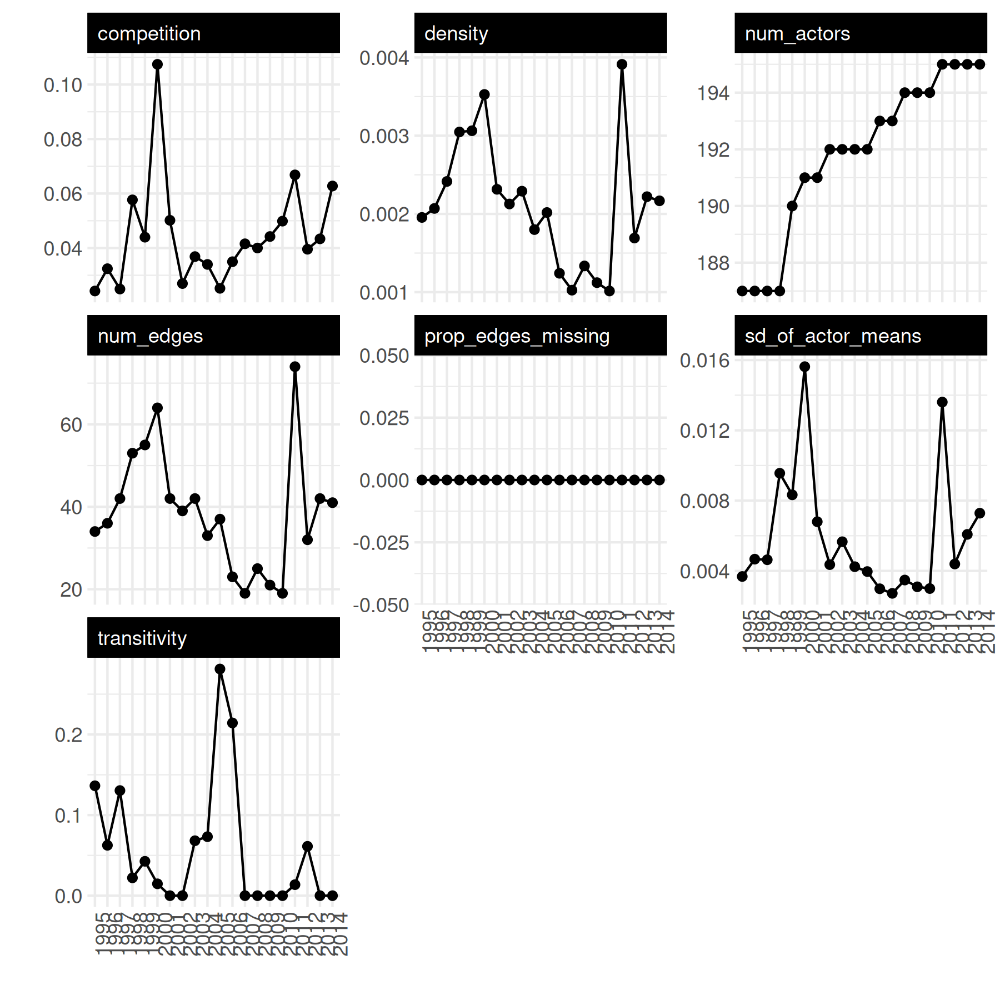

These graph statistics are useful for understanding changes over time at
the network level. We might also want to look at actor-level statistics
over time. The built-in
[`summary_actor()`](https://netify-dev.github.io/netify/reference/summary_actor.md)
function calculates actor-level degree, strength, and centrality
statistics for each actor in each time period. The
[`plot_actor_stats()`](https://netify-dev.github.io/netify/reference/plot_actor_stats.md)
function can show distributions across actors or trajectories for
selected actors:

``` r

# summarize every actor-year
summary_actor_mids <- summary_actor(mid_long_network)
head(summary_actor_mids)
```

    ##   actor time degree   prop_ties network_share closeness betweenness
    ## 1   100 1995      1 0.005376344    0.01470588         1           0
    ## 2   101 1995      1 0.005376344    0.01470588         1           0
    ## 3   110 1995      0 0.000000000    0.00000000       NaN           0
    ## 4   115 1995      0 0.000000000    0.00000000       NaN           0
    ## 5   130 1995      1 0.005376344    0.01470588         1           0
    ## 6   135 1995      1 0.005376344    0.01470588         1           0
    ##   eigen_vector
    ## 1            0
    ## 2            0
    ## 3            0
    ## 4            0
    ## 5            0
    ## 6            0

We can look at the distribution of the statistic for all actors over
time:

``` r

# plot actor-level distributions
plot_actor_stats(
    summary_actor_mids,
    across_actor = TRUE
)
```

    ## Warning: Removed 2913 rows containing non-finite outside the scale range
    ## (`stat_density_ridges()`).

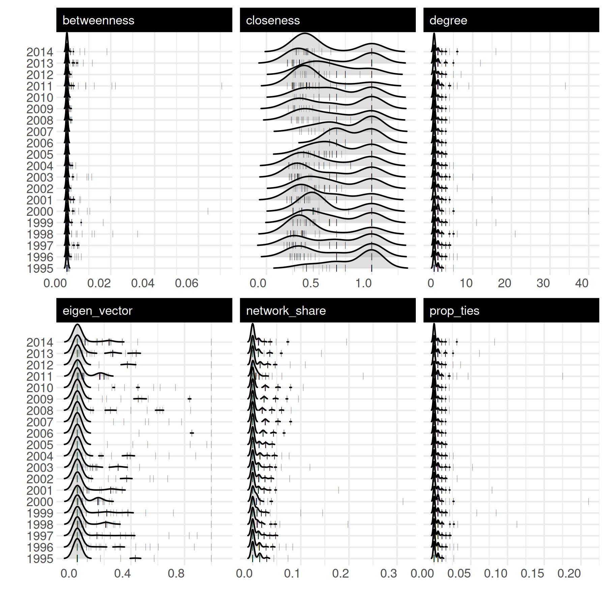

Or we might like to select a specific statistic to focus on across
actors over time:

``` r

# focus on closeness
plot_actor_stats(
    summary_actor_mids,
    across_actor = TRUE,
    specific_stats = "closeness"
)
```

    ## Picking joint bandwidth of 0.114

    ## Warning: Removed 2913 rows containing non-finite outside the scale range
    ## (`stat_density_ridges()`).

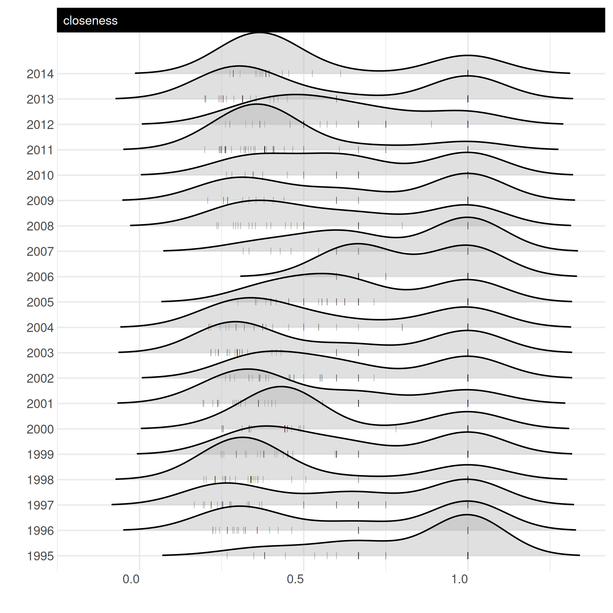

For actor-specific statistics over time, subset to a few actors so the
plot stays legible.

``` r

# selected high-gdp countries
top_5 <- c("2", "710", "740", "255", "750")

plot_actor_stats(
    summary_actor_mids,
    across_actor = FALSE,
    specific_actors = top_5
)
```

    ## Warning: Removed 2058 rows containing missing values or values outside the scale range
    ## (`geom_line()`).

    ## Warning: Removed 2913 rows containing missing values or values outside the scale range
    ## (`geom_point()`).

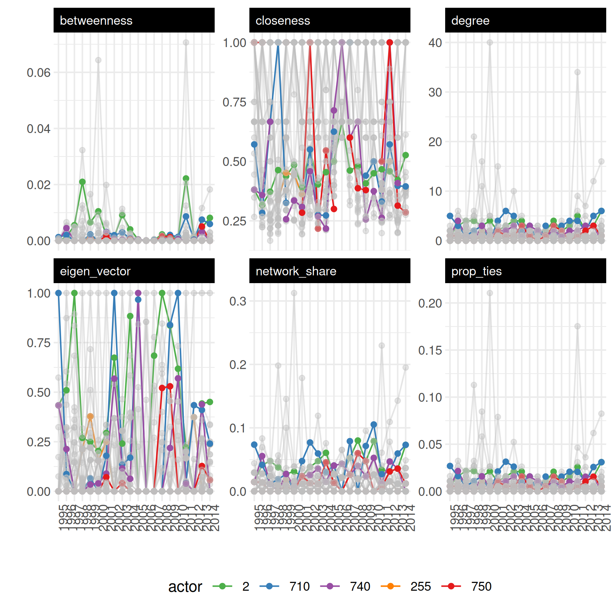

We can also zoom into a specific time slice of the network:

``` r

summary_df_static <- summary_actor_mids[summary_actor_mids$time == 2011, ]

plot_actor_stats(
    summary_df_static,
    across_actor = FALSE,
    specific_actors = top_5
)
```

    ## ! Note: The `summary_df` provided only has one unique time point, so longitudinal will be set to FALSE.

    ## Warning: Removed 123 rows containing missing values or values outside the scale range
    ## (`position_quasirandom()`).

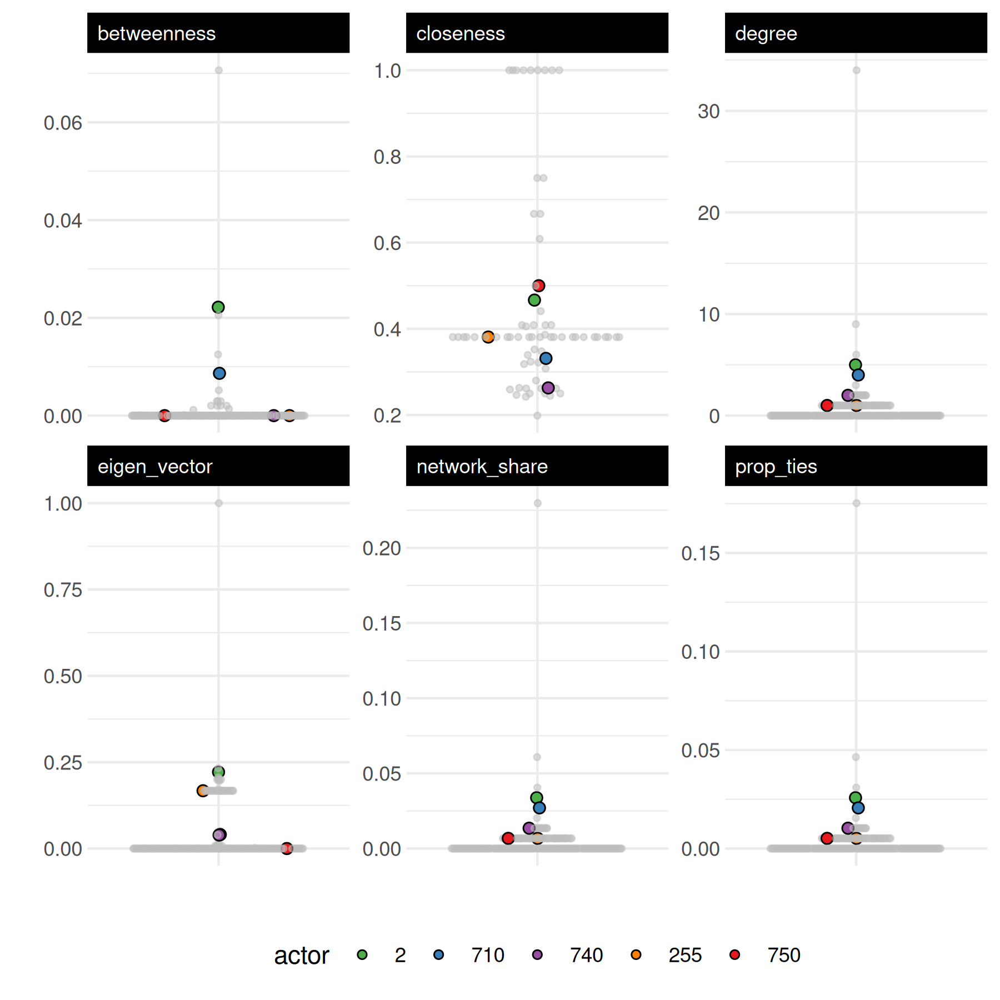

Instead of looking at summary statistics, we also might want to simply
visualize the entire network. We can do this by plotting the netify
object.

By default, [`plot()`](https://rdrr.io/r/graphics/plot.default.html)
uses `auto_format = TRUE`, which automatically adjusts aesthetics based
on your network’s properties — node sizes scale down for larger
networks, edge transparency increases for denser networks, and text
labels appear for small networks (≤15 nodes). You can disable this with
`auto_format = FALSE` for full manual control, or simply override any
individual parameter.

``` r

# default plot with auto_format
plot(mid_long_network,
    static_actor_positions = TRUE,
    remove_isolates = FALSE
)
```

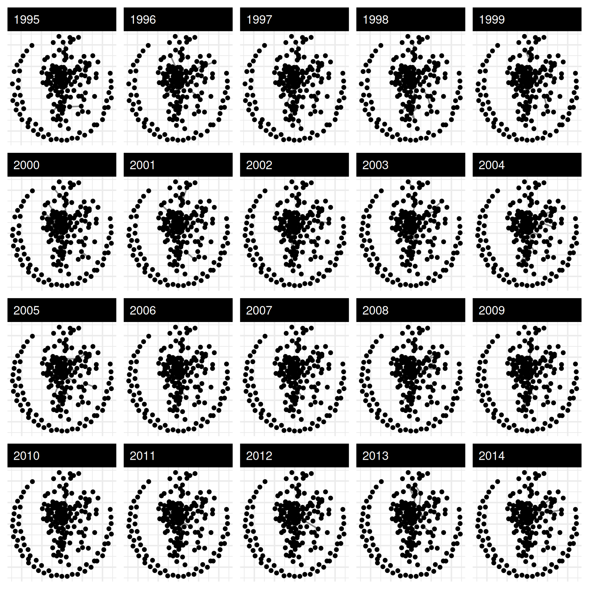

``` r

# override specific defaults
plot(
    mid_long_network,
    edge_color = "grey",
    node_size = 2
)
```

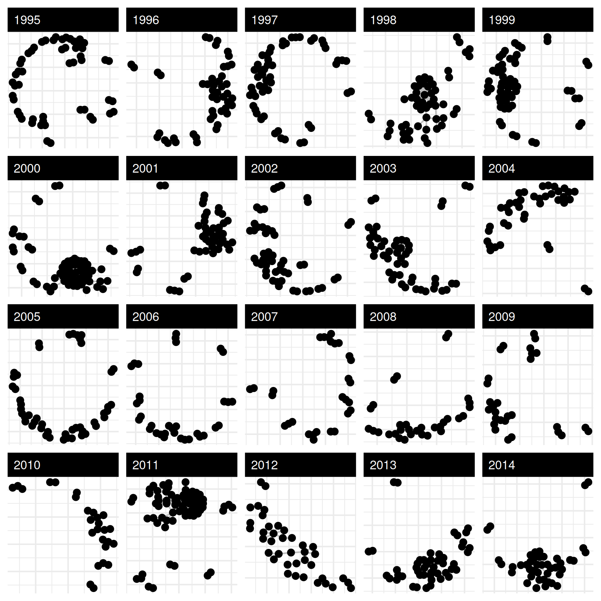

You can also map actor-level summary statistics onto the network plot.

``` r

# attach actor statistics
mid_long_network <- add_node_vars(
    mid_long_network,
    summary_actor_mids,
    actor = "actor", time = "time",
    node_vars = c("degree", "prop_ties", "eigen_vector"),
)
```

Print the object to inspect its metadata.

``` r

# inspect the netlet object
print(mid_long_network)
```

    ## ✔ Network data created.
    ## • Unipartite
    ## • Symmetric
    ## • Weights from `cowmidonset`
    ## • Longitudinal: 20 Periods
    ## • # Unique Actors: 195
    ## Network Summary Statistics (averaged across time):
    ##              dens miss trans
    ## cowmidonset 0.002    0 0.056
    ## • Nodal Features: v2x_polyarchy1, v2x_polyarchy2, pwtrgdp, pwtrgdp_log, degree,
    ## prop_ties, eigen_vector
    ## • Dyad Features: capdist, log_capdist

The nodal attributes are stored on the object.

``` r

# inspect nodal data
head(
    attr(
        mid_long_network,
        "nodal_data"
    )
)
```

    ##   actor time v2x_polyarchy1 v2x_polyarchy2  pwtrgdp pwtrgdp_log degree
    ## 1     2 1995          0.868      0.4767047 13375583    16.40894      1
    ## 2     2 1996          0.867      0.4741600 14136908    16.46430      3
    ## 3     2 1997          0.866      0.4898562 14480122    16.48829      4
    ## 4     2 1998          0.867      0.4879351 15268303    16.54129      4
    ## 5     2 1999          0.870      0.4921494 16085312    16.59342      3
    ## 6     2 2000          0.868      0.4940449 16191328    16.59999      4
    ##     prop_ties eigen_vector
    ## 1 0.005376344    0.4334163
    ## 2 0.016129032    0.5097062
    ## 3 0.021505376    1.0000000
    ## 4 0.021505376    0.2690264
    ## 5 0.015873016    0.2492445
    ## 6 0.021052632    0.2037526

``` r

head(attributes(mid_long_network)$nodal_data)
```

    ##   actor time v2x_polyarchy1 v2x_polyarchy2  pwtrgdp pwtrgdp_log degree
    ## 1     2 1995          0.868      0.4767047 13375583    16.40894      1
    ## 2     2 1996          0.867      0.4741600 14136908    16.46430      3
    ## 3     2 1997          0.866      0.4898562 14480122    16.48829      4
    ## 4     2 1998          0.867      0.4879351 15268303    16.54129      4
    ## 5     2 1999          0.870      0.4921494 16085312    16.59342      3
    ## 6     2 2000          0.868      0.4940449 16191328    16.59999      4
    ##     prop_ties eigen_vector
    ## 1 0.005376344    0.4334163
    ## 2 0.016129032    0.5097062
    ## 3 0.021505376    1.0000000
    ## 4 0.021505376    0.2690264
    ## 5 0.015873016    0.2492445
    ## 6 0.021052632    0.2037526

And now return to our network graph by highlighting specific nodal
attributes. To map visual properties to data, we use the `node_*_by`
naming convention (e.g., `node_size_by`, `node_color_by`). The legacy
`point_*_var` names (e.g., `point_size_var`) also work identically if
you prefer that style.

``` r

# vary node size by degree
plot(
    mid_long_network,
    edge_color = "grey",
    node_size_by = "degree"
)
```

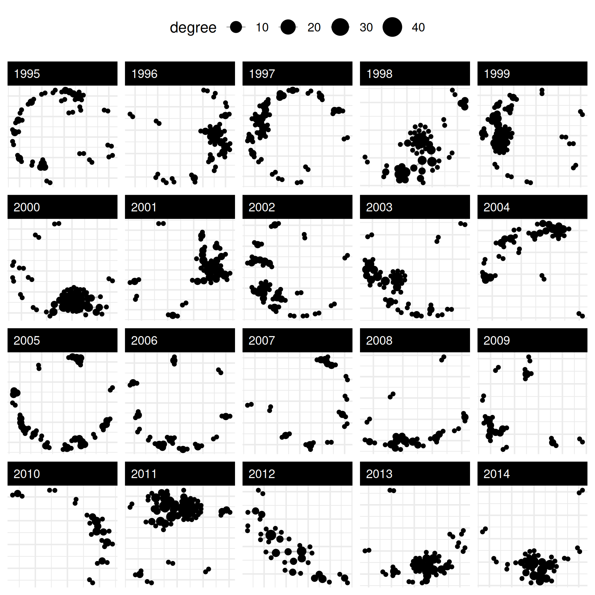

``` r

# vary node color by polyarchy
plot(
    mid_long_network,
    edge_color = "grey",
    node_size_by = "degree",
    node_color_by = "v2x_polyarchy1",
    node_color_label = "Polyarchy",
    node_size_label = "Degree"
) +
    scale_color_gradient2()
```

    ## Scale for colour is already present.
    ## Adding another scale for colour, which will replace the existing scale.

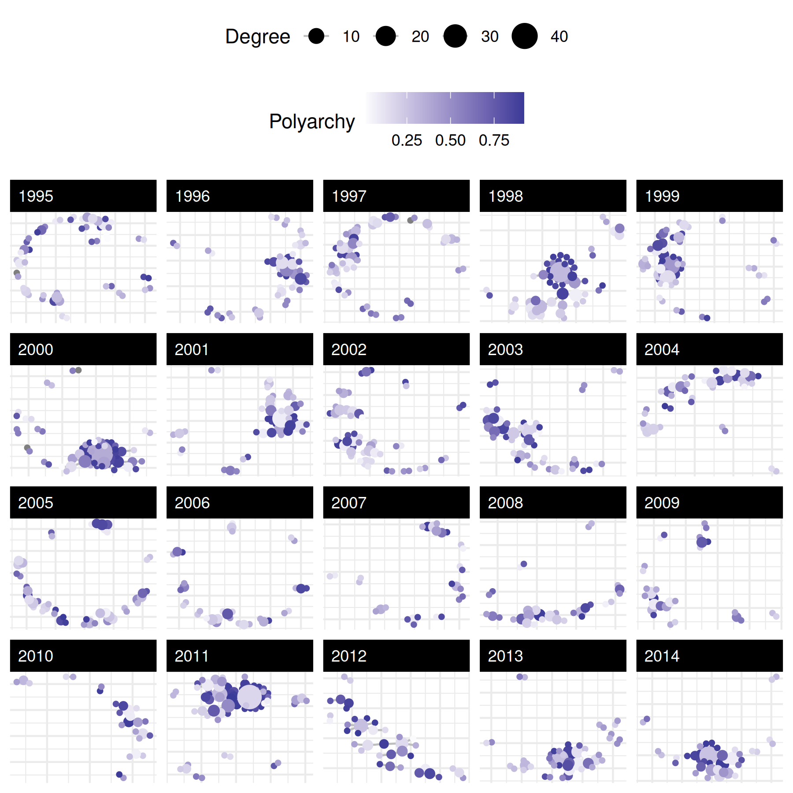

We might also prefer to add labels, but only a select few:

``` r

library(countrycode)
cowns <- countrycode(
    c(
        "United States", "China", "Russia",
        "France", "Germany", "United Kingdom"
    ),
    "country.name", "cown"
)
cabbs <- countrycode(cowns, "cown", "iso3c")

plot(
    mid_long_network,
    edge_color = "grey",
    node_size_by = "degree",
    node_color_by = "v2x_polyarchy1",
    node_color_label = "Polyarchy",
    node_size_label = "Degree",
    select_text = cowns,
    select_text_display = cabbs,
    text_size = 3
) +
    scale_color_gradient2()
```

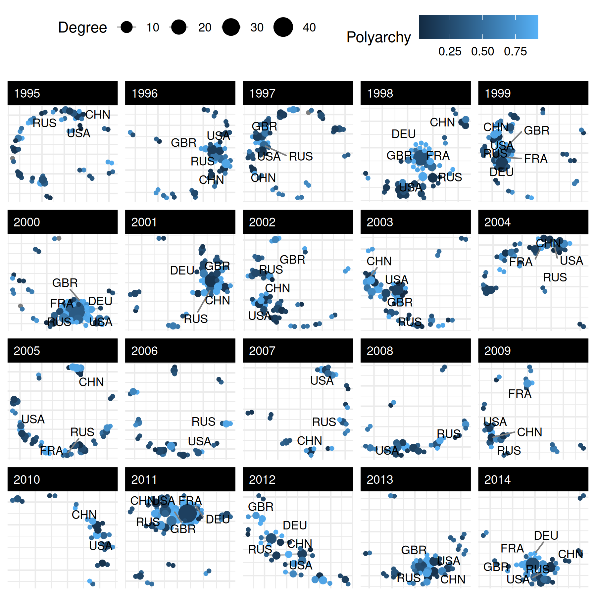

``` r

# draw labels without points
plot(
    mid_long_network,
    edge_color = "grey",
    add_points = FALSE,
    add_label = TRUE,
    label_size_var = "degree",
    label_color = "white",
    label_fill_var = "v2x_polyarchy1",
    label_fill_label = "Polyarchy",
    label_size_label = "Degree"
) + guides(size = "none")
```

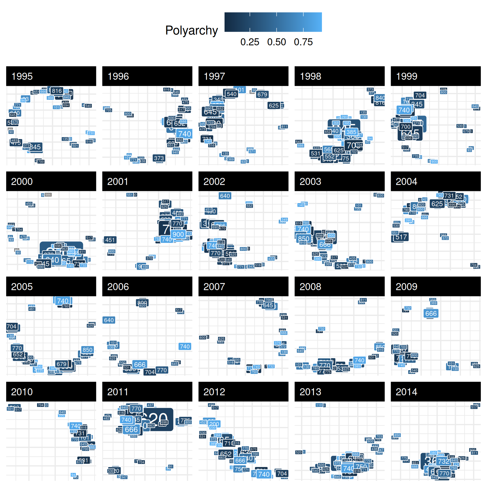

### extracting data back to a data frame

If you need to convert a netify object back into a dyadic data frame —
for example, to run regressions or export to other software — use
[`unnetify()`](https://netify-dev.github.io/netify/reference/unnetify.md):

``` r

mid_long_df <- unnetify(mid_long_network)
head(mid_long_df[, 1:5])
```

    ##   from  to time cowmidonset   capdist
    ## 1  100 101 1995           1 1024.5480
    ## 2  100 110 1995           0 1779.6330
    ## 3  100 115 1995           0 2101.0041
    ## 4  100 130 1995           0  732.7128
    ## 5  100 135 1995           0 1889.2499
    ## 6  100 140 1995           0 2853.6456

This returns one row per dyad with all nodal and dyadic attributes
merged in. Use `remove_zeros = TRUE` to keep only non-zero edges for a
more compact result.

## step 3: model

After creating and exploring the network, you can pass it to other
modeling packages. The examples below use a cross-sectional network.

First, prepare the data:

``` r

# prepare cross-sectional data
cow_cross <- cow_dyads |>
    group_by(ccode1, ccode2) |>
    summarize(
        cowmidonset = ifelse(any(cowmidonset > 0), 1, 0),
        capdist = mean(capdist),
        polity21 = mean(polity21, na.rm = TRUE),
        polity22 = mean(polity22, na.rm = TRUE),
        pwtrgdp1 = mean(pwtrgdp1, na.rm = TRUE),
        pwtrgdp2 = mean(pwtrgdp2, na.rm = TRUE),
        pwtpop1 = mean(pwtpop1, na.rm = TRUE),
        pwtpop2 = mean(pwtpop2, na.rm = TRUE)
    ) |>
    ungroup() |>
    mutate(
        capdist = log(capdist + 1)
    )

# subset to actors with average population above 10 million
actor_to_keep <- cow_cross |>
    select(ccode1, pwtpop1) |>
    filter(pwtpop1 > 10) |>
    distinct(ccode1)

# filter cow_cross by actor_to_keep
cow_cross <- cow_cross |>
    filter(ccode1 %in% actor_to_keep$ccode1) |>
    filter(ccode2 %in% actor_to_keep$ccode1)

# build cross-sectional netlet
mid_cross_network <- netify(
    cow_cross,
    actor1 = "ccode1", actor2 = "ccode2",
    weight = "cowmidonset",
    sum_dyads = FALSE, symmetric = TRUE,
    diag_to_NA = TRUE, missing_to_zero = FALSE,
    nodal_vars = c(
        "polity21", "polity22", "pwtrgdp1",
        "pwtrgdp2", "pwtpop1", "pwtpop2"
    ),
    dyad_vars = c("capdist"),
    dyad_vars_symmetric = c(TRUE)
)
```

Next, pass the netify object to `amen`. This section requires the `amen`
package (`install.packages("amen")`).

``` r

library(amen)

# prepare amen inputs
mid_cross_amen <- netify_to_amen(mid_cross_network)

# inspect amen inputs
str(mid_cross_amen)
```

    ## List of 4
    ##  $ Y    : num [1:86, 1:86] NA 1 1 0 0 0 0 0 0 0 ...
    ##   ..- attr(*, "dimnames")=List of 2
    ##   .. ..$ : chr [1:86] "100" "101" "130" "135" ...
    ##   .. ..$ : chr [1:86] "100" "101" "130" "135" ...
    ##  $ Xdyad: num [1:86, 1:86, 1] 0 6.93 6.6 7.54 7.96 ...
    ##   ..- attr(*, "dimnames")=List of 3
    ##   .. ..$ : chr [1:86] "100" "101" "130" "135" ...
    ##   .. ..$ : chr [1:86] "100" "101" "130" "135" ...
    ##   .. ..$ : chr "capdist"
    ##  $ Xrow : num [1:86, 1:6] 7 4.3 6.38 6.28 8 ...
    ##   ..- attr(*, "dimnames")=List of 2
    ##   .. ..$ : chr [1:86] "100" "101" "130" "135" ...
    ##   .. ..$ : chr [1:6] "polity21" "polity22" "pwtrgdp1" "pwtrgdp2" ...
    ##  $ Xcol : num [1:86, 1:6] 7 4.3 6.38 6.28 8 ...
    ##   ..- attr(*, "dimnames")=List of 2
    ##   .. ..$ : chr [1:86] "100" "101" "130" "135" ...
    ##   .. ..$ : chr [1:6] "polity21" "polity22" "pwtrgdp1" "pwtrgdp2" ...

``` r

# fit amen model
mid_amen_mod <- ame(
    Y = mid_cross_amen$Y,
    Xdyad = mid_cross_amen$Xdyad,
    family = "bin",
    R = 0,
    symmetric = TRUE,
    seed = 6886,
    nscan = 50,
    burn = 10,
    odens = 1,
    plot = FALSE,
    print = FALSE
)
```

We can apply the same process to ERGMs. This section requires the `ergm`
package (`install.packages("ergm")`).

``` r

library(ergm)
```

    ## Loading required package: network

    ## 
    ## 'network' 1.20.0 (2026-02-06), part of the Statnet Project
    ## * 'news(package="network")' for changes since last version
    ## * 'citation("network")' for citation information
    ## * 'https://statnet.org' for help, support, and other information

    ## Registered S3 methods overwritten by 'ergm':
    ##   method               from
    ##   simulate.formula     lme4
    ##   simulate.formula_lhs lme4

    ## 
    ## 'ergm' 4.12.0 (2026-02-17), part of the Statnet Project
    ## * 'news(package="ergm")' for changes since last version
    ## * 'citation("ergm")' for citation information
    ## * 'https://statnet.org' for help, support, and other information

    ## 'ergm' 4 is a major update that introduces some backwards-incompatible
    ## changes. Please type 'news(package="ergm")' for a list of major
    ## changes.

``` r

# netify_to_statnet converts to a network object,
# which is what ergm uses
mid_cross_ergm <- netify_to_statnet(mid_cross_network)
```

    ## ! Nodal columns with "NA" detected: "polity21". Ergm terms like
    ##   `nodecov()`/`nodematch()` will refuse to fit.
    ## ℹ Use `drop_na_actors(net, cols = c('polity21'))` (or impute) before refitting.
    ## This message is displayed once per session.

    ## ℹ Dyad covariates attached as per-edge attributes under "capdist_e" and as
    ##   network-level matrices under their original names ("capdist").
    ## ℹ For `ergm::edgecov()` use the matrix name (e.g. `edgecov('capdist')`); the
    ##   "_e" per-edge attribute is for descriptive use such as edge styling.
    ## This message is displayed once per session.

``` r

# inspect statnet attributes
mid_cross_ergm
```

    ##  Network attributes:
    ##   vertices = 86 
    ##   directed = FALSE 
    ##   hyper = FALSE 
    ##   loops = FALSE 
    ##   multiple = FALSE 
    ##   bipartite = FALSE 
    ##   cowmidonset: 86x86 matrix
    ##   capdist: 86x86 matrix
    ##   total edges= 149 
    ##     missing edges= 0 
    ##     non-missing edges= 149 
    ## 
    ##  Vertex attribute names: 
    ##     polity21 polity22 pwtpop1 pwtpop2 pwtrgdp1 pwtrgdp2 vertex.names 
    ## 
    ##  Edge attribute names: 
    ##     capdist_e cowmidonset

``` r

# replace missing nodecov values for the example
set.vertex.attribute(
    mid_cross_ergm, "polity21", 
    ifelse(
        is.na(get.vertex.attribute(mid_cross_ergm, "polity21")), 
        0, get.vertex.attribute(mid_cross_ergm, "polity21")))

set.vertex.attribute(
    mid_cross_ergm, "pwtrgdp2",
    ifelse(
        is.na(get.vertex.attribute(mid_cross_ergm, "pwtrgdp2")),
        0, get.vertex.attribute(mid_cross_ergm, "pwtrgdp2")) )

set.vertex.attribute(
    mid_cross_ergm, "pwtpop2",
    ifelse(
        is.na(get.vertex.attribute(mid_cross_ergm, "pwtpop2")),
        0,  get.vertex.attribute(mid_cross_ergm, "pwtpop2")) )

# fit ergm model
ergm_model <- ergm(
    formula = mid_cross_ergm ~
        edges +
        nodecov("polity21") +
        nodecov("pwtrgdp2") +
        nodecov("pwtpop2")
)
```

    ## Starting maximum pseudolikelihood estimation (MPLE):
    ## Obtaining the responsible dyads.
    ## Evaluating the predictor and response matrix.
    ## Maximizing the pseudolikelihood.
    ## Finished MPLE.
    ## Evaluating log-likelihood at the estimate.

## references

- Csárdi G, Nepusz T, Traag V, Horvát S, Zanini F, Noom D, Müller K
  (2024). igraph: Network Analysis and Visualization in R.
  <doi:10.5281/zenodo.7682609>, R package version 2.0.3,
  <https://CRAN.R-project.org/package=igraph>.

- Davies, Shawn, Therese Pettersson & Magnus Öberg (2023). Organized
  violence 1989-2022 and the return of conflicts between states?.
  Journal of Peace Research 60(4).

- Handcock M, Hunter D, Butts C, Goodreau S, Krivitsky P, Morris M
  (2018). ergm: Fit, Simulate and Diagnose Exponential-Family Models for
  Networks. The Statnet Project (<https://statnet.org/>). R package
  version 3.9.4, <https://CRAN.R-project.org/package=ergm>.

- Hoff, Peter D. “Dyadic data analysis with amen.” arXiv preprint
  arXiv:1506.08237 (2015).

- Högbladh Stina, 2023, “UCDP GED Codebook version 23.1”, Department of
  Peace and Conflict Research, Uppsala University

- Miller S (2022). “peacesciencer: An R Package for Quantitative Peace
  Science Research.” Conflict Management and Peace Science, 39(6),
  755–779. doi: 10.1177/07388942221077926.

- Statnet Development Team (Pavel N. Krivitsky, Mark S. Handcock,
  David R. Hunter, Carter T. Butts, Chad Klumb, Steven M. Goodreau, and
  Martina Morris) (2003-2023). statnet: Software tools for the
  Statistical Modeling of Network Data. URL <https://statnet.org/>

- Sundberg, Ralph and Erik Melander (2013) Introducing the UCDP
  Georeferenced Event Dataset. Journal of Peace Research 50(4).
