# Foundations

## Package Overview

You supply data and `netify` transforms it into easy-to-work-with
network data. The goal of `netify` is to provide R functions that
simplify and facilitate common tasks related to network creation,
summary, visualization, and modeling. Although our package was built
with social scientists (especially peace science scholars) in mind,
anyone can use it!

This vignette provides a high-level overview of our package from start
to finish. It introduces the core components of the package with data
examples and minimal writing.

`netify` goals:

1.  **Create**: Netify your data! We make it easy for users to create
    networks from raw data in R as well as add additional features, such
    as nodal and dyadic variables, to the network object.
2.  **Explore**: Explore characteristics of the network you created,
    like summary statistics at both the network and actor levels.
    Visualize your network.
3.  **Advance**: Advance your network analysis to the next stage by
    preparing it for use in other network packages and modeling
    approaches.

`netify` provides a suite of primary functions to help achieve these
goals:

| Create💡                                                                            | Explore 🔎                                                                                | Advance ️🚀                                                                                  |
|-------------------------------------------------------------------------------------|-------------------------------------------------------------------------------------------|---------------------------------------------------------------------------------------------|
| [`netify()`](https://netify-dev.github.io/netify/reference/netify.md)               | [`peek()`](https://netify-dev.github.io/netify/reference/peek.md)                         | [`netify_to_amen()`](https://netify-dev.github.io/netify/reference/netify_to_amen.md)       |
| [`add_node_vars()`](https://netify-dev.github.io/netify/reference/add_node_vars.md) | [`summary_actor()`](https://netify-dev.github.io/netify/reference/summary_actor.md)       | [`netify_to_igraph()`](https://netify-dev.github.io/netify/reference/netify_to_igraph.md)   |
| [`add_dyad_vars()`](https://netify-dev.github.io/netify/reference/add_dyad_vars.md) | [`summary()`](https://rdrr.io/r/base/summary.html)                                        | [`netify_to_statnet()`](https://netify-dev.github.io/netify/reference/netify_to_statnet.md) |
| [`subset_netify()`](https://netify-dev.github.io/netify/reference/subset_netify.md) | [`plot_actor_stats()`](https://netify-dev.github.io/netify/reference/plot_actor_stats.md) |                                                                                             |
|                                                                                     | [`plot_graph_stats()`](https://netify-dev.github.io/netify/reference/plot_graph_stats.md) |                                                                                             |
|                                                                                     | [`plot()`](https://rdrr.io/r/graphics/plot.default.html)                                  |                                                                                             |

`netify` begins with the user’s data input. Our core function,
[`netify()`](https://netify-dev.github.io/netify/reference/netify.md),
handles several different data inputs including data frames and
edgelists (see documentation for more detail).

- The package can also create different types of networks including:

  - cross sectional networks
  - longitudinal (with static and varying actor composition)
  - bipartite networks
  - multilayer

- As well as create networks with different edge types:

  - weighted
  - binary
  - symmetric or non-symmetric

## Step 1: Create üí°

Begin by loading packages and supplying the data. We will use the
`peacesciencer` package to grab some familiar data.

``` r
# load packages
library(netify)
library(peacesciencer)
library(dplyr)
library(ggplot2)

# organize external data for peacesciencer
peacesciencer::download_extdata()

# create dyadic data set over time using peacesciencer
cow_dyads <- create_dyadyears(
    subset_years = c(1995:2014)
) |>
    # add mids
    add_cow_mids() |>
    # add capital distance
    add_capital_distance() |>
    # add democracy
    add_democracy() |>
    # add gdp
    add_sdp_gdp()
```

Next, create a `netlet` object from the above COW data frame using our
package’s core function `netify.` There are a number of useful
parameters, but the most important ones to highlight are:

- `input` is, in this use case, a dyadic data.frame that should have at
  the following variables used to specify actors:

  - `actor1`: indicates actor 1 variable in the data
  - `actor2`: indicates actor 2 variable in the data

- `netify_type` is a type of netlet object (`cross-sec`, `longit_list`,
  or `longit_array`).

``` r
mid_long_network <- netify(
    input = cow_dyads,
    actor1 = "ccode1", actor2 = "ccode2", time = "year",
    weight = "cowmidonset",
    actor_time_uniform = FALSE,
    sum_dyads = FALSE, symmetric = TRUE,
    diag_to_NA = TRUE, missing_to_zero = TRUE,
    nodal_vars = c("v2x_polyarchy1", "v2x_polyarchy2"),
    dyad_vars = c("capdist"),
    dyad_vars_symmetric = c(TRUE)
)
```

    ## ! Converting `actor1` and/or `actor2` to character vector(s).

**Congratulations** you have created a network object! üéâ

We can also add nodal and dyadic data after we’ve created the network
via the
[`add_node_vars()`](https://netify-dev.github.io/netify/reference/add_node_vars.md)
and
[`add_dyad_vars()`](https://netify-dev.github.io/netify/reference/add_dyad_vars.md)
functions.

Let’s assume that we had information about each actor in the network
that we’d like to add as a nodal variable after we already made the
network object. This could be from our original data set or elsewhere.
For example, lets add a logged variable measuring gdp for each node in
the network over time:

``` r
# create a vector of nodal data
node_data <- unique(cow_dyads[, c("ccode1", "year", "wbgdppc2011est2")])
node_data$wbgdppc2011est2_log <- log(node_data$wbgdppc2011est2)

# add nodal variable to netlet object
mid_long_network <- add_node_vars(
    netlet = mid_long_network,
    node_data = node_data,
    actor = "ccode1",
    time = "year"
)

# create another dyadic var in cow
cow_dyads$log_capdist <- log(cow_dyads$capdist + 1)

# now lets add this to the netlet
mid_long_network <- add_dyad_vars(
    netlet = mid_long_network,
    dyad_data = cow_dyads,
    actor1 = "ccode1",
    actor2 = "ccode2",
    time = "year",
    dyad_vars = "log_capdist",
    dyad_vars_symmetric = TRUE
)
```

## Step 2: Explore and Summarize üîé

We made a network, so let’s look at it. First, we might want to take a
`peek` at the network object to see if the matrix looks the way we’d
expect it to look. This function lets you glance at a specific slice of
the network if it is longitudinal or the entire network if it is
cross-sectional. (To actually subset the netlet object and make a new
object use netify’s `subset` function.)

``` r
peek(mid_long_network,
    from = 5, to = 5,
    time = c("2009", "2010")
)
```

    ## $`2009`
    ##     100 101 110 115 130
    ## 100  NA   1   0   0   1
    ## 101   1  NA   0   0   0
    ## 110   0   0  NA   0   0
    ## 115   0   0   0  NA   0
    ## 130   1   0   0   0  NA
    ## 
    ## $`2010`
    ##     100 101 110 115 130
    ## 100  NA   1   0   0   0
    ## 101   1  NA   0   0   0
    ## 110   0   0  NA   0   0
    ## 115   0   0   0  NA   0
    ## 130   0   0   0   0  NA

Next, let’s examine a few basic summary statistics about the network
using our[`summary()`](https://rdrr.io/r/base/summary.html) function.

``` r
# create data.frame that provides network-level summary stats
# for each year of the network
mid_long_summary <- summary(mid_long_network)
```

We can also make a quick visualization of network statistics over time
using the summary statistics data frame.

``` r
plot_graph_stats(mid_long_summary)
```

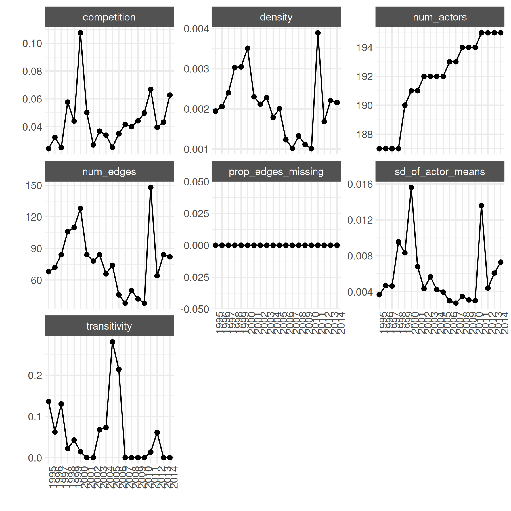

These graph statistics are useful for understanding changes overtime at
the network level, however, we might also want to look at actor-level
statistics overtime. Our built-in function, `summary_actor` will
calculate in-degree, out-degree, average degree, and eigenvector
centrality for each actor in each time period. The `across_actors`
function allows users to toggle whether they want a summary of a given
statistic across all actors (shown in a density plot) or for specific
actors:

``` r
# every year & every actor
summary_actor_mids <- summary_actor(mid_long_network)
head(summary_actor_mids)
```

    ##   actor time degree   prop_ties network_share closeness betweenness
    ## 1   100 1995      1 0.005347594    0.01470588         1           0
    ## 2   101 1995      1 0.005347594    0.01470588         1           0
    ## 3   110 1995      0 0.000000000    0.00000000       NaN           0
    ## 4   115 1995      0 0.000000000    0.00000000       NaN           0
    ## 5   130 1995      1 0.005347594    0.01470588         1           0
    ## 6   135 1995      1 0.005347594    0.01470588         1           0
    ##   eigen_vector
    ## 1            0
    ## 2            0
    ## 3            0
    ## 4            0
    ## 5            0
    ## 6            0

We can look at the distribution of the statistic for all actors over
time:

``` r
# density plot across all actors
# for each stat
plot_actor_stats(
    summary_actor_mids,
    across_actor = TRUE,
)
```

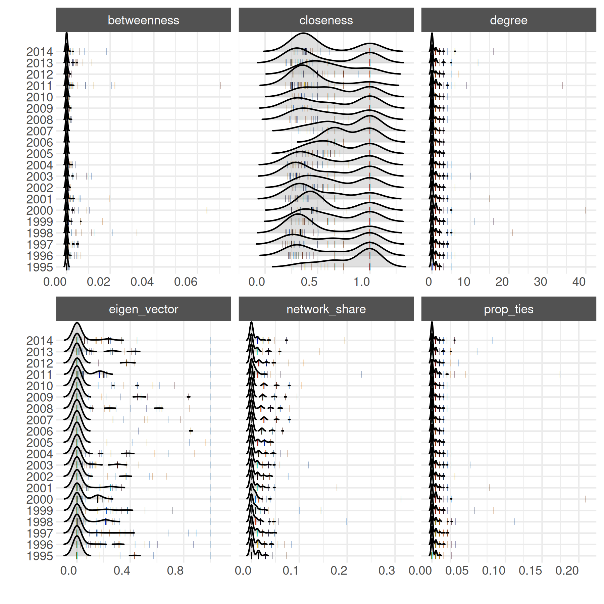

Or we might like to select a specific statistic to focus on across
actors over time:

``` r
# focus on closeness
plot_actor_stats(
    summary_actor_mids,
    across_actor = TRUE,
    specific_stats = "closeness"
)
```

    ## Picking joint bandwidth of 0.114

    ## Warning: Removed 2913 rows containing non-finite outside the scale range
    ## (`stat_density_ridges()`).

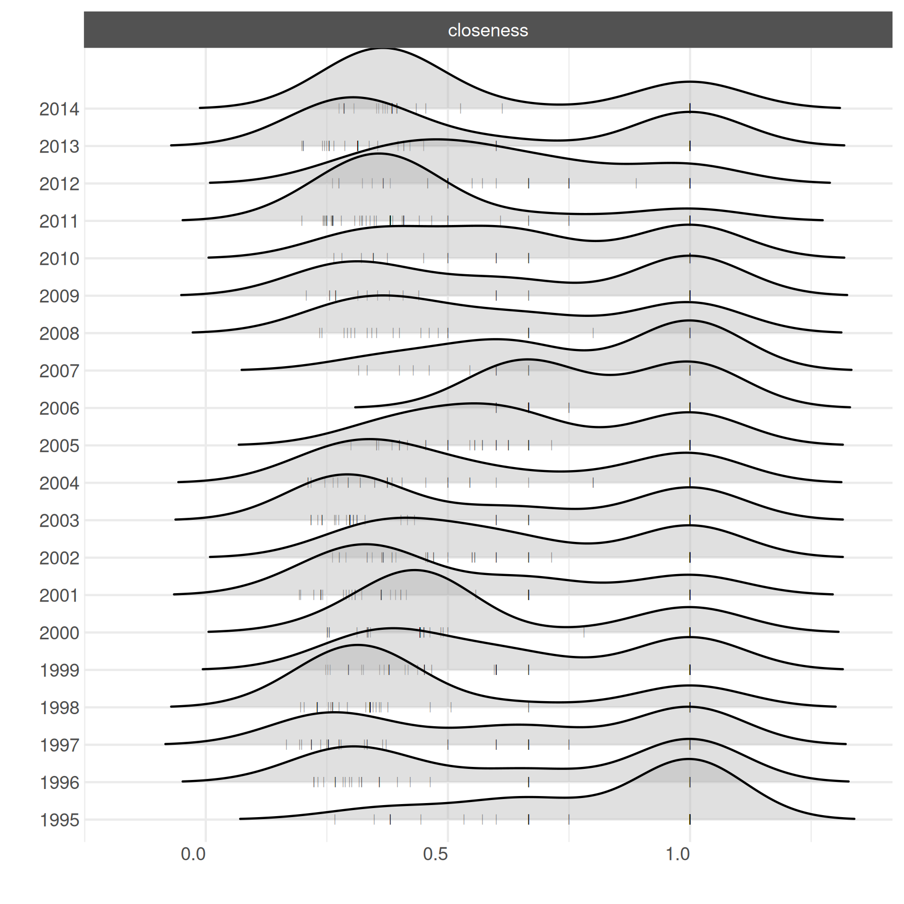

Say that we wanted to showcase actor-specific statistics over time. We
can use the plot_actor_stats function for this as well, though it’s
**highly recommended** to subset to a few actors for a more legible
plot.

``` r
# top 5 GDP countries (USA, China, Japan, Germany, India)
top_5 <- c("2", "710", "740", "255", "750")

#
plot_actor_stats(
    summary_actor_mids,
    across_actor = FALSE,
    specific_actors = top_5
)
```

    ## Warning: Removed 2058 rows containing missing values or values outside the scale range
    ## (`geom_line()`).

    ## Warning: Removed 2913 rows containing missing values or values outside the scale range
    ## (`geom_point()`).

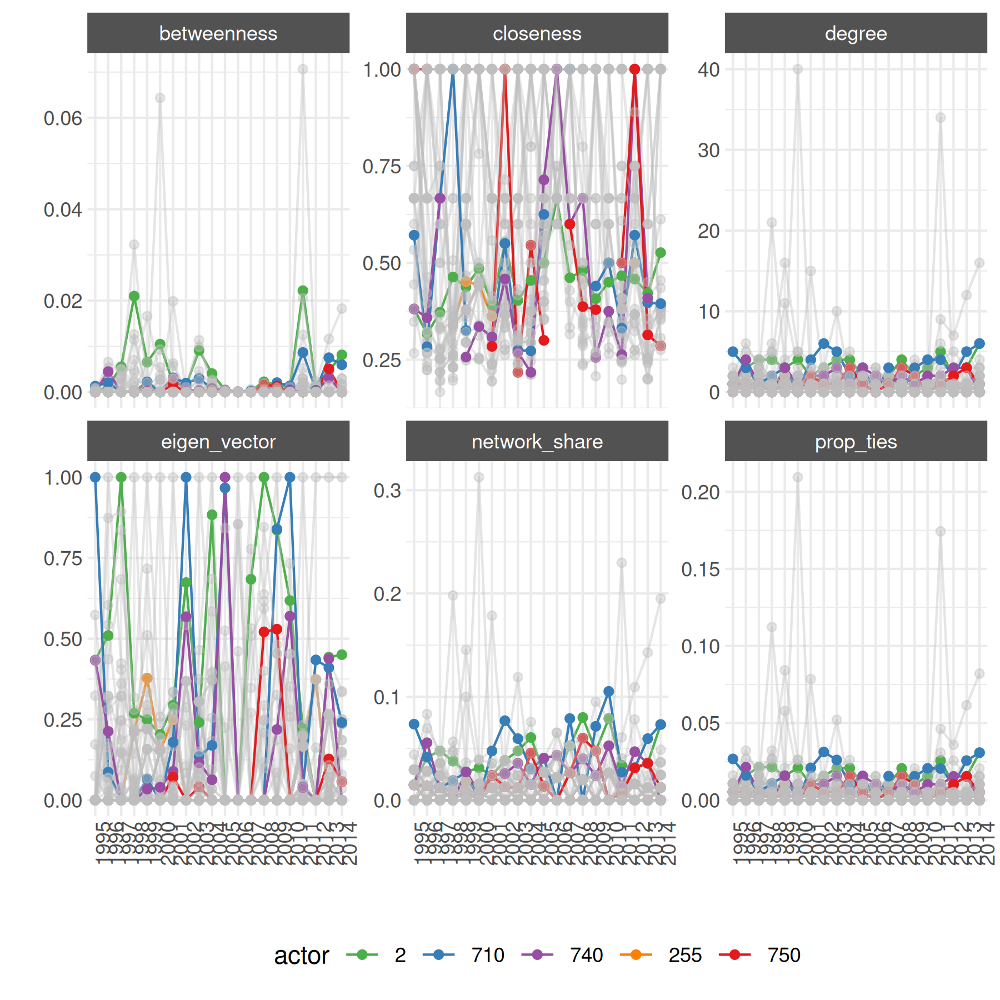

We can also zoom into a specific time slice of the network:

``` r
summary_df_static <- summary_actor_mids[summary_actor_mids$time == 2011, ]

plot_actor_stats(
    summary_df_static,
    across_actor = FALSE,
    specific_actors = top_5
)
```

    ## ! Note: The `summary_df` provided only has one unique time point, so longitudional will be set to FALSE.

    ## Warning: Removed 123 rows containing missing values or values outside the scale range
    ## (`position_quasirandom()`).

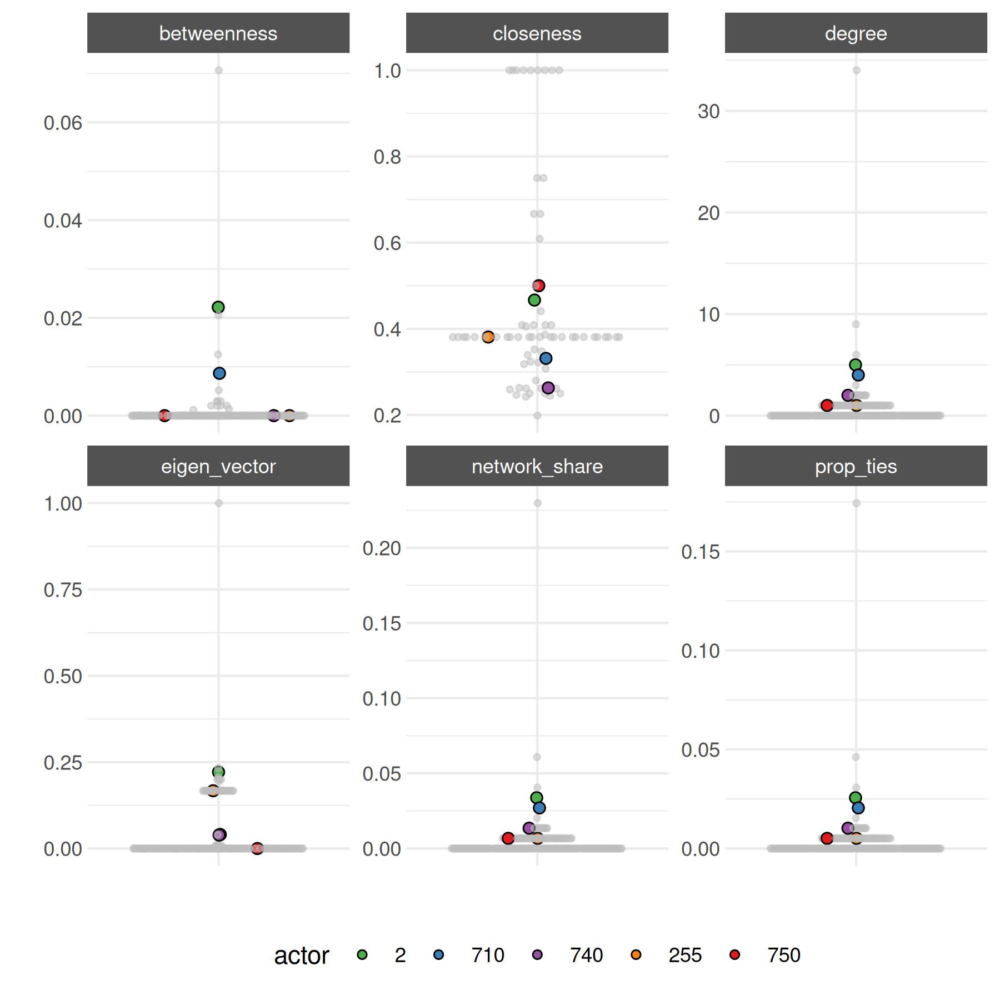

Instead of looking at summary statistics, we also might want to simply
visualize the entire network. We can do this by plotting the netify
object.

By default, [`plot()`](https://rdrr.io/r/graphics/plot.default.html)
uses `auto_format = TRUE`, which automatically adjusts aesthetics based
on your network’s properties — node sizes scale down for larger
networks, edge transparency increases for denser networks, and text
labels appear for small networks (≤15 nodes). You can disable this with
`auto_format = FALSE` for full manual control, or simply override any
individual parameter.

``` r
# default plot with auto_format
plot(mid_long_network,
    static_actor_positions = TRUE,
    remove_isolates = FALSE
)
```

    ## Warning: Removed 773 rows containing missing values or values outside the scale range
    ## (`geom_segment()`).

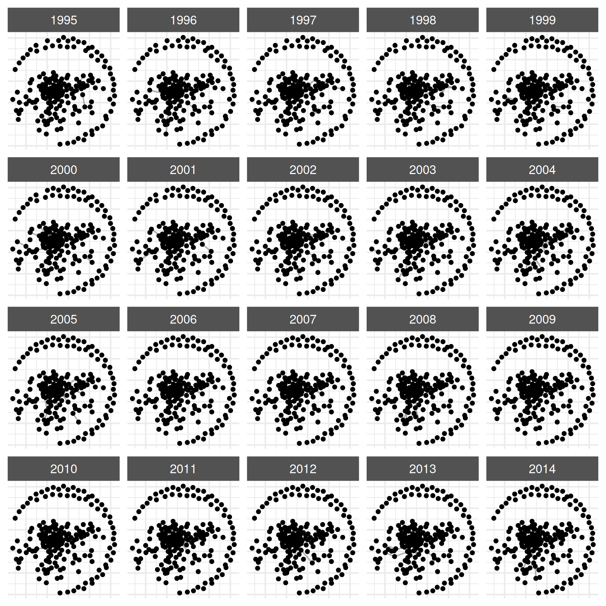

``` r
# override specific defaults
plot(
    mid_long_network,
    edge_color = "grey",
    node_size = 2
)
```

    ## Warning: Removed 773 rows containing missing values or values outside the scale range
    ## (`geom_segment()`).

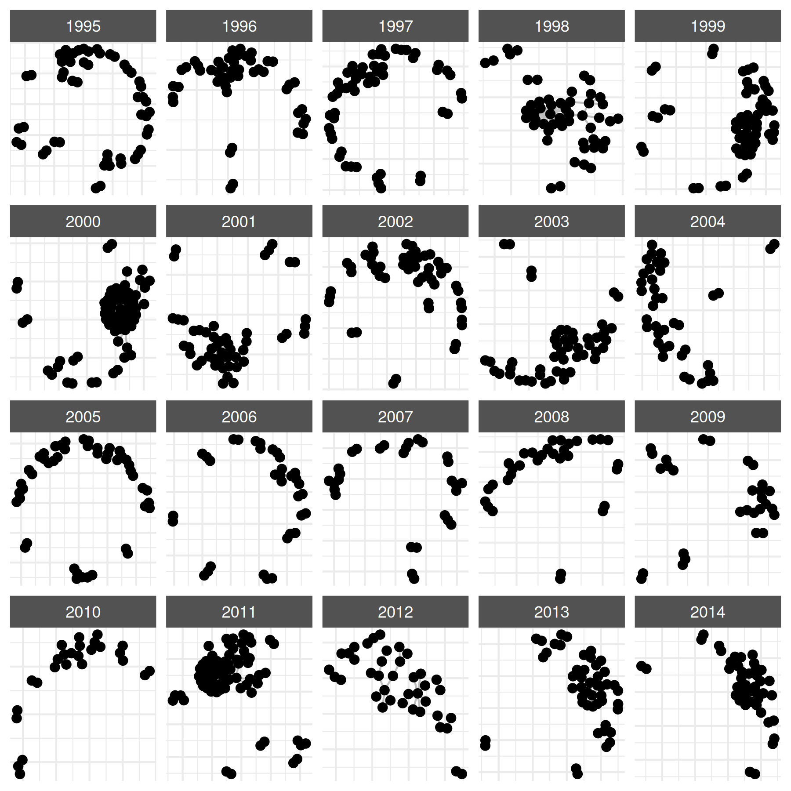

We can also use `netify` functions to explore actor level summary
statistics in the network graph.

``` r
# add actor variables from summary_actor_mids
mid_long_network <- add_node_vars(
    mid_long_network,
    summary_actor_mids,
    actor = "actor", time = "time",
    node_vars = c("degree", "prop_ties", "eigen_vector"),
)
```

We can quickly inspect the object with the `print` function.

``` r
# print netlet obj to make sure they got added to nodal features
print(mid_long_network)
```

    ## ‚úî Hello, you have created network data, yay!
    ## • Unipartite
    ## • Symmetric
    ## • Weights from `cowmidonset`
    ## • Longitudinal: 20 Periods
    ## • # Unique Actors: 195
    ## Network Summary Statistics (averaged across time):
    ##              dens miss trans
    ## cowmidonset 0.002    0 0.056
    ## • Nodal Features: v2x_polyarchy1, v2x_polyarchy2, wbgdppc2011est2,
    ## wbgdppc2011est2_log, degree, prop_ties, eigen_vector
    ## • Dyad Features: capdist, log_capdist

As well as look at the attributes of the data and specify showing the
nodal data information.

``` r
# if you're curious as to where they live
head(
    attr(
        mid_long_network,
        "nodal_data"
    )
)
```

    ##   actor time v2x_polyarchy1 v2x_polyarchy2 wbgdppc2011est2 wbgdppc2011est2_log
    ## 1   100 1995          0.563          0.868          10.740            2.373975
    ## 2   100 1996          0.554          0.867          10.768            2.376579
    ## 3   100 1997          0.554          0.866          10.798            2.379361
    ## 4   100 1998          0.544          0.867          10.833            2.382597
    ## 5   100 1999          0.539          0.870          10.860            2.385086
    ## 6   100 2000          0.548          0.868          10.888            2.387661
    ##   degree   prop_ties eigen_vector
    ## 1      1 0.005347594 0.000000e+00
    ## 2      0 0.000000000 0.000000e+00
    ## 3      1 0.005347594 0.000000e+00
    ## 4      0 0.000000000 5.137642e-20
    ## 5      0 0.000000000 0.000000e+00
    ## 6      1 0.005235602 4.953675e-03

``` r
# i.e.,
head(attributes(mid_long_network)$nodal_data)
```

    ##   actor time v2x_polyarchy1 v2x_polyarchy2 wbgdppc2011est2 wbgdppc2011est2_log
    ## 1   100 1995          0.563          0.868          10.740            2.373975
    ## 2   100 1996          0.554          0.867          10.768            2.376579
    ## 3   100 1997          0.554          0.866          10.798            2.379361
    ## 4   100 1998          0.544          0.867          10.833            2.382597
    ## 5   100 1999          0.539          0.870          10.860            2.385086
    ## 6   100 2000          0.548          0.868          10.888            2.387661
    ##   degree   prop_ties eigen_vector
    ## 1      1 0.005347594 0.000000e+00
    ## 2      0 0.000000000 0.000000e+00
    ## 3      1 0.005347594 0.000000e+00
    ## 4      0 0.000000000 5.137642e-20
    ## 5      0 0.000000000 0.000000e+00
    ## 6      1 0.005235602 4.953675e-03

And now return to our network graph by highlighting specific nodal
attributes. To map visual properties to data, we use the `node_*_by`
naming convention (e.g., `node_size_by`, `node_color_by`). The legacy
`point_*_var` names (e.g., `point_size_var`) also work identically if
you prefer that style.

``` r
# vary node size by degree
plot(
    mid_long_network,
    edge_color = "grey",
    node_size_by = "degree"
)
```

    ## Warning: Removed 773 rows containing missing values or values outside the scale range
    ## (`geom_segment()`).

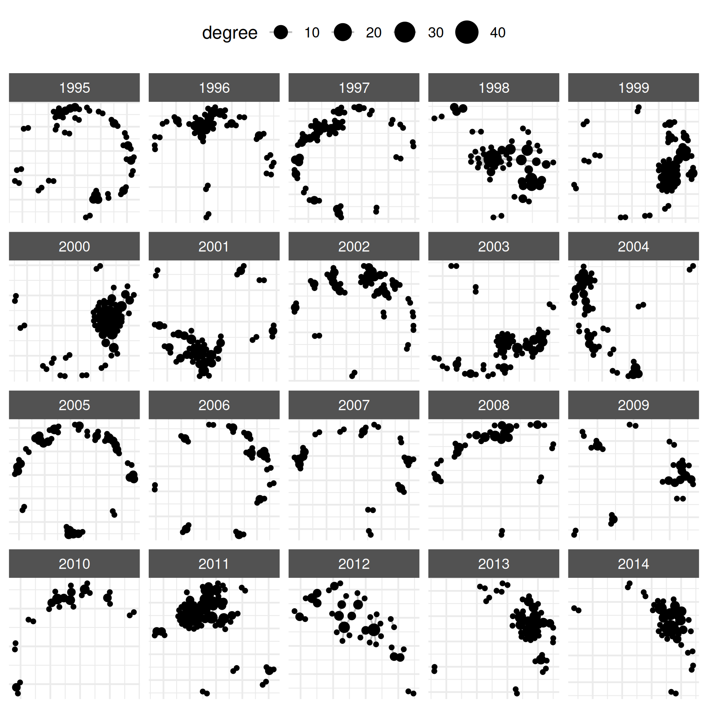

``` r
# vary node color by polyarchy
plot(
    mid_long_network,
    edge_color = "grey",
    node_size_by = "degree",
    node_color_by = "v2x_polyarchy1",
    node_color_label = "Polyarchy",
    node_size_label = "Degree"
) +
    scale_color_gradient2()
```

    ## Scale for colour is already present.
    ## Adding another scale for colour, which will replace the existing scale.

    ## Warning: Removed 773 rows containing missing values or values outside the scale range
    ## (`geom_segment()`).

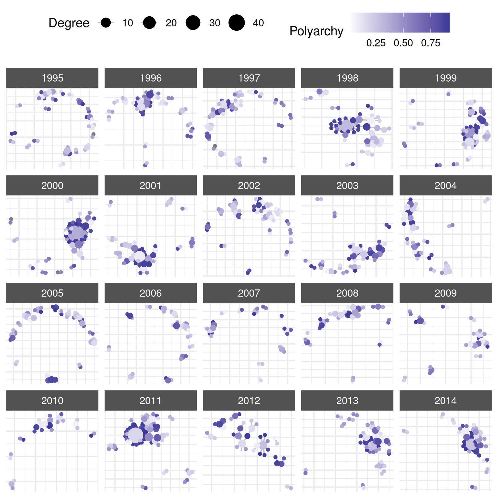

We might also prefer to add labels, but only a select few:

``` r
library(countrycode)
cowns <- countrycode(
    c(
        "United States", "China", "Russia",
        "France", "Germany", "United Kingdom"
    ),
    "country.name", "cown"
)
cabbs <- countrycode(cowns, "cown", "iso3c")

plot(
    mid_long_network,
    edge_color = "grey",
    node_size_by = "degree",
    node_color_by = "v2x_polyarchy1",
    node_color_label = "Polyarchy",
    node_size_label = "Degree",
    select_text = cowns,
    select_text_display = cabbs,
    text_size = 3
) +
    scale_color_gradient2()
```

    ## Scale for colour is already present.
    ## Adding another scale for colour, which will replace the existing scale.

    ## Warning: Removed 773 rows containing missing values or values outside the scale range
    ## (`geom_segment()`).

    ## Warning: Removed 839 rows containing missing values or values outside the scale range
    ## (`geom_text_repel()`).

    ## Warning: ggrepel: 2 unlabeled data points (too many overlaps). Consider
    ## increasing max.overlaps

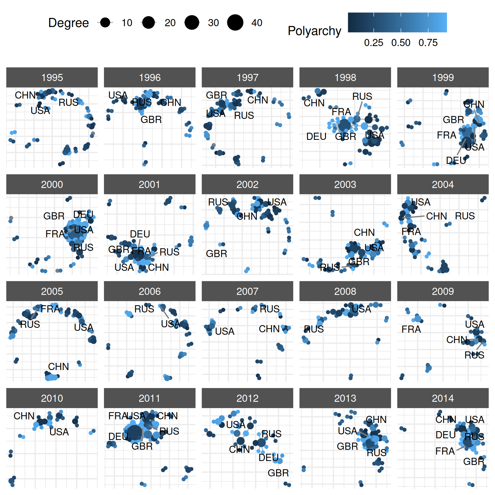

``` r
# or we can go with labels only
# and remove points
plot(
    mid_long_network,
    edge_color = "grey",
    add_points = FALSE,
    add_label = TRUE,
    label_size_by = "degree",
    label_color = "white",
    label_fill_by = "v2x_polyarchy1",
    label_fill_label = "Polyarchy",
    label_size_label = "Degree"
) + guides(size = "none")
```

    ## Warning: ! Unknown parameter 'label_size_by' in plot.netify().
    ## ‚Ñπ Did you mean 'label_size'?
    ## ‚Ñπ The parameter 'label_size_by' is being ignored.

    ## Warning: ! Unknown parameter 'label_fill_by' in plot.netify().
    ## ‚Ñπ Did you mean 'label_fill'?
    ## ‚Ñπ The parameter 'label_fill_by' is being ignored.

    ## Warning: Removed 773 rows containing missing values or values outside the scale range
    ## (`geom_segment()`).

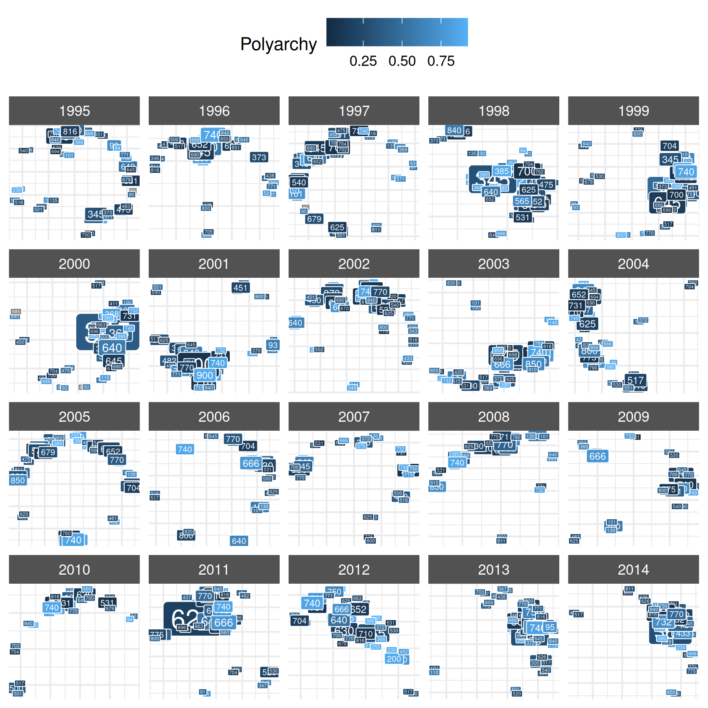

### Extracting data back to a data frame

If you need to convert a netify object back into a dyadic data frame —
for example, to run regressions or export to other software — use
[`unnetify()`](https://netify-dev.github.io/netify/reference/unnetify.md):

``` r
mid_long_df <- unnetify(mid_long_network)
head(mid_long_df[, 1:5])
```

    ##   from  to time cowmidonset   capdist
    ## 1  100 101 1995           1 1024.5480
    ## 2  100 110 1995           0 1779.6330
    ## 3  100 115 1995           0 2101.0041
    ## 4  100 130 1995           0  732.7128
    ## 5  100 135 1995           0 1889.2499
    ## 6  100 140 1995           0 2853.6456

This returns one row per dyad with all nodal and dyadic attributes
merged in. Use `remove_zeros = TRUE` to keep only non-zero edges for a
more compact result.

## Step 3: Advance üöÄ

Once we have created and explored our network object, we might want to
continue analyzing the data using different modeling approaches.
`netify` makes this simple even though those models often aren’t! And
for the sake of convergence lets go with cross-sectional networks.

First, prep the data:

``` r
# prep data
cow_cross <- cow_dyads |>
    group_by(ccode1, ccode2) |>
    summarize(
        cowmidonset = ifelse(any(cowmidonset > 0), 1, 0),
        capdist = mean(capdist),
        polity21 = mean(polity21, na.rm = TRUE),
        polity22 = mean(polity22, na.rm = TRUE),
        wbgdp2011est1 = mean(wbgdp2011est1, na.rm = TRUE),
        wbgdp2011est2 = mean(wbgdp2011est2, na.rm = TRUE),
        wbpopest1 = mean(wbpopest1, na.rm = TRUE),
        wbpopest2 = mean(wbpopest2, na.rm = TRUE)
    ) |>
    ungroup() |>
    mutate(
        capdist = log(capdist + 1)
    )

# subset set to actors with 10mil pop
actor_to_keep <- cow_cross |>
    select(ccode1, wbpopest1) |>
    filter(wbpopest1 > log(10000000)) |>
    distinct(ccode1)

# filter cow_cross by actor_to_keep
cow_cross <- cow_cross |>
    filter(ccode1 %in% actor_to_keep$ccode1) |>
    filter(ccode2 %in% actor_to_keep$ccode1)

# create netlet
mid_cross_network <- netify(
    cow_cross,
    actor1 = "ccode1", actor2 = "ccode2",
    weight = "cowmidonset",
    sum_dyads = FALSE, symmetric = TRUE,
    diag_to_NA = TRUE, missing_to_zero = FALSE,
    nodal_vars = c(
        "polity21", "polity22", "wbgdp2011est1",
        "wbgdp2011est2", "wbpopest1", "wbpopest2"
    ),
    dyad_vars = c("capdist"),
    dyad_vars_symmetric = c(TRUE)
)
```

Next, let’s take a look at passing our netify object to the `amen`
function:

``` r
library(amen)

# prep for amen
mid_cross_amen <- netify_to_amen(mid_cross_network)

# we got all the elements we need for amen
str(mid_cross_amen)
```

    ## List of 4
    ##  $ Y    : num [1:81, 1:81] NA 1 1 0 0 0 0 0 0 0 ...
    ##   ..- attr(*, "dimnames")=List of 2
    ##   .. ..$ : chr [1:81] "100" "101" "130" "135" ...
    ##   .. ..$ : chr [1:81] "100" "101" "130" "135" ...
    ##  $ Xdyad: num [1:81, 1:81, 1] 0 6.93 6.6 7.54 7.96 ...
    ##   ..- attr(*, "dimnames")=List of 3
    ##   .. ..$ : chr [1:81] "100" "101" "130" "135" ...
    ##   .. ..$ : chr [1:81] "100" "101" "130" "135" ...
    ##   .. ..$ : chr "capdist"
    ##  $ Xrow : num [1:81, 1:6] 7 4.35 6.4 6.25 8 9.2 7.8 10 10 10 ...
    ##   ..- attr(*, "dimnames")=List of 2
    ##   .. ..$ : chr [1:81] "100" "101" "130" "135" ...
    ##   .. ..$ : chr [1:6] "polity21" "polity22" "wbgdp2011est1" "wbgdp2011est2" ...
    ##  $ Xcol : num [1:81, 1:6] 7 4.35 6.4 6.25 8 9.2 7.8 10 10 10 ...
    ##   ..- attr(*, "dimnames")=List of 2
    ##   .. ..$ : chr [1:81] "100" "101" "130" "135" ...
    ##   .. ..$ : chr [1:6] "polity21" "polity22" "wbgdp2011est1" "wbgdp2011est2" ...

``` r
# plug and run
mid_amen_mod <- ame(
    Y = mid_cross_amen$Y,
    Xdyad = mid_cross_amen$Xdyad,
    Xrow = mid_cross_amen$Xrow,
    family = "bin",
    R = 0,
    symmetric = TRUE,
    seed = 6886,
    nscan = 50,
    burn = 10,
    odens = 1,
    plot = FALSE,
    print = FALSE
)
```

    ## WARNING: replacing NAs in design matrix with zeros

We can apply the same process to ERGMs:

``` r
library(ergm)
```

    ## Loading required package: network

    ## 
    ## 'network' 1.20.0 (2026-02-06), part of the Statnet Project
    ## * 'news(package="network")' for changes since last version
    ## * 'citation("network")' for citation information
    ## * 'https://statnet.org' for help, support, and other information

    ## 
    ## 'ergm' 4.12.0 (2026-02-17), part of the Statnet Project
    ## * 'news(package="ergm")' for changes since last version
    ## * 'citation("ergm")' for citation information
    ## * 'https://statnet.org' for help, support, and other information

    ## 'ergm' 4 is a major update that introduces some backwards-incompatible
    ## changes. Please type 'news(package="ergm")' for a list of major
    ## changes.

``` r
# netify_to_statnet converts to a network object,
# which is what ergm uses
mid_cross_ergm <- netify_to_statnet(mid_cross_network)

# attributes should all be loaded into the
# appropriate slot
# notice edge attributes get a _e suffix added
mid_cross_ergm
```

    ##  Network attributes:
    ##   vertices = 81 
    ##   directed = FALSE 
    ##   hyper = FALSE 
    ##   loops = FALSE 
    ##   multiple = FALSE 
    ##   bipartite = FALSE 
    ##   cowmidonset: 81x81 matrix
    ##   capdist: 81x81 matrix
    ##   total edges= 160 
    ##     missing edges= 0 
    ##     non-missing edges= 160 
    ## 
    ##  Vertex attribute names: 
    ##     polity21 polity22 vertex.names wbgdp2011est1 wbgdp2011est2 wbpopest1 wbpopest2 
    ## 
    ##  Edge attribute names: 
    ##     capdist_e cowmidonset

``` r
# set NA values to 0 for the three nodecov variables
# this is only for demonstration purposes in the vignette/example
# in any real analysis, carefully consider how to handle missing data
set.vertex.attribute(
    mid_cross_ergm, "polity21", 
    ifelse(
        is.na(get.vertex.attribute(mid_cross_ergm, "polity21")), 
        0, get.vertex.attribute(mid_cross_ergm, "polity21")))

set.vertex.attribute(
    mid_cross_ergm, "wbgdp2011est2", 
    ifelse(
        is.na(get.vertex.attribute(mid_cross_ergm, "wbgdp2011est2")), 
        0, get.vertex.attribute(mid_cross_ergm, "wbgdp2011est2")) )

set.vertex.attribute(
    mid_cross_ergm, "wbpopest2", 
    ifelse(
        is.na(get.vertex.attribute(mid_cross_ergm, "wbpopest2")), 
        0,  get.vertex.attribute(mid_cross_ergm, "wbpopest2")) )

# plug and run
ergm_model <- ergm(
    formula = mid_cross_ergm ~
        edges +
        nodecov("polity21") +
        nodecov("wbgdp2011est2") +
        nodecov("wbpopest2")
)
```

    ## Starting maximum pseudolikelihood estimation (MPLE):

    ## Obtaining the responsible dyads.

    ## Evaluating the predictor and response matrix.

    ## Maximizing the pseudolikelihood.

    ## Finished MPLE.

    ## Evaluating log-likelihood at the estimate.

## References

- Csárdi G, Nepusz T, Traag V, Horvát S, Zanini F, Noom D, Müller K
  (2024). igraph: Network Analysis and Visualization in R.
  <doi:10.5281/zenodo.7682609>, R package version 2.0.3,
  <https://CRAN.R-project.org/package=igraph>.

- Davies, Shawn, Therese Pettersson & Magnus Öberg (2023). Organized
  violence 1989-2022 and the return of conflicts between states?.
  Journal of Peace Research 60(4).

- Handcock M, Hunter D, Butts C, Goodreau S, Krivitsky P, Morris M
  (2018). ergm: Fit, Simulate and Diagnose Exponential-Family Models for
  Networks. The Statnet Project (<http://www.statnet.org>). R package
  version 3.9.4, <https://CRAN.R-project.org/package=ergm>.

- Hoff, Peter D. “Dyadic data analysis with amen.” arXiv preprint
  arXiv:1506.08237 (2015).

- Högbladh Stina, 2023, “UCDP GED Codebook version 23.1”, Department of
  Peace and Conflict Research, Uppsala University

- Miller S (2022). “peacesciencer: An R Package for Quantitative Peace
  Science Research.” Conflict Management and Peace Science, 39(6),
  755–779. doi: 10.1177/07388942221077926.

- Statnet Development Team (Pavel N. Krivitsky, Mark S. Handcock,
  David R. Hunter, Carter T. Butts, Chad Klumb, Steven M. Goodreau, and
  Martina Morris) (2003-2023). statnet: Software tools for the
  Statistical Modeling of Network Data. URL <http://statnet.org>

- Sundberg, Ralph and Erik Melander (2013) Introducing the UCDP
  Georeferenced Event Dataset. Journal of Peace Research 50(4).
