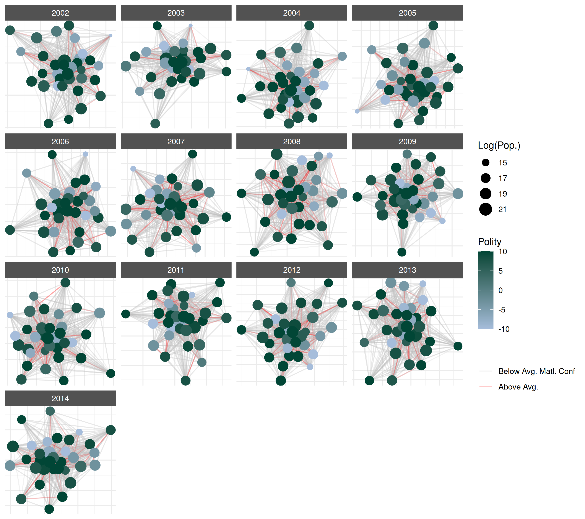

# Manual Plotting with ggplot2

This vignette provides an overview of how to create customizable plots
using `ggplot2` while still using `netify` to prepare the data.

Let’s load the necessary libraries.

``` r
library(netify)
library(ggplot2)
```

We’ll also use the `ggnewscale` package to create multiple legends when
necessary in the same plot (e.g., if you want to have legends for a
color aesthetic for both nodes and edges).

``` r
library(ggnewscale)
```

## Preparing data

First lets create a `netlet` object from some dyadic data (ICEWS data)
using the `netify` package.

``` r
# load icews data
data(icews)

# choose attributes
nvars <- c("i_polity2", "i_log_gdp", "i_log_pop")
dvars <- c("matlCoop", "verbConf", "matlConf")

# create a netify object
netlet <- netify(
    icews,
    actor1 = "i", actor2 = "j",
    time = "year",
    symmetric = FALSE, weight = "verbCoop",
    mode = "unipartite", sum_dyads = FALSE,
    actor_time_uniform = TRUE, actor_pds = NULL,
    diag_to_NA = TRUE, missing_to_zero = TRUE,
    nodal_vars = nvars,
    dyad_vars = dvars
)

# subset to a few actors
actors_to_keep <- c(
    "Australia", "Brazil",
    "Canada", "Chile", "China",
    "Colombia", "Egypt", "Ethiopia",
    "France", "Germany", "Ghana",
    "Hungary", "India", "Indonesia",
    "Iran, Islamic Republic Of",
    "Israel", "Italy", "Japan", "Kenya",
    "Korea, Democratic People's Republic Of",
    "Korea, Republic Of", "Nigeria", "Pakistan",
    "Qatar", "Russian Federation", "Saudi Arabia",
    "South Africa", "Spain", "Sudan",
    "Syrian Arab Republic", "Thailand",
    "United Kingdom", "United States",
    "Zimbabwe"
)
netlet <- subset_netify(
    netlet,
    actors = actors_to_keep
)

# print
netlet
```

    ## ✔ Hello, you have created network data, yay!
    ## • Unipartite
    ## • Asymmetric
    ## • Weights from `verbCoop`
    ## • Longitudinal: 13 Periods
    ## • # Unique Actors: 34
    ## Network Summary Statistics (averaged across time):
    ##           dens miss    mean recip trans
    ## verbCoop 0.861    0 179.484 0.978 0.928
    ## • Nodal Features: i_polity2, i_log_gdp, i_log_pop
    ## • Dyad Features: matlCoop, verbConf, matlConf

This is a longitudinal, weighted network with nodal and dyadic
attributes. In a few more steps we will show how to highlight these
attributes in the plot.

Next, we use the `net_plot_data` function to create a data frame for
`ggplot2`. `net_plot_data` extracts and sets up node and edge data from
a `netify` object according to specified plotting arguments. It returns
a list of different components but the most important one for users is
the `net_dfs` element. This element contains two objects: `edge_data`
and `nodal_data`. These are data frames that can be passed to `ggplot2`.

``` r
# create a data frame for plotting
plot_data <- net_plot_data(netlet)

# get relevant dfs
net_dfs <- plot_data$net_dfs

# check structure of what's here
str(net_dfs)
```

    ## List of 2
    ##  $ edge_data :'data.frame':  12937 obs. of  11 variables:
    ##   ..$ from    : chr [1:12937] "Australia" "Australia" "Australia" "Australia" ...
    ##   ..$ to      : chr [1:12937] "Brazil" "Canada" "Chile" "China" ...
    ##   ..$ time    : chr [1:12937] "2002" "2002" "2002" "2002" ...
    ##   ..$ verbCoop: num [1:12937] 3 24 1 518 1 15 28 42 1 61 ...
    ##   ..$ matlCoop: num [1:12937] 0 1 0 15 0 0 3 2 0 0 ...
    ##   ..$ verbConf: num [1:12937] 0 3 0 43 6 2 11 1 0 3 ...
    ##   ..$ matlConf: num [1:12937] 0 3 1 3 0 4 0 6 0 3 ...
    ##   ..$ x1      : num [1:12937] -0.0576 -0.0576 -0.0576 -0.0576 -0.0576 ...
    ##   ..$ y1      : num [1:12937] 0.132 0.132 0.132 0.132 0.132 ...
    ##   ..$ x2      : num [1:12937] 0.25671 0.03958 0.22088 -0.00051 0.25814 ...
    ##   ..$ y2      : num [1:12937] 0.061 -0.1548 0.2778 0.0518 -0.0817 ...
    ##  $ nodal_data:'data.frame':  442 obs. of  10 variables:
    ##   ..$ name      : chr [1:442] "Australia" "Australia" "Australia" "Australia" ...
    ##   ..$ time      : chr [1:442] "2002" "2003" "2004" "2005" ...
    ##   ..$ i_polity2 : int [1:442] 10 10 10 10 10 10 10 10 10 10 ...
    ##   ..$ i_log_gdp : num [1:442] 27.6 27.6 27.6 27.7 27.7 ...
    ##   ..$ i_log_pop : num [1:442] 16.8 16.8 16.8 16.8 16.8 ...
    ##   ..$ x         : num [1:442] -0.0576 0.1062 -0.1676 0.0248 0.0547 ...
    ##   ..$ y         : num [1:442] 0.1316 -0.0741 0.0391 -0.1551 0.1232 ...
    ##   ..$ name_text : chr [1:442] "Australia" "Australia" "Australia" "Australia" ...
    ##   ..$ name_label: chr [1:442] "Australia" "Australia" "Australia" "Australia" ...
    ##   ..$ id        : chr [1:442] "Australia_2002" "Australia_2003" "Australia_2004" "Australia_2005" ...

``` r
# check the first few rows of the edge data
head(net_dfs$edge_data)
```

    ##        from       to time verbCoop matlCoop verbConf matlConf          x1
    ## 1 Australia   Brazil 2002        3        0        0        0 -0.05761221
    ## 2 Australia   Canada 2002       24        1        3        3 -0.05761221
    ## 3 Australia    Chile 2002        1        0        0        1 -0.05761221
    ## 4 Australia    China 2002      518       15       43        3 -0.05761221
    ## 5 Australia Colombia 2002        1        0        6        0 -0.05761221
    ## 6 Australia    Egypt 2002       15        0        2        4 -0.05761221
    ##          y1            x2          y2
    ## 1 0.1316246  0.2567066471  0.06102817
    ## 2 0.1316246  0.0395816516 -0.15478831
    ## 3 0.1316246  0.2208771149  0.27780000
    ## 4 0.1316246 -0.0005098899  0.05176884
    ## 5 0.1316246  0.2581434830 -0.08165964
    ## 6 0.1316246 -0.0063939248 -0.10525516

``` r
# check the first few rows of the nodal data
head(net_dfs$nodal_data)
```

    ##         name time i_polity2 i_log_gdp i_log_pop           x           y
    ## 79 Australia 2002        10  27.55492  16.78568 -0.05761221  0.13162457
    ## 80 Australia 2003        10  27.58556  16.79718  0.10621976 -0.07408432
    ## 81 Australia 2004        10  27.62686  16.80787 -0.16761260  0.03905379
    ## 82 Australia 2005        10  27.65791  16.82005  0.02483645 -0.15514885
    ## 83 Australia 2006        10  27.68495  16.83354  0.05468896  0.12317962
    ## 84 Australia 2007        10  27.72203  16.85179  0.03834328 -0.11702110
    ##    name_text name_label             id
    ## 79 Australia  Australia Australia_2002
    ## 80 Australia  Australia Australia_2003
    ## 81 Australia  Australia Australia_2004
    ## 82 Australia  Australia Australia_2005
    ## 83 Australia  Australia Australia_2006
    ## 84 Australia  Australia Australia_2007

The `x` and `y` in `nodal_data` and the `x1`, `y1`, `x2`, and `y2` in
`edge_data` are the coordinates of the nodes and edges, respectively.
These are the coordinates that will be used to plot the network.

## Creating a plot

Now that we have the data, we can create a plot using `ggplot2`. We’ll
use `geom_segment` and `geom_point` (or `geom_label`, `geom_text`, and
the `ggrepel` equivalents) to plot the edges and nodes, respectively.

``` r
ggplot() +
    geom_segment(
        data = net_dfs$edge_data,
        aes(
            x = x1,
            y = y1,
            xend = x2,
            yend = y2
        ),
        color = "lightgrey",
        alpha = .2
    ) +
    geom_point(
        data = net_dfs$nodal_data,
        aes(
            x = x,
            y = y,
            size = i_log_pop,
            color = i_polity2
        )
    ) +
    labs(
        color = "Polity",
        size = "Log(Pop.)"
    ) +
    scale_color_gradient(low = "#a6bddb", high = "#014636") +
    facet_wrap(~time, scales = "free") +
    theme_netify()
```


### Changing the layout

By default layouts for node positions are drawn from the `layout_nicely`
algorithm in the `igraph` package. Users can specify other layouts as,
for example, say that you wanted to use the `mds` algorithm instead:

``` r
# create a df using mds instead
plot_data_mds <- net_plot_data(
    netlet,
    list(
        layout = "mds"
    )
)

# see new x-y coordinates
lapply(plot_data_mds$net_dfs, head)
```

    ## $edge_data
    ##        from       to time verbCoop matlCoop verbConf matlConf         x1
    ## 1 Australia   Brazil 2002        3        0        0        0 -0.3548545
    ## 2 Australia   Canada 2002       24        1        3        3 -0.3548545
    ## 3 Australia    Chile 2002        1        0        0        1 -0.3548545
    ## 4 Australia    China 2002      518       15       43        3 -0.3548545
    ## 5 Australia Colombia 2002        1        0        6        0 -0.3548545
    ## 6 Australia    Egypt 2002       15        0        2        4 -0.3548545
    ##           y1          x2          y2
    ## 1 -0.1680305 -0.72811128  0.36196590
    ## 2 -0.1680305 -0.03316817 -0.05312512
    ## 3 -0.1680305 -0.65201941  0.27166650
    ## 4 -0.1680305 -0.03316817 -0.05312512
    ## 5 -0.1680305 -1.22997412 -0.06398966
    ## 6 -0.1680305  0.36325222  0.13977670
    ## 
    ## $nodal_data
    ##         name time i_polity2 i_log_gdp i_log_pop           x           y
    ## 79 Australia 2002        10  27.55492  16.78568 -0.35485450 -0.16803048
    ## 80 Australia 2003        10  27.58556  16.79718  0.20857397 -0.12705283
    ## 81 Australia 2004        10  27.62686  16.80787 -0.04224981  0.05123628
    ## 82 Australia 2005        10  27.65791  16.82005 -0.06014447 -0.02708750
    ## 83 Australia 2006        10  27.68495  16.83354  0.15073774  0.46114648
    ## 84 Australia 2007        10  27.72203  16.85179 -0.03161665 -0.03885021
    ##    name_text name_label             id
    ## 79 Australia  Australia Australia_2002
    ## 80 Australia  Australia Australia_2003
    ## 81 Australia  Australia Australia_2004
    ## 82 Australia  Australia Australia_2005
    ## 83 Australia  Australia Australia_2006
    ## 84 Australia  Australia Australia_2007

### Add Edge Information

So far, we have focused on using color to convey information about nodal
attributes in the network (population size and polity score). Now, let’s
add more edge information to the plot. For example, we can include
information about the `matlConf` dyadic attribute. Imagine we want to
highlight edges of verbal cooperation that occur at the same time as
when higher than average levels of material conflict occur in the
network. First, let’s create the variable in the edge data.

``` r
library(dplyr)
```

    ## 
    ## Attaching package: 'dplyr'

    ## The following objects are masked from 'package:stats':
    ## 
    ##     filter, lag

    ## The following objects are masked from 'package:base':
    ## 
    ##     intersect, setdiff, setequal, union

``` r
# create high_matlConf variable
net_dfs$edge_data <- net_dfs$edge_data |>
    group_by(time) |>
    mutate(
        high_matlConf = matlConf > mean(matlConf, na.rm = TRUE)
    ) |>
    ungroup() |>
    as.data.frame()

# check
head(net_dfs$edge_data)
```

    ##        from       to time verbCoop matlCoop verbConf matlConf          x1
    ## 1 Australia   Brazil 2002        3        0        0        0 -0.05761221
    ## 2 Australia   Canada 2002       24        1        3        3 -0.05761221
    ## 3 Australia    Chile 2002        1        0        0        1 -0.05761221
    ## 4 Australia    China 2002      518       15       43        3 -0.05761221
    ## 5 Australia Colombia 2002        1        0        6        0 -0.05761221
    ## 6 Australia    Egypt 2002       15        0        2        4 -0.05761221
    ##          y1            x2          y2 high_matlConf
    ## 1 0.1316246  0.2567066471  0.06102817         FALSE
    ## 2 0.1316246  0.0395816516 -0.15478831         FALSE
    ## 3 0.1316246  0.2208771149  0.27780000         FALSE
    ## 4 0.1316246 -0.0005098899  0.05176884         FALSE
    ## 5 0.1316246  0.2581434830 -0.08165964         FALSE
    ## 6 0.1316246 -0.0063939248 -0.10525516         FALSE

Now that we have the new variable in the data.frame, we can plot by it
but note that we now need a color aesthetic for both points and
segments, even though `ggplot2` only supports one legend by aesthetic by
default. We can get around this by using the `new_scale_color` function
from the \``ggnewscale` package.

``` r
# color line segments by this new variable
ggplot() +
    geom_segment(
        data = net_dfs$edge_data,
        aes(
            x = x1,
            y = y1,
            xend = x2,
            yend = y2,
            color = high_matlConf
        ),
        alpha = .2
    ) +
    scale_color_manual(
        name = "",
        values = c("grey", "red"),
        labels = c("Below Avg. Matl. Conf", "Above Avg.")
    ) +
    new_scale_color() +
    geom_point(
        data = net_dfs$nodal_data,
        aes(
            x = x,
            y = y,
            size = i_log_pop,
            color = i_polity2
        )
    ) +
    scale_color_gradient(
        name = "Polity",
        low = "#a6bddb", high = "#014636"
    ) +
    labs(
        size = "Log(Pop.)"
    ) +
    facet_wrap(~time, scales = "free") +
    theme_netify() +
    theme(
        legend.position = "right"
    )
```



## References

- Boschee, Elizabeth; Lautenschlager, Jennifer; O’Brien, Sean; Shellman,
  Steve; Starz, James; Ward, Michael, 2015, \`\`ICEWS Coded Event
  Data’’, <doi:10.7910/DVN/28075> , Harvard Dataverse.

- Pedersen, T. L. (2020). ggnewscale: Multiple Fill and Colour Scales in
  ‘ggplot2’. R package version 0.4.3.
  <https://CRAN.R-project.org/package=ggnewscale>

- Wickham, H. (2016). ggplot2: Elegant Graphics for Data Analysis.
  Springer-Verlag New York.
