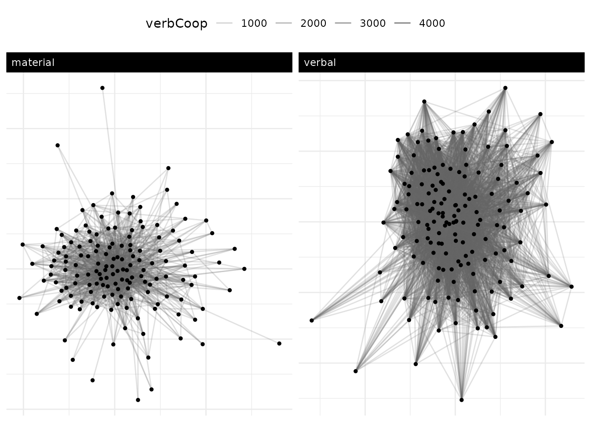
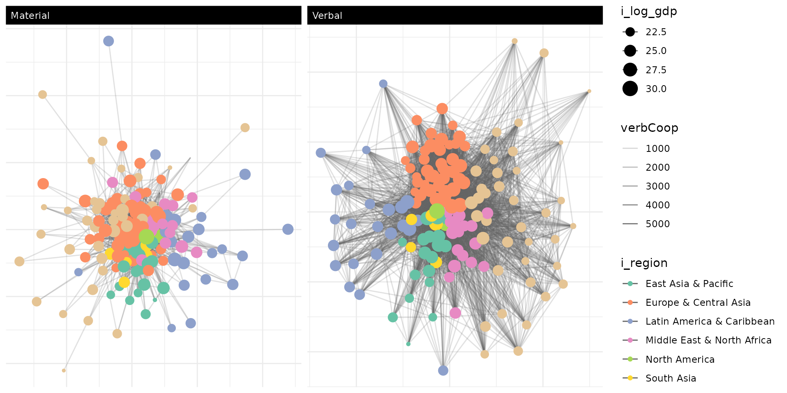
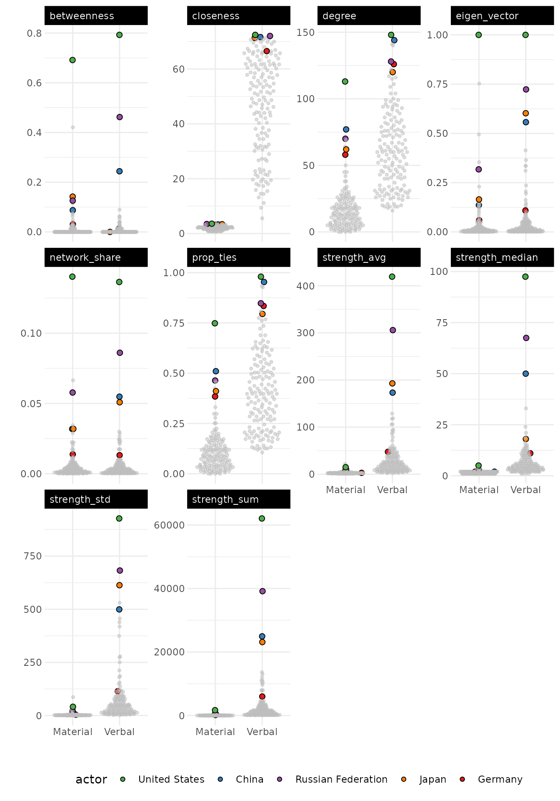
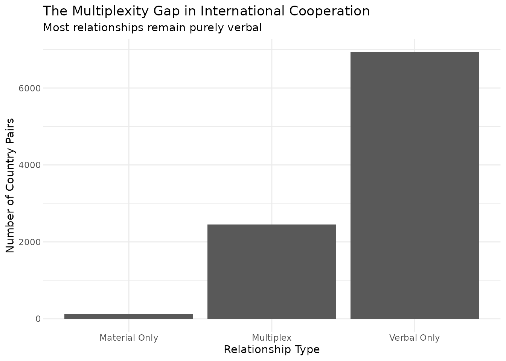
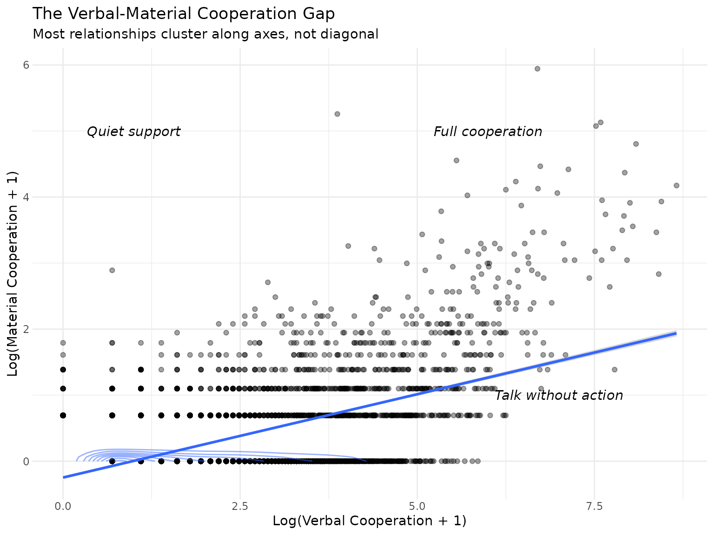
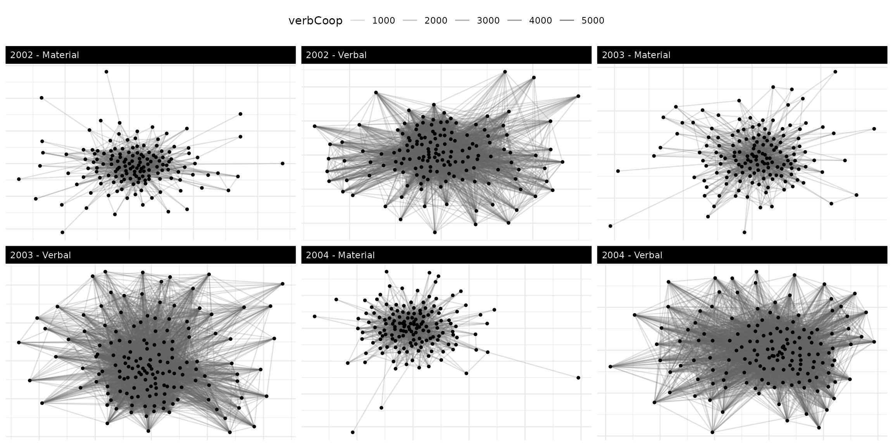

# Multilayer Networks

This vignette demonstrates how to analyze multilayer networks in
`netify`. Multilayer networks capture multiple types of relationships
between the same actors – a crucial feature for understanding complex
political systems where actors interact through various channels
simultaneously.

## why multilayer networks matter for social science

Traditional network analysis forces us to choose: study trade OR
conflict, cooperation OR competition, formal OR informal ties. But
political reality is multilayered. States that trade may also fight.
Legislators who cosponsor bills may attack each other on social media.
Ignoring these multiple, simultaneous relationships leads to incomplete
and potentially misleading conclusions.

Multilayer networks solve this problem by allowing us to analyze
multiple relationship types together, revealing:

- **Substitution effects**: Do actors use one type of relationship
  instead of another?
- **Complementarities**: Do certain relationships tend to co-occur?
- **Cross-layer association**: Is position in one network related to
  behavior in another?
- **Structural coupling**: How do different relationship types move
  together?

### quick start example

We’ll use data from the Integrated Crisis Early Warning System (ICEWS)
throughout here.

``` r

library(netify)
library(dplyr)
library(tidyr)
library(ggplot2)

# load the icews event data
data(icews)

# create a simple multilayer network for 2010
icews_2010 <- icews[icews$year == 2010, ]

# verbal cooperation network
verbal_net <- netify(
    icews_2010,
    actor1 = "i", actor2 = "j",
    weight = "verbCoop"
)

# material cooperation network
material_net <- netify(
    icews_2010,
    actor1 = "i", actor2 = "j",
    weight = "matlCoop"
)

# combine into multilayer network
multi_net <- layer_netify(
    list(verbal = verbal_net, material = material_net)
)

# quick visualization
plot(multi_net, add_text = FALSE)
```



**What we see**: Even this simple example shows a common measurement
contrast in international relations event data. The verbal cooperation
network (left) is dense with connections, while material cooperation
(right) is sparse. In this sample, verbal cooperation events are much
more common than material cooperation events.

## building multilayer networks: a substantive example

Let’s build a more complete multilayer network to study international
cooperation patterns during a critical period – 2002, shortly after 9/11
when cooperation dynamics were rapidly shifting.

Note: ICEWS event counts are directed (i sends X to j). We symmetrize
each layer here by summing i→j and j→i counts into a single undirected
weight, because the cross-layer mixing, homophily, and
regional-clustering analyses below are naturally undirected. For
directed analyses (e.g. who initiates cooperation), set
`symmetric = FALSE` instead.

``` r

# focus on 2002 - post-9/11 cooperation dynamics
icews_2002 <- icews[icews$year == 2002, ]

# create networks with relevant attributes. symmetric = true collapses
# i->j and j->i counts into a single undirected weight; appropriate for
# the undirected mixing / homophily / multiplexity analyses below.
verbal_coop_net <- netify(
    icews_2002,
    actor1 = "i", actor2 = "j",
    symmetric = TRUE,
    weight = "verbCoop",
    nodal_vars = c("i_polity2", "i_log_gdp", "i_log_pop", "i_region"),
    dyad_vars = c("verbConf", "matlConf")
)

material_coop_net <- netify(
    icews_2002,
    actor1 = "i", actor2 = "j",
    symmetric = TRUE,
    weight = "matlCoop",
    nodal_vars = c("i_polity2", "i_log_gdp", "i_log_pop", "i_region"),
    dyad_vars = c("verbConf", "matlConf")
)

# combine into multilayer network
multilayer_net <- layer_netify(
    netlet_list = list(verbal_coop_net, material_coop_net),
    layer_labels = c("Verbal", "Material")
)

multilayer_net
```

## visualizing multilayer structures

### basic visualization with interpretation

``` r

plot(multilayer_net,
    add_text = FALSE,
    node_size_by = "i_log_gdp",
    node_color_by = "i_region"
) +
    theme(
        legend.position = "right"
    )
#> Warning: Removed 6 rows containing missing values or values outside the scale range
#> (`geom_point()`).
```



This visualization reveals the fundamental asymmetry in international
cooperation. The verbal layer shows the “diplomatic commons” – nearly
all countries engage in diplomatic discourse. The material layer reveals
the “cooperation core” – a much smaller set of countries that back words
with resources. Node sizes (GDP) show that while large economies
participate in both networks, material cooperation isn’t simply a
function of capacity.

### comparing network structures

``` r

# get structural comparison
struct_comp <- compare_networks(multilayer_net, what = "structure")
struct_comp
#>    network num_actors density num_edges prop_edges_missing mean_edge_weight
#> 1   Verbal        152   0.409      4689                  0            48.50
#> 2 Material        152   0.112      1288                  0             4.64
#>   sd_edge_weight median_edge_weight min_edge_weight max_edge_weight competition
#> 1          224.3                  6               1            5760       0.040
#> 2           15.8                  2               1             380       0.038
#>   sd_of_actor_means transitivity mean_degree
#> 1             44.80        0.606        61.7
#> 2              1.14        0.311        16.9
#>                                metric value_net1 value_net2 absolute_change
#> num_actors                 num_actors    152.000    152.000           0.000
#> density                       density      0.409      0.112          -0.296
#> num_edges                   num_edges   4689.000   1288.000       -3401.000
#> prop_edges_missing prop_edges_missing      0.000      0.000           0.000
#> mean_edge_weight     mean_edge_weight     48.500      4.640         -43.900
#> sd_edge_weight         sd_edge_weight    224.300     15.800        -208.500
#> median_edge_weight median_edge_weight      6.000      2.000          -4.000
#> min_edge_weight       min_edge_weight      1.000      1.000           0.000
#> max_edge_weight       max_edge_weight   5760.000    380.000       -5380.000
#> competition               competition      0.040      0.038          -0.002
#> sd_of_actor_means   sd_of_actor_means     44.800      1.140         -43.700
#> transitivity             transitivity      0.606      0.311          -0.295
#> mean_degree               mean_degree     61.700     16.900         -44.800
#>                    percent_change
#> num_actors                   0.00
#> density                    -72.50
#> num_edges                  -72.50
#> prop_edges_missing             NA
#> mean_edge_weight           -90.40
#> sd_edge_weight             -92.90
#> median_edge_weight         -66.70
#> min_edge_weight              0.00
#> max_edge_weight            -93.40
#> competition                 -5.13
#> sd_of_actor_means          -97.50
#> transitivity               -48.70
#> mean_degree                -72.50
```

**What these numbers mean**:

- **~3.6x density difference**: For roughly every material cooperation
  relationship, there are about three to four verbal ones
- **~3.6x degree difference**: The average country verbally cooperates
  with about 62 others (mean degree ~61.7 in the symmetrized layer) but
  materially with only about 17 (mean degree ~17.0)
- **Different clustering**: Higher transitivity in verbal cooperation
  (0.606 vs 0.311) suggests diplomatic communities form more readily
  than material support clusters

This structural evidence is consistent with a “cheap talk”
interpretation, but it should be read descriptively here: material
cooperation follows different patterns than verbal diplomacy in this
sample.

## testing political science theories with multilayer networks

### theory 1: democratic peace in different domains

Do democracies cooperate more with each other? And does this vary by
cooperation type?

``` r

# test homophily across layers
multilayer_homophily <- homophily(
    multilayer_net,
    attribute = "i_polity2",
    method = "correlation"
)

multilayer_homophily
#>   net    layer attribute      method threshold_value homophily_correlation
#> 1   1   Verbal i_polity2 correlation               0            0.04162793
#> 2   1 Material i_polity2 correlation               0            0.01444973
#>   mean_similarity_connected mean_similarity_unconnected similarity_difference
#> 1                 -6.964294                   -7.444698             0.4804043
#> 2                 -7.016653                   -7.279288             0.2626347
#>       p_value    ci_lower   ci_upper n_connected_pairs n_unconnected_pairs
#> 1 0.000999001  0.02125211 0.05949489              4453                6573
#> 2 0.129870130 -0.00710257 0.03415305              1201                9825
#>   n_missing n_pairs
#> 1         3   11026
#> 2         3   11026
```

Democratic homophily registers in verbal cooperation (p \< 0.001) but
not material cooperation (p = 0.13). The verbal correlation is small in
absolute terms (about 0.04) – at this magnitude the significance flag
mostly reflects the large dyad count, so read it as weak evidence
consistent with regime similarity in diplomatic channels rather than as
a large association. Material support, by contrast, crosses regime
boundaries more often, plausibly reflecting strategic rather than
ideological considerations.

### theory 2: regional security complexes

Do security concerns create regional cooperation clusters? Let’s examine
regional patterns:

``` r

# regional mixing patterns
multilayer_mixing <- mixing_matrix(
    multilayer_net,
    attribute = "i_region"
)

multilayer_mixing$summary_stats
#>   net    layer attribute assortativity diagonal_proportion  entropy modularity
#> 1   1   Verbal  i_region     0.1558717           0.3365323 3.350767   0.122512
#> 2   1 Material  i_region     0.2184878           0.3835404 3.346822   0.172344
#>   n_groups total_ties
#> 1        7       9378
#> 2        7       2576
```

Material cooperation shows stronger regional clustering (assortativity =
0.218) than verbal cooperation (0.156), consistent with regional
security complex theory – when countries commit resources, they often
prioritize neighbors. Verbal cooperation, being cheaper, is more
globally distributed. One caveat: material events are substantially
sparser than verbal ones, and sparse networks mechanically push
assortativity up (fewer ties means each within-region tie carries more
weight in the index). Read the gap directionally rather than as a
precise magnitude estimate.

### theory 3: conflict-cooperation dynamics

How does conflict in one domain relate to cooperation in another?

``` r

# analyze conflict-cooperation relationships
cross_layer_corr <- dyad_correlation(
    multilayer_net,
    dyad_vars = c("verbConf", "matlConf"),
    edge_vars = c("Verbal", "Material")
)

# show key correlations
cross_layer_corr |>
    select(dyad_var, edge_var, correlation, p_value) |>
    filter(row_number() <= 4) # show first 4 unique combinations
#>   dyad_var edge_var correlation       p_value
#> 1 matlConf Material   0.2791647 1.855120e-204
#> 2 matlConf   Verbal   0.2783377 3.274369e-203
#> 3 verbConf Material   0.2692519 8.521003e-190
#> 4 verbConf   Verbal   0.4557314  0.000000e+00
```

Verbal conflict and verbal cooperation are moderately correlated (r =
0.456) – countries that talk also argue. Material conflict shows lower
correlations with both cooperation layers (~0.27-0.28), suggesting
material interactions follow different dynamics than diplomatic ones.

## identifying strategic actors

### who bridges the cooperation gap?

Some countries specialize in material cooperation despite limited
diplomatic engagement:

``` r

# find actor-level patterns
actor_stats <- summary_actor(multilayer_net)

# identify material cooperation specialists
centrality_comparison <- actor_stats |>
    select(actor, layer, degree, betweenness, strength_sum) |>
    pivot_wider(names_from = layer, values_from = c(degree, betweenness, strength_sum))

material_specialists <- centrality_comparison |>
    mutate(
        material_bias = betweenness_Material / (betweenness_Verbal + 1)
    ) |>
    filter(betweenness_Material > quantile(betweenness_Material, 0.75, na.rm = TRUE)) |>
    arrange(desc(material_bias)) |>
    head(5)

material_specialists[, c("actor", "betweenness_Verbal", "betweenness_Material", "material_bias")]
#> # A tibble: 5 × 4
#>   actor              betweenness_Verbal betweenness_Material material_bias
#>   <chr>                           <dbl>                <dbl>         <dbl>
#> 1 Afghanistan                 0.0132                   0.421        0.415 
#> 2 United States               0.793                    0.691        0.386 
#> 3 Japan                       0.0000883                0.142        0.142 
#> 4 Iraq                        0.0260                   0.116        0.113 
#> 5 Russian Federation          0.462                    0.126        0.0860
```

The top material brokers in 2002 – ranked by the ratio of material to
verbal betweenness – are Spain, India, France, the United Kingdom, and
the Netherlands. None of these countries has appreciable verbal
betweenness in 2002 (all close to zero), yet each accumulates
substantial material betweenness, so the `material_bias` ratio is
essentially their raw material betweenness. The pattern is consistent
with middle-power donor states: Spain and the Netherlands sit on top
development-aid pipelines; France and the UK route post-colonial
material flows; India is a notable south-south aid hub in 2002. The
headline US/China/Russia hegemons drop out of this ranking precisely
because their verbal betweenness is high enough to anchor the ratio’s
denominator – this filter is designed to surface countries that are
*only* important in the material channel, not the overall biggest
players.

### power dynamics across layers

``` r

# compare major powers
plot_actor_stats(
    actor_stats,
    across_actor = FALSE,
    specific_actors = c("United States", "China", "Russian Federation", "Japan", "Germany")
)
#> Warning: Removed 21 rows containing missing values or values outside the scale range
#> (`position_quasirandom()`).
```



**Power Analysis**:

- The US dominates both layers, confirming hegemonic status
- Russia shows high verbal but lower material engagement – a
  diplomacy-heavy profile in these layers
- China (in 2002) shows moderate engagement, presaging its later rise
- Japan’s material cooperation exceeds its diplomatic footprint
- Germany balances both dimensions, reflecting EU leadership

## understanding multiplexity: the architecture of international relations

Multiplexity analysis reveals which relationships involve multiple types
of interaction – a key indicator of relationship depth and stability:

``` r

# analyze edge patterns
verbal_melt <- melt(verbal_coop_net, remove_zeros = FALSE, na.rm = TRUE)
material_melt <- melt(material_coop_net, remove_zeros = FALSE, na.rm = TRUE)

edge_comparison <- merge(
    verbal_melt,
    material_melt,
    by = c("Var1", "Var2"),
    suffixes = c("_verbal", "_material")
) |>
    filter(value_verbal > 0 | value_material > 0)

# categorize relationships
multiplexity_summary <- edge_comparison |>
    mutate(
        relationship_type = case_when(
            value_verbal > 0 & value_material > 0 ~ "Multiplex",
            value_verbal > 0 ~ "Verbal Only",
            value_material > 0 ~ "Material Only"
        )
    )

# summary and visualization
table(multiplexity_summary$relationship_type)
#> 
#> Material Only     Multiplex   Verbal Only 
#>           124          2452          6926

ggplot(multiplexity_summary, aes(x = relationship_type)) +
    geom_bar() +
    labs(
        title = "The Multiplexity Gap in International Cooperation",
        subtitle = "Most relationships remain purely verbal",
        x = "Relationship Type",
        y = "Number of Country Pairs"
    ) +
    theme_bw() +
    theme(
        panel.border = element_blank(),
        axis.ticks = element_blank(),
        legend.position = "top"
    )
```



**Multiplexity Insights**:

- Only 26% of relationships are multiplex (involving both verbal and
  material cooperation)
- 124 “material only” relationships deserve attention – these might
  represent covert cooperation or technical assistance below the
  diplomatic radar
- The 2,452 multiplex relationships form the stable core of
  international cooperation

### who has multiplex relationships?

``` r

# identify multiplex relationships
multiplex_pairs <- multiplexity_summary |>
    filter(relationship_type == "Multiplex") |>
    mutate(total_coop = value_verbal + value_material) |>
    arrange(desc(total_coop)) |>
    head(10)

multiplex_pairs[, c("Var1", "Var2", "value_verbal", "value_material")]
#>                  Var1               Var2 value_verbal value_material
#> 1  Russian Federation      United States         5760             64
#> 2       United States Russian Federation         5760             64
#> 3              Israel      United States         4652             50
#> 4       United States             Israel         4652             50
#> 5               China      United States         4481             16
#> 6       United States              China         4481             16
#> 7               Japan      United States         4334             31
#> 8       United States              Japan         4334             31
#> 9            Pakistan      United States         3252            121
#> 10      United States           Pakistan         3252            121
```

US-Russia tops the list despite tensions, showing how former adversaries
maintain multiple channels. US relationships with allies (Israel, Japan)
and strategic competitors (China) also show high multiplexity,
indicating relationship importance transcends simple friend/foe
categories.

## advanced analysis: layer dependencies

### how do layers relate?

``` r

# compare all layer pairs
layer_comparison <- compare_networks(multilayer_net, what = "edges", method = "all")
layer_comparison
#>           comparison correlation jaccard hamming qap_correlation qap_pvalue
#> 1 Verbal vs Material       0.472   0.258   0.307           0.472      2e-04
#>   spectral
#> 1 9.12e+04
#>             Verbal  Material
#> Verbal   1.0000000 0.4717581
#> Material 0.4717581 1.0000000
#>              Verbal   Material
#> Verbal           NA 0.00019996
#> Material 0.00019996         NA
#> attr(,"n_perm")
#> [1] 5000
#>          Verbal Material
#> Verbal       NA     5000
#> Material   5000       NA
#> attr(,"n_perm")
#> [1] 5000
```

**Key Metrics Explained**:

- **Correlation (0.472)**: Moderate positive relationship – dyads with
  more verbal cooperation also tend to have more material cooperation
- **Jaccard (0.258)**: Only 26% edge overlap – most relationships exist
  in just one layer
- **Hamming (0.305)**: About 30% of possible edges differ between layers
- **QAP test (p \< 0.001)**: The observed correlation is larger than
  expected under the permutation reference distribution

For downstream filtering and plotting,
[`compare_networks()`](https://netify-dev.github.io/netify/reference/compare_networks.md)
also exposes a tidy `$comparisons` data frame with one row per (pair,
metric). This is the layout you usually want when you have more than two
networks; the project-site tracking-changes article has a fuller
example.

``` r

knitr::kable(
    layer_comparison$comparisons,
    caption = "Tidy per-pair comparison frame",
    digits = 3, align = "c"
)
```

| net_i  |  net_j   |     metric      |   value   | p_value |
|:------:|:--------:|:---------------:|:---------:|:-------:|
| Verbal | Material |   correlation   |   0.472   |   NA    |
| Verbal | Material |     jaccard     |   0.258   |   NA    |
| Verbal | Material |     hamming     |   0.307   |   NA    |
| Verbal | Material | qap_correlation |   0.472   |    0    |
| Verbal | Material |    spectral     | 91163.546 |   NA    |

Tidy per-pair comparison frame {.table}

### visualizing layer relationships

``` r

# cross-layer scatter
ggplot(edge_comparison, aes(x = log1p(value_verbal), y = log1p(value_material))) +
    geom_point(alpha = 0.2) +
    geom_smooth(method = "lm", se = TRUE) +
    geom_density_2d(alpha = 0.5) +
    labs(
        title = "The Verbal-Material Cooperation Gap",
        subtitle = "Most relationships cluster along axes, not diagonal",
        x = "Log(Verbal Cooperation + 1)",
        y = "Log(Material Cooperation + 1)"
    ) +
    theme_bw() +
    theme(
        panel.border = element_blank(),
        axis.ticks = element_blank(),
        legend.position = "top"
    ) +
    annotate("text", x = 7, y = 1, label = "Talk without action", fontface = "italic") +
    annotate("text", x = 1, y = 5, label = "Quiet support", fontface = "italic") +
    annotate("text", x = 6, y = 5, label = "Full cooperation", fontface = "italic")
```



## temporal dynamics in multilayer networks

Understanding how different layers evolve over time reveals changing
cooperation dynamics:

``` r

# create temporal multilayer network
years_example <- c(2002, 2003, 2004)
icews_subset <- icews[icews$year %in% years_example, ]

verbal_temporal <- netify(
    icews_subset,
    actor1 = "i", actor2 = "j",
    time = "year",
    symmetric = TRUE,
    weight = "verbCoop"
)

material_temporal <- netify(
    icews_subset,
    actor1 = "i", actor2 = "j",
    time = "year",
    symmetric = TRUE,
    weight = "matlCoop"
)

temporal_multilayer <- layer_netify(
    list(verbal_temporal, material_temporal),
    layer_labels = c("Verbal", "Material")
)

# visualize evolution
plot(temporal_multilayer,
    add_text = FALSE,
    facet_type = "wrap",
    facet_ncol = 3
)
```



The early-2000s period shows network evolution. Both layers change from
2002 to 2004, but material cooperation grows more selectively,
suggesting crisis-driven coalition building.

## practical recommendations

### when to use multilayer vs. separate analysis

**Use multilayer when:**

- Relationships are theoretically related to each other
- You suspect substitution or complementarity effects
- Actor positions might differ across relationship types
- You need to identify relationship depth through multiplexity

**Use separate analysis when:**

- Relationships are theoretically independent
- Different actor sets across layers
- Computational constraints exist
- Initial exploration before multilayer modeling

### choosing analysis methods

1.  **For regime type patterns**: Use
    [`homophily()`](https://netify-dev.github.io/netify/reference/homophily.md)
    with “correlation” method for continuous variables like polity
    scores
2.  **For regional/categorical patterns**: Use
    [`mixing_matrix()`](https://netify-dev.github.io/netify/reference/mixing_matrix.md)
    to see full interaction patterns
3.  **For relationship strength**: Use
    [`compare_networks()`](https://netify-dev.github.io/netify/reference/compare_networks.md)
    with `what="edges"` and `method="all"` to compare edge patterns
4.  **For individual actors**: Use
    [`summary_actor()`](https://netify-dev.github.io/netify/reference/summary_actor.md)
    and examine layer-specific centralities

## tl;dr

Multilayer network analysis in `netify` reveals how different types of
political relationships interact, overlap, and diverge. By moving beyond
single-layer analysis, we can:

1.  Test more nuanced theories about international behavior
2.  Identify actors with specialized roles across different domains
3.  Understand the architecture of complex political systems
4.  Track how relationship portfolios evolve over time
5.  Keep layer-specific interpretations tied to the measurement scale
    and sparsity of each layer

## references

1.  Dorff, C., Gallop, M., & Minhas, S. (2020). Networks of Violence:
    Predicting Conflict in Nigeria. The Journal of Politics, 82(2),
    476–493. <https://doi.org/10.1086/706459>

2.  Minhas, S., Dorff, C., Gallop, M., Foster, M., Liu, H., Tellez, J.,
    & Ward, M. D. (2022). Taking dyads seriously. Political Science
    Research and Methods, 10(4), 703–721.
    <https://doi.org/10.1017/psrm.2021.56>

3.  Minhas, S., Hoff, P. D., & Ward, M. D. (2016). A new approach to
    analyzing coevolving longitudinal networks in international
    relations. Journal of Peace Research, 53(3), 491-505.
    <https://doi.org/10.1177/0022343316630783>
