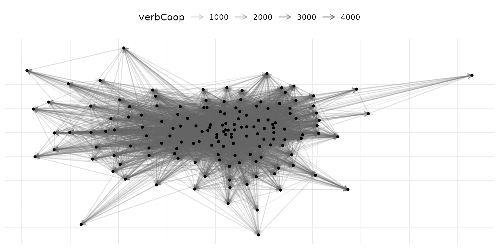

# Pipeline: netify to lame and dbn

Latent space models for network data require carefully structured array
inputs whose construction is both tedious and error-prone when performed
manually. The `amen` package handles cross-sectional and single-layer
longitudinal networks, `lame` extends this to longitudinal networks with
time-varying actor compositions, and `dbn` fits Dynamic Bilinear Network
models to multilayer longitudinal networks. Each package expects a
distinct data structure (3D arrays, lists of matrices, or 4D arrays,
respectively), and `netify` provides a unified pipeline for producing
all of them. Users describe their data once with
[`netify()`](https://netify-dev.github.io/netify/reference/netify.md),
optionally combine layers with
[`layer_netify()`](https://netify-dev.github.io/netify/reference/layer_netify.md),
and then call
[`to_amen()`](https://netify-dev.github.io/netify/reference/netify_to_amen.md)
or
[`to_dbn()`](https://netify-dev.github.io/netify/reference/netify_to_dbn.md)
to obtain the exact structure each modeling package requires.

## Setup

The examples below use ICEWS event data, which captures directed
interactions between 152 countries from 2002 to 2014 across four
relation types: verbal cooperation, material cooperation, verbal
conflict, and material conflict.

``` r
library(netify)
library(ggplot2)

# load the ICEWS event data
data(icews)

# preview
head(icews[, c("i", "j", "year", "verbCoop", "matlCoop", "verbConf", "matlConf")], 4)
#>             i       j year verbCoop matlCoop verbConf matlConf
#> 2 Afghanistan Albania 2002        6        1        0        0
#> 3 Afghanistan Albania 2003        1        1        0        0
#> 4 Afghanistan Albania 2004       10        2        0        1
#> 5 Afghanistan Albania 2005        0        0        0        0
```

## Part 1: Single-Layer Pipeline (netify to amen)

### Step 1: Create the network

The first step is always
[`netify()`](https://netify-dev.github.io/netify/reference/netify.md).
We create a single directed, weighted network representing verbal
cooperation over time.

``` r
verbal_net = netify(
    icews,
    actor1 = "i", actor2 = "j", time = "year",
    symmetric = FALSE,
    weight = "verbCoop",
    missing_to_zero = FALSE,
    nodal_vars = c("i_polity2", "i_log_gdp"),
    dyad_vars = c("matlCoop", "verbConf"),
    dyad_vars_symmetric = c(FALSE, FALSE),
    output_format = "longit_array"
)

print(verbal_net)
```

Key choices:

- **`missing_to_zero = FALSE`**: Preserving NAs distinguishes “no
  observed interaction” from “structurally impossible interaction.” This
  matters for latent space models where missing data and structural
  zeros have different likelihoods.
- **`output_format = "longit_array"`**: We use array format because our
  actor set is constant across time.
- **`nodal_vars` and `dyad_vars`**: These covariates will be carried
  through to the amen output automatically.

### Step 2: Inspect the network

Before modeling, it’s worth checking basic properties.

``` r
# quick summary
net_summary = summary(verbal_net)
head(net_summary[, c("net", "num_actors", "density", "num_edges", "reciprocity")])
#>    net num_actors   density num_edges reciprocity
#> 1 2002        152 0.3787034      8692   0.9778217
#> 2 2003        152 0.3871994      8887   0.9632488
#> 3 2004        152 0.4145173      9514   0.9769563
#> 4 2005        152 0.4071976      9346   0.9804325
#> 5 2006        152 0.4108139      9429   0.9771928
#> 6 2007        152 0.4243203      9739   0.9783703
```

``` r
# visualize a single year
verbal_2010 = subset(verbal_net, time = "2010")
plot(verbal_2010, add_text = FALSE)
```



### Step 3: Convert to amen format

[`to_amen()`](https://netify-dev.github.io/netify/reference/netify_to_amen.md)
converts a single-layer netify object into the list structure that
[`amen::ame()`](https://rdrr.io/pkg/amen/man/ame.html) expects.

``` r
amen_data = to_amen(verbal_net)

# what did we get?
cat("Y dimensions:", paste(dim(amen_data$Y), collapse = " x "), "\n")
#> Y dimensions: 152 x 152 x 13
cat("Xdyad dimensions:", paste(dim(amen_data$Xdyad), collapse = " x "), "\n")
#> Xdyad dimensions: 152 x 152 x 2 x 13
cat("Xrow dimensions:", paste(dim(amen_data$Xrow), collapse = " x "), "\n")
#> Xrow dimensions: 152 x 2 x 13
cat("Xcol dimensions:", paste(dim(amen_data$Xcol), collapse = " x "), "\n")
#> Xcol dimensions: 152 x 2 x 13
```

The output is:

- **Y**: `[n_actors x n_actors x n_time]`, the adjacency array
- **Xdyad**: `[n_actors x n_actors x n_dyad_vars x n_time]`, dyadic
  covariates
- **Xrow**: `[n_actors x n_nodal_vars x n_time]`, sender covariates
- **Xcol**: `[n_actors x n_nodal_vars x n_time]`, receiver covariates

These can be plugged directly into
[`amen::ame()`](https://rdrr.io/pkg/amen/man/ame.html):

``` r
library(amen)

# cross-sectional model for a single year
ame_fit = ame(
    Y = amen_data$Y[, , "2010"],
    Xdyad = amen_data$Xdyad[, , , "2010"],
    Xrow = amen_data$Xrow[, , "2010"],
    Xcol = amen_data$Xcol[, , "2010"],
    R = 2,
    symmetric = FALSE,
    family = "nrm",
    nscan = 1000, burn = 500, odens = 1,
    plot = FALSE, print = FALSE
)
```

## Part 2: Longitudinal Pipeline with lame

For longitudinal modeling with time-varying actor compositions, the
`lame` package expects data as lists of matrices rather than arrays. Use
`to_amen(netlet, lame = TRUE)`.

### When to use lame format

Use `lame = TRUE` when:

- Actors enter and exit the network over time (e.g., new states forming,
  organizations dissolving)
- You want to leverage lame’s longitudinal latent space models

### Create a network with varying actors

``` r
# use longit_list format for varying actor compositions
verbal_list = netify(
    icews,
    actor1 = "i", actor2 = "j", time = "year",
    symmetric = FALSE,
    weight = "verbCoop",
    missing_to_zero = FALSE,
    actor_time_uniform = FALSE,
    nodal_vars = c("i_polity2", "i_log_gdp"),
    dyad_vars = c("matlCoop"),
    dyad_vars_symmetric = c(FALSE)
)

print(verbal_list)
```

### Convert to lame format

``` r
lame_data = to_amen(verbal_list, lame = TRUE)

# what did we get?
cat("Y: list of", length(lame_data$Y), "matrices\n")
#> Y: list of 13 matrices
cat("First period dimensions:", paste(dim(lame_data$Y[[1]]), collapse = " x "), "\n")
#> First period dimensions: 152 x 152
cat("Last period dimensions:", paste(dim(lame_data$Y[[length(lame_data$Y)]]), collapse = " x "), "\n")
#> Last period dimensions: 152 x 152

# check actor counts across time
actor_counts = sapply(lame_data$Y, nrow)
cat("\nActors per time period:\n")
#> 
#> Actors per time period:
print(actor_counts)
#> 2002 2003 2004 2005 2006 2007 2008 2009 2010 2011 2012 2013 2014 
#>  152  152  152  152  152  152  152  152  152  152  152  152  152
```

Each element of the list can have a different set of actors. This is the
format `lame` expects:

``` r
# fit a longitudinal latent space model with lame
library(lame)

lame_fit = lame(
    Y = lame_data$Y,
    Xdyad = lame_data$Xdyad,
    Xrow = lame_data$Xrow,
    Xcol = lame_data$Xcol,
    R = 2,
    symmetric = FALSE,
    family = "nrm",
    nscan = 1000, burn = 500, odens = 1,
    plot = FALSE, print = FALSE
)
```

## Part 3: Multilayer Pipeline (netify to dbn)

The `dbn` package models multilayer longitudinal networks using Dynamic
Bilinear Network models. It expects a 4D array with dimensions
`[n, n, p, T]` where `p` is the number of relation types (layers).

### Step 1: Create individual layer networks

``` r
# verbal cooperation layer (symmetric - mutual diplomatic engagement)
verbal_coop = netify(
    icews,
    actor1 = "i", actor2 = "j", time = "year",
    symmetric = TRUE,
    weight = "verbCoop",
    missing_to_zero = FALSE,
    output_format = "longit_array",
    nodal_vars = c("i_polity2", "i_log_gdp"),
    dyad_vars = c("verbConf"),
    dyad_vars_symmetric = c(TRUE)
)

# material cooperation layer (directed - trade/aid flows)
material_coop = netify(
    icews,
    actor1 = "i", actor2 = "j", time = "year",
    symmetric = FALSE,
    weight = "matlCoop",
    missing_to_zero = FALSE,
    output_format = "longit_array",
    dyad_vars = c("matlConf"),
    dyad_vars_symmetric = c(FALSE)
)
```

### Step 2: Combine into a multilayer network

[`layer_netify()`](https://netify-dev.github.io/netify/reference/layer_netify.md)
supports mixed directedness, meaning layers can have different symmetry
settings. This is common in IR applications where some relations are
inherently symmetric (alliance status) while others are directed (trade
exports).

``` r
multi_net = layer_netify(
    list(verbal_coop, material_coop),
    layer_labels = c("Verbal", "Material")
)

print(multi_net)
```

Notice that the print output shows the mixed directedness across layers.

### Step 3: Convert to dbn format

[`to_dbn()`](https://netify-dev.github.io/netify/reference/netify_to_dbn.md)
extracts the multilayer longitudinal netify object into the exact 4D
array format that `dbn` expects.

``` r
dbn_data = to_dbn(multi_net)

# what did we get?
cat("Y dimensions:", paste(dim(dbn_data$Y), collapse = " x "), "\n")
#> Y dimensions: 152 x 152 x 2 x 13
cat("  Actors:", dim(dbn_data$Y)[1], "\n")
#>   Actors: 152
cat("  Layers:", paste(dimnames(dbn_data$Y)[[3]], collapse = ", "), "\n")
#>   Layers: Verbal, Material
cat("  Time periods:", dim(dbn_data$Y)[4], "\n")
#>   Time periods: 13
```

The output structure:

- **Y**: `[n_actors x n_actors x n_layers x n_time]`, the 4D adjacency
  array
- **Xdyad**: `[n_actors x n_actors x n_dyad_vars x n_time]`, dyadic
  covariates
- **Xrow**: `[n_actors x n_nodal_vars x n_time]`, sender covariates
- **Xcol**: `[n_actors x n_nodal_vars x n_time]`, receiver covariates

``` r
# fit a dynamic bilinear network model
library(dbn)

dbn_fit = dbn(
    Y = dbn_data$Y,
    R = 2,
    nscan = 1000, burn = 500, odens = 1,
    plot = FALSE, print = FALSE
)
```

### Single-layer networks work too

[`to_dbn()`](https://netify-dev.github.io/netify/reference/netify_to_dbn.md)
also handles single-layer longitudinal networks by adding a layer
dimension of size 1:

``` r
dbn_single = to_dbn(verbal_coop)
cat("Single-layer Y dimensions:", paste(dim(dbn_single$Y), collapse = " x "), "\n")
#> Single-layer Y dimensions: 152 x 152 x 1 x 13
cat("Layer name:", dimnames(dbn_single$Y)[[3]], "\n")
#> Layer name: verbCoop
```

## Part 4: Working with Mixed Directedness

A common challenge in political science is that data naturally includes
both symmetric and directed relations. For example:

- **Symmetric**: UNGA voting agreement, alliance status, shared IGO
  membership
- **Directed**: trade exports, foreign aid, arms transfers

`netify` now handles this directly.

### Creating mixed-directedness multilayer networks

``` r
# symmetric layer: average verbal cooperation
verbal_symm = netify(
    icews,
    actor1 = "i", actor2 = "j", time = "year",
    symmetric = TRUE,
    weight = "verbCoop",
    missing_to_zero = FALSE,
    output_format = "longit_array"
)

# directed layer: material cooperation
material_dir = netify(
    icews,
    actor1 = "i", actor2 = "j", time = "year",
    symmetric = FALSE,
    weight = "matlCoop",
    missing_to_zero = FALSE,
    output_format = "longit_array"
)

# combine -- mixed directedness is allowed
mixed_net = layer_netify(
    list(verbal_symm, material_dir),
    layer_labels = c("Verbal_Symm", "Material_Dir")
)

# check attributes
cat("Symmetric attribute:", attr(mixed_net, "symmetric"), "\n")
#> Symmetric attribute: TRUE FALSE
cat("Layer names:", attr(mixed_net, "layers"), "\n")
#> Layer names: Verbal_Symm Material_Dir
```

When you subset to a single layer, the correct symmetry is preserved:

``` r
# subset to the symmetric layer
verbal_only = subset(mixed_net, layers = "Verbal_Symm")
cat("Verbal layer symmetric:", attr(verbal_only, "symmetric"), "\n")
#> Verbal layer symmetric: TRUE

# subset to the directed layer
material_only = subset(mixed_net, layers = "Material_Dir")
cat("Material layer symmetric:", attr(material_only, "symmetric"), "\n")
#> Material layer symmetric: FALSE
```

### Converting mixed-directedness to dbn

[`to_dbn()`](https://netify-dev.github.io/netify/reference/netify_to_dbn.md)
handles mixed-directedness multilayer objects:

``` r
dbn_mixed = to_dbn(mixed_net)
cat("Y dimensions:", paste(dim(dbn_mixed$Y), collapse = " x "), "\n")
#> Y dimensions: 152 x 152 x 2 x 13
```

Note that the 4D array represents all layers uniformly. The per-layer
symmetry information is metadata that you would pass to your model
separately. For dbn, you would typically specify this in the model call.

## Part 5: The missing_to_zero Decision

The `missing_to_zero` parameter deserves special attention for modeling
pipelines. By default,
[`netify()`](https://netify-dev.github.io/netify/reference/netify.md)
sets `missing_to_zero = TRUE`, which fills unobserved dyads with zeros.
This is fine for descriptive analysis but can be problematic for
statistical models.

### Why it matters

``` r
# compare the two approaches
net_zeros = netify(
    icews[icews$year == 2010, ],
    actor1 = "i", actor2 = "j",
    symmetric = FALSE,
    weight = "verbCoop",
    missing_to_zero = TRUE
)

net_na = netify(
    icews[icews$year == 2010, ],
    actor1 = "i", actor2 = "j",
    symmetric = FALSE,
    weight = "verbCoop",
    missing_to_zero = FALSE
)

# count zeros vs NAs
raw_zeros = get_raw(net_zeros)
raw_na = get_raw(net_na)

cat("With missing_to_zero = TRUE:\n")
#> With missing_to_zero = TRUE:
cat("  Zeros:", sum(raw_zeros == 0, na.rm = TRUE), "\n")
#>   Zeros: 12976
cat("  NAs:", sum(is.na(raw_zeros)), "\n")
#>   NAs: 152

cat("\nWith missing_to_zero = FALSE:\n")
#> 
#> With missing_to_zero = FALSE:
cat("  Zeros:", sum(raw_na == 0, na.rm = TRUE), "\n")
#>   Zeros: 12976
cat("  NAs:", sum(is.na(raw_na)), "\n")
#>   NAs: 152
```

For latent space models, the distinction matters:

- **Zero**: “We observed this dyad and there was no interaction,” which
  informs the model that these actors are distant in latent space
- **NA**: “We don’t know whether these actors interacted,” so the model
  marginalizes over possible values

**Recommendation for modeling pipelines**: Always use
`missing_to_zero = FALSE` unless you are confident that all unobserved
dyads represent genuine zeros.

## Quick Reference: Choosing Your Export Function

| Scenario                                     | Function                                                                       | Output                     |
|----------------------------------------------|--------------------------------------------------------------------------------|----------------------------|
| Single-layer, cross-sectional                | [`to_amen()`](https://netify-dev.github.io/netify/reference/netify_to_amen.md) | list(Y, Xdyad, Xrow, Xcol) |
| Single-layer, longitudinal (constant actors) | [`to_amen()`](https://netify-dev.github.io/netify/reference/netify_to_amen.md) | 3D arrays                  |
| Single-layer, longitudinal (varying actors)  | `to_amen(lame=TRUE)`                                                           | lists of matrices          |
| Multilayer, longitudinal                     | [`to_dbn()`](https://netify-dev.github.io/netify/reference/netify_to_dbn.md)   | 4D array `[n, n, p, T]`    |
| Single-layer, longitudinal (dbn format)      | [`to_dbn()`](https://netify-dev.github.io/netify/reference/netify_to_dbn.md)   | 4D array `[n, n, 1, T]`    |

## tl;dr

The `netify` pipeline eliminates manual array construction by providing
a four-step workflow: create the network with
[`netify()`](https://netify-dev.github.io/netify/reference/netify.md)
(using `missing_to_zero = FALSE` for modeling applications), combine
layers with
[`layer_netify()`](https://netify-dev.github.io/netify/reference/layer_netify.md)
when multilayer structure is needed, export with
[`to_amen()`](https://netify-dev.github.io/netify/reference/netify_to_amen.md)
or
[`to_dbn()`](https://netify-dev.github.io/netify/reference/netify_to_dbn.md)
depending on the target modeling package, and pass the resulting output
directly to the model fitting function.
