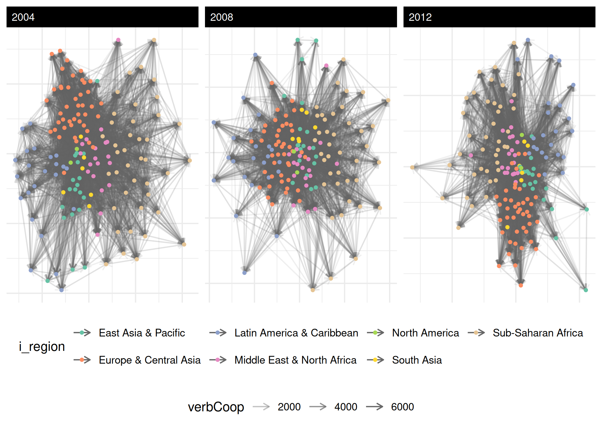

# Quickstart to Inference

This is a minimal end-to-end tour of `netify` that uses **only the data
bundled with the package** – no `peacesciencer`, no `countrycode`, no
external downloads. If you want the full IR-data walkthrough with
covariates from outside sources, see the [Foundations
article](https://netify-dev.github.io/netify/articles/foundations.html)
on the project site.

We’ll cover the four things `netify` is for:

1.  **Build** a network object from dyadic data
2.  **Explore** it with summary statistics and a quick plot
3.  **Test** a couple of basic inferential questions
4.  **Bridge** out to other packages when you want to model

``` r

library(netify)
library(ggplot2)
```

## 1. build

The bundled `icews` dataset has ICEWS event-data slices for 152
countries from 2002 to 2014 with the four “quad” variables
(verbal/material by cooperation/conflict) plus a handful of nodal
covariates.

``` r

data(icews)
head(icews[, c("i", "j", "year", "verbCoop", "matlConf", "i_polity2", "i_region")])
#>             i       j year verbCoop matlConf i_polity2   i_region
#> 2 Afghanistan Albania 2002        6        0        NA South Asia
#> 3 Afghanistan Albania 2003        1        0        NA South Asia
#> 4 Afghanistan Albania 2004       10        1        NA South Asia
#> 5 Afghanistan Albania 2005        0        0        NA South Asia
#> 6 Afghanistan Albania 2006        6       21        NA South Asia
#> 7 Afghanistan Albania 2007        3        0        NA South Asia
```

Turn it into a netify object with one call:

``` r

verb_coop <- netify(
    icews,
    actor1 = "i", actor2 = "j", time = "year",
    symmetric = FALSE,
    weight   = "verbCoop",
    nodal_vars = c("i_polity2", "i_log_gdp", "i_region"),
    dyad_vars  = c("matlCoop", "verbConf")
)
#> ℹ `missing_to_zero` is set to "TRUE" (the default).
#> ! Missing dyads will be filled with zeros. For latent space or other
#>   statistical network models, structural zeros and missing data have different
#>   meanings. Set `missing_to_zero = FALSE` to preserve NAs if this distinction
#>   matters for your analysis.
#> This message is displayed once per session.

print(verb_coop)
#> ✔ Network data created.
#> • Unipartite
#> • Asymmetric
#> • Weights from `verbCoop`
#> • Longitudinal: 13 Periods
#> • # Unique Actors: 152
#> Network Summary Statistics (averaged across time):
#>           dens miss   mean recip trans
#> verbCoop 0.418    0 45.869 0.976 0.627
#> • Nodal Features: i_polity2, i_log_gdp, i_region
#> • Dyad Features: matlCoop, verbConf
```

The [`print()`](https://rdrr.io/r/base/print.html) summary tells you the
network is unipartite, directed, longitudinal (13 periods), 152 actors,
with nodal and dyadic features attached. The numeric table shows
density, missingness, mean edge weight, reciprocity, and transitivity
averaged across time.

A quick glossary, since several of these terms appear before they’re
defined elsewhere:

- **unipartite**: one kind of actor (countries here). The opposite is
  **bipartite** – two kinds, e.g., students-to-clubs.
- **directed** / **symmetric**: a directed tie has a sender and a
  receiver (`i -> j` is different from `j -> i`); a symmetric tie does
  not.
- **density**: share of possible ties that are actually present (0 = no
  ties, 1 = complete graph).
- **transitivity**: probability that two of your friends are also
  friends with each other – “friend of a friend is a friend.” Higher =
  more clustering.
- **mutual-dyad proportion (`mutual`)**: among ordered pairs where at
  least one tie exists, the share where both `i -> j` and `j -> i` are
  present.
- **reciprocity**: correlation between the adjacency matrix `A` and its
  transpose `A^T`; behaves like `mutual` for binary networks but
  generalizes to weighted ones.

## 2. explore

[`summary()`](https://rdrr.io/r/base/summary.html) returns one row per
time period with graph-level statistics:

``` r

gs <- summary(verb_coop)
head(gs[, c("net", "num_actors", "density", "reciprocity", "mutual", "transitivity")])
#>    net num_actors   density reciprocity    mutual transitivity
#> 1 2002        152 0.3787034   0.9778217 0.8537001    0.6058952
#> 2 2003        152 0.3871994   0.9632488 0.8479933    0.6072045
#> 3 2004        152 0.4145173   0.9769563 0.8452289    0.6215978
#> 4 2005        152 0.4071976   0.9804325 0.8386779    0.6215075
#> 5 2006        152 0.4108139   0.9771928 0.8510012    0.6277829
#> 6 2007        152 0.4243203   0.9783703 0.8511690    0.6330626
```

Note both `reciprocity` (the correlation between $`A`$ and $`A^T`$,
useful for weighted networks) and `mutual` (the classic mutual-dyad
proportion). Use whichever fits your audience.

Actor-level stats – degree, prop_ties, centrality, strength – come from
[`summary_actor()`](https://netify-dev.github.io/netify/reference/summary_actor.md).
Quick definitions of what shows up in the columns:

- **degree_in / degree_out / degree_total**: count of incoming,
  outgoing, or total ties for an actor.
- **prop_ties\_**\*: those degree counts divided by the number of
  possible partners.
- **strength**: sum / average / sd of the *weights* on realized non-zero
  ties (parallel to degree but weight-aware).
- **betweenness**: how often an actor sits on the shortest path between
  two others – a broker score.
- **closeness**: how short the actor’s average distance is to everyone
  else.
- **authority_score / hub_score** (HITS): authorities are nodes that
  many hubs point to; hubs are nodes that point to many authorities.
  Useful in directed networks (e.g., who’s getting cited vs. who’s doing
  the citing).

``` r

as_ <- summary_actor(verb_coop)
head(as_[, c("actor", "time", "degree_in", "degree_out",
             "betweenness", "authority_score", "hub_score")])
#>         actor time degree_in degree_out  betweenness authority_score
#> 1 Afghanistan 2002        92         81 1.324503e-02      0.26866096
#> 2     Albania 2002        46         49 0.000000e+00      0.01252200
#> 3     Algeria 2002        68         65 0.000000e+00      0.01406673
#> 4      Angola 2002        64         67 8.830022e-05      0.01905067
#> 5   Argentina 2002        48         48 0.000000e+00      0.03580770
#> 6     Armenia 2002        71         66 0.000000e+00      0.05049222
#>     hub_score
#> 1 0.183233794
#> 2 0.009730031
#> 3 0.010671854
#> 4 0.011275109
#> 5 0.024732267
#> 6 0.039622725
```

Plot it. The default uses `auto_format = TRUE` and adapts to network
size – for 152 actors over 13 years it’ll suppress text labels and tone
down edge alpha automatically:

``` r

plot(verb_coop,
     time_filter = c("2004", "2008", "2012"),
     node_color_by = "i_region",
     edge_alpha = 0.1) +
  theme(legend.position = "bottom")
```



## 3. test (basic inferential)

A common first question is *homophily*: do similar countries cooperate
more? The call below computes the descriptive homophily statistic
quickly. Set `significance_test = TRUE` when you want the permutation
p-value and interval.

``` r

hom <- homophily(verb_coop,
                 attribute = "i_polity2",
                 method = "correlation",
                 significance_test = FALSE)
head(hom)
#>    net    layer attribute      method threshold_value homophily_correlation
#> 1 2002 verbCoop i_polity2 correlation               0            0.04822429
#> 2 2003 verbCoop i_polity2 correlation               0            0.06630047
#> 3 2004 verbCoop i_polity2 correlation               0            0.04929628
#> 4 2005 verbCoop i_polity2 correlation               0            0.05016483
#> 5 2006 verbCoop i_polity2 correlation               0            0.04604959
#> 6 2007 verbCoop i_polity2 correlation               0            0.03108231
#>   mean_similarity_connected mean_similarity_unconnected similarity_difference
#> 1                 -6.897821                   -7.462007             0.5641861
#> 2                 -6.745410                   -7.514014             0.7686034
#> 3                 -6.874874                   -7.452968             0.5780945
#> 4                 -6.745738                   -7.336404             0.5906658
#> 5                 -6.787059                   -7.331676             0.5446173
#> 6                 -6.869626                   -7.230992             0.3613660
#>   p_value ci_lower ci_upper n_connected_pairs n_unconnected_pairs n_missing
#> 1      NA       NA       NA              8260               13792         3
#> 2      NA       NA       NA              8225               13237         5
#> 3      NA       NA       NA              8903               12853         4
#> 4      NA       NA       NA              8916               13136         3
#> 5      NA       NA       NA              8979               13073         3
#> 6      NA       NA       NA              9281               12771         3
#>   n_pairs
#> 1   22052
#> 2   21462
#> 3   21756
#> 4   22052
#> 5   22052
#> 6   22052
```

For a categorical attribute,
[`mixing_matrix()`](https://netify-dev.github.io/netify/reference/mixing_matrix.md)
gives the full who-with-whom table:

``` r

mm <- mixing_matrix(verb_coop, attribute = "i_region", normalized = TRUE)
round(mm$mixing_matrices[[1]], 2)
#>                            East Asia & Pacific Europe & Central Asia
#> East Asia & Pacific                       0.03                  0.04
#> Europe & Central Asia                     0.04                  0.18
#> Latin America & Caribbean                 0.01                  0.03
#> Middle East & North Africa                0.02                  0.04
#> North America                             0.00                  0.01
#> South Asia                                0.01                  0.02
#> Sub-Saharan Africa                        0.02                  0.04
#>                            Latin America & Caribbean Middle East & North Africa
#> East Asia & Pacific                             0.01                       0.02
#> Europe & Central Asia                           0.02                       0.05
#> Latin America & Caribbean                       0.03                       0.01
#> Middle East & North Africa                      0.01                       0.04
#> North America                                   0.00                       0.00
#> South Asia                                      0.00                       0.01
#> Sub-Saharan Africa                              0.01                       0.03
#>                            North America South Asia Sub-Saharan Africa
#> East Asia & Pacific                 0.00       0.01               0.02
#> Europe & Central Asia               0.01       0.02               0.04
#> Latin America & Caribbean           0.00       0.00               0.01
#> Middle East & North Africa          0.00       0.01               0.03
#> North America                       0.00       0.00               0.01
#> South Asia                          0.00       0.00               0.01
#> Sub-Saharan Africa                  0.01       0.01               0.07
mm$summary_stats[1, ]
#>    net    layer attribute assortativity diagonal_proportion entropy modularity
#> 1 2002 verbCoop  i_region     0.1717675           0.3507823 3.33186  0.1346415
#>   n_groups total_ties
#> 1        7       8692
```

[`compare_networks()`](https://netify-dev.github.io/netify/reference/compare_networks.md)
is the all-purpose comparison tool. For a longitudinal netify it returns
pairwise temporal comparisons:

``` r

temp_cmp <- compare_networks(verb_coop, method = "correlation")
head(temp_cmp$summary)
#>        metric      mean         sd       min       max
#> 1 correlation 0.8391837 0.05285993 0.7127432 0.9364287
```

You can also slice by a nodal attribute and compare the resulting
subnetworks:

``` r

by_region <- compare_networks(
  subset(verb_coop, time = "2010"),
  by = "i_region",
  method = "correlation"
)
by_region$by_group$n_actors_per_group
#>        East Asia & Pacific      Europe & Central Asia 
#>                         19                         43 
#>  Latin America & Caribbean Middle East & North Africa 
#>                         23                         19 
#>              North America                 South Asia 
#>                          2                          6 
#>         Sub-Saharan Africa 
#>                         40
```

## 4. bridge

netify intentionally stops at descriptives + basic inference. For
statistical models, hand off to a downstream package:

| Want to fit… | Use this | netify exporter |
|----|----|----|
| Latent factor / AME | [amen](https://CRAN.R-project.org/package=amen) | `to_amen(netlet)` |
| ERGM | [`vignette("pipeline_netify_ergm", package = "netify")`](https://netify-dev.github.io/netify/articles/pipeline_netify_ergm.md) | `to_statnet(netlet)` |
| Community detection / graph algorithms | [igraph](https://igraph.org/r/) | `to_igraph(netlet)` |
| Roll your own dyadic regression | base R or modeling packages | `unnetify(netlet)` for a long data frame |

Additional project-site articles cover optional workflows, including
latent-factor and multilayer modeling handoffs.

Example: convert to igraph and use a function netify doesn’t expose:

``` r

ig <- to_igraph(verb_coop)             # list of igraph objects, one per year
#> ℹ `netify_to_igraph()` kept the igraph edge set unchanged.
#> • 236 dyadic covariate cells on non-edges cannot be stored as igraph edge
#>   attributes.
#> This message is displayed once per session.
ig_2010 <- ig[["2010"]]
length(igraph::cluster_walktrap(ig_2010))
#> [1] 6
```

Or flatten back to a dyadic data frame:

``` r

df <- unnetify(subset(verb_coop, time = "2010"), remove_zeros = TRUE)
head(df[, c("from", "to", "verbCoop", "matlCoop", "i_polity2_from", "i_polity2_to")])
#>          from         to verbCoop matlCoop i_polity2_from i_polity2_to
#> 1 Afghanistan  Argentina        1        0             NA            8
#> 2 Afghanistan    Armenia        7        2             NA            5
#> 3 Afghanistan  Australia      125        0             NA           10
#> 4 Afghanistan    Austria        1        0             NA           10
#> 5 Afghanistan Azerbaijan        7        0             NA           -7
#> 6 Afghanistan    Bahrain        3        0             NA           -5
```

## tl;dr

``` r

net <- netify(df, actor1 = "i", actor2 = "j", time = "year", weight = "x")
summary(net)            # graph-level stats
summary_actor(net)      # actor-level stats
plot(net)               # ggplot-based network visual
homophily(net, attribute = "v")   # do similar actors connect?
compare_networks(net)             # how do periods/layers/groups differ?
to_amen(net)  # or to_dbn / to_statnet / to_igraph when you're ready to model
```

For the long version with peacesciencer data and a full IR walkthrough,
see the [Foundations
article](https://netify-dev.github.io/netify/articles/foundations.html)
on the project site.

## a note for non-time use cases

Most of netify’s docs talk about “longitudinal” networks because that is
the common social-science use case. The underlying `longit_list`
structure is more general: it is a list of matrices, each with its own
actor set. Common non-time examples:

- **Per-subject networks**: brain connectivity matrices, one per fMRI
  subject
- **Per-replicate networks**: synthetic networks drawn from a generative
  process
- **Per-condition networks**: networks observed under different
  experimental conditions
- **Per-document networks**: term co-occurrence networks, one per
  document

For these, build a list of matrices (one per partition) and use either
`new_netify(list_of_matrices)` or
`netify(df, ..., time = "partition_id")`. The same per-period operations
still apply: [`summary()`](https://rdrr.io/r/base/summary.html),
[`summary_actor()`](https://netify-dev.github.io/netify/reference/summary_actor.md),
faceted [`plot()`](https://rdrr.io/r/graphics/plot.default.html), and
`subset(time = ...)`. The column is called `time`, but it can hold a
subject, replicate, condition, or other slice id. If that framing gets
confusing in your context, alias it locally:

``` r

# build a per-subject network library
subjects <- new_netify(list_of_subject_matrices)
# treat the "time" dimension as subject
per_subject_stats <- summary(subjects)
```

This generality is why the package treats `longit_list` as a general
partition format rather than a strictly temporal one.
