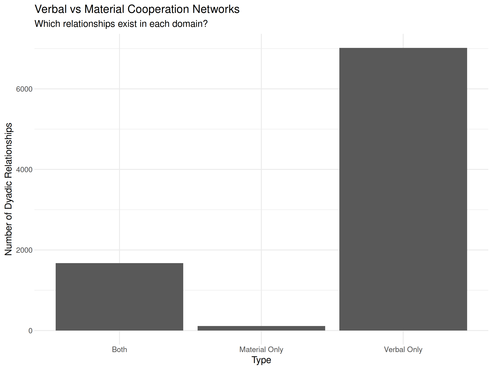
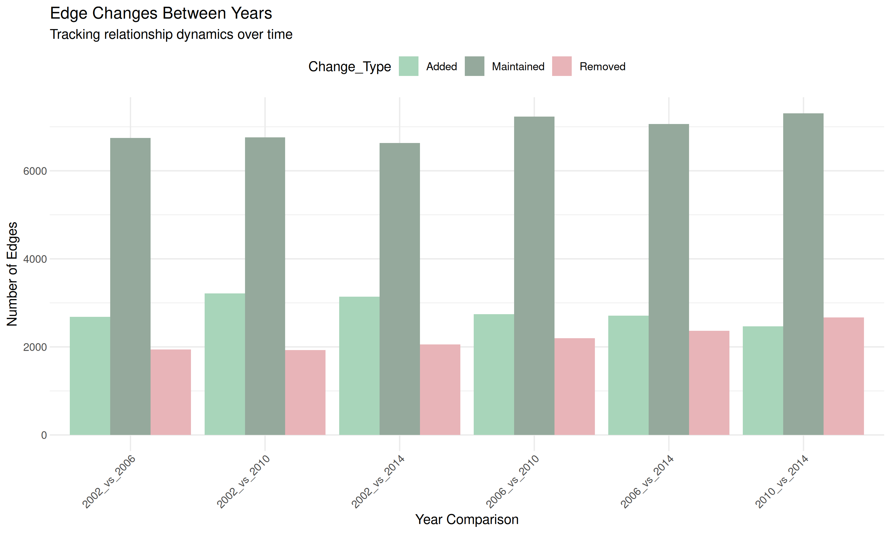
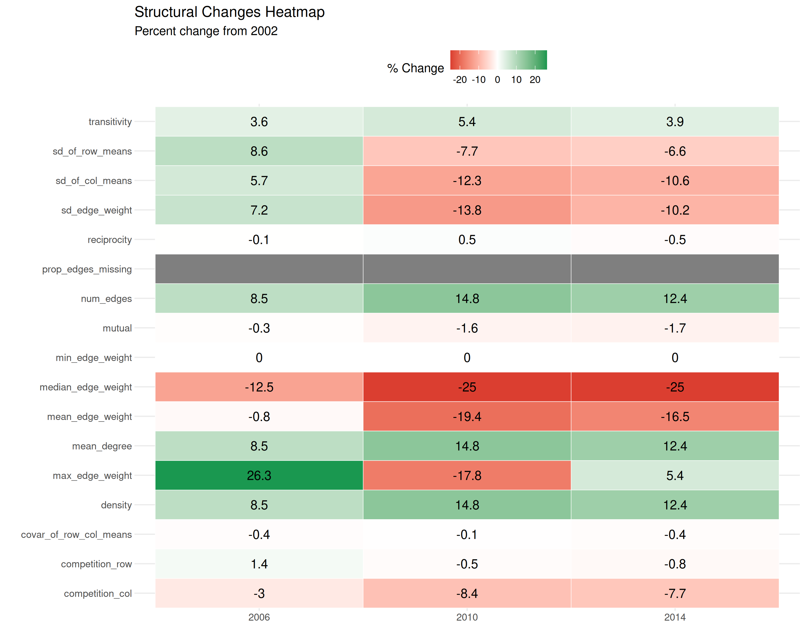
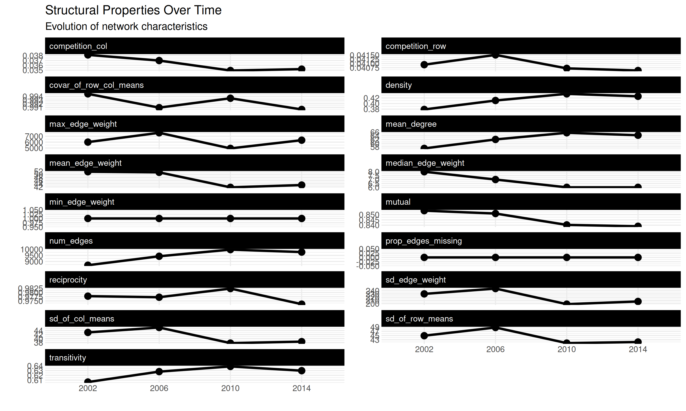
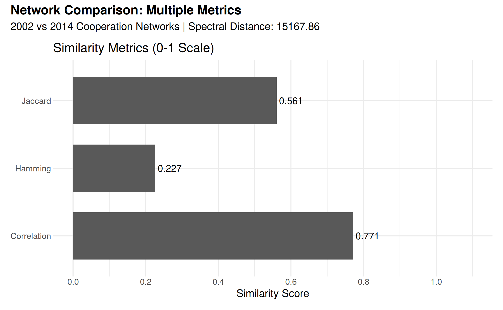

# Tracking Changes in Cooperation and Conflict: Comparing Networks

## vignette summary

This vignette demonstrates how to use **netify** to analyze changes in
international relations over time using data from the Integrated Crisis
Early Warning System (ICEWS). We’ll explore some fun questions about how
countries interact:

1.  **Talk vs. Action**: Do countries that cooperate verbally
    (diplomatic statements) also cooperate materially (aid, trade)?
2.  **Friend or Foe**: Are cooperation and conflict separate networks,
    or do countries that cooperate also tend to have conflicts?
3.  **Temporal Stability**: Which international relationships persist
    over time and which are fleeting?
4.  **Structural Evolution**: How do the overall patterns of
    international interactions change across years?

We’ll use
[`compare_networks()`](https://netify-dev.github.io/netify/reference/compare_networks.md)
to answer these questions:

**[`compare_networks()`](https://netify-dev.github.io/netify/reference/compare_networks.md):**

- Compares networks across edges, structure, nodes, and attributes.

- Function notes:

  - **Multi-method flexibility**: Choose from correlation, Jaccard,
    Hamming, QAP, spectral distance, or “all”
  - **Four comparison modes**: Compare edges (who connects to whom),
    structure (density, clustering), nodes (actor composition), or
    attributes (actor characteristics)
  - **QAP testing**: Optional permutation tests for edge-correlation
    comparisons
  - **Output**: Returns information on edge changes, similarity metrics,
    and structural differences

``` r

library(netify)
library(ggplot2)
library(dplyr)
library(tidyr)
library(patchwork)
```

## understanding icews data

The Integrated Crisis Early Warning System (ICEWS) provides event-level
data on interactions between international actors. Each event captures:

- **Who**: Source and target countries
- **What**: Type of interaction (cooperation or conflict, verbal or
  material)
- **When**: Date of the event
- **How Much**: Intensity scores on cooperation/conflict scales

``` r

# load icews data
data(icews)

# take a peek
head(icews)
```

    ##             i       j year                       id verbCoop matlCoop verbConf
    ## 2 Afghanistan Albania 2002 AFGHANISTAN_ALBANIA_2002        6        1        0
    ## 3 Afghanistan Albania 2003 AFGHANISTAN_ALBANIA_2003        1        1        0
    ## 4 Afghanistan Albania 2004 AFGHANISTAN_ALBANIA_2004       10        2        0
    ## 5 Afghanistan Albania 2005 AFGHANISTAN_ALBANIA_2005        0        0        0
    ## 6 Afghanistan Albania 2006 AFGHANISTAN_ALBANIA_2006        6        2        3
    ## 7 Afghanistan Albania 2007 AFGHANISTAN_ALBANIA_2007        3        2        0
    ##   matlConf           i_year       j_year i_polity2 j_polity2 i_iso3c j_iso3c
    ## 2        0 AFGHANISTAN_2002 ALBANIA_2002        NA         7     AFG     ALB
    ## 3        0 AFGHANISTAN_2003 ALBANIA_2003        NA         7     AFG     ALB
    ## 4        1 AFGHANISTAN_2004 ALBANIA_2004        NA         7     AFG     ALB
    ## 5        0 AFGHANISTAN_2005 ALBANIA_2005        NA         9     AFG     ALB
    ## 6       21 AFGHANISTAN_2006 ALBANIA_2006        NA         9     AFG     ALB
    ## 7        0 AFGHANISTAN_2007 ALBANIA_2007        NA         9     AFG     ALB
    ##     i_region              j_region       i_gdp      j_gdp i_log_gdp j_log_gdp
    ## 2 South Asia Europe & Central Asia  7555185296 6857137321  22.74550  22.64856
    ## 3 South Asia Europe & Central Asia  8222480251 7236243584  22.83014  22.70237
    ## 4 South Asia Europe & Central Asia  8338755823 7635298387  22.84418  22.75605
    ## 5 South Asia Europe & Central Asia  9275174321 8057257368  22.95061  22.80984
    ## 6 South Asia Europe & Central Asia  9772082812 8532849798  23.00280  22.86719
    ## 7 South Asia Europe & Central Asia 11123202208 9043392346  23.13230  22.92530
    ##      i_pop   j_pop i_log_pop j_log_pop
    ## 2 21000256 3051010  16.86005  14.93098
    ## 3 22645130 3039616  16.93546  14.92724
    ## 4 23553551 3026939  16.97479  14.92306
    ## 5 24411191 3011487  17.01055  14.91794
    ## 6 25442944 2992547  17.05195  14.91164
    ## 7 25903301 2970017  17.06988  14.90408

The *quad variables* in ICEWS:

- `verbCoop`: Verbal cooperation (diplomatic statements, promises)
- `matlCoop`: Material cooperation (aid, trade agreements)
- `verbConf`: Verbal conflict (threats, accusations)
- `matlConf`: Material conflict (sanctions, military actions)

## creating networks for comparison

First, let’s create separate networks for different types of
interactions in a single year:

``` r

# create networks for different interaction types in 2002
icews_2002 <- icews[icews$year == 2002, ]

# verbal cooperation network
verb_coop_2002 <- netify(
    icews_2002,
    actor1 = "i", actor2 = "j",
    weight = "verbCoop",
    symmetric = FALSE,
    nodal_vars = c('i_polity2', 'i_log_gdp', 'i_region')
)

# material cooperation network
matl_coop_2002 <- netify(
    icews_2002,
    actor1 = "i", actor2 = "j",
    weight = "matlCoop",
    symmetric = FALSE,
    nodal_vars = c('i_polity2', 'i_log_gdp', 'i_region')
)

# verbal conflict network
verb_conf_2002 <- netify(
    icews_2002,
    actor1 = "i", actor2 = "j",
    weight = "verbConf",
    symmetric = FALSE,
    nodal_vars = c('i_polity2', 'i_log_gdp', 'i_region')
)

# material conflict network
matl_conf_2002 <- netify(
    icews_2002,
    actor1 = "i", actor2 = "j",
    weight = "matlConf",
    symmetric = FALSE,
    nodal_vars = c('i_polity2', 'i_log_gdp', 'i_region')
)
```

## 1. comparing cooperation networks: verbal vs. material

Do countries that cooperate verbally also cooperate materially? Let’s
use
[`compare_networks()`](https://netify-dev.github.io/netify/reference/compare_networks.md)
with `method = "all"` to compare the two networks:

``` r

# compare verbal vs material cooperation
coop_comparison <- compare_networks(
    list(
        verbal = verb_coop_2002,
        material = matl_coop_2002
    ),
    method = "all"
)

# render the summary frame as a knitr table
knitr::kable(
    coop_comparison$summary,
    caption = "Verbal vs Material Cooperation Comparison Metrics",
    digits = 3,
    align = "c"
)
```

| comparison | correlation | jaccard | hamming | qap_correlation | qap_pvalue | spectral |
|:--:|:--:|:--:|:--:|:--:|:--:|:--:|
| verbal vs material | 0.507 | 0.19 | 0.311 | 0.507 | 0 | 90096.66 |

Verbal vs Material Cooperation Comparison Metrics {.table}

``` r

# display edge changes
edge_changes_df <- data.frame(
    Change_Type = c("Added", "Removed", "Maintained"),
    Count = c(
        coop_comparison$edge_changes[[1]]$added,
        coop_comparison$edge_changes[[1]]$removed,
        coop_comparison$edge_changes[[1]]$maintained
    )
)
knitr::kable(
    edge_changes_df,
    caption = "Edge Changes Between Networks",
    align = "c"
)
```

| Change_Type | Count |
|:-----------:|:-----:|
|    Added    |  111  |
|   Removed   | 7016  |
| Maintained  | 1676  |

Edge Changes Between Networks {.table}

``` r

# interpret results
cat("\n**INTERPRETATION**\n")
```

    ## 
    ## **INTERPRETATION**

``` r

if (coop_comparison$summary$correlation > 0.7) {
    cat("Strong alignment: Countries that cooperate verbally tend to cooperate materially\n")
} else if (coop_comparison$summary$correlation > 0.4) {
    cat("Moderate alignment: Verbal and material cooperation partially overlap\n")
} else {
    cat("Weak alignment: Verbal cooperation does not strongly align with material actions\n")
}
```

    ## Moderate alignment: Verbal and material cooperation partially overlap

### the tidy `$comparisons` frame

[`compare_networks()`](https://netify-dev.github.io/netify/reference/compare_networks.md)
also returns a long-format `$comparisons` data frame with one row per
(pair, metric). This is the artifact you usually want for downstream
filtering and plotting – the same column layout (`net_i`, `net_j`,
`metric`, `value`, `p_value`) shows up regardless of whether you passed
a list, a longitudinal netify, a multilayer netify, or used `by=`:

``` r

knitr::kable(
    coop_comparison$comparisons,
    caption = "Tidy per-pair comparison frame",
    digits = 3,
    align = "c"
)
```

| net_i  |  net_j   |     metric      |   value   | p_value |
|:------:|:--------:|:---------------:|:---------:|:-------:|
| verbal | material |   correlation   |   0.507   |   NA    |
| verbal | material |     jaccard     |   0.190   |   NA    |
| verbal | material |     hamming     |   0.311   |   NA    |
| verbal | material | qap_correlation |   0.507   |    0    |
| verbal | material |    spectral     | 90096.660 |   NA    |

Tidy per-pair comparison frame {.table}

With only two networks this is a small table, but the same column layout
scales naturally to dozens of networks (longitudinal, multilayer,
by-group), where it’s much easier to filter and plot than the wide
`$summary` table.

### understanding the output

Let’s break down what each metric tells us:

**Network Comparison Results Header:**

- `Type: cross_network` - Indicates we’re comparing separate networks
  (not time periods)
- `Method: all` - We requested all comparison metrics
- `Networks compared: 2` - Confirms we’re comparing two networks

**Summary Statistics Table:**

- **correlation (0.507)**: Measures how similar the edge weights are
  between networks. A value of 0.507 indicates moderate positive
  correlation - when verbal cooperation is high between two countries,
  material cooperation tends to be somewhat higher too, but the
  relationship isn’t perfect.
- **jaccard (0.190)**: 19% of the dyads that appear in at least one of
  the two networks appear in both. This low value tells us that most
  country pairs engage in either verbal OR material cooperation, but not
  both.
- **hamming (0.308)**: About 31% of dyads (after NA handling) differ
  between the two networks. This measures the proportion of comparable
  country pairs that have different connection patterns.
- **qap_correlation (0.507) with qap_pvalue \< 0.001**: The printed zero
  is a rounding artifact from the permutation test. With 5,000
  permutations, read it as p \< 1/5000 (about 0.0002), not as a literal
  zero.

**Edge Changes:**

- `111 added`: 111 country pairs have material cooperation but NO verbal
  cooperation
- `7016 removed`: 7,016 country pairs have verbal cooperation but NO
  material cooperation
- `1676 maintained`: 1,676 country pairs have BOTH verbal and material
  cooperation

This tells us verbal cooperation is much more common than material
cooperation, and verbal cooperation events do not map one-to-one onto
material actions.

### visualizing domain differences

``` r

# extract edge change information
edge_changes <- coop_comparison$edge_changes[[1]]

# create summary of changes
change_summary <- data.frame(
    Type = c("Verbal Only", "Material Only", "Both"),
    Count = c(
        edge_changes$removed, # in verbal but not material
        edge_changes$added, # in material but not verbal
        edge_changes$maintained # in both
    )
)

# visualize
ggplot(change_summary, aes(x = Type, y = Count)) +
    geom_col() +
    labs(
        title = "Verbal vs Material Cooperation Networks",
        subtitle = "Which relationships exist in each domain?",
        y = "Number of Dyadic Relationships"
    ) +
    theme_bw() +
    theme(
        panel.border = element_blank(),
        axis.ticks = element_blank(),
        legend.position = "top"
    )
```



The visualization makes the pattern clear: verbal cooperation (cheap
talk) is far more common than material cooperation (costly actions).
Note that this pattern may partly reflect reporting bias in event data,
as verbal events (statements, promises) are more likely to be captured
in news sources than material actions.

## 2. cooperation vs. conflict: testing network relationships

Are cooperation and conflict networks related? Let’s use the QAP
(Quadratic Assignment Procedure) method for statistical testing:

``` r

# perform qap test between cooperation and conflict
coop_conf_qap <- compare_networks(
    list(
        cooperation = verb_coop_2002,
        conflict = verb_conf_2002
    ),
    method = "qap",
    n_permutations = 500, # reduced for vignette speed
    seed = 12345 # for reproducibility
)

# construct message
qap_msg <- paste0(
    "**QAP Test Results:**\n\n",
    "- Observed correlation: ", round(coop_conf_qap$summary$qap_correlation, 3), "\n",
    "- P-value: ",
    ifelse(
        coop_conf_qap$summary$qap_pvalue == 0,
        "< 0.002 (1/500 permutations)",
        round(coop_conf_qap$summary$qap_pvalue, 3)
    ),
    "\n"
)

# add interpretation based on significance
if (coop_conf_qap$summary$qap_pvalue < 0.05) {
    if (coop_conf_qap$summary$qap_correlation > 0) {
        qap_msg <- paste0(
            qap_msg,
            "→ Cooperation and conflict networks are positively correlated\n",
            "  (Countries interact through both cooperation AND conflict)\n"
        )
    } else {
        qap_msg <- paste0(
            qap_msg,
            "→ Cooperation and conflict networks are negatively correlated\n",
            "  (Different countries engage in cooperation vs conflict)\n"
        )
    }
} else {
    qap_msg <- paste0(
        qap_msg,
        "→ No significant relationship between cooperation and conflict patterns\n"
    )
}

# print result
cat(qap_msg)
```

    ## **QAP Test Results:**
    ## 
    ## - Observed correlation: 0.506
    ## - P-value: 0.002
    ## → Cooperation and conflict networks are positively correlated
    ##   (Countries interact through both cooperation AND conflict)

### understanding qap results

The positive correlation (0.506) with a small QAP p-value (about 0.002
in this run) tells us that countries that cooperate also tend to have
conflicts. This counterintuitive finding reflects the multiplex nature
of international relations: countries that appear frequently in
international news tend to have both cooperative and conflictual
interactions. High-interaction dyads accumulate both cooperative and
conflictual events; the correlation therefore captures activity rather
than affinity. In contrast, countries that rarely interact have neither
cooperation nor conflict events recorded. This pattern is often
described in the international relations literature as interaction
density.

### qap options: classic and degree-preserving permutations

For pairwise network comparisons,
[`compare_networks()`](https://netify-dev.github.io/netify/reference/compare_networks.md)
supports classic node-label QAP and a degree-preserving option for
binary networks:

``` r

# compare supported permutation schemes
verb_coop_bin <- binarize(verb_coop_2002)
verb_conf_bin <- binarize(verb_conf_2002)

qap_methods <- list(
    classic = compare_networks(
        list(cooperation = verb_coop_2002, conflict = verb_conf_2002),
        method = "qap",
        permutation_type = "classic",
        n_permutations = 500,
        seed = 12345
    ),
    degree_preserving = compare_networks(
        list(cooperation = verb_coop_bin, conflict = verb_conf_bin),
        method = "qap",
        permutation_type = "degree_preserving",
        n_permutations = 500,
        seed = 12345
    )
)

# compare results
qap_results <- data.frame(
    Permutation_Type = c("Classic", "Degree-preserving"),
    Correlation = c(
        qap_methods$classic$summary$qap_correlation,
        qap_methods$degree_preserving$summary$qap_correlation
    ),
    P_Value = c(
        qap_methods$classic$summary$qap_pvalue,
        qap_methods$degree_preserving$summary$qap_pvalue
    )
)

knitr::kable(qap_results, 
             caption = "QAP Results with Supported Pairwise Permutation Schemes",
             digits = 3)
```

| Permutation_Type  | Correlation | P_Value |
|:------------------|------------:|--------:|
| Classic           |       0.506 |   0.002 |
| Degree-preserving |       0.388 |   0.002 |

QAP Results with Supported Pairwise Permutation Schemes {.table}

**Understanding the Permutation Types:**

- **Classic**: Standard node label permutation. Fast and widely used.
- **Degree-preserving**: Rewires a binary network while preserving the
  degree sequence. Use this when degree heterogeneity is a central
  concern.

### correlation types: pearson vs. spearman

For networks with skewed weight distributions, Spearman correlation may
be more appropriate:

``` r

# compare using different correlation types
cor_comparison <- data.frame(
    Correlation_Type = c("Pearson", "Spearman"),
    Cooperation_Networks = c(
        compare_networks(
            list(verbal = verb_coop_2002, material = matl_coop_2002),
            correlation_type = "pearson"
        )$summary$correlation,
        compare_networks(
            list(verbal = verb_coop_2002, material = matl_coop_2002),
            correlation_type = "spearman"
        )$summary$correlation
    ),
    Conflict_Networks = c(
        compare_networks(
            list(verbal = verb_conf_2002, material = matl_conf_2002),
            correlation_type = "pearson"
        )$summary$correlation,
        compare_networks(
            list(verbal = verb_conf_2002, material = matl_conf_2002),
            correlation_type = "spearman"
        )$summary$correlation
    )
)

knitr::kable(cor_comparison,
             caption = "Pearson vs. Spearman Correlations",
             digits = 3)
```

| Correlation_Type | Cooperation_Networks | Conflict_Networks |
|:-----------------|---------------------:|------------------:|
| Pearson          |                0.507 |             0.784 |
| Spearman         |                0.429 |             0.535 |

Pearson vs. Spearman Correlations {.table}

Spearman correlation is rank-based and less sensitive to outliers, which
is useful when edge weights have extreme values.

## 3. temporal evolution: tracking network changes

How do international networks evolve over time? When you pass a
longitudinal netify object to
[`compare_networks()`](https://netify-dev.github.io/netify/reference/compare_networks.md),
it automatically compares consecutive time periods:

``` r

# create networks for multiple years
years_to_compare <- seq(2002, 2014, by = 4)

# create cooperation networks for each year
coop_net_longit <- netify(
    icews[icews$year %in% years_to_compare, ],
    actor1 = "i", actor2 = "j",
    time = "year",
    weight = "verbCoop",
    symmetric = FALSE,
    output_format = "longit_list"
)

# compare across time - automatic pairwise comparisons
temporal_comparison <- compare_networks(
    coop_net_longit,
    method = "all"
)
# render the summary frame as a knitr table
knitr::kable(
    temporal_comparison$summary,
    caption = "Temporal Network Comparison Summary",
    digits = 3,
    align = "c"
)
```

|     metric      |   mean    |    sd    |   min    |    max    |
|:---------------:|:---------:|:--------:|:--------:|:---------:|
|   correlation   |   0.828   |  0.034   |  0.771   |   0.874   |
|     jaccard     |   0.581   |  0.014   |  0.561   |   0.594   |
|     hamming     |   0.219   |  0.009   |  0.201   |   0.227   |
| qap_correlation |   0.828   |  0.034   |  0.771   |   0.874   |
|    spectral     | 13240.234 | 3756.815 | 8847.569 | 17658.467 |

Temporal Network Comparison Summary {.table}

### understanding temporal comparison output

**Header Changes:**

- `Type: temporal` - Indicates we’re comparing time periods from the
  same longitudinal network
- `Networks compared: 4` - We have 4 time periods (2002, 2006, 2010,
  2014)

**Summary Statistics Table:**

Instead of a single comparison, we see summary statistics across ALL
pairwise comparisons:

- **mean correlation (0.828)**: On average, networks are highly
  correlated across time
- **sd (0.034)**: Very low standard deviation indicates consistent
  similarity
- **min (0.771) to max (0.874)**: Even the least similar pair of years
  has correlation \> 0.77

This high correlation tells us that cooperation networks are quite
stable over time - the same countries tend to cooperate across years.

**Edge Changes Section:**

Shows all pairwise comparisons (not just consecutive years):

- `2002_vs_2006`: First comparison
- `2010_vs_2014`: Last consecutive comparison
- Notice that as time gaps increase, more edges are added/removed

### visualizing temporal changes

``` r

# extract edge changes over time
edge_change_data <- data.frame(
    Comparison = names(temporal_comparison$edge_changes),
    Added = sapply(temporal_comparison$edge_changes, function(x) x$added),
    Removed = sapply(temporal_comparison$edge_changes, function(x) x$removed),
    Maintained = sapply(temporal_comparison$edge_changes, function(x) x$maintained)
)

# reshape for plotting
edge_change_long <- edge_change_data |>
    pivot_longer(
        cols = c(Added, Removed, Maintained),
        names_to = "Change_Type",
        values_to = "Count"
    )

# plot edge changes
ggplot(edge_change_long, aes(x = Comparison, y = Count, fill = Change_Type)) +
    geom_col(position = "dodge") +
    scale_fill_manual(
        values = c(
            "Added" = "#A8D5BA",
            "Removed" = "#E8B4B8",
            "Maintained" = "#95A99C"
        )
    ) +
    labs(
        title = "Edge Changes Between Years",
        subtitle = "Tracking relationship dynamics over time",
        x = "Year Comparison",
        y = "Number of Edges"
    ) +
    theme_bw() +
    theme(
        panel.border = element_blank(),
        axis.ticks = element_blank(),
        legend.position = "top",
        axis.text.x = element_text(angle = 45, hjust = 1)
    )
```



Notice that “Maintained” edges dominate - most relationships persist
across time periods, confirming the stability we observed in the
correlation metrics.

### multiple testing correction

When comparing multiple networks, it’s important to adjust p-values for
multiple comparisons. The `p_adjust` parameter offers several correction
methods:

``` r

# demonstrate multiple testing correction
# compare all years pairwise with qap
multi_year_comparison <- compare_networks(
    coop_net_longit,
    method = "qap",
    n_permutations = 500,  # lower for vignette
    p_adjust = "BH",  # benjamini-hochberg correction
    seed = 123
)

# show adjusted p-values
cat("Number of pairwise comparisons:", 
    choose(length(names(coop_net_longit)), 2), "\n")
```

    ## Number of pairwise comparisons: 6

``` r

cat("P-value adjustment method: Benjamini-Hochberg (FDR)\n\n")
```

    ## P-value adjustment method: Benjamini-Hochberg (FDR)

``` r

# display the p-value matrix
knitr::kable(
    round(multi_year_comparison$significance_tests$qap_pvalues, 4),
    caption = "QAP P-values (Adjusted using BH method)",
    align = "c"
)
```

|      | 2002  | 2006  | 2010  | 2014  |
|:-----|:-----:|:-----:|:-----:|:-----:|
| 2002 |  NA   | 0.002 | 0.002 | 0.002 |
| 2006 | 0.002 |  NA   | 0.002 | 0.002 |
| 2010 | 0.002 | 0.002 |  NA   | 0.002 |
| 2014 | 0.002 | 0.002 | 0.002 |  NA   |

QAP P-values (Adjusted using BH method) {.table}

**Available p-value adjustment methods:**

- `"none"`: No adjustment (default)
- `"holm"`: Holm’s method (controls family-wise error rate)
- `"BH"`: Benjamini-Hochberg (controls false discovery rate)
- `"BY"`: Benjamini-Yekutieli (more conservative FDR control)

Use p-value adjustment when making many comparisons to avoid inflated
Type I error rates.

## 4. structural evolution: beyond individual edges

The `what = "structure"` option compares network-level properties rather
than individual edges:

``` r

# compare structural properties across years
struct_comparison <- compare_networks(
    coop_net_longit,
    what = "structure"
)

# display structural comparison
knitr::kable(struct_comparison$summary,
    caption = "Structural Properties Across Time Periods",
    digits = 3,
    align = "c"
)
```

| network | num_actors | density | num_edges | prop_edges_missing | mean_edge_weight | sd_edge_weight | median_edge_weight | min_edge_weight | max_edge_weight | competition_row | competition_col | sd_of_row_means | sd_of_col_means | covar_of_row_col_means | reciprocity | mutual | transitivity | mean_degree |
|:--:|:--:|:--:|:--:|:--:|:--:|:--:|:--:|:--:|:--:|:--:|:--:|:--:|:--:|:--:|:--:|:--:|:--:|:--:|
| 2002 | 152 | 0.379 | 8692 | 0 | 51.732 | 230.131 | 8 | 1 | 6003 | 0.041 | 0.038 | 44.915 | 43.049 | 0.995 | 0.978 | 0.854 | 0.606 | 57.184 |
| 2006 | 152 | 0.411 | 9429 | 0 | 51.340 | 246.631 | 7 | 1 | 7579 | 0.042 | 0.037 | 48.763 | 45.485 | 0.991 | 0.977 | 0.851 | 0.628 | 62.033 |
| 2010 | 152 | 0.435 | 9976 | 0 | 41.721 | 198.316 | 6 | 1 | 4937 | 0.041 | 0.035 | 41.441 | 37.770 | 0.993 | 0.982 | 0.840 | 0.639 | 65.632 |
| 2014 | 152 | 0.426 | 9774 | 0 | 43.192 | 206.667 | 6 | 1 | 6327 | 0.041 | 0.035 | 41.954 | 38.498 | 0.990 | 0.973 | 0.839 | 0.630 | 64.303 |

Structural Properties Across Time Periods {.table}

### understanding structural comparison output

This table shows how network-wide properties evolve:

- **n_nodes (152)**: Number of countries remains constant - same actors
  throughout
- **n_edges**: Increases from 8,692 (2002) to 9,774 (2014) - more
  connections over time
- **density**: Increases from 0.379 to 0.426 - the network becomes
  denser
- **reciprocity**: Stays very high (0.97-0.98) — the correlation between
  each directed tie and its reverse is nearly perfect, meaning
  cooperation from A to B closely tracks cooperation from B to A in
  magnitude. (Note: this is a correlation-based measure, not the
  proportion of mutual edges.)
- **transitivity**: Around 0.61-0.64 - moderate clustering (friend of a
  friend is often a friend)
- **mean_degree**: Increases from 57.2 to 64.3 - average country has
  more partners over time

The increasing density and mean degree suggest growing
interconnectedness in international cooperation.

### visualizing structural changes

``` r

# prepare data for visualization
# struct_comparison$summary contains a
# data.frame with structural metrics over time
struct_data <- struct_comparison$summary

# calculate percent changes from baseline
baseline_year <- struct_data$network[1]
struct_long <- struct_data |>
    select(-num_actors) |> # remove num_actors since it doesn't change much
    pivot_longer(cols = -network, names_to = "metric", values_to = "value") |>
    group_by(metric) |>
    mutate(
        first_value = value[1],
        percent_change = (value - first_value) / first_value * 100
    ) |>
    ungroup()

# create heatmap of changes
ggplot(
    filter(struct_long, network != baseline_year),
    aes(x = network, y = metric, fill = percent_change)
) +
    geom_tile(color = "white") +
    geom_text(aes(label = round(percent_change, 1)), color = "black", size = 4) +
    scale_fill_gradient2(
        low = "#d73027", mid = "white", high = "#1a9850",
        midpoint = 0, name = "% Change"
    ) +
    labs(
        title = "Structural Changes Heatmap",
        subtitle = paste("Percent change from", baseline_year),
        x = "", y = ""
    ) +
    theme_bw() +
    theme(
        panel.border = element_blank(),
        axis.ticks = element_blank(),
        legend.position = "top",
        axis.text.x = element_text(angle = 0)
    )
```

    ## Warning: Removed 3 rows containing missing values or values outside the scale range
    ## (`geom_text()`).



The heatmap reveals that density, number of edges, and mean degree all
increase by about 14-15% from 2002 to 2010 (and remain ~12-13% above
baseline in 2014), while reciprocity stays essentially flat (within 1%
in either direction) and transitivity shows modest growth (~3-5%).

Many ways to visualize structural changes … could also just do a line
plot:

``` r

# reshape data for visualization
struct_long <- struct_data |>
    select(-num_actors) |> # remove num_actors since it doesn't change
    pivot_longer(cols = -network, names_to = "metric", values_to = "value") |>
    group_by(metric) |>
    mutate(
        # calculate percent change from first year
        first_value = value[1],
        percent_change = (value - first_value) / first_value * 100,
        # also calculate year-to-year change
        yoy_change = (value - lag(value)) / lag(value) * 100
    ) |>
    ungroup()

# visualize structural changes over time
ggplot(struct_long, aes(x = network, y = value, group = metric)) +
    geom_line(size = 1.2) +
    geom_point(size = 3) +
    facet_wrap(~metric, scales = "free_y", ncol = 2) +
    labs(
        title = "Structural Properties Over Time",
        subtitle = "Evolution of network characteristics",
        x = "", y = ""
    ) +
    theme_bw() +
    theme(
        panel.border = element_blank(),
        axis.ticks = element_blank(),
        legend.position = "none",
        strip.background = element_rect(fill = "black", color = "black"),
        strip.text = element_text(color = "white", hjust = 0)
    )
```

    ## Warning: Using `size` aesthetic for lines was deprecated in ggplot2 3.4.0.
    ## ℹ Please use `linewidth` instead.
    ## This warning is displayed once per session.
    ## Call `lifecycle::last_lifecycle_warnings()` to see where this warning was
    ## generated.



## 5. node composition: tracking actor dynamics

The `what = "nodes"` option tracks which actors enter and exit the
network:

``` r

# compare node composition
node_comparison <- compare_networks(
    coop_net_longit,
    what = "nodes"
)

# display node comparison
knitr::kable(node_comparison$summary,
    caption = "Node Composition Across Time Periods",
    digits = 0,
    align = "c",
    row.names = FALSE
)
```

| network | n_nodes | mean_overlap | mean_jaccard |
|:-------:|:-------:|:------------:|:------------:|
|  2002   |   152   |     152      |      1       |
|  2006   |   152   |     152      |      1       |
|  2010   |   152   |     152      |      1       |
|  2014   |   152   |     152      |      1       |

Node Composition Across Time Periods {.table}

The table shows:

- All networks have 152 nodes (countries)
- `mean_overlap = 152`: All 152 countries appear in all comparisons

This is by design in our example since we filtered the data to only
include certain countries. In real-world datasets, you might see actors
entering or exiting the network over time.

## 6. Using `return_details`

The `return_details = TRUE` option provides access to full comparison
matrices:

``` r

# compare 2002 and 2014 cooperation networks with full details
early_late_comp <- compare_networks(
    # note subset here is
    # subset.netify() function
    subset(
        coop_net_longit,
        time = c("2002", "2014")
    ),
    method = "all",
    return_details = TRUE,
    n_permutations = 1000 # lower for vignette speed
)

# access detailed comparison matrices
names(early_late_comp$details)
```

    ## [1] "correlation_matrix" "jaccard_matrix"     "hamming_matrix"    
    ## [4] "spectral_matrix"

``` r

# get edge changes
changes <- early_late_comp$edge_changes[[1]]

# summary of relationship dynamics
changes_summary <- paste0(
    "**Relationship Dynamics 2002-2014:**\n\n",
    "- Stable relationships: ", changes$maintained, "\n",
    "- New relationships: ", changes$added, "\n",
    "- Ended relationships: ", changes$removed, "\n",
    "- Total change rate: ",
    round((changes$added + changes$removed) /
        (changes$maintained + changes$added + changes$removed) * 100, 1), "%\n"
)

if (!is.na(changes$weight_correlation)) {
    changes_summary <- paste0(
        changes_summary,
        "- Weight correlation for maintained edges: ",
        round(changes$weight_correlation, 3), "\n"
    )

    if (changes$weight_correlation > 0.7) {
        changes_summary <- paste0(
            changes_summary,
            "  → Stable cooperation intensities for continuing relationships\n"
        )
    } else {
        changes_summary <- paste0(
            changes_summary,
            "  → Cooperation intensities vary even for maintained relationships\n"
        )
    }
}
```

**Relationship Dynamics 2002-2014:**

- Stable relationships: 6633
- New relationships: 3141
- Ended relationships: 2059
- Total change rate: 43.9%
- Weight correlation for maintained edges: 0.762 → Stable cooperation
  intensities for continuing relationships

### understanding detailed output

With `return_details = TRUE`, you get:

- Access to full similarity matrices (correlation_matrix,
  jaccard_matrix, hamming_matrix)
- These allow custom analysis and visualization of network similarities

The relationship dynamics show:

- 6,633 stable relationships persist from 2002 to 2014
- 3,141 new relationships formed
- 2,059 relationships ended
- 43.9% total change rate indicates moderate network evolution
- Weight correlation of 0.762 means cooperation intensity is fairly
  stable for continuing relationships

With this detailed information you could create custom visualizations or
further statistical tests, such as detecting structural breaks in time
series.

## 7. spectral distance: comparing network structure through eigenvalues

The spectral distance approach provides a way to compare networks based
on their fundamental structural properties captured by eigenvalues (See
[Shimada et al 2016](https://www.nature.com/articles/srep34944.pdf) for
a useful introduction):

``` r

# compare networks using spectral distance
spectral_comp <- compare_networks(
    list(
        "2002" = coop_net_longit[["2002"]],
        "2014" = coop_net_longit[["2014"]]
    ),
    method = "spectral"
)

# render the spectral summary as a knitr table
knitr::kable(
    spectral_comp$summary,
    caption = "Spectral Distance Results",
    digits = 2,
    align = "c"
)
```

|  comparison  | spectral |
|:------------:|:--------:|
| 2002 vs 2014 | 15167.86 |

Spectral Distance Results {.table}

``` r

# interpretation
# build spectral interpretation message
spec_dist <- spectral_comp$summary$spectral

spec_msg <- paste0(
    "**SPECTRAL DISTANCE INTERPRETATION**\n\n",
    "- Spectral distance: ", round(spec_dist, 2), "\n"
)

# add scale note
interpretation <- paste0(
    "→ The spectral distance of ", round(spec_dist, 0), 
    " should be interpreted relative to other network comparisons in your study.\n",
    "  Larger values indicate greater structural differences."
)

# combine and print
cat(paste0(spec_msg, "→ ", interpretation))
```

    ## **SPECTRAL DISTANCE INTERPRETATION**
    ## 
    ## - Spectral distance: 15167.86
    ## → → The spectral distance of 15168 should be interpreted relative to other network comparisons in your study.
    ##   Larger values indicate greater structural differences.

### understanding spectral distance

Spectral distance measures how different two networks are by comparing
their eigenvalue spectra. It captures global structural properties that
other metrics might miss:

- **What it measures**: The distance between the sorted eigenvalues of
  two network Laplacian matrices
- **Scale**: Ranges from 0 (identical spectra) to potentially large
  values depending on network size
- **Advantages**:
  - Captures global network structure
  - Sensitive to community structure and clustering patterns
  - Robust to node relabeling
- **Use cases**:
  - Detecting fundamental structural changes over time
  - Comparing networks with different connectivity patterns
  - Identifying networks with similar spectral properties (useful for
    network classification)

### performance optimization for large networks

For large networks (\>1000 nodes), computing all eigenvalues can be
computationally expensive. The `spectral_rank` parameter allows you to
use only the top-k eigenvalues.

*Example: adapt the code below with your own large network objects to
run it.*

``` r

# for large networks, use spectral_rank to improve performance
spectral_comp_fast <- compare_networks(
    list(large_net1, large_net2),
    method = "spectral",
    spectral_rank = 50  # use only top 50 eigenvalues (rule of thumb: round(sqrt(n)))
)
```

The top eigenvalues capture the most significant structural features. A
good rule of thumb is to use `round(sqrt(n))` eigenvalues, where n is
the number of nodes.

### combining with other methods

``` r

# compare all methods including spectral
full_comp <- compare_networks(
    list(
        early = coop_net_longit[["2002"]],
        late = coop_net_longit[["2014"]]
    ),
    method = "all",
    return_details = TRUE
)

# extract similarity metrics (0-1 scale) and spectral distance separately
similarity_metrics <- data.frame(
    Method = c("Correlation", "Jaccard", "Hamming"),
    Value = c(
        full_comp$summary$correlation,
        full_comp$summary$jaccard,
        full_comp$summary$hamming
    )
)

spectral_distance <- full_comp$summary$spectral

# display similarity metrics table
knitr::kable(
    rbind(
        similarity_metrics,
        data.frame(Method = "Spectral Distance", Value = spectral_distance)
    ),
    caption = "Network Similarity Metrics: 2002 vs 2014",
    digits = 3,
    align = "c"
)
```

|      Method       |   Value   |
|:-----------------:|:---------:|
|    Correlation    |   0.771   |
|      Jaccard      |   0.561   |
|      Hamming      |   0.227   |
| Spectral Distance | 15167.856 |

Network Similarity Metrics: 2002 vs 2014 {.table}

``` r

# create visualization for similarity metrics
p_similarity <- ggplot(similarity_metrics, aes(x = Method, y = Value)) +
    geom_col(width = 0.7) +
    geom_text(aes(label = round(Value, 3)), hjust = -0.1, size = 3.5) +
    scale_y_continuous(limits = c(0, 1.1), breaks = seq(0, 1, 0.2)) +
    labs(
        title = "Similarity Metrics (0-1 Scale)",
        x = NULL, y = "Similarity Score"
    ) +
    theme_bw() +
    theme(
        panel.border = element_blank(),
        axis.ticks = element_blank(),
        legend.position = "top"
    ) +
    coord_flip()

# create separate note for spectral distance
spectral_note <- paste("Spectral Distance:", round(spectral_distance, 2))

# combine the plot with spectral distance information
library(patchwork)
p_similarity + plot_annotation(
    title = "Network Comparison: Multiple Metrics",
    subtitle = paste("2002 vs 2014 Cooperation Networks |", spectral_note),
    theme = theme(plot.title = element_text(face = "bold"))
)
```



Note that spectral distance is on a different scale than the other
metrics (which are typically 0-1), so it’s best interpreted relative to
other spectral distance values rather than in absolute terms.

## 8. multilayer networks: comparing different relationship types

The
[`compare_networks()`](https://netify-dev.github.io/netify/reference/compare_networks.md)
function automatically handles multilayer networks created with
[`layer_netify()`](https://netify-dev.github.io/netify/reference/layer_netify.md).
This allows you to compare different types of relationships (layers)
within the same set of actors:

``` r

# create multilayer network for 2010
icews_2010 <- icews[icews$year == 2010, ]

# create individual networks for each layer
verb_coop_2010 <- netify(
    icews_2010,
    actor1 = "i", actor2 = "j",
    weight = "verbCoop",
    symmetric = FALSE
)

matl_coop_2010 <- netify(
    icews_2010,
    actor1 = "i", actor2 = "j",
    weight = "matlCoop",
    symmetric = FALSE
)

verb_conf_2010 <- netify(
    icews_2010,
    actor1 = "i", actor2 = "j",
    weight = "verbConf",
    symmetric = FALSE
)

matl_conf_2010 <- netify(
    icews_2010,
    actor1 = "i", actor2 = "j",
    weight = "matlConf",
    symmetric = FALSE
)

# combine into multilayer network
multilayer_2010 <- layer_netify(
    list(
        verbal_coop = verb_coop_2010,
        material_coop = matl_coop_2010,
        verbal_conf = verb_conf_2010,
        material_conf = matl_conf_2010
    )
)

# compare layers automatically
layer_comparison <- compare_networks(multilayer_2010, method = "all")
# render the layer-comparison summary as a knitr table
knitr::kable(
    layer_comparison$summary,
    caption = "Multilayer Network Comparison Summary",
    digits = 3,
    align = "c"
)
```

|     metric      |   mean    |    sd     |   min    |    max    |
|:---------------:|:---------:|:---------:|:--------:|:---------:|
|   correlation   |   0.531   |   0.106   |  0.422   |   0.643   |
|     jaccard     |   0.280   |   0.069   |  0.198   |   0.385   |
|     hamming     |   0.224   |   0.130   |  0.101   |   0.353   |
| qap_correlation |   0.531   |   0.106   |  0.422   |   0.643   |
|    spectral     | 40929.781 | 40168.876 | 1847.796 | 81155.371 |

Multilayer Network Comparison Summary {.table}

### understanding multilayer comparison output

When you pass a multilayer network to
[`compare_networks()`](https://netify-dev.github.io/netify/reference/compare_networks.md),
it automatically:

- Detects that it’s a multilayer network (Type: multilayer)
- Extracts each layer for comparison
- Performs pairwise comparisons between all layers

The output shows how different types of relationships relate to each
other. For example:

- High correlation between verbal and material cooperation suggests
  consistency across cooperation types
- Lower correlation between cooperation and conflict layers indicates
  these are distinct relationship patterns

### interpreting multilayer results

The output shows all six pairwise comparisons between the four network
layers. To inspect them individually, pull the tidy `$comparisons`
frame:

``` r

knitr::kable(
    subset(layer_comparison$comparisons, metric == "qap_correlation",
        select = c(net_i, net_j, value)),
    caption = "Pairwise edge-weight correlations across layers",
    digits = 3, row.names = FALSE
)
```

| net_i         | net_j         | value |
|:--------------|:--------------|------:|
| verbal_coop   | material_coop | 0.623 |
| verbal_coop   | verbal_conf   | 0.643 |
| verbal_coop   | material_conf | 0.459 |
| material_coop | verbal_conf   | 0.422 |
| material_coop | material_conf | 0.427 |
| verbal_conf   | material_conf | 0.613 |

Pairwise edge-weight correlations across layers {.table}

Key patterns:

- **Verbal coop vs. verbal conflict (0.643)**: highest cross-domain
  correlation – countries that talk a lot tend to do both cooperative
  and conflictual talking
- **Verbal coop vs. material coop (0.623)**: within cooperation, the
  verbal and material channels overlap moderately
- **Material coop vs. verbal conflict (~0.42)** and **material coop
  vs. material conflict (~0.43)**: the lowest correlations involve
  material cooperation – costly material support is the layer that
  overlaps least with the others
- **Range**: correlations span 0.42 to 0.64, all positive – interaction
  density creates a baseline overlap even between cooperation and
  conflict.

### longitudinal multilayer networks

You can also compare multilayer networks that evolve over time:

``` r

# create longitudinal multilayer networks
verb_coop_longit <- netify(
    icews,
    actor1 = "i", actor2 = "j",
    time = "year",
    weight = "verbCoop",
    symmetric = FALSE,
    output_format = "longit_array"
)

matl_coop_longit <- netify(
    icews,
    actor1 = "i", actor2 = "j",
    time = "year",
    weight = "matlCoop",
    symmetric = FALSE,
    output_format = "longit_array"
)

# combine into longitudinal multilayer
longit_multilayer <- layer_netify(
    list(
        verbal = verb_coop_longit,
        material = matl_coop_longit
    )
)

# compare layers across all time periods
longit_layer_comp <- compare_networks(longit_multilayer)

# display results cleanly
longit_summary <- paste0(
    "**Longitudinal multilayer comparison:**\n\n",
    "- Type: ", longit_layer_comp$comparison_type, "\n",
    "- Number of layers compared: ", longit_layer_comp$n_networks, "\n",
    "- Average correlation between verbal and material cooperation: ",
    round(mean(longit_layer_comp$summary$correlation), 3), "\n"
)
```

**Longitudinal multilayer comparison:**

- Type: multilayer
- Number of layers compared: 2
- Average correlation between verbal and material cooperation: 0.507

This shows how the relationship between different types of cooperation
remains stable or changes over time.

## tl;dr

The
[`compare_networks()`](https://netify-dev.github.io/netify/reference/compare_networks.md)
function is your go-to tool for understanding how networks differ and
change:

**Basic usage:**

``` r

# compare two networks
comparison <- compare_networks(list(net1, net2))

# compare longitudinal networks automatically
comparison <- compare_networks(longitudinal_netify_object)
```

**Key parameters to remember:**

- `method`: “correlation” (default), “jaccard”, “hamming”, “qap”,
  “spectral”, or “all”
- `what`: “edges” (default), “structure”, “nodes”, or “attributes”
- `return_details`: Set TRUE to get full comparison matrices
- `n_permutations`: For QAP significance testing (default 5000)
- `permutation_type`: “classic” (default) or “degree_preserving” for
  pairwise QAP
- `correlation_type`: “pearson” (default) or “spearman” for non-QAP edge
  correlations
- `seed`: Set for reproducible permutation tests
- `p_adjust`: “none” (default), “holm”, “BH”, or “BY” for multiple
  testing correction
- `spectral_rank`: Number of eigenvalues for spectral distance (0 = all,
  default). Rule of thumb: `round(sqrt(n))` for networks with many nodes

**What you get:**

- **Summary statistics**: Correlation, Jaccard similarity, Hamming
  distance, spectral distance
- **Edge changes**: Detailed counts of added, removed, and maintained
  edges
- **Statistical tests**: Permutation tests for significance
- **Flexible comparisons**: Works with any number of networks,
  automatically handles longitudinal data

1.  Use `method = "all"` for initial exploration
2.  Use `what = "structure"` to compare network-level properties
3.  Set `return_details = TRUE` when you need the full comparison
    matrices
4.  For longitudinal data, just pass your netify object - it handles the
    rest
5.  Use `permutation_type = "degree_preserving"` for binary QAP when
    degree heterogeneity is central
6.  Set `correlation_type = "spearman"` for non-QAP comparisons with
    skewed weight distributions
7.  Use `p_adjust` when making multiple comparisons to control false
    discovery rate
8.  Set `spectral_rank = round(sqrt(n))` for large networks to improve
    performance

### when to use advanced options

The
[`compare_networks()`](https://netify-dev.github.io/netify/reference/compare_networks.md)
function includes several advanced parameters that help tailor the
analysis to your specific network characteristics:

**Permutation Types:**

- **`classic`** (default): Standard node label permutation. Use for
  general network comparisons.
- **`degree_preserving`**: Maintains degree sequences through edge
  swaps. Essential for sparse, binary networks with high degree
  heterogeneity.

**Correlation Types:**

- **`pearson`** (default): Standard linear correlation. Appropriate for
  normally distributed edge weights.
- **`spearman`**: Rank-based correlation for non-QAP edge comparisons.
  Use when edge weights are skewed, zero-inflated, or contain outliers.

**P-value Adjustments:**

- **`none`** (default): No adjustment. Fine for single comparisons.
- **`holm`**: Controls family-wise error rate. Use for a small number of
  planned comparisons.
- **`BH`** (Benjamini-Hochberg): Controls false discovery rate. Best for
  many comparisons (e.g., comparing all time periods).
- **`BY`** (Benjamini-Yekutieli): More conservative FDR control. Use
  when comparisons are strongly dependent.

**Binary Metrics** (for binary networks):

- **`phi`**: Phi coefficient. Standard choice, but sensitive to marginal
  imbalance.
- **`simple_matching`**: Proportion of matching edges. Use when absence
  of edges is as meaningful as presence.
- **`mean_centered`**: Centers matrices before correlation. Reduces bias
  from density differences.

## using `compare_networks()` in your research workflow

### where `compare_networks()` fits in network analysis

The
[`compare_networks()`](https://netify-dev.github.io/netify/reference/compare_networks.md)
function can be used at several points in a network analysis workflow:

| Analysis Stage | Key Questions | How [`compare_networks()`](https://netify-dev.github.io/netify/reference/compare_networks.md) Helps |
|----|----|----|
| **Data cleaning** | Have I built the networks correctly? | Quick edge & node sanity checks |
| **Exploration** | Where are the major differences? | Multi-metric similarity diagnostics |
| **Theory building** | Which dimensions vary most (time, layer, subgroup)? | Temporal/multilayer/by-group comparisons highlight patterns to investigate |
| **Model specification** | Which terms belong in my ERGM/SAOM? | Structural summaries reveal relevant patterns |
| **Model validation** | Does my model capture observed differences? | Compare observed vs. simulated networks |

### recommended pre-modeling workflow

Before fitting ERGMs, SAOMs, or latent space models, follow this
systematic approach:

1.  **Sanity Check**:
    `compare_networks(nets, method="all", what="edges")`
    - Identify duplicate edges, missing dyads, density anomalies
    - Clean data or adjust
      [`netify()`](https://netify-dev.github.io/netify/reference/netify.md)
      parameters as needed
2.  **Cross-Domain Analysis**: Compare different relationship types
    - Example: verbal vs. material cooperation
    - Decides whether to model layers jointly (multiplex ERGM) or
      separately
3.  **Temporal Stability**:
    `compare_networks(longit_nets, method="all")`
    - How quickly do ties appear/disappear?
    - Informs SAOM rate functions or ERGM temporal windows
4.  **Actor Dynamics**: `compare_networks(nets, what="nodes")`
    - Track actor turnover
    - Choose between relational event models vs. panel frameworks
5.  **Structural Evolution**: `compare_networks(nets, what="structure")`
    - Identify density, reciprocity, transitivity trends
    - Suggests candidate ERGM terms or SAOM effects
6.  **Global Shifts**: `compare_networks(nets, method="spectral")`
    - Detect regime-change style discontinuities
    - May require sample breaks or change-point models
7.  **Statistical Validation**:
    `compare_networks(nets, method="qap", permutation_type="degree_preserving")`
    - Test if correlations are spurious under network constraints
    - Guides which controls must enter your model

### interpreting results for model building

**For ERGMs:**

- High transitivity → include GWESP terms
- Degree heterogeneity → add degree-based terms (e.g., `gwidegree`)
- Reciprocity changes → include mutual edge terms
- Spectral distance jumps → consider time-varying parameters

**For SAOMs:**

- Edge turnover rates → set appropriate rate functions
- Structural stability → choose evaluation vs. creation effects
- Actor composition changes → include composition change effects

**For Latent Space Models:**

- Spectral distance magnitude → suggests latent dimensionality
- Community structure (from eigenvalues) → number of latent positions
- Temporal stability → fixed vs. dynamic latent positions

### computational considerations

For large networks (\>1000 nodes):

- Set `spectral_rank = round(sqrt(n))` for faster spectral comparisons
- Use `n_permutations = 1000` for initial exploration, increase for
  final analysis
- Consider `correlation_type = "spearman"` for heavy-tailed weight
  distributions
- Always use `p_adjust` when making many comparisons

### example: complete pre-modeling diagnostic

*Example: adapt the template below to your own networks to run it.*

``` r

# check edge, structure, and node composition
edge_results <- compare_networks(
    network_list,
    method = "all",
    what = "edges",
    permutation_type = "degree_preserving",  # for sparse networks
    correlation_type = "spearman",           # for skewed weights
    n_permutations = 10000,                  # for final analysis
    p_adjust = "BH",                         # multiple comparisons
    spectral_rank = 75,                      # large network optimization
    return_details = TRUE,                   # for custom analysis
    seed = 12345                             # reproducibility
)

structure_results <- compare_networks(
    network_list,
    method = "all",
    what = "structure",
    return_details = TRUE
)

# extract insights for model specification
if (any(structure_results$summary$transitivity > 0.3, na.rm = TRUE)) {
    # high clustering suggests including triadic closure terms
    ergm_formula <- formula(net ~ edges + gwesp(0.5, fixed=TRUE))
}

if (max(edge_results$summary$spectral, na.rm = TRUE) > 100) {
    # large spectral distance suggests structural regime change
    # consider separate models for different periods
}
```

### metric interpretation guidelines

**Edge-level Metrics:**

- **Correlation** (-1 to 1): Linear association between edge weights
  - 0.7+ = Strong alignment
  - 0.4-0.7 = Moderate relationship  
  - \<0.4 = Weak or specialized overlap
- **Jaccard** (0 to 1): Proportion of dyads that appear in at least one
  of the two networks that appear in both
  - Context-dependent: 0.25 is high for sparse international relations
    data
  - 0.5+ indicates substantial structural similarity
- **Hamming** (0 to 1): Proportion of dyads that differ
  - The denominator is the count of dyads observed in both matrices
    after NA handling
  - 0.2 = 20% edge turnover (moderate change)
  - 0.5+ = Major restructuring
- **Spectral Distance**: No fixed scale; interpret relatively
  - Doubling from baseline often indicates structural regime change
  - Compare within same study/time period

**QAP p-values:**

- Interpret conditional on permutation engine used
- `degree_preserving` typically more conservative than `classic`
- Small p-values more credible with more permutations

### computational performance guide

| Method | Time Complexity | Memory Usage | When to Optimize |
|----|----|----|----|
| Correlation | O(n²) | Low | Rarely needed |
| Jaccard/Hamming | O(n²) | Low | Rarely needed |
| Spectral | O(n³) | O(n²) | Use `spectral_rank` for n\>1000 |
| QAP Classic | O(R×n²) | Moderate | Reduce permutations for exploration |
| QAP Degree-Preserving | O(R×m) | High | Most expensive; use selectively |

R = number of permutations, n = number of nodes, m = number of edges

### common pitfalls and solutions

1.  **Binary vs. Weighted Networks**
    - If your “weighted” network is actually binary (0/1), set
      `binary_metric` appropriately
    - Different density networks need
      `binary_metric = "simple_matching"`
2.  **Temporal Comparisons**
    - Always check actor composition first with `what = "nodes"`
    - High node turnover invalidates edge-level comparisons
3.  **Multiple Testing**
    - With 10+ comparisons, always use `p_adjust`
    - Report both raw and adjusted p-values in your results
4.  **Reproducibility**
    - Always set `seed` for permutation tests
    - The function captures and reports the seed used

The
[`compare_networks()`](https://netify-dev.github.io/netify/reference/compare_networks.md)
function is a pre-modeling diagnostic tool for checking whether network
differences are large enough to matter for the next analysis step.
