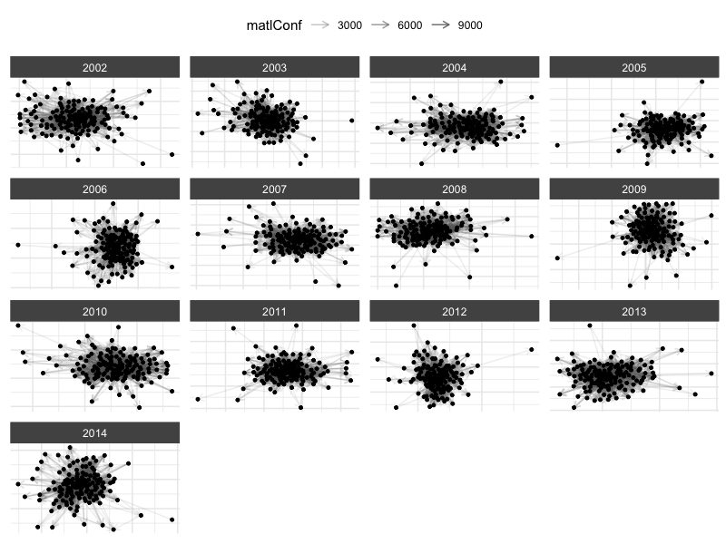

# netify 

## Overview

netify is an R package for working with relational data. It converts
edge lists, matrices, and data frames into network objects that you can
analyze and visualize using a consistent set of functions.

We built netify while doing our own network research in social science.
It handles common tasks like temporal network analysis, ego network
extraction, and multiplex relationships without requiring multiple
packages or data format conversions.

## Installation

Install the package from CRAN after release:

``` r

install.packages("netify")
```

Install the development version from GitHub:

``` r

install.packages("devtools")
devtools::install_github("netify-dev/netify", dependencies = TRUE)
```

## Quick Start

Transform your relational data into a network object with just one
function:

``` r

library(netify)
data(icews)

# Create a network from dyadic data
icews_conflict <- netify(
  icews,
  actor1 = 'i', 
  actor2 = 'j',
  time = 'year',
  symmetric = FALSE, 
  weight = 'matlConf',
  nodal_vars = c('i_polity2', 'i_log_gdp', 'i_region')
)

# Print the netify object
print(icews_conflict)
```

    ✔ Network data created.
    • Unipartite
    • Asymmetric
    • Weights from `matlConf`
    • Longitudinal: 13 Periods
    • # Unique Actors: 152
    Network Summary Statistics (averaged across time):
              dens miss   mean recip trans
    matlConf 0.113    0 12.997 0.594 0.387
    • Nodal Features: i_polity2, i_log_gdp, i_region
    • Dyad Features: None

### Quick visualization

``` r

# Plot the network
plot(icews_conflict)
```



Basic ICEWS conflict network plot

### Add node color

You can map node attributes to plot aesthetics:

``` r

# Create democracy indicator
icews$i_democ <- factor(
  ifelse(icews$i_polity2 >= 6, 1, 0), 
  levels = c(0, 1), 
  labels = c("Non-democracy", "Democracy")
)

# Add it to the network
icews_conflict <- add_node_vars(
  icews_conflict, icews,
  actor = 'i', time = 'year',
  node_vars = 'i_democ'
)

plot(
  icews_conflict,
  # Log transform weights
  mutate_weight = log1p, 
  # Map node attributes to aesthetics
  node_color_by = 'i_region', 
  node_size_by = 'i_log_gdp', 
  node_shape_by = 'i_democ',
  # set global node alpha
  node_alpha = .7,
  # set global edge alpha
  edge_linewidth = .1,
  # Filter data
  node_filter = ~ !is.na(i_democ),
  time_filter = c('2002', '2004', '2008', '2014'),
  # clean up plot labels
  edge_alpha_label = 'Log(Matl.\n Conf.)',
  node_color_label = '',
  node_size_label = 'Log(GDP)',
  node_shape_label = ''
  ) +
  ggplot2::theme(legend.position = 'right') +
  ggplot2::scale_color_brewer(palette = 'Set1')
```


Advanced ICEWS network plot with node colors, sizes, and shapes

## What can you do with a netify object?

### Get network statistics

``` r

summary(icews_conflict)
```

This returns a data frame with network statistics for each time period:

| Year | Actors | Density | Edges | Mean Weight | Reciprocity | Transitivity |
|------|--------|---------|-------|-------------|-------------|--------------|
| 2002 | 152    | 0.090   | 2069  | 1.12        | 0.200       | 0.354        |
| 2003 | 152    | 0.095   | 2193  | 1.54        | 0.294       | 0.358        |
| 2004 | 152    | 0.115   | 2666  | 1.64        | 0.647       | 0.391        |
| …    | …      | …       | …     | …           | …           | …            |

(Table shows first few rows - actual output includes all time periods)

## Key functions

### Building networks

- [`netify()`](https://netify-dev.github.io/netify/reference/netify.md) -
  Turn your data into a network object
- [`ego_netify()`](https://netify-dev.github.io/netify/reference/ego_netify.md) -
  Extract ego networks
- [`layer_netify()`](https://netify-dev.github.io/netify/reference/layer_netify.md) -
  Stack multiple relationships into multilayer networks

### Adding information

- [`add_node_vars()`](https://netify-dev.github.io/netify/reference/add_node_vars.md) -
  Attach attributes to actors (like GDP, democracy scores)
- [`add_dyad_vars()`](https://netify-dev.github.io/netify/reference/add_dyad_vars.md) -
  Attach attributes to relationships (like trade volume, conflict
  events)

### Wrangling networks

- [`subset()`](https://rdrr.io/r/base/subset.html) - Pull out specific
  time periods or actors
- [`mutate_weights()`](https://netify-dev.github.io/netify/reference/mutate_weights.md) -
  Log-transform, normalize, or otherwise modify edge weights

### Analysis

- [`measurements()`](https://netify-dev.github.io/netify/reference/netify_measurements.md) -
  Measurements of your network size and composition
- [`summary()`](https://rdrr.io/r/base/summary.html) - Get a quick
  overview of your network
- [`summary_actor()`](https://netify-dev.github.io/netify/reference/summary_actor.md) -
  See how individual actors fit into the network
- [`compare_networks()`](https://netify-dev.github.io/netify/reference/compare_networks.md) -
  See how similar two networks are
- [`homophily()`](https://netify-dev.github.io/netify/reference/homophily.md) -
  Do similar actors tend to connect?
- [`mixing_matrix()`](https://netify-dev.github.io/netify/reference/mixing_matrix.md) -
  Who connects with whom?

### Visualization

- [`plot()`](https://rdrr.io/r/graphics/plot.default.html) - Create
  network diagrams with sensible defaults
- [`plot_actor_stats()`](https://netify-dev.github.io/netify/reference/plot_actor_stats.md) -
  Visualize node-level statistics
- [`plot_graph_stats()`](https://netify-dev.github.io/netify/reference/plot_graph_stats.md) -
  Show how network properties change over time

### Working with other packages

- [`to_igraph()`](https://netify-dev.github.io/netify/reference/netify_to_igraph.md)
  /
  [`to_network()`](https://netify-dev.github.io/netify/reference/netify_to_statnet.md) -
  When you need something we don’t have
- [`to_amen()`](https://netify-dev.github.io/netify/reference/netify_to_amen.md) -
  For fitting AME or SRM models
- [`unnetify()`](https://netify-dev.github.io/netify/reference/unnetify.md) -
  Get back to a regular data frame

## Quick Reference

### Essential Functions

| Task | Function | Example |
|----|----|----|
| Create network | [`netify()`](https://netify-dev.github.io/netify/reference/netify.md) | `netify(data, actor1="from", actor2="to")` |
| Extract ego network | [`ego_netify()`](https://netify-dev.github.io/netify/reference/ego_netify.md) | `ego_netify(net, ego="USA")` |
| Create multilayer | [`layer_netify()`](https://netify-dev.github.io/netify/reference/layer_netify.md) | `layer_netify(list(net1, net2))` |
| Add node data | [`add_node_vars()`](https://netify-dev.github.io/netify/reference/add_node_vars.md) | `add_node_vars(net, node_df, actor="id")` |
| Add dyad data | [`add_dyad_vars()`](https://netify-dev.github.io/netify/reference/add_dyad_vars.md) | `add_dyad_vars(net, dyad_df, actor1="from", actor2="to")` |
| Subset network | [`subset()`](https://rdrr.io/r/base/subset.html) | `subset(net, time="2020")` |
| Get graph level summary statistics | [`summary()`](https://rdrr.io/r/base/summary.html) | `summary(net)` |
| Get actor level summary statistics | [`summary_actor()`](https://netify-dev.github.io/netify/reference/summary_actor.md) | `summary_actor(net)` |
| Test homophily | [`homophily()`](https://netify-dev.github.io/netify/reference/homophily.md) | `homophily(net, attribute="democracy", method="correlation")` |
| Create mixing matrix | [`mixing_matrix()`](https://netify-dev.github.io/netify/reference/mixing_matrix.md) | `mixing_matrix(net, attribute="regime_type", normalized=TRUE)` |
| Test dyadic correlations | [`dyad_correlation()`](https://netify-dev.github.io/netify/reference/dyad_correlation.md) | `dyad_correlation(net, dyad_vars="geographic_distance")` |
| Attribute report | [`attribute_report()`](https://netify-dev.github.io/netify/reference/attribute_report.md) | `attribute_report(net, node_vars=c("region", "democracy"), dyad_vars="distance")` |
| Compare networks | [`compare_networks()`](https://netify-dev.github.io/netify/reference/compare_networks.md) | `compare_networks(list(net1, net2), method="all")` |
| Plot network | [`plot()`](https://rdrr.io/r/graphics/plot.default.html) | `plot(net)` |
| Convert to igraph | [`to_igraph()`](https://netify-dev.github.io/netify/reference/netify_to_igraph.md) | `g <- to_igraph(net)` |
| Convert to statnet/network | [`to_statnet()`](https://netify-dev.github.io/netify/reference/netify_to_statnet.md) | `g <- to_statnet(net)` |
| Convert to amen | [`to_amen()`](https://netify-dev.github.io/netify/reference/netify_to_amen.md) | `amen_data <- to_amen(net)` |
| Back to data frame | [`unnetify()`](https://netify-dev.github.io/netify/reference/unnetify.md) | `df <- unnetify(net)` |

## Scaling to large networks

netify stores adjacencies as dense matrices/arrays, which keeps the API
uniform but makes memory the binding constraint at large N (a single
dense `N x N` slice costs `8 * N^2` bytes; e.g. ~7.6 MB at N=1K, ~191 MB
at N=5K, and ~1.7 GB at N=15K). A few knobs and benchmarks to keep in
mind:

- **Sparse matrix guard.** Passing a
  [`Matrix::sparseMatrix`](https://rdrr.io/pkg/Matrix/man/sparseMatrix.html)
  (e.g. `dgCMatrix`) to
  [`netify()`](https://netify-dev.github.io/netify/reference/netify.md)
  densifies internally. When `N > 5000` and density is under 1%,
  [`netify()`](https://netify-dev.github.io/netify/reference/netify.md)
  aborts with a guidance message rather than silently allocating
  gigabytes. Override with `force_dense = TRUE` if you really want the
  dense object, or build from an edgelist `data.frame` to skip the
  matrix intermediate entirely.
- **Fast actor stats.**
  [`summary_actor()`](https://netify-dev.github.io/netify/reference/summary_actor.md)
  defaults to `stats = "all"` (degree + closeness + betweenness +
  eigenvector + HITS). The closeness/betweenness paths dominate
  wall-clock at large N, so at
  `N >= getOption("netify.fast_threshold", 1500L)` netify auto-promotes
  the default call to `stats = "fast"`, which returns only the degree-
  and strength-style columns. Pass `stats = "all"` explicitly to force
  centralities, or raise the threshold via
  `options(netify.fast_threshold = ...)`.
- **Indicative timings** (single laptop core, directed weighted toy
  nets):

| N | edges | [`netify()`](https://netify-dev.github.io/netify/reference/netify.md) | [`summary()`](https://rdrr.io/r/base/summary.html) | `summary_actor(fast)` | [`to_igraph()`](https://netify-dev.github.io/netify/reference/netify_to_igraph.md) |
|----|---:|---:|---:|---:|---:|
| 1000 | ~10K | 0.08 s | 0.6 s | 0.6 s | 0.1 s |
| 5000 | ~50K | 0.8 s | 4.8 s | 4.5 s | 0.6 s |

For 10K+ actor / weekly-slice workflows, prefer edgelist inputs, set
`stats = "fast"` explicitly, and consider
[`to_igraph()`](https://netify-dev.github.io/netify/reference/netify_to_igraph.md)
for any heavy centrality work.

## When you might need something else

netify covers common network data workflows and provides converters for
specialized packages when you need methods outside its scope:

- **Statistical models**: Use
  [`to_amen()`](https://netify-dev.github.io/netify/reference/netify_to_amen.md)
  for latent factor models or
  [`to_statnet()`](https://netify-dev.github.io/netify/reference/netify_to_statnet.md)
  for ERGMs
- **Graph algorithms**: Convert with
  [`to_igraph()`](https://netify-dev.github.io/netify/reference/netify_to_igraph.md)
  to use igraph methods
- **Custom analysis**: Use
  [`unnetify()`](https://netify-dev.github.io/netify/reference/unnetify.md)
  to return to a data frame

These converters let you move between netify and other network-analysis
tools without rebuilding the data by hand.

## Getting help

- Browse installed vignettes with `browseVignettes("netify")`;
  additional workflow articles are on the package website.
- Check function documentation:
  [`?netify`](https://netify-dev.github.io/netify/reference/netify.md),
  [`?plot.netify`](https://netify-dev.github.io/netify/reference/plot.netify.md),
  etc.
- Report bugs: [GitHub
  Issues](https://github.com/netify-dev/netify/issues)

## Citation

If you use netify in your research, please cite:

``` r

citation("netify")
```

## Contributors

netify is developed by: - **Cassy Dorff** (Vanderbilt University) -
**Shahryar Minhas** (Michigan State University)

With contributions from: - Ha Eun Choi (Michigan State University) -
Colin Henry (Vanderbilt University) - Tosin Salau (Michigan State
University)

This work is supported by National Science Foundation Awards \#2017162
and \#2017180.

## License

GPL-3

------------------------------------------------------------------------

Made for the network analysis community
