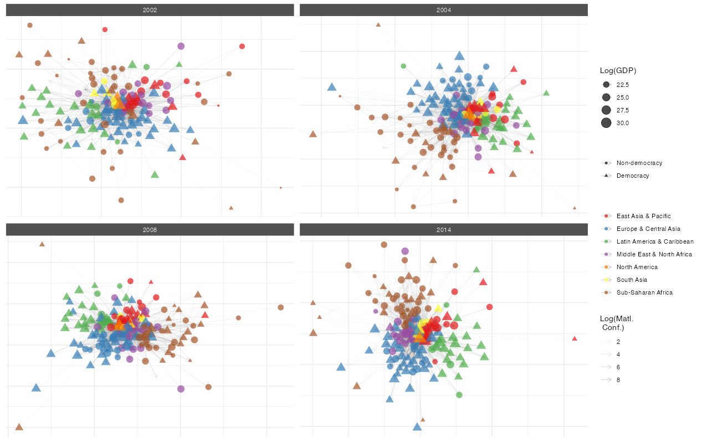

# netify 

## Overview

netify is an R package for working with relational data. It converts
edge lists, matrices, and data frames into network objects that you can
analyze and visualize using a consistent set of functions.

We built netify while doing our own network research in social science.
It handles common tasks like temporal network analysis, ego network
extraction, and multiplex relationships without requiring multiple
packages or data format conversions.

## Installation

You have two options for installing `netify`.

### 🔧 Option 1: Install from GitHub (requires build tools)

> ⚠️ Requires R build tools:
>
> - macOS: Xcode Command Line Tools
> - Windows: Rtools
> - Linux: build-essential and related packages

``` r
# Install from GitHub
# install.packages("devtools")
devtools::install_github("netify-dev/netify", dependencies = TRUE)
```

### 🛠 Option 2: Pre-built binaries (no compilation needed)

If you’re on **macOS** or **Windows** and want to avoid installing
developer tools (like compilers, Xcode, or Rtools), you can use our
pre-built binaries from the [Releases
page](https://github.com/netify-dev/netify/releases):

#### ✅ Steps:

1.  Go to: <https://github.com/netify-dev/netify/releases>
2.  Click on the latest release (e.g., **v0.1.3**)
3.  Download the file that matches your system

#### 📦 First, install dependencies (if needed):

``` r
# Install required packages if you don't already have them
deps <- c("Rcpp", "stats", "rlang", "cli", "checkmate", "igraph", 
          "ggplot2", "scales", "ggnewscale", "ggridges", 
          "ggbeeswarm", "patchwork", "RColorBrewer", "ggrepel")

# Check which packages are not installed
missing_deps <- deps[!deps %in% installed.packages()[,"Package"]]

# Install missing packages
if(length(missing_deps) > 0) {
  install.packages(missing_deps, repos='https://cloud.r-project.org/')
}
```

#### 🖥 macOS users:

There are several macOS builds — choose the one that fits your system:

| File              | For…                                                                        |
|-------------------|-----------------------------------------------------------------------------|
| `macos-arm64.tgz` | Macs with Apple Silicon (M1, M2, M3 chips) running recent macOS             |
| `macos-intel.tgz` | Macs with Intel chips                                                       |
| `macos-asan.tgz`  | Developer/debug version (for advanced users only; includes sanitizer flags) |

Most users can choose based on chip type:

``` r
# Example: Apple Silicon (M1/M2/M3)
install.packages(
  "~/Downloads/netify_0.1.3-macos-arm64.tgz", 
  repos = NULL, type = "mac.binary")

# Example: Intel Mac
install.packages(
  "~/Downloads/netify_0.1.3-macos-intel.tgz", 
  repos = NULL, type = "mac.binary")
```

#### 🪟 Windows users:

Download the `.zip` file named `netify_0.1.3-windows.zip` and install:

``` r
install.packages(
  "C:/path/to/netify_0.1.3-windows.zip", 
  repos = NULL)
```

Be sure to replace the file path with where you saved the download.

#### 🐧 Linux users:

You can use the precompiled `.tgz` file, or install from source (see
Option 1). Example:

``` r
install.packages(
  "~/Downloads/netify_0.1.3-linux.tgz", 
  repos = NULL, type = "source")
```

## Quick Start

Transform your relational data into a network object with just one
function:

``` r
library(netify)
data(icews)

# Create a network from dyadic data
icews_conflict <- netify(
  icews,
  actor1 = 'i', 
  actor2 = 'j',
  time = 'year',
  symmetric = FALSE, 
  weight = 'matlConf',
  nodal_vars = c('i_polity2', 'i_log_gdp', 'i_region')
)

# Print the netify object
print(icews_conflict)
```

    ✔ Hello, you have created network data, yay!
    • Unipartite
    • Asymmetric
    • Weights from `matlConf`
    • Longitudinal: 13 Periods
    • # Unique Actors: 152
    Network Summary Statistics (averaged across time):
              dens miss  mean recip trans
    matlConf 0.113    0 1.471 0.594 0.387
    • Nodal Features: None
    • Dyad Features: None

### Quick visualization

``` r
# Plot the network
plot(icews_conflict)
```


### More involved visualization

netify’s plotting system is highly customizable. Here’s how you can
create a more sophisticated visualization:

``` r
# Create democracy indicator
icews$i_democ <- factor(
  ifelse(icews$i_polity2 >= 6, 1, 0), 
  levels = c(0, 1), 
  labels = c("Non-democracy", "Democracy")
)

# Add it to the network
icews_conflict <- add_node_vars(
  icews_conflict, icews,
  actor = 'i', time = 'year',
  node_vars = 'i_democ'
)

# plot(
  icews_conflict, 
  # Log transform weights
  mutate_weight = log1p, 
  # Map node attributes to aesthetics
  node_color_by = 'i_region', 
  node_size_by = 'i_log_gdp', 
  node_shape_by = 'i_democ',
  # set global node alpha
  node_alpha = .7,
  # set global edge alpha
  edge_linewidth = .1,
  # Filter data
  node_filter = ~ !is.na(i_democ),
  time_filter = c('2002', '2004', '2008', '2014'),
  # clean up plot labels
  edge_alpha_label = 'Log(Matl.\n Conf.)',
  node_color_label = '',
  node_size_label = 'Log(GDP)',
  node_shape_label = ''
  ) +
  theme(legend.position = 'right') + 
  scale_color_brewer(palette = 'Set1')
```



## What can you do with a netify object?

### Get network statistics

``` r
summary(icews_conflict)
```

This returns a data frame with network statistics for each time period:

| Year | Actors | Density | Edges | Mean Weight | Reciprocity | Transitivity |
|------|--------|---------|-------|-------------|-------------|--------------|
| 2002 | 152    | 0.090   | 2069  | 1.12        | 0.200       | 0.354        |
| 2003 | 152    | 0.095   | 2193  | 1.54        | 0.294       | 0.358        |
| 2004 | 152    | 0.115   | 2666  | 1.64        | 0.647       | 0.391        |
| …    | …      | …       | …     | …           | …           | …            |

(Table shows first few rows - actual output includes all time periods)

## Key functions

### Building networks

- [`netify()`](https://netify-dev.github.io/netify/reference/netify.md) -
  Turn your data into a network object
- [`ego_netify()`](https://netify-dev.github.io/netify/reference/ego_netify.md) -
  Extract ego networks
- [`layer_netify()`](https://netify-dev.github.io/netify/reference/layer_netify.md) -
  Stack multiple relationships into multilayer networks

### Adding information

- [`add_node_vars()`](https://netify-dev.github.io/netify/reference/add_node_vars.md) -
  Attach attributes to actors (like GDP, democracy scores)
- [`add_dyad_vars()`](https://netify-dev.github.io/netify/reference/add_dyad_vars.md) -
  Attach attributes to relationships (like trade volume, conflict
  events)

### Wrangling networks

- [`subset()`](https://rdrr.io/r/base/subset.html) - Pull out specific
  time periods or actors
- [`mutate_weights()`](https://netify-dev.github.io/netify/reference/mutate_weights.md) -
  Log-transform, normalize, or otherwise modify edge weights

### Analysis

- [`measurements()`](https://netify-dev.github.io/netify/reference/netify_measurements.md) -
  Measurements of your network size and composition
- [`summary()`](https://rdrr.io/r/base/summary.html) - Get a quick
  overview of your network
- [`summary_actor()`](https://netify-dev.github.io/netify/reference/summary_actor.md) -
  See how individual actors fit into the network
- [`compare_networks()`](https://netify-dev.github.io/netify/reference/compare_networks.md) -
  See how similar two networks are
- [`homophily()`](https://netify-dev.github.io/netify/reference/homophily.md) -
  Do similar actors tend to connect?
- [`mixing_matrix()`](https://netify-dev.github.io/netify/reference/mixing_matrix.md) -
  Who connects with whom?

### Visualization

- [`plot()`](https://rdrr.io/r/graphics/plot.default.html) - Create
  network diagrams with sensible defaults
- [`plot_actor_stats()`](https://netify-dev.github.io/netify/reference/plot_actor_stats.md) -
  Visualize node-level statistics
- [`plot_graph_stats()`](https://netify-dev.github.io/netify/reference/plot_graph_stats.md) -
  Show how network properties change over time

### Working with other packages

- [`to_igraph()`](https://netify-dev.github.io/netify/reference/netify_to_igraph.md)
  /
  [`to_network()`](https://netify-dev.github.io/netify/reference/netify_to_statnet.md) -
  When you need something we don’t have
- [`to_amen()`](https://netify-dev.github.io/netify/reference/netify_to_amen.md) -
  For fitting AME or SRM models
- [`unnetify()`](https://netify-dev.github.io/netify/reference/unnetify.md) -
  Get back to a regular data frame

## Quick Reference

### Essential Functions

| Task                               | Function                                                                                  | Example                                                                           |
|------------------------------------|-------------------------------------------------------------------------------------------|-----------------------------------------------------------------------------------|
| Create network                     | [`netify()`](https://netify-dev.github.io/netify/reference/netify.md)                     | `netify(data, actor1="from", actor2="to")`                                        |
| Extract ego network                | [`ego_netify()`](https://netify-dev.github.io/netify/reference/ego_netify.md)             | `ego_netify(net, ego="USA")`                                                      |
| Create multilayer                  | [`layer_netify()`](https://netify-dev.github.io/netify/reference/layer_netify.md)         | `layer_netify(list(net1, net2))`                                                  |
| Add node data                      | [`add_node_vars()`](https://netify-dev.github.io/netify/reference/add_node_vars.md)       | `add_node_vars(net, node_df, actor="id")`                                         |
| Add dyad data                      | [`add_dyad_vars()`](https://netify-dev.github.io/netify/reference/add_dyad_vars.md)       | `add_dyad_vars(net, dyad_df, actor1="from", actor2="to")`                         |
| Subset network                     | [`subset()`](https://rdrr.io/r/base/subset.html)                                          | `subset(net, time="2020")`                                                        |
| Get graph level summary statistics | [`summary()`](https://rdrr.io/r/base/summary.html)                                        | `summary(net)`                                                                    |
| Get actor level summary statistics | [`summary_actor()`](https://netify-dev.github.io/netify/reference/summary_actor.md)       | `summary_actor(net)`                                                              |
| Test homophily                     | [`homophily()`](https://netify-dev.github.io/netify/reference/homophily.md)               | `homophily(net, attribute="democracy", method="correlation")`                     |
| Create mixing matrix               | [`mixing_matrix()`](https://netify-dev.github.io/netify/reference/mixing_matrix.md)       | `mixing_matrix(net, attribute="regime_type", normalized=TRUE)`                    |
| Test dyadic correlations           | [`dyad_correlation()`](https://netify-dev.github.io/netify/reference/dyad_correlation.md) | `dyad_correlation(net, dyad_vars="geographic_distance")`                          |
| Comprehensive attribute analysis   | [`attribute_report()`](https://netify-dev.github.io/netify/reference/attribute_report.md) | `attribute_report(net, node_vars=c("region", "democracy"), dyad_vars="distance")` |
| Compare networks                   | [`compare_networks()`](https://netify-dev.github.io/netify/reference/compare_networks.md) | `compare_networks(list(net1, net2), method="all")`                                |
| Plot network                       | [`plot()`](https://rdrr.io/r/graphics/plot.default.html)                                  | `plot(net)`                                                                       |
| Convert to igraph                  | [`to_igraph()`](https://netify-dev.github.io/netify/reference/netify_to_igraph.md)        | `g <- to_igraph(net)`                                                             |
| Convert to statnet/network         | [`to_statnet()`](https://netify-dev.github.io/netify/reference/netify_to_statnet.md)      | `g <- to_statnet(net)`                                                            |
| Convert to amen                    | [`to_amen()`](https://netify-dev.github.io/netify/reference/netify_to_amen.md)            | `amen_data <- to_amen(net)`                                                       |
| Back to data frame                 | [`unnetify()`](https://netify-dev.github.io/netify/reference/unnetify.md)                 | `df <- unnetify(net)`                                                             |

## When you might need something else

netify handles a lot, but there’s an awesome world of network packages
out there! If you need to venture beyond our walls, we’ve built bridges
to get you there:

- **Fancy statistical models**: Use
  [`to_amen()`](https://netify-dev.github.io/netify/reference/netify_to_amen.md)
  for latent factor models or
  [`to_statnet()`](https://netify-dev.github.io/netify/reference/netify_to_statnet.md)
  for ERGMs
- **Graph algorithms we don’t have (yet!)**: Convert with
  [`to_igraph()`](https://netify-dev.github.io/netify/reference/netify_to_igraph.md)
  to access igraph’s vast toolkit
- **Roll your own analysis**: Use
  [`unnetify()`](https://netify-dev.github.io/netify/reference/unnetify.md)
  to get back to a data frame and do your own thing

We play well with others! 🤝

## Getting help

- Browse vignettes for detailed guides: `browseVignettes("netify")`
- Check function documentation:
  [`?netify`](https://netify-dev.github.io/netify/reference/netify.md),
  [`?plot.netify`](https://netify-dev.github.io/netify/reference/plot.netify.md),
  etc.
- Report bugs: [GitHub
  Issues](https://github.com/netify-dev/netify/issues)
- Ask questions: [GitHub
  Discussions](https://github.com/netify-dev/netify/discussions)

## Citation

If you use netify in your research, please cite:

``` r
citation("netify")
```

## Contributors

netify is developed by: - **Cassy Dorff** (Vanderbilt University) -
**Shahryar Minhas** (Michigan State University)

With contributions from: - Ha Eun Choi (Michigan State University) -
Colin Henry (Vanderbilt University) - Tosin Salau (Michigan State
University)

This work is supported by National Science Foundation Awards \#2017162
and \#2017180.

## License

MIT License - see [LICENSE](https://netify-dev.github.io/netify/LICENSE)
file for details.

------------------------------------------------------------------------

Made with ❤️ for the network analysis community
